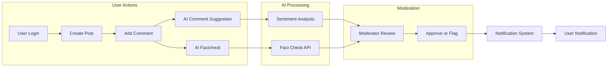

# Functional Requirements for communityAi Community Website

## 1. Introduction
This document specifies the full set of functional requirements for the communityAi community website, which integrates AI features like AI Commenting and AI Factcheck. It is intended to provide backend developers with clear, measurable, and testable business requirements to implement the system.

This document focuses exclusively on the business logic and functional requirements. Technical implementation details such as API design, database schema, or UI/UX specifications are outside the scope.

## 2. Business Model

### Why This Service Exists
The communityAi website is designed to facilitate online community interaction with enhanced AI-powered features to improve content quality and user engagement. It fills a market gap by integrating AI-driven assistance directly into user interactions, enabling smarter commenting and misinformation detection.

### Revenue Strategy
Though primarily community-driven, potential revenue streams include:
- Advertising based on user engagement.
- Premium subscription plans offering advanced AI features.

### Growth Plan
The platform aims for organic growth through word-of-mouth, supported by AI features that improve content moderation and user interaction quality.

### Success Metrics
- Daily active users (DAU)
- Number of AI-assisted comments
- Number of fact-check alerts and resolutions
- User retention rates

## 3. User Roles and Authentication

### User Role Definitions
- **Admin**: Full system control including user management, content moderation, and AI feature configuration.
- **Moderator**: Responsibilities include reviewing and flagging inappropriate content and managing user-generated posts/comments.
- **Member**: Authenticated users who can create posts and comments and use AI-assisted features.

### Authentication Requirements
- Users shall register with email and password.
- Users shall verify email addresses before posting.
- User sessions must be managed securely with JWT tokens including role and permissions.
- Password reset and change functionalities shall be available.

### Authorization and Permissions
The system shall enforce role-based access as follows:

| Action                         | Admin   | Moderator | Member  |
|--------------------------------|---------|-----------|---------|
| Manage users                   | ✅       | ❌         | ❌       |
| Manage AI feature settings     | ✅       | ❌         | ❌       |
| Create/edit/delete posts       | ✅       | ✅         | ✅       |
| Approve posts                  | ✅       | ✅         | ❌       |
| Create/edit/delete comments    | ✅       | ✅         | ✅       |
| Use AI Commenting features     | ✅       | ✅         | ✅       |
| Use AI Factcheck features      | ✅       | ✅         | ✅       |
| Moderate flagged content       | ✅       | ✅         | ❌       |

## 4. Post Management

### Post Creation
WHEN a member submits a new post, THE system SHALL validate that the post content is not empty and does not exceed 10,000 characters.

WHEN a post is created, THE system SHALL assign it a unique identifier and store metadata including the author's user ID and timestamp.

### Post Editing
WHEN a member edits their post within 24 hours of creation, THE system SHALL update the existing post content and store an edit timestamp.

IF a member attempts to edit a post after 24 hours, THEN THE system SHALL deny the edit and return an appropriate error message.

### Post Deletion
WHEN a member deletes their own post, THE system SHALL remove the post and all associated comments from the public view but retain data for audit purposes.

WHEN an admin or moderator deletes any post, THE system SHALL remove it immediately from public view.

## 5. Commenting System

### Comment Creation
WHEN a member adds a comment to a post, THE system SHALL validate that the comment is not empty and does not exceed 1,000 characters.

WHEN a comment is submitted, THE system SHALL store it with reference to the post ID, author user ID, and creation timestamp.

### Comment Editing
WHEN a member edits their comment within 1 hour of creation, THE system SHALL update the comment content and record the edit timestamp.

IF a member attempts to edit a comment after 1 hour, THEN THE system SHALL deny the edit with an appropriate error message.

### Comment Deletion
WHEN a member deletes their comment, THE system SHALL remove it from public view but keep it in audit logs.

WHEN a moderator or admin deletes any comment, THE system SHALL remove it immediately from public view.

## 6. AI Commenting Features

### AI Comment Suggestion
WHEN a member writes a comment, THE system SHALL provide AI-generated suggested improvements or alternative responses.

WHERE AI Comment Suggestion is enabled, THE system SHALL allow users to accept AI suggestions to auto-fill or enhance their comment.

### Sentiment Analysis
WHEN a comment is submitted, THE system SHALL run sentiment analysis to detect potentially harmful or abusive tone.

IF sentiment analysis detects harmful content, THEN THE system SHALL flag the comment for moderator review and notify the commenter.

### Auto-generated Comment Replies
WHERE enabled, THE system SHALL offer AI-generated replies to posts or comments based on conversation context.

## 7. AI Factcheck Features

### Fact-check Workflow
WHEN a post or comment is submitted, THE system SHALL analyze text for factual statements.

WHERE factual claims are detected, THE system SHALL query an external AI fact-check service to verify claims.

IF potential misinformation is detected, THEN THE system SHALL flag the content and notify content moderators and the author.

### Fact-check Feedback
WHEN factcheck results are available, THE system SHALL display a fact-check status badge alongside the post or comment.

THE system SHALL provide links or references to data sources used in fact-checking.

### User Interaction
WHERE fact-check flags are present, THE system SHALL allow users to submit disputes or additional evidence for moderator consideration.

## 8. Notification System

WHEN a user receives a reply to their post or comment, THE system SHALL send a notification.

WHEN a user's content is flagged by AI Factcheck or moderation, THE system SHALL notify the user with details and guidance.

WHEN a user's AI Comment suggestion is available, THE system SHALL notify them in the commenting interface.

Notifications SHALL be delivered in near real-time (within 5 seconds under normal load).

## 9. User Account Management

### Registration
WHEN a new user registers, THE system SHALL collect email, password, and optional profile data.

THE system SHALL require email verification before content posting privileges are granted.

### Authentication
WHEN a user logs in, THE system SHALL authenticate credentials and issue a JWT access token with embedded role and permissions.

### Profile Updates
WHEN a user updates profile information, THE system SHALL validate inputs for correctness and update the database.

### Password Management
WHEN a user requests password reset, THE system SHALL send a secure, time-limited reset token.

WHEN a password change occurs, THE system SHALL invalidate all existing sessions.

## 10. Business Rules and Validation

- Posts and comments cannot be empty and have defined max lengths.
- Edits are time-limited as specified.
- AI flags are advisory but can trigger moderator intervention.
- Moderators and admins can override AI flags.
- Users must verify emails before creating public content.
- AI features require integration with external AI service APIs.

## 11. Error Handling

IF validation fails during post or comment creation, THEN THE system SHALL reject the request with clear error codes and user-friendly messages.

IF AI service calls fail or timeout, THEN THE system SHALL allow content submission but log error and notify admins.

IF user authentication fails, THEN THE system SHALL return HTTP 401 with an error code AUTH_INVALID_CREDENTIALS.

## 12. Performance Requirements

- THE system SHALL respond to post and comment submissions within 2 seconds.
- AI feature latency SHALL be less than 3 seconds per request under normal load.
- Notification delivery SHALL occur within 5 seconds.
- Page data retrieval SHALL paginate posts by 20 items per page with sorting by newest first.

## 13. Diagrams and Flowcharts

---

This document provides business functional requirements only. All technical implementation details, including architecture, APIs, and database design, are under the full autonomy of backend developers.

The system described herein defines WHAT the system must do to meet user and business needs, NOT HOW to implement these features.
