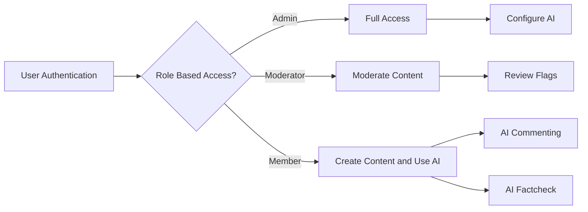
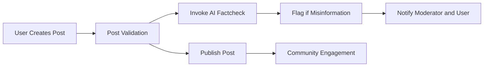

# Community AI Website Requirement Analysis

## 1. Introduction
The Community AI Website is a web-based platform that enables users to create posts, comment, and interact within an online community augmented by AI features such as AI Commenting and AI Factcheck. This document specifies the comprehensive business and functional requirements for backend developers to implement the system accurately.

## 2. Business Model

### Why This Service Exists
The service addresses the growing need for reliable online communities that can maintain content quality and factual accuracy in a scalable way by integrating AI assistance.

### Revenue and Growth Strategy
Revenue may be generated via subscription plans offering advanced AI features and advertising opportunities. Growth will be driven by improved user engagement through AI-facilitated content moderation and assistance.

### Success Metrics
- Number of active users monthly.
- Engagement rates including posts, comments, and AI feature utilization.
- Misinformation detection accuracy rates.

## 3. User Roles and Authentication

### 3.1 User Roles
- Admin: Full system control including user and AI feature management.
- Moderator: Content review and moderation capabilities.
- Member: Create and interact with content, access AI features.

### 3.2 Authentication Requirements
- WHEN a user registers, THE system SHALL validate inputs and send a verification email.
- WHEN a user logs in with valid credentials, THE system SHALL authenticate and issue a JWT access token and refresh token.
- THE system SHALL expire sessions after 30 days of inactivity.

### 3.3 Authorization
- THE system SHALL enforce role-based access control.
- Admins have exclusive access to AI feature configuration.
- Moderators have content moderation permissions.
- Members have content creation and AI feature usage permissions.

## 4. Functional Requirements

### 4.1 Post Management
- WHEN a member creates a post, THE system SHALL validate content length and store it.
- Members may edit own posts within 24 hours.
- Posts can be deleted by owner or moderators.

### 4.2 Commenting System
- WHEN a comment is created, THE system SHALL validate character limits and associate it with the post.
- Comments can be edited within 15 minutes.

### 4.3 AI Commenting Features
- WHEN a user writes a comment, THE system SHALL provide AI suggestions.
- THE system SHALL perform sentiment analysis and flag negative comments.

### 4.4 AI Factcheck Features
- WHEN a post/comment is submitted, THE system SHALL extract factual claims and verify them.
- Misleading content SHALL be flagged and users notified with source info.

### 4.5 Notification System
- Notifications SHALL be sent within 5 seconds of triggering events.
- Users SHALL be notified of replies, likes, and moderation flags.

## 5. User Scenarios

### 5.1 Registration and Login
- Users register with email, verify account, and log in.
- Invalid attempts result in user-friendly errors.

### 5.2 Posting and Commenting
- Posts and comments created and edited under defined constraints.
- AI suggestions offered upon user request.

### 5.3 AI Factcheck Usage
- Users receive fact-check results with references.
- Flagged content enters moderation queue.

### 5.4 Moderation
- Moderators review flagged content, approve or reject with logs.

### 5.5 Notifications
- Delivered in-app, real-time for user events.

## 6. Error Handling

- Validation failures on post/comment rejection with clear messages.
- Authentication errors return relevant codes.
- AI service unavailability results in fallback modes.
- Moderation conflicts escalate to admins.

## 7. Performance Requirements

- Page loads within 3 seconds for regular pages.
- API calls respond within 2 seconds.
- AI features respond in less than 3-5 seconds.
- Notifications delivered within 5 seconds.

## 8. Security and Compliance

- User data encrypted in transit and at rest.
- Passwords stored hashed with salt.
- GDPR and other compliance enforced.
- Moderator access logged and restricted.

## 9. External Integrations

- AI services securely connected with error handling and rate limiting.
- Authentication providers integrated with JWT management.
- Notification systems for email and in-app messages.

## Mermaid Diagrams

This document defines business requirements only. All technical implementation decisions, including architecture, API, and database design, belong to developers. It describes WHAT the system should do, not HOW to build it.