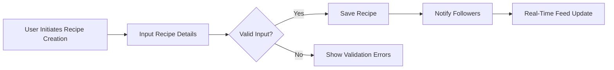
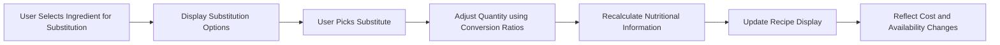

# Recipe Sharing Backend - Requirement Analysis Report

## 1. Introduction
This document provides a comprehensive set of business requirements for the Recipe Sharing Backend system. The backend is designed to support features including recipe creation, ingredient substitution with nutritional and cost adjustments, user-generated categorization, detailed rating and review systems, social interactions, personalized feeds, and meal planning. This requirement analysis report will guide backend developers in understanding the functionalities, user roles, business rules, error handling, and performance requirements necessary to build a robust system.

## 2. Business Model

### Why This Service Exists
The Recipe Sharing Backend exists to address a growing need among consumers for dynamic recipe management platforms that go beyond static offerings. Users increasingly seek customization to cater to dietary restrictions, ingredient availability, and budget constraints. This service differentiates itself by offering smart ingredient substitution capabilities, real-time personalized feeds, and integration with grocery chains for cost and availability tracking.

### Revenue Strategy
The primary revenue source will be premium user subscriptions that unlock advanced meal planning and cost tracking features. Monetization is additionally planned through partnerships with grocery retailers for store availability and price integrations.

### Growth Plan
Growth will capitalize on organic user engagement through social features like following users, rating, and reviewing. Retention strategies include personalized feeds and meal planning capabilities that create daily value for users. Expanding grocery chains supported and enriching ingredient substitution datasets will further drive growth.

### Success Metrics
- Monthly active users (MAU)
- Conversion rate to premium subscriptions
- Average new recipes posted daily
- Retention rate of active users
- Frequency and accuracy of shopping list generation

## 3. User Roles and Authentication

### Overview of User Roles
- Regular Users: Can create and share recipes; rate and review recipes, follow other users; manage personal collections and meal plans.
- Premium Users: All Regular User capabilities plus advanced meal planning, ingredient cost tracking, and enhanced recipe management.
- Moderators: Oversee flagged content, manage reported reviews, and approve new user-generated categories.

### Authentication Requirements
- Users shall register with email and password.
- Users shall verify their email addresses.
- Users shall be able to log in and log out securely.
- Password reset and change features are mandatory.
- Systems will maintain secure sessions with JWT tokens.

### Role-Based Permissions
| Action | Regular User | Premium User | Moderator |
|--------|--------------|--------------|-----------|
| Create/Share Recipes | ✅ | ✅ | ❌ |
| Rate and Review Recipes | ✅ | ✅ | ❌ |
| Follow Users | ✅ | ✅ | ❌ |
| Create Meal Plans | ❌ | ✅ | ❌ |
| Cost Tracking | ❌ | ✅ | ❌ |
| Moderate Content | ❌ | ❌ | ✅ |

## 4. Functional Requirements

### 4.1 Recipe Management
- WHEN a user creates a recipe, THE system SHALL enable entry of ingredients with exact quantities, units, and optional brand names.
- WHEN a user adds nutritional information, THE system SHALL record calories, macronutrients (protein, carbs, fat), fiber, sodium, sugar, and key vitamins and minerals.
- THE system SHALL support tagging recipes with multiple categories including pre-defined cuisines (Italian, Mexican, Asian), diets (vegan, keto, gluten-free, paleo), and difficulties (beginner, intermediate, advanced), plus user-generated tags pending moderator approval.

### 4.2 Ingredient Substitution and Nutritional Adjustments
- WHERE users substitute ingredients, THE system SHALL maintain 3-5 substitution options per ingredient, each with defined conversion ratios.
- WHEN ingredients are substituted, THE system SHALL adjust nutritional values automatically accordingly.
- THE system SHALL prioritize substitutions matching the user's stored dietary preferences.
- THE system SHALL track ingredient prices from three major grocery stores with weekly updates, adjusting meal plan cost predictions accordingly.

### 4.3 Rating and Review System
- THE system SHALL provide a 5-star rating scale.
- USERS SHALL be able to submit detailed text reviews.
- USERS SHALL be able to vote on the helpfulness of reviews.
- USERS SHALL be able to flag inappropriate reviews.
- Moderators SHALL be able to hide flagged reviews while maintaining a full audit trail.

### 4.4 Social Features
- USERS SHALL follow other users to curate personalized recipe feeds.
- THE feed algorithm SHALL consist of 60% recent recipes from followed users, 25% trending in preferred categories, and 15% personalized recommendations based on past interaction.
- THE feed SHALL update in real-time when followed users post new recipes.

### 4.5 Search Functionality
- USERS SHALL search recipes by ingredient lists, with ANY matching ingredients included.
- THE system SHALL support partial matching of ingredient terms.
- THE search results SHALL be ranked by the percentage of ingredients the user has available.

### 4.6 Personal Collections and Meal Planning
- USERS SHALL create and manage named collections of recipes.
- Meal plans SHALL be created by dragging recipes onto calendar dates and meals.
- THE system SHALL allow recurring meal plans configuration.
- WEEKLY shopping lists SHALL be generated from meal plans.

### 4.7 Shopping Lists and Cost Tracking
- THE system SHALL consolidate shopping list quantities for overlapping ingredients.
- AVAILABLE ingredient stocks SHALL be checked via mock API from preferred stores.
- COST estimates SHALL be provided with alternative store suggestions for better prices.

## 5. Business Rules and Validations
- Users can store and use up to 5 substitutes per ingredient with defined ratios.
- Dietary preferences shall filter and prioritize substitutions.
- New user tags require moderator approval before use.
- Moderators must maintain audit logs of all moderation actions.

## 6. Error Handling
- IF recipe creation lacks required fields (ingredient quantity/unit), THEN THE system SHALL return clear error messages specifying the missing fields.
- IF unauthorized actions are attempted, THEN THE system SHALL deny access with appropriate error codes.
- IF ingredient substitution data is incomplete or missing, THEN THE system SHALL notify users and use original ingredient.
- IF external store availability API fails, THEN the shopping list shall proceed without availability or cost details.

## 7. Performance Requirements
- Search results SHALL return within 2 seconds.
- Feed updates SHALL be pushed within 1 second of new recipe posting.
- Authentication SHALL complete within 3 seconds.

## Diagrams

This document exclusively defines business requirements. All technical implementation details such as architecture, API designs, and database schemas are at the discretion of the development team. Developers shall exercise autonomy to design optimal solutions that satisfy these requirements.
