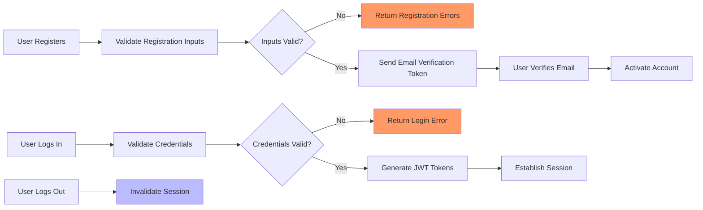
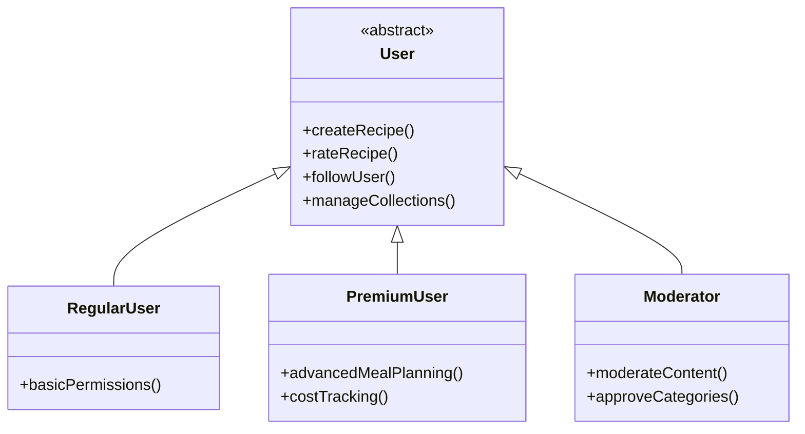

# User Roles and Authentication Requirements for Recipe Sharing Backend

## 1. Overview of User Roles

The recipe sharing backend supports three distinct user roles tailored to the platform's business needs and user functionalities:

### 1.1 Regular Users
Regular Users are general platform members who can create and share recipes, rate and review recipes, follow other users, and manage personal recipe collections and meal plans.

### 1.2 Premium Users
Premium Users have all Regular User permissions plus access to advanced meal planning, ingredient cost tracking, and enhanced recipe management features.

### 1.3 Moderators
Moderators oversee content quality and community safety by reviewing flagged content, managing reported reviews, and approving user-suggested categories. They have no administrative control but focus solely on community moderation.

## 2. Authentication Requirements

### 2.1 Core Authentication Functions
- WHEN a user registers an account, THE system SHALL validate the email and password according to format and strength rules.
- WHEN a user registers successfully, THE system SHALL send an email verification link.
- WHEN a user verifies their email, THE system SHALL activate the account, enabling full platform access.
- WHEN a user attempts to log in, THE system SHALL verify credentials and email verification status.
- IF credentials are invalid or email unverified, THEN THE system SHALL reject access with a descriptive error.
- WHEN a user logs in successfully, THE system SHALL establish a secure session using JWT tokens.
- WHEN a user logs out, THE system SHALL invalidate the session tokens promptly.
- WHEN a user requests password reset, THE system SHALL send a secure reset link via email.
- WHEN a user follows the reset link and enters a new password, THE system SHALL update the password and revoke existing sessions.

### 2.2 Registration Process
- WHEN a user submits registration information, THE system SHALL validate: 
  - Email format according to RFC 5322.
  - Password complexity includes minimum 8 characters with letters, numbers, and special characters.
- IF validation fails, THEN THE system SHALL provide explicit feedback with error codes.

### 2.3 Email Verification
- THE system SHALL generate a unique token linked to the user account and send it in the verification email.
- The email verification token SHALL expire after 24 hours.
- IF the verification token is expired or invalid, THEN THE system SHALL reject the verification attempt with an error.

### 2.4 Password Reset
- THE system SHALL generate a time-limited token for password reset requests.
- THE reset token SHALL expire after 15 minutes.
- IF the reset token is invalid or expired, THEN THE system SHALL reject the password reset.
- Password reset SHALL require a strong new password conforming to registration standards.

## 3. Role-Based Permissions

### 3.1 Regular Users
- CAN create, edit, and delete their own recipes.
- CAN rate and review any recipes.
- CAN follow and unfollow other users.
- CAN create and manage personal recipe collections and meal plans.
- CANNOT access premium-only meal planning or cost tracking features.
- CANNOT moderate or approve content.

### 3.2 Premium Users
- HAVE all Regular User capabilities.
- ALSO HAVE access to advanced meal planning including recurring meal plans.
- CAN track ingredient cost variations and budgeting tools.

### 3.3 Moderators
- CAN review and manage flagged content and reviews.
- CAN approve or reject user-generated categories.
- CAN hide inappropriate reviews maintaining audit trails.
- CANNOT create or edit recipes.
- CANNOT access premium user features.

## 4. Permission Matrix

| Action                                    | Regular User | Premium User | Moderator |
|-------------------------------------------|--------------|--------------|-----------|
| Register account                          | ✅           | ✅           | ✅        |
| Login/logout                              | ✅           | ✅           | ✅        |
| Email verification                        | ✅           | ✅           | ✅        |
| Password reset                           | ✅           | ✅           | ✅        |
| Create recipe                           | ✅           | ✅           | ❌        |
| Edit/delete own recipe                    | ✅           | ✅           | ❌        |
| Rate and review recipes                   | ✅           | ✅           | ❌        |
| Follow/unfollow users                     | ✅           | ✅           | ❌        |
| Create/manage collections and meal plans | ✅           | ✅           | ❌        |
| Advanced meal planning and cost tracking | ❌           | ✅           | ❌        |
| Moderate flagged content                  | ❌           | ❌           | ✅        |
| Approve user-generated categories        | ❌           | ❌           | ✅        |

## 5. Session and Token Management

### 5.1 Session Management
- THE system SHALL securely maintain active user sessions.
- Inactivity timeout SHALL end sessions after 30 days.
- Logging out SHALL immediately invalidate the session.

### 5.2 Token Management
- THE system SHALL implement JWT for authentication tokens.
- Access tokens SHALL expire after 15 minutes.
- Refresh tokens SHALL expire after 14 days.
- JWT payload SHALL include user identifier, role, and permissions array.
- Password changes or logout from all devices SHALL revoke all active tokens.

## 6. Error Handling

- IF a user provides invalid login credentials, THEN THE system SHALL respond with a clear authentication error.
- IF a user attempts login without email verification, THEN THE system SHALL deny access and inform the user.
- IF a password reset token is invalid or expired, THEN THE system SHALL return a descriptive error and allow re-request.

## 7. Performance Requirements

- Authentication attempts SHALL complete within 2 seconds under normal load.
- Session validation SHALL occur in less than 100 milliseconds.
- Token issuance and verification SHALL support high concurrency efficiently.

## 8. Diagrams

### 8.1 Authentication Flow

### 8.2 Role-Based Permissions Overview

---

This document provides business requirements only. All technical implementation decisions belong to developers. Developers have full autonomy over architecture, APIs, and database design. This document describes WHAT the system should do, not HOW to build it.