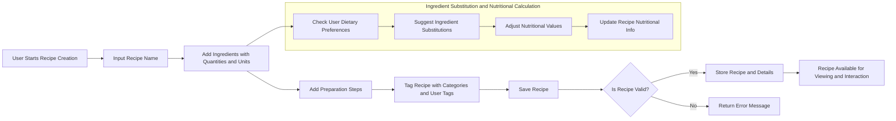
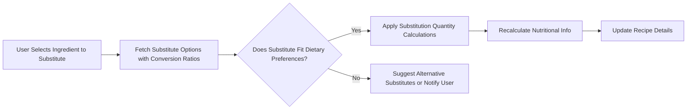

# Recipe Sharing Backend - Recipe Management Business Requirements

## 1. Introduction
The recipe sharing backend's recipe management system addresses the need for a collaborative platform where users create, personalize, and share recipes. This system resolves common challenges such as dietary accommodation and budget constraints by incorporating robust ingredient substitution and cost tracking. It supports premium monetization through advanced meal planning and nutritional customizations.

### 1.1 Business Model
WHEN users create recipes, THE system SHALL offer a user-friendly interface to input comprehensive recipe details including name, preparation steps, ingredients, nutritional info, and tags.

WHERE applicable, THE system SHALL support monetization by allowing premium users to access enhanced features like advanced ingredient cost tracking and meal planning tools.

### 1.2 Growth and Success Metrics
THE system SHALL measure success via metrics such as monthly active users, recipe creation rate, user retention, and accuracy of nutritional calculations.

## 2. User Roles and Permissions

### 2.1 Roles Overview
- Regular Users can create, edit, and share their own recipes; rate and review others; follow users; and manage collections and meal plans.
- Premium Users have all Regular User capabilities with additional access to advanced meal planning and cost tracking.
- Moderators oversee content quality by reviewing flagged recipes, managing reported reviews, and approving new user-generated tags.

### 2.2 Permissions
- WHEN a user attempts to create, edit, or delete a recipe, THE system SHALL verify ownership.
- Modifications by Premium Users to meal plans and cost tracking SHALL be restricted to premium features.
- Moderators SHALL have read-only access for recipe viewing but full permission to moderate tags and flagged content.

## 3. Recipe Creation

WHEN a user initiates recipe creation, THE system SHALL require the following:
- Recipe title unique per user.
- At least one ingredient with valid quantity and unit.
- At least one preparation step.
- Nutritional information including calories, macronutrients (protein, carbs, fat), fiber, sodium, sugar, and specific vitamins and minerals.

THE system SHALL validate all inputs and return clear error messages if fields are missing or invalid.

## 4. Ingredients Specification

THE system SHALL represent ingredients with:
- Name (string)
- Quantity (decimal, positive, up to 3 decimal places)
- Unit (from a predefined set: cups, grams, tablespoons, etc.)
- Optional brand (string), stored if provided
- Substitutes (up to 5), stored with name and conversion ratio

WHEN a recipe is saved, THE system SHALL validate ingredient quantities and units strictly.

## 5. Nutritional Information Handling

THE system SHALL maintain detailed nutritional data per ingredient:
- Calories, protein, carbohydrates, fat, fiber, sodium, sugar
- Vitamins A, C, D
- Minerals iron, calcium

WHEN substitutions occur, THE system SHALL recalculate recipe nutritional totals using conversion ratios and substitute ingredient nutritional data.

## 6. Recipe Tagging and Categories

THE system SHALL provide tagging of recipes with multiple categories:
- Predefined categories: cuisine (Italian, Mexican, Asian), diet (vegan, keto, gluten-free, paleo), difficulty (beginner, intermediate, advanced)
- User-generated tags allowed pending moderator approval

Moderators SHALL approve or reject new user-generated tags, maintaining audit records.

## 7. Ingredient Substitution Logic

THE system SHALL support 3-5 substitutes per ingredient with conversion ratios.

WHEN substitutions are applied, THE system SHALL:
- Automatically adjust ingredient quantities and recipe nutritional info
- Prioritize substitutions in line with user dietary preferences
- Track cost variations for ingredients and their substitutes across supported stores

## 8. Business Rules

- Recipe titles must be unique per user.
- Ingredient quantities must be positive and units valid.
- Substitution conversion ratios must be verified before use.
- User dietary preferences shall influence substitution suggestions.
- Moderation actions are logged.

## 9. Error Handling

IF required recipe data is missing or invalid, THEN THE system SHALL reject creation or update requests with detailed error messages specifying the field and issue.

IF substitution data is missing or invalid, THEN THE system SHALL notify the user and default to original ingredients.

## 10. Performance Requirements

- Recipe creation and update shall complete within 2 seconds under typical load.
- Nutritional recalculations upon ingredient substitution SHALL occur within 1 second.
- Recipe retrieval with full detail SHALL occur within 1 second.

## 11. Summary

The recipe management module enables users to create, modify, and share recipes with detailed ingredient and nutritional data. It supports advanced ingredient substitution with dietary and cost considerations, moderated tagging, and robust input validation.

All business rules and workflows are specified to ensure backend developers implement a scalable, user-friendly system.

---

### Recipe Creation Workflow

---

### Ingredient Substitution Logic

---

> This document provides business requirements only. All technical implementation decisions belong to the developers. Developers have full autonomy over architecture, APIs, and database design. This document describes WHAT the system should do, not HOW to build it.