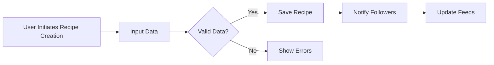
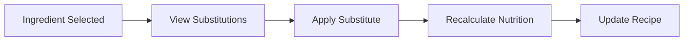

# Recipe Sharing Backend - Functional Requirements and Business Rules

## 1. Introduction
This document specifies a detailed set of business requirements for the Recipe Sharing Backend, enabling users to create, share, and manage recipes while supporting social engagement, dietary customization, and budget-conscious meal planning.

## 2. Business Model

### Why This Service Exists
The platform addresses a market gap for a highly customizable and socially connected recipe system that adapts recipes dynamically to dietary restrictions and ingredient availability, improving cooking convenience and nutrition management.

### Revenue Model
The service adopts a freemium approach: Regular Users access core features, with Premium Users unlocking advanced meal planning and cost tracking, generating recurring subscription revenue.

### Growth Strategy
Growth is driven through social engagement, personalized content feeds, and partnerships with grocery chains to enhance shopping and pricing features.

### Success Metrics
- Monthly active users (MAU)
- Premium subscription conversion rates
- Recipe creation volume
- User engagement in social and review features
- Accuracy and adoption of substitution and cost-tracking functions

## 3. User Roles and Authentication

### Roles
- Regular Users: Recipe creation, reviews, social following, collections, meal plans
- Premium Users: All Regular features plus advanced meal planning and cost tracking
- Moderators: Content moderation and category approval

### Authentication
- Email/password registration
- Secure login/logout
- Email verification required for content creation
- Reset and revoke password/session features

### Permissions
| Action | Regular User | Premium User | Moderator |
|--------|--------------|--------------|-----------|
| Create Recipes | ✅ | ✅ | ❌ |
| Rate and Review | ✅ | ✅ | ❌ |
| Follow Users | ✅ | ✅ | ❌ |
| Manage Collections/Meal Plans | ✅ | ✅ | ❌ |
| Advanced Meal Planning | ❌ | ✅ | ❌ |
| Ingredient Cost Tracking | ❌ | ✅ | ❌ |
| Moderate Content | ❌ | ❌ | ✅ |
| Approve Categories | ❌ | ❌ | ✅ |

## 4. Recipe Management

WHEN a user creates a recipe, THE system SHALL capture all necessary details including ingredients with units and optional brands, intuitive steps, and detailed nutritional data.

Recipe names must be unique per user. Quantities must be positive and utilize validated units.

Editing and deletion require verification of user ownership.

Missing or invalid fields cause rejection with descriptive errors.

## 5. Tagging and Categories

Predefined tags exist by cuisine, diet, and difficulty; user-generated tags require moderator approval.

Moderators review and approve or reject user-suggested categories.

## 6. Rating and Reviews

A 5-star rating system with detailed text reviews is supported.

Users may vote on the helpfulness of reviews and flag inappropriate content.

Moderators can hide flagged reviews and keep audit logs of moderation actions.

## 7. Social Features

Users follow others to curate feeds composed of 60% recent followed users’ recipes, 25% trending in category preferences, and 15% personalized recommendations.

Feeds update in real-time as followed users post.

## 8. Ingredient Search

Users may search recipes by ingredients with partial and minor typo matching.

Search results include any recipes containing input ingredients, ranked by match percentage.

## 9. Personal Collections and Meal Planning

Users create collections and meal plans linked to calendar dates and slots.

Recurring weekly meal plans are supported.

Weekly shopping lists are automatically generated based on plans.

## 10. Ingredient Substitution

The system supports 3-5 substitutes per ingredient with conversion ratios.

Substitutions trigger recalculation of nutritional info.

Dietary preferences influence substitution suggestions.

Cost tracking incorporates weekly pricing updates from three grocery chains.

## 11. Shopping List and Cost Tracking

Shopping lists consolidate ingredients and quantities, include cost estimates, and integrate with store availability APIs.

Alternative store and ingredient suggestions optimize cost.

## 12. Error Handling

All invalid inputs and unauthorized actions produce clear error messages.

Failures in external dependencies revert to last known good states with user notification.

## 13. Performance

Target responses: Feed updates under 3 sec, search results under 2 sec, recipe submissions under 2 sec, shopping list generation under 5 sec.

## 14. Diagrams

## 15. Developer Autonomy

This document specifies business requirements only. Developers have full autonomy over architecture, APIs, and database design. It defines WHAT needs to be built, not HOW it should be built.
