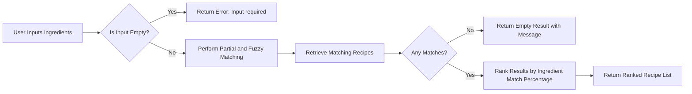

# Ingredient Search Business Requirements and Functional Specification

## 1. Introduction
This document details the feature allowing users to search recipes by providing ingredients they have available. It aims to improve recipe discovery by enabling searches that accommodate partial ingredient names and minor typographical errors. The backend must return search results ranked by how many ingredients from the user's input match those in each recipe.

## 2. Search by Ingredients

### 2.1 User Input
- Users shall be able to input one or more ingredient names as search criteria.
- THE system SHALL accept a list of ingredient terms for search.

### 2.2 Matching Logic
- THE system SHALL return all recipes containing any of the input ingredients.
- Ingredient matching SHALL be case-insensitive.

## 3. Partial and Fuzzy Matching

### 3.1 Partial Matching
- THE system SHALL match recipe ingredients that include the search term as a substring.
- Example: Searching "almond" SHALL match "almond milk" and "almond flour".

### 3.2 Fuzzy Matching
- THE system SHALL allow minor input typos.
- The maximum allowed edit distance for fuzzy matching SHALL default to 1, configurable as needed.

## 4. Result Ranking

- THE system SHALL rank recipes based on the percentage of user-input ingredients present in the recipe.
- Higher matching percentages SHALL result in higher rankings.
- Secondary ranking criteria include recipe popularity and recentness.

## 5. Search Performance Requirements

- THE system SHALL return search results within 2 seconds under up to 1000 concurrent search users.
- The search index SHALL update in near real-time to reflect recipe additions or changes.

## 6. Error Handling and Recovery

- IF the search input is empty, THEN THE system SHALL return an error indicating that at least one ingredient is required.
- IF no recipes match the search criteria, THEN THE system SHALL return an empty result set with a user-friendly message.
- IF a server error occurs during search processing, THEN THE system SHALL return a retryable error message.

## 7. Integration with Other Modules

- The ingredient search feature SHALL integrate with the recipe management module for ingredient data.
- Search ranking SHALL incorporate user preference data from the personalization module to adjust results.

## 8. Success Criteria

- Users SHALL find relevant recipes efficiently by searching with their available ingredients.
- Partial and fuzzy matching SHALL minimize search failure due to input variations.
- System response times SHALL meet the defined performance benchmarks.

## 9. Mermaid Diagram: Ingredient Search Flow

---

THE system SHALL treat this document as defining business requirements only. All technical implementation decisions including system architecture, APIs, and databases SHALL remain within developer autonomy. THE document specifies WHAT the system must do, not HOW to implement these functionalities.