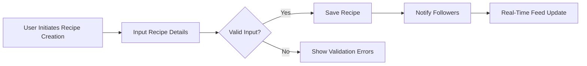

# Recipe Sharing Backend - Requirements Analysis Report

## 1. Introduction
This document defines the complete business requirements and functional specifications for the Recipe Sharing Backend system. It is intended exclusively for backend developers to guide the development of a robust, scalable, and user-centered backend platform.

The Recipe Sharing Backend enables users to create, share, rate, and manage recipes along with social engagement features, dietary customization, and budget-sensitive meal planning.

## 2. Business Model

### Why This Service Exists
The recipe sharing platform fills a market gap by combining community-driven recipe sharing with personalized nutrition and meal planning support. It addresses users' need to discover, adapt, and organize recipes fitting their dietary preferences and budget constraints.

### Revenue Strategy
The platform monetizes through premium subscriptions that unlock advanced meal planning, cost tracking, and enhanced management features, creating a recurring revenue stream.

### Growth Plan
User acquisition leverages recipe discovery, social following, and user-generated content. Retention is driven by personalized feeds and meal planning features.

### Success Metrics
- Monthly Active Users (MAU)
- Premium Subscriber Rate
- Average Recipes Created per User
- User Engagement on Reviews and Ratings
- Accuracy of Ingredient Substitution and Cost Tracking

## 3. User Roles and Authentication

### Overview of User Roles
- **Regular Users:** Can create, share, rate, and review recipes, follow others, and manage collections and meal plans.
- **Premium Users:** Have all Regular User capabilities plus advanced meal planning, ingredient cost tracking, and enhanced recipe management.
- **Moderators:** Can review flagged content, manage reported reviews, and approve user-generated categories.

### Authentication Requirements
- Users can register via email and password.
- Users can log in and log out securely.
- Email verification is mandatory before content creation privileges are enabled.
- Secure session management with configurable expiration.
- Password reset and change functionalities are provided.

### Role-Based Permissions
| Action                                | Regular User | Premium User | Moderator |
|-------------------------------------|--------------|--------------|-----------|
| Create and share recipes            | ✅           | ✅           | ❌        |
| Rate and review recipes             | ✅           | ✅           | ✅ (moderate reviews) |
| Follow other users                  | ✅           | ✅           | ❌        |
| Create collections and meal plans   | ✅           | ✅           | ❌        |
| Access advanced meal planning       | ❌           | ✅           | ❌        |
| Track ingredient cost and budgets   | ❌           | ✅           | ❌        |
| Review flagged content              | ❌           | ❌           | ✅        |
| Approve user-generated categories  | ❌           | ❌           | ✅        |

## 4. Recipe Management

### Recipe Creation
WHEN a user creates a recipe, THE system SHALL capture recipe details including title, description, ingredients, preparation steps, and nutritional information.

Ingredients SHALL include precise quantities, units, and optional brand information.

Nutritional information SHALL cover calories, protein, carbohydrates, fat, fiber, sodium, sugar, as well as vitamins A, C, D and minerals iron and calcium.

### Recipe Editing and Deletion
WHEN a recipe owner updates or deletes a recipe, THE system SHALL enforce ownership validation.

### Validation
IF any required recipe fields are missing or invalid during creation, THEN THE system SHALL reject the request with detailed error messages.

## 5. Tagging and Categories

THE system SHALL provide predefined categories including cuisine types (Italian, Mexican, Asian), diet types (vegan, keto, gluten-free, paleo), and difficulty levels (beginner, intermediate, advanced).

WHERE users add new tags, THE system SHALL mark these for moderator approval before becoming public.

### Category Management
Moderators SHALL receive and review user-suggested categories and approve or reject them.

## 6. Rating and Review System

THE system SHALL provide a 5-star rating scale along with text reviews.

Users SHALL be able to vote on review helpfulness.

Flagging of inappropriate reviews SHALL be supported.

Moderators SHALL have capabilities to hide flagged reviews and maintain an audit trail of moderation actions.

## 7. Social Features: Following and Feed

WHEN a user follows another user, THE system SHALL update the follower list and personalize the feed for that user.

THE personalized feed SHALL consist of 60% recipes from followed users, 25% trending recipes in preferred categories, and 15% recommendations based on past interactions.

Feed updates SHALL be pushed in real-time to users upon new recipe postings by followed users.

## 8. Ingredient Search

Users SHALL search recipes by listing available ingredients.

The search SHALL match recipes containing any of the listed ingredients with partial word matching enabled (e.g., 'almond' matches 'almond milk').

Search results SHALL be ranked by the percentage of matched ingredients.

## 9. Personal Collections and Meal Planning

Users SHALL create named recipe collections for organizing recipes.

Meal plans SHALL be created using calendar integration, allowing drag-and-drop of recipes to specific dates and meals.

Recurring meal plans SHALL be supported for repeated weekly schedules.

The system SHALL generate weekly shopping lists based on meal plans.

## 10. Ingredient Substitution and Nutritional Adjustments

FOR each ingredient, THE system SHALL store 3-5 common substitutions with conversion ratios.

WHEN users substitute ingredients in recipes, THEN THE system SHALL automatically adjust nutritional information accordingly.

User dietary preferences SHALL be stored to prioritize relevant substitutions.

Cost tracking SHALL incorporate prices from three major grocery stores, updated weekly.

## 11. Shopping List and Cost Tracking

Shopping lists SHALL consolidate ingredient quantities from multiple recipes intelligently.

Ingredient availability SHALL be checked against the user's preferred stores using a mock API.

Cost estimates SHALL be included with alternative store suggestions for budget optimization.

## 12. Error Handling and Performance Expectations

IF user inputs are invalid or incomplete, THEN THE system SHALL return clear error messages with actionable guidance.

Search and feed updates SHALL respond within 2 seconds under typical load.

Real-time feed updates SHALL propagate within 5 seconds after new recipe posts.

Moderation actions SHALL maintain audit logs with time stamps and user identifiers.

---

## Mermaid Diagram: Recipe Creation Workflow

## Mermaid Diagram: Ingredient Substitution Logic

---

This document exclusively defines business requirements. All technical implementation details such as architecture, API designs, and database schemas are at the discretion of the development team. Developers shall exercise autonomy to design optimal solutions that satisfy these requirements.