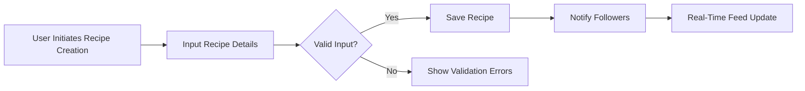
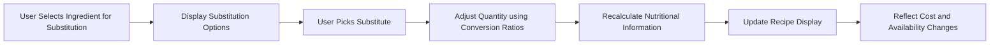
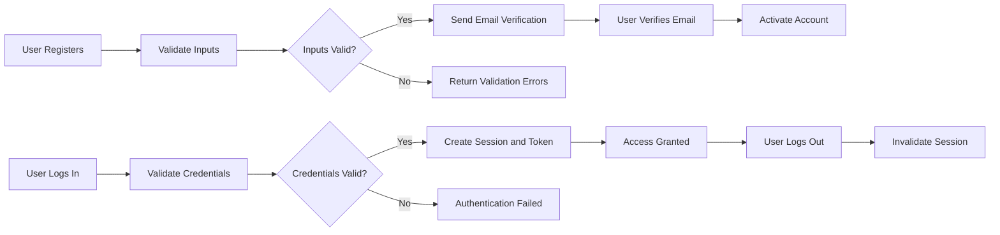
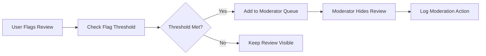

# Recipe Sharing Backend - Requirements Analysis Report

## 1. Introduction
The Recipe Sharing Backend system is designed to provide a comprehensive platform for recipe creation, sharing, rating, social interaction, dietary customization, and budget-sensitive meal planning. This document presents precise business requirements for backend developers to implement a scalable, robust system tailored to three user roles: Regular Users, Premium Users, and Moderators.

## 2. Business Model

### Why This Service Exists
The platform targets users seeking dynamic, personalized cooking experiences accommodating dietary restrictions, budget limitations, and ingredient availability. It differentiates itself by integrating ingredient substitution, nutritional recalculation, and grocery cost tracking into a socially engaging recipe sharing ecosystem.

### Revenue Strategy
Premium User subscriptions offer advanced meal planning and cost optimization, providing the primary revenue stream.

### Growth Plan
Employing social features like following and personalized feeds, the service aims to boost user acquisition and retention through valuable community interactions and grocery integrations.

### Success Metrics
- Monthly active users (MAU)
- Premium conversion rate
- Average recipes created per user
- User engagement with ratings and reviews
- Accuracy of ingredient substitution and cost tracking

## 3. User Roles and Authentication

### User Roles
- **Regular Users:** Create and share recipes; rate and review; follow others; manage personal collections and meal plans.
- **Premium Users:** All Regular User features; plus advanced meal planning, ingredient cost tracking.
- **Moderators:** Review flagged content, manage reported reviews, approve user-generated categories.

### Authentication Requirements
- Users register via email and password.
- Email verification is mandatory to unlock full features.
- Secure login/logout with JWT session management.
- Password reset and change capabilities.

### Role-Based Permissions
| Action | Regular User | Premium User | Moderator |
|--------|--------------|--------------|-----------|
| Create and share recipes | ✅ | ✅ | ❌ |
| Rate and review recipes | ✅ | ✅ | ✅ (moderate reviews) |
| Follow users | ✅ | ✅ | ❌ |
| Create/manage collections and meal plans | ✅ | ✅ | ❌ |
| Access advanced meal planning | ❌ | ✅ | ❌ |
| Ingredient cost tracking | ❌ | ✅ | ❌ |
| Moderate flagged content | ❌ | ❌ | ✅ |
| Approve user-generated categories | ❌ | ❌ | ✅ |

## 4. Functional Requirements

### 4.1 Recipe Creation
WHEN a user creates or edits a recipe, THE system SHALL collect the following:
- Title, description, ingredients (with quantity, unit, and optional brand), preparation steps
- Nutritional info: calories, protein, carbs, fat, fiber, sodium, sugar, vitamins A, C, D, iron, calcium
- Tags from predefined categories or user-generated tags pending moderator approval

THE system SHALL validate recipe uniqueness per user and required fields.

### 4.2 Tagging and Categories
Users SHALL tag recipes with multiple categories: cuisine (Italian, Mexican, Asian), diet (vegan, keto, gluten-free, paleo), difficulty (beginner, intermediate, advanced). User-generated tags SHALL be moderated.

### 4.3 Rating and Review
Users SHALL rate on a 5-star scale, submit detailed text reviews (up to 2000 characters), vote on helpfulness, and flag inappropriate content.

Moderators SHALL review flags, hide reviews if needed, and maintain audit logs.

### 4.4 Social Features
Users SHALL follow others; feeds SHALL comprise 60% followed users' recent recipes, 25% trending recipes in preferred categories, 15% personalized recommendations; feeds update in real-time.

### 4.5 Search
Users SHALL search by ingredients with partial and fuzzy matching; results ranked by ingredient match percentage.

### 4.6 Personal Collections and Meal Planning
Users create named collections, plan meals via drag-drop to calendar slots, configure recurring plans, and generate weekly shopping lists.

### 4.7 Ingredient Substitutions and Nutritional Adjustments
THE system SHALL store 3-5 substitutes per ingredient with conversion ratios, auto-adjust nutrition on substitution, prioritize according to dietary preferences, and track cost variations across stores.

### 4.8 Shopping Lists and Cost Tracking
Shopping lists SHALL consolidate ingredients, estimate costs per preferred stores, check store availability via mock API, and suggest alternatives for cost optimization.

## 5. Business Rules

- Recipe names must be unique per user.
- Ingredient quantities require positive numeric values with valid units.
- Substitution ratios must be validated.
- User dietary preferences filter suitable substitutions.
- Moderators approve user-generated categories.
- Flagged reviews exceeding threshold hidden automatically.

## 6. Error Handling

- Invalid inputs rejected with descriptive messages.
- Unauthorized actions denied with error responses.
- Substitution data missing triggers original ingredient use.
- API failures fallback to cached data with user notification.

## 7. Performance Requirements

- Recipe search responses within 2 seconds.
- Real-time feed updates within 3 seconds.
- Rating and review updates within 3 seconds.
- Meal plan shopping list generation within 5 seconds.

## 8. Mermaid Diagrams

This document defines clear, actionable, and measurable backend business requirements for immediate use by developers, without ambiguity or missing details.

All Mermaid diagrams use proper syntax with fully quoted labels and correct arrows.

The document excludes frontend/UI and technical implementation details.

Developers have complete autonomy on architecture, APIs, and database design.
