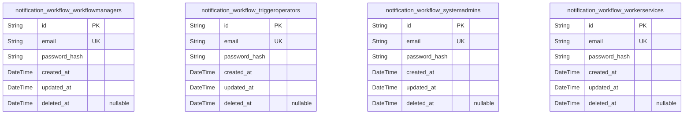
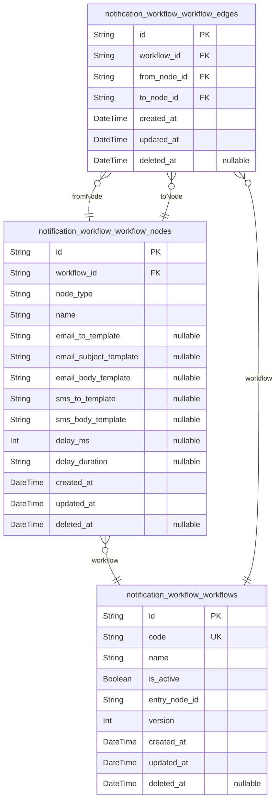
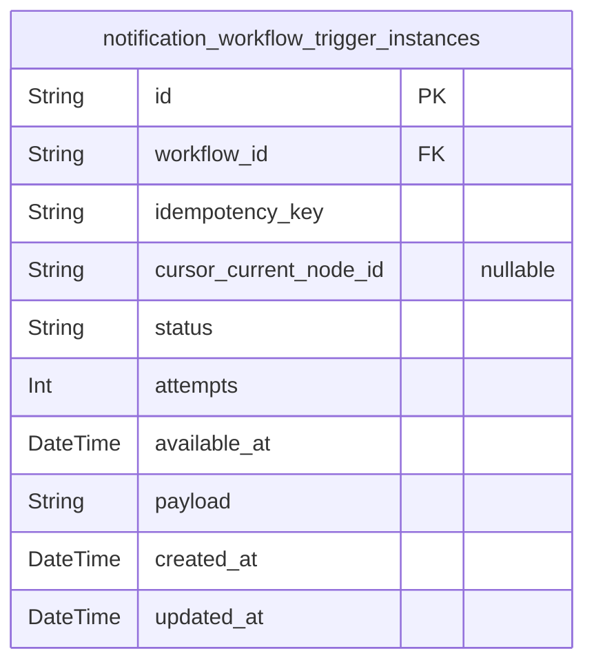
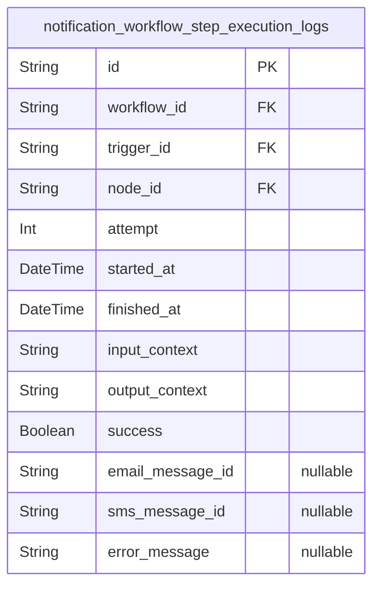
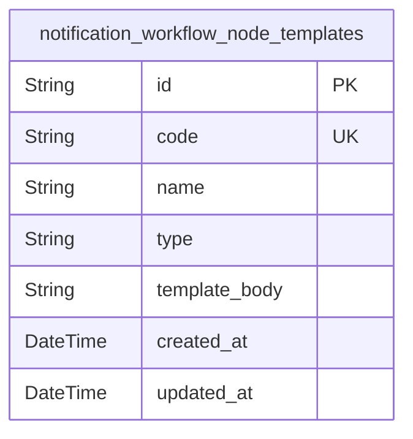
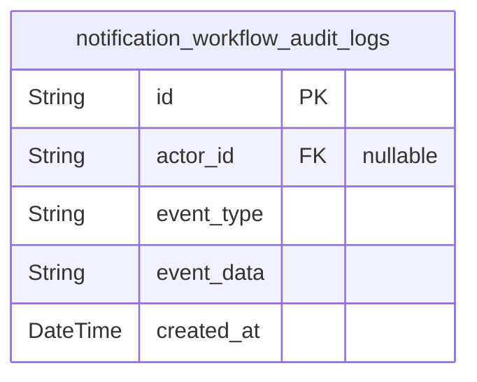

# Prisma Markdown

> Generated by [`prisma-markdown`](https://github.com/samchon/prisma-markdown)

- [Identity](#identity)
- [Workflows](#workflows)
- [Triggers](#triggers)
- [WorkerExecution](#workerexecution)
- [Core](#core)
- [AuditLogs](#auditlogs)

## Identity

### `notification_workflow_workflowmanagers`

Workflow manager users responsible for creating, updating, activating,
and managing notification workflows. Stores identity and authentication
data required for access control. Includes standard audit fields for
record management.

Properties as follows:

- `id`: Primary Key.
- `email`
  > Unique email address of the workflow manager used for login and
  > notifications.
- `password_hash`: Hashed password for authentication; never store plain passwords.
- `created_at`: Timestamp when the user record was created.
- `updated_at`: Timestamp when the user record was last updated.
- `deleted_at`: Timestamp for soft deletion; null if the record is active.

### `notification_workflow_triggeroperators`

Trigger operator users who create and manage trigger instances for
workflows. Stores identity and authentication information with audit
timestamps for access control enforcement.

Properties as follows:

- `id`: Primary Key.
- `email`
  > Unique email address of the trigger operator, used for user
  > identification and login.
- `password_hash`: Hashed password securely stored for authentication.
- `created_at`: Record creation timestamp for audit trail.
- `updated_at`: Last update timestamp reflecting modifications.
- `deleted_at`: Soft delete timestamp marking inactive users; null if active.

### `notification_workflow_systemadmins`

System administrator users with full permissions to manage users,
workflows, and system settings. Includes authentication credentials and
audit timestamps for secure management.

Properties as follows:

- `id`: Primary Key.
- `email`: Unique email address used by the system administrator for authentication.
- `password_hash`: Hashed password for secure authentication.
- `created_at`: Timestamp when the admin record was created.
- `updated_at`: Timestamp of last modification.
- `deleted_at`: Soft deletion timestamp; null indicates active record.

### `notification_workflow_workerservices`

Automated worker service users responsible for processing triggers
concurrently. Authentication and audit fields included to track service
identity and activity.

Properties as follows:

- `id`: Primary Key.
- `email`: Unique email identifying the worker service account.
- `password_hash`: Hashed password for worker service authentication.
- `created_at`: Timestamp when the worker service account was created.
- `updated_at`: Timestamp when the worker service account was last updated.
- `deleted_at`: Soft deletion timestamp; null for active records.

## Workflows

### `notification_workflow_workflows`

Represents notification workflows forming the main business entity for
orchestrating notification steps. Contains metadata including unique
code, name, activation status, versioning, and timestamps. Serves as the
root for related workflow nodes and edges. Workflows are DAGs defining
notification sequences for emails, SMS, and delays.

Properties as follows:

- `id`: Primary Key.
- `code`: Unique business identifier code for the workflow.
- `name`: Display name of the workflow.
- `is_active`: Indicates whether the workflow is active and can be triggered.
- `entry_node_id`: Reference to the starting node of the workflow DAG.
- `version`: Version number of the workflow, incremented on updates.
- `created_at`: Timestamp when the workflow was created.
- `updated_at`: Timestamp when the workflow was last updated.
- `deleted_at`: Soft deletion timestamp, null if not deleted.

### `notification_workflow_workflow_nodes`

Represents nodes within a notification workflow, each defining a step
such as Email, SMS, or Delay. Nodes belong to a parent workflow and can
be sequenced via edges. Stores node type discriminator, LiquidJS
templates for messages, and delay durations as applicable. Supports
validation and lifecycle properties. Managed subsidiary to the workflow
entity.

Properties as follows:

- `id`: Primary Key.
- `workflow_id`: Parent workflow's notification_workflow_workflows.id
- `node_type`: Type of node indicating Email, SMS, or Delay.
- `name`: Display name of the node.
- `email_to_template`: LiquidJS template string for email recipient address.
- `email_subject_template`: LiquidJS template string for email subject.
- `email_body_template`: LiquidJS template string for email body content.
- `sms_to_template`: LiquidJS template string for SMS recipient number.
- `sms_body_template`: LiquidJS template string for SMS content.
- `delay_ms`: Delay in milliseconds for DelayNode steps.
- `delay_duration`: ISO 8601 duration string representing delay.
- `created_at`: Timestamp when the node was created.
- `updated_at`: Timestamp when the node was last updated.
- `deleted_at`: Soft deletion timestamp for the node.

### `notification_workflow_workflow_edges`

Defines directed edges connecting nodes within notification workflows.
Represents the relationships modeling the DAG structure of workflows by
linking nodes with 'from' and 'to' references. Ensures graph integrity
and no self loops. Managed as subsidiary entity.

Properties as follows:

- `id`: Primary Key.
- `workflow_id`: Parent workflow's notification_workflow_workflows.id
- `from_node_id`: Source node reference in notification_workflow_workflow_nodes.id
- `to_node_id`: Target node reference in notification_workflow_workflow_nodes.id
- `created_at`: Timestamp when the edge was created.
- `updated_at`: Timestamp when the edge was last updated.
- `deleted_at`: Soft deletion timestamp for the edge.

## Triggers

### `notification_workflow_trigger_instances`

Stores runtime TriggerInstances for notification workflows representing
workflow executions with idempotency key, status, current cursor
position, retry attempts, and availability scheduling. References the
target workflow and supports lifecycle management and worker processing
coordination.

Properties as follows:

- `id`: Primary Key.
- `workflow_id`: Referenced workflow's notification_workflow_workflows.id.
- `idempotency_key`
  > Idempotency key to ensure uniqueness and prevent duplicate trigger
  > creation per workflow.
- `cursor_current_node_id`
  > Current node id cursor indicating the next node to execute in the
  > workflow DAG.
- `status`
  > Status of the trigger instance, enum values: enqueued, processing,
  > completed, failed.
- `attempts`: Count of execution attempts for retry logic, starting from zero.
- `available_at`
  > Timestamp indicating when the trigger instance becomes available for
  > processing or retry.
- `payload`
  > Input data payload in JSON format for the workflow trigger execution
  > context.
- `created_at`: Timestamp when the TriggerInstance was created.
- `updated_at`: Timestamp when the TriggerInstance was last updated.

## WorkerExecution

### `notification_workflow_step_execution_logs`

This table captures detailed execution logs for each workflow step run by
worker servers. It records each attempt's input, output, timestamps, and
result, associating logs with workflow, trigger instances, and nodes. It
supports robust audit trails and troubleshooting by providing immutable
records of every step execution in the Notification Workflow system.

Properties as follows:

- `id`: Primary Key.
- `workflow_id`: Referenced workflow's notification_workflow_workflows.id.
- `trigger_id`: Referenced trigger instance's notification_workflow_trigger_instances.id.
- `node_id`: Referenced workflow node's notification_workflow_workflow_nodes.id.
- `attempt`: Attempt number of this execution step, starting from 1.
- `started_at`: Timestamp when execution of this step started.
- `finished_at`: Timestamp when execution of this step finished.
- `input_context`: JSON string capturing the input execution context for this step.
- `output_context`: JSON string capturing the output execution context after this step.
- `success`: Whether this execution step succeeded.
- `email_message_id`
  > Identifier of the email message if this step sent an email; null
  > otherwise.
- `sms_message_id`: Identifier of the SMS message if this step sent an SMS; null otherwise.
- `error_message`: Error message if the execution step failed; null otherwise.

## Core

### `notification_workflow_node_templates`

This table stores reusable node templates for notification workflows
including email, sms, and delay templates. Each template is identified by
a unique code and classified by type to facilitate consistent workflow
node creation and management. Templates contain LiquidJS template bodies
defining the content or behavior of each node type. This core entity
enables flexible and centralized management of notification content
templates used by workflow nodes across the system.

Properties as follows:

- `id`: Primary Key.
- `code`: Unique business identifier code for the node template.
- `name`: Human-readable name of the node template.
- `type`: Type of the node template: "email", "sms", or "delay".
- `template_body`: LiquidJS template content of the node template.
- `created_at`: Timestamp when the template was created.
- `updated_at`: Timestamp when the template was last updated.

## AuditLogs

### `notification_workflow_audit_logs`

Audit log records capturing immutable events related to workflows,
triggers, user roles, and system operations for compliance and forensic
analysis.

Properties as follows:

- `id`: Primary Key.
- `actor_id`
  > ID of the user or system actor responsible for the event, nullable for
  > system events. [notification_workflow_workflowmanagers.id](#notification_workflow_workflowmanagers)
- `event_type`
  > Type of event recorded (e.g., workflow_created, trigger_fired,
  > user_role_assigned).
- `event_data`: JSON string containing detailed event data and context.
- `created_at`: Timestamp of when the event was recorded.
