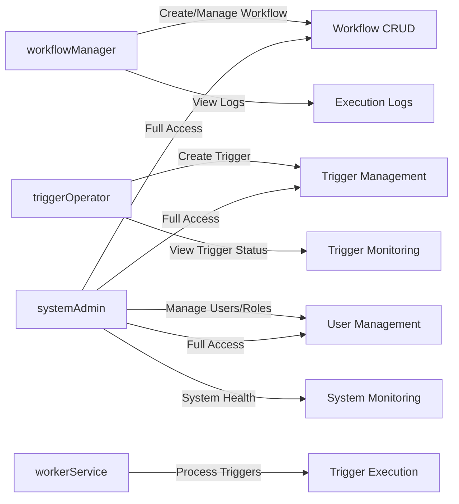

# Notification Workflow Backend System: User Roles and Permissions Specification

This document provides the **business requirements** for user roles and permissions within the Notification Workflow backend system. It describes the authentication mechanisms, defines roles and responsibilities, details the permission matrix, and explains token management policies.

This document specifies **WHAT** the system must do regarding user access and authentication, leaving technical implementation details to the development team.

---

## 1. Authentication Overview

### 1.1 Authentication Mechanisms

- THE Notification Workflow system SHALL support user authentication to control access to workflow management and trigger operations.
- THE system SHALL authenticate users using credentials aligned with assigned roles.
- THE system SHALL issue JSON Web Tokens (JWT) for authenticated sessions to facilitate stateless authorization.
- THE system SHALL maintain session security by limiting token lifespan and supporting token revocation.

### 1.2 Token Management

- THE system SHALL use JWTs for access tokens with expiry of 15 to 30 minutes.
- THE system SHALL issue refresh tokens valid for 7 to 30 days for session renewal.
- THE system SHALL store tokens securely, recommending httpOnly cookies for web clients.
- THE system SHALL include in JWT payload the userId, role, and permissions array to enforce access controls.
- THE system SHALL protect the JWT secret key with a robust management strategy.

---

## 2. User Role Definitions

The system defines four primary roles, each with distinct responsibilities and permissions:

| Role            | Description                                                                        |
|-----------------|------------------------------------------------------------------------------------|
| workflowManager | Users responsible for creating, updating, activating, and deactivating workflows. They can perform CRUD on workflows and view execution logs.
| triggerOperator | Users who create trigger instances, monitor trigger statuses, and manage the lifecycle of triggers, ensuring idempotency.
| systemAdmin     | Administrators with full control over users, roles, workflows, triggers, and system health.
| workerService   | Automated role representing the worker server that processes pending trigger instances concurrently.

### 2.1 Role Responsibilities

- **workflowManager** shall: 
  - Create, read, update, and delete workflows.
  - Activate and deactivate workflows.
  - View detailed execution logs for troubleshooting.

- **triggerOperator** shall:
  - Initiate trigger instances with idempotency guarantees.
  - Monitor trigger instance statuses and progress.
  - Manage retries, failures, and lifecycle states of triggers.

- **systemAdmin** shall:
  - Manage users and their roles.
  - Oversee workflows and triggers.
  - Monitor overall system health and audit logs.

- **workerService** shall:
  - Claim and process enqueued triggers concurrently.
  - Execute nodes sequentially within each workflow.
  - Handle retries, exponential backoff, and failure conditions.

---

## 3. Permission Matrix

The following matrix maps roles to system capabilities:

| Capability                        | workflowManager | triggerOperator | systemAdmin | workerService |
|---------------------------------|-----------------|-----------------|-------------|---------------|
| Create Workflow                 | ✅               | ❌               | ✅           | ❌             |
| Read Workflow                   | ✅               | ✅               | ✅           | ✅             |
| Update Workflow                 | ✅               | ❌               | ✅           | ❌             |
| Delete Workflow                 | ✅               | ❌               | ✅           | ❌             |
| Activate/Deactivate Workflow    | ✅               | ❌               | ✅           | ❌             |
| View Execution Logs            | ✅               | ✅               | ✅           | ❌             |
| Create Trigger Instance         | ❌               | ✅               | ✅           | ❌             |
| View Trigger Status             | ❌               | ✅               | ✅           | ❌             |
| Manage Trigger Lifecycle        | ❌               | ✅               | ✅           | ❌             |
| Manage Users and Roles          | ❌               | ❌               | ✅           | ❌             |
| Monitor System Health           | ❌               | ❌               | ✅           | ❌             |
| Process Trigger Instances (Worker) | ❌           | ❌               | ❌           | ✅             |

---

## 4. Token Management

### 4.1 Token Types

- THE system SHALL issue JSON Web Tokens (JWT) for authentication.
- THE access token SHALL have an expiration between 15 and 30 minutes.
- THE refresh token SHALL have an expiration between 7 and 30 days.

### 4.2 Token Payload

- THE JWT SHALL include the following claims:
  - `userId`: unique identifier of the user.
  - `role`: assigned role name (e.g., workflowManager).
  - `permissions`: an array of permissions consistent with assigned role.

### 4.3 Security Considerations

- THE system SHALL secure token storage (preferably httpOnly cookies to mitigate XSS).
- THE system SHALL protect the JWT secret key with secure key management practices.
- THE system SHALL support token revocation and renewal to maintain session security.

---

## 5. Summary of Business Rules

- WHEN a new user is assigned a role, THE system SHALL enforce associated permissions immediately.
- THE system SHALL ensure users can only perform actions explicitly allowed by their assigned role.
- IF an unauthorized action is attempted, THEN the system SHALL deny access and return an appropriate error.
- THE system SHALL log all role and permission changes for audit purposes.
- THE workerService role SHALL run as an automated backend process with no direct human interaction.

---

## Mermaid Diagram: Role to Capability Mapping

---

This document provides business requirements only. All technical implementation decisions — including architecture, API design, database schema, and security controls — are the responsibility of the development team.

Developers have full autonomy over how to implement these requirements effectively, provided all business rules and access constraints specified herein are adhered to strictly.