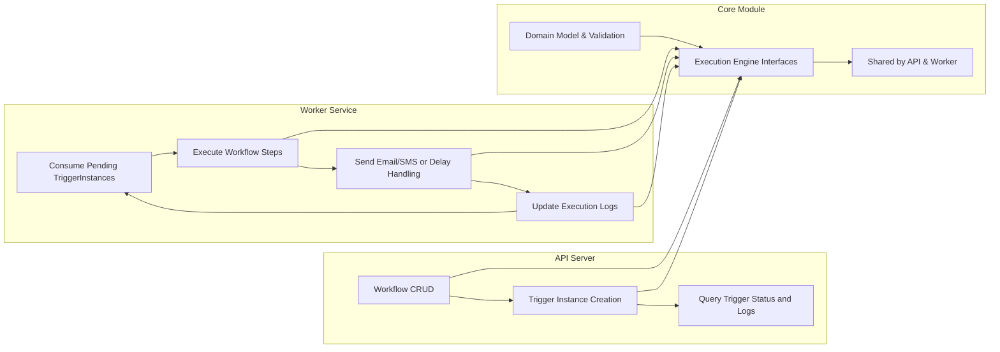

# Notification Workflow Backend Service Overview

## 1. Introduction
The Notification Workflow backend system provides a robust and scalable platform for managing and executing event-driven communication workflows composed of email, SMS, and delay actions. This service enables users to define complex notification sequences as directed acyclic graphs (DAGs), supporting advanced use cases such as delayed SMS following an email, ensuring message idempotency, and providing detailed execution logging and retry capabilities.

## 2. Business Model

### 2.1 Why This Service Exists
The growing demand for personalized and reliable notification systems drives the need for a dedicated backend service that can handle multiple communication channels with fine-grained control and reliability. This service addresses common deficiencies in notification handling such as duplicate message sending, inflexible triggering mechanisms, and limited delay/retry strategies.

Our system fills the market gap for an integrated, developer-friendly backend workflow engine that supports content templating, idempotent triggers, and concurrency-safe execution for mission-critical notifications. This enhances operational efficiency and customer engagement for client applications.

### 2.2 Revenue Strategy
Revenue generation is envisioned through licensing the notification workflow engine as a backend service platform, potentially offered as a subscription SaaS. Additional opportunities include:
- Premium features around provider integrations and analytics
- Usage-based billing for message volumes
- Enterprise support and customization

### 2.3 Growth Plan
User acquisition will focus on developers and product teams requiring reliable, scalable notification orchestration through:
- Developer-friendly APIs and comprehensive documentation
- Flexible integration capabilities (email, SMS providers)
- Scalable infrastructure supporting horizontal worker scaling for concurrent execution

Retention will be promoted through system reliability, rich feature set, and proactive support.

### 2.4 Success Metrics
Key performance indicators include:
- Trigger throughput and latency (triggers processed per minute, step execution times)
- System uptime and resilience
- Idempotency success rate (avoiding duplicate notifications)
- Customer satisfaction via reduced notification errors
- Workflow activation and usage frequency

## 3. Core Value Proposition
The core value offered by this backend service is a reliable, flexible, and easy-to-use notification workflow execution engine with key capabilities:
- Declarative workflow definitions as node graphs with email, SMS, and delay nodes
- Enforced idempotent triggering to prevent duplicated sends
- Template-based message generation using LiquidJS
- Scalable concurrent processing with safe state persistence
- Configurable retry and backoff handling to ensure completion
- Detailed step execution logging for audit and debugging

These features reduce development overhead for clients, ensure messaging accuracy, and improve customer engagement outcomes.

## 4. Business Strategy

### 4.1 API Server Responsibilities
The API server manages workflow lifecycle operations and trigger management:
- Create, read, update, and delete (CRUD) operations on notification workflows
- Workflow validation enforcing DAG acyclicity, template correctness, and domain invariants
- Idempotent creation of TriggerInstances for workflow execution initiation
- Querying trigger instance states and logs
- Access control scoped to defined user roles (workflowManager, triggerOperator, systemAdmin)

### 4.2 Worker Server Responsibilities
The worker server consumes queued TriggerInstances and executes steps:
- Processes multiple TriggerInstances concurrently, supporting horizontal scale-out
- Executes workflow nodes in sequence based on edges with concurrency scoped only at the instance level
- Handles email and SMS sending, delays, and logs execution results
- Enforces retry policies with up to three attempts and exponential backoff
- Utilizes BullMQ for scheduling DelayNode timed execution
- Updates TriggerInstance and StepExecutionLog statuses accordingly

### 4.3 Core Module Responsibilities
The shared core module provides:
- Domain model definitions for Workflow, Node types, Edges, TriggerInstances, and Execution Context
- Validation logic for workflows, triggers, templates, and DAG structure
- Execution logic for step rendering, sending (email/SMS), delay calculation, and context merging
- Interfaces for API and worker servers to load, validate, create triggers, and execute nodes

### 4.4 Concurrency and Scaling
TriggerInstances are independent units allowing the system to:
- Process multiple triggers in parallel
- Scale workers horizontally for throughput
- Maintain strict sequential execution order only within the nodes of a single workflow instance

### 4.5 Failure and Retry Handling
The system emphasizes robustness by:
- Retrying failed node executions up to three times using exponential backoff scheduling
- Recording failure causes in execution logs
- Marking TriggerInstance as 'failed' after exhausting retry attempts
- Leveraging idempotency keys at trigger creation to prevent duplicate processing

## 5. Summary and Developer Guidance
This document describes the foundational business objectives and system rationale behind the Notification Workflow backend. Backend developers are empowered to build a scalable, reliable, and flexible notification orchestration backend by:
- Implementing APIs for workflow and trigger management aligned with domain rules
- Creating a horizontally scalable worker service processing concurrent trigger executions
- Sharing a core module encapsulating domain validation and execution logic

The system should maintain clear separation of concerns, support high availability and consistency, and meet defined success metrics for reliability and customer experience.

*This document provides business requirements only. All technical implementation decisions belong to developers. Developers have full autonomy over architecture, APIs, and database design. The document describes WHAT the system should do, not HOW to build it.*

---

This flowchart demonstrates the separation of responsibilities and interaction between the service components.