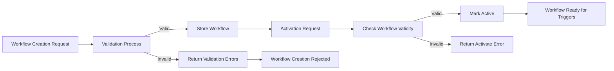

# Notification Workflow Management Service
## Workflow CRUD and Management Operations Functional Requirements

### 1. Introduction and Overview
This document defines the comprehensive functional requirements for the Workflow management aspects of the Notification Workflow backend system. It focuses on the creation, reading, updating, deleting (CRUD), validation, activation, deactivation, and error handling of workflows.

This document is written for backend developers building the Workflow API server which handles Workflow CRUD and management operations along with workflow lifecycle enforcement.

### 2. Business Model and Context for Workflow Management

#### Why This Service Exists
The Notification Workflow system exists to automate sending notifications via email, SMS, and delayed execution. Workflows define complex sequences of actions as directed acyclic graphs containing nodes and edges. Efficient management of these workflows enables businesses to automate timely communication, improving user engagement and operational efficiency.

#### Revenue Strategy
While this service is primarily internal infrastructure, it supports higher-value features sold as part of customer-facing products that automate marketing or transactional messaging.

#### Growth Plan
Workflow management capabilities scale with the business by enabling users (workflowManagers) to author and maintain notification flows flexibly.

#### Success Metrics
Key metrics include the number of active workflows managed, successful workflow activations, and absence of workflow validation errors affecting runtime.

### 3. User Roles and Permissions Related to Workflows

| Role           | Permissions Related to Workflow CRUD and Management                               |
|----------------|---------------------------------------------------------------------------------|
| workflowManager | Can create new workflows, read detailed workflows, update, delete, activate and deactivate workflows, and view execution logs. |
| triggerOperator | Can trigger workflow instances but cannot create or manage workflows.             |
| systemAdmin    | Full system access including workflow CRUD and management features.              |
| workerService  | Not applicable for API operations; responsible for background execution only.     |

### 4. Functional Requirements

#### 4.1 Workflow CRUD Operations

##### 4.1.1 Create Workflow
- WHEN a workflowManager submits a new workflow creation request, THE system SHALL validate all workflow fields before saving.
- THE system SHALL ensure that `entryNodeId` references an existing node in the workflow's nodes list.
- THE system SHALL verify that every edge's `from` and `to` node IDs exist in the nodes list.
- THE system SHALL assert the workflow graph is acyclic to ensure no cycles exist.
- THE system SHALL validate the schemas of each node according to their types (email, sms, delay).
- THE system SHALL verify that email and sms templates are syntactically valid LiquidJS template strings.
- THE system SHALL verify that delay nodes specify valid `delayMs` or `duration` convertible to milliseconds.
- IF any validation fails, THEN THE system SHALL reject the creation and provide meaningful error messages indicating the problems.
- ON successful validation, THE system SHALL store the workflow with version incremented and timestamps createdAt and updatedAt.

##### 4.1.2 Read Workflow Details
- WHEN a workflowManager requests a workflow by ID, THE system SHALL return the workflow including all nodes and edges.
- THE system SHALL include metadata such as version, isActive status, createdAt, and updatedAt.

##### 4.1.3 Update Workflow
- WHEN a workflowManager submits an update to an existing workflow, THE system SHALL perform the same validation steps as creation.
- THE system SHALL ensure that updates increment the version number.
- THE system SHALL update the updatedAt timestamp.
- IF validation fails, THE system SHALL reject the update and provide clear error details.

##### 4.1.4 Delete Workflow
- WHEN a workflowManager requests deletion of a workflow, THE system SHALL only allow deletion if no active triggers are referencing it.
- IF deletion is allowed, THE system SHALL delete the workflow and all associated references.
- IF deletion is disallowed due to active references, THEN THE system SHALL return an error indicating reason.

#### 4.2 Workflow Validation Rules
- THE system SHALL enforce that `entryNodeId` exists in the node list.
- THE system SHALL confirm all nodes referenced by edges exist, forbidding self loops (edges where from and to are the same node).
- THE system SHALL enforce acyclic workflow graph property by applying a topological sort or equivalent.
- THE system SHALL check that email and SMS node templates are parsable and reject those with syntax errors.
- THE system SHALL ensure delay nodes have at least one valid delay field and that the delay can be interpreted as milliseconds.

#### 4.3 Activation and Deactivation Logic
- WHEN a workflowManager activates a workflow, THE system SHALL confirm that the workflow is valid and complete.
- THE system SHALL mark the workflow as active (`isActive` = true), making it eligible for triggering.
- WHEN deactivating, THE system SHALL set `isActive` = false, preventing new triggers.
- THE system SHALL reject activation if validation errors exist.

#### 4.4 Error Handling
- IF workflow validation fails at any point, THEN THE system SHALL return error responses specifying which validation(s) failed.
- IF an attempt is made to delete an active workflow referenced by triggers, THEN THE system SHALL return a conflict error.
- IF unexpected system errors occur during CRUD operations, THEN THE system SHALL log the error and return a generic error message.
- THE system SHALL provide error messages that assist workflowManagers in correcting issues.

### 5. Performance Expectations
- THE system SHALL respond to workflow CRUD API requests within 500 milliseconds under normal load.
- THE system SHALL handle concurrent workflow modifications with proper versioning to prevent race conditions.
- THE system SHALL ensure validation performance is efficient to support workflows with up to hundreds of nodes and edges.

### 6. Diagrams

#### 6.1 Workflow Lifecycle Flow


#### 6.2 Workflow Validation Process
```mermaid
flowchart LR
  A["Start Validation"] --> B["Check entryNodeId exists"]
  B --> C["Check all edges reference valid nodes"]
  C --> D["Assert no cycles in graph"]
  D --> E{ "Nodes pass schema validations?" }
  E -->|"Yes"| F["Parse Email/SMS Templates"]
  E -->|"No"| G["Fail Validation"]
  F --> H["Verify Delay Node delays"]
  H --> I{ "All validations pass?" }
  I -->|"Yes"| J["Validation Success"]
  I -->|"No"| G
```

### 7. Appendix

#### 7.1 Glossary
- **Workflow:** Directed acyclic graph of nodes and edges defining notification actions.
- **Node:** Action unit of type Email, SMS, or Delay.
- **Edge:** Directed connection between nodes, no cycles allowed.
- **Activation:** Marking a workflow as active to allow triggering.

#### 7.2 Relationship to Other Documents
- This document builds on concepts from the service overview and user roles documents.
- It complements trigger management and worker execution specifications.
- Validation rules here connect closely to the business rules document.

---

THE requirements in this document define only WHAT the Notification Workflow service SHALL do in terms of workflow CRUD and management. Implementation details around database schema, API routes, or infrastructure are left to the development team. This document empowers developers with clear, testable business rules, user role considerations, error cases, and performance targets necessary to build the backend effectively.
