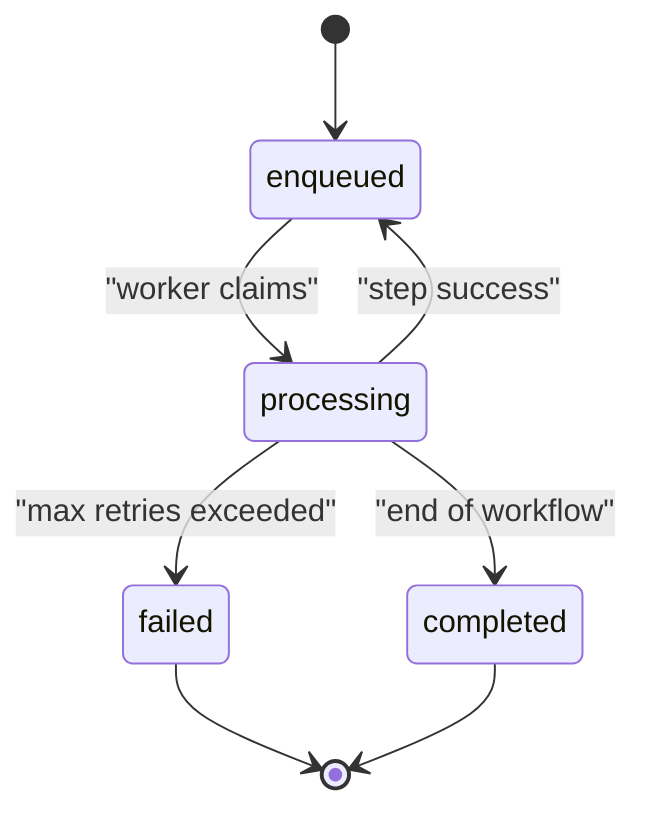
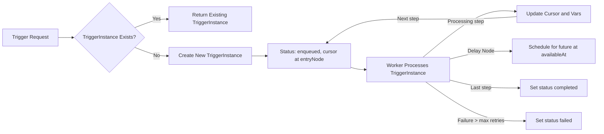

# Notification Workflow Backend - Trigger Management Functional Requirements

## 1. Introduction

This document specifies the detailed functional requirements for managing TriggerInstances in the Notification Workflow backend system. It establishes clear business rules, validation criteria, lifecycle state behaviors, idempotency guarantees, error handling policies, and comprehensive logging requirements.

The goal is to enable reliable, concurrent processing of triggers that initiate workflow executions with strict uniqueness enforced by idempotency keys. The document is intended for backend developers building and operating both the API server responsible for trigger CRUD operations and the worker server responsible for executing workflow steps.

This document provides business requirements only. All technical implementations, including architecture, APIs, and database design, are at the discretion of the development team. Developers have full autonomy to decide how to realize these requirements.

---

## 2. Trigger Creation and Validation

### 2.1 TriggerInstance Creation

WHEN a request to create a new TriggerInstance for a specific workflow arrives, THE system SHALL:

- Validate that the referenced workflow exists and is currently active.
- Enforce that the combination of `workflowId` and `idempotencyKey` is unique.
- IF a TriggerInstance with the same `workflowId` and `idempotencyKey` already exists, THEN THE system SHALL return the existing TriggerInstance instead of creating a duplicate.
- Initialize the new TriggerInstance with:
  - Status set to `enqueued`.
  - Cursor pointing to the `entryNodeId` of the referenced workflow.
  - Attempts count initialized to zero.
  - `availableAt` set to the creation timestamp.
  - Store the input `payload` as provided.
  - Generate unique identifiers and timestamps accordingly.

### 2.2 Validation Rules for Creation

THE system SHALL enforce the following validation rules at TriggerInstance creation:

- The `workflowId` must reference a valid and active workflow.
- The `idempotencyKey` must be a non-empty string.
- The combined `(workflowId, idempotencyKey)` pair must be unique system-wide.

---

## 3. Idempotency Handling

- WHEN a trigger request is received, THE system SHALL check for an existing TriggerInstance with the same `(workflowId, idempotencyKey)`.
- IF such a TriggerInstance exists, THEN THE system SHALL return the existing instance without creating a new one.
- This enforces idempotency of triggers leveraging the Inbox pattern.

---

## 4. Status Transitions and States

### 4.1 TriggerInstance States

The TriggerInstance SHALL only be in one of the following states:

| State       | Description                                      |
|-------------|------------------------------------------------|
| `enqueued`  | Awaiting processing by a worker.
| `processing`| Actively being processed by a worker.
| `completed` | Successfully finished execution of all steps.
| `failed`    | Marked as failed after exceeding retry attempts or unrecoverable error.

### 4.2 Valid State Transitions

- `enqueued` → `processing` when a worker claims the TriggerInstance for step execution.
- `processing` → `enqueued` when an EmailNode or SmsNode step succeeds and the cursor advances.
- `processing` → `enqueued` when a DelayNode computes the next `availableAt` and reschedules the trigger.
- `processing` → `completed` when the end of the workflow DAG is reached (no next node).
- Any state → `failed` when max retry attempts are exceeded or irrecoverable error occurs.

### 4.3 Cursor Management

- The cursor SHALL keep track of the current node being executed.
- After successful step execution, the cursor advances to the next node as defined by the workflow edges.
- At workflow termination, the cursor's `currentNodeId` SHALL be set to null.

---

## 5. Error and Retry Logic

### 5.1 Failure Handling

- WHEN a step execution results in failure, THE system SHALL:
  - Increment the `attempts` count for the TriggerInstance.
  - Reschedule the trigger for future processing applying exponential backoff.
  - Apply a maximum of three retry attempts.
  - IF the maximum number of retries is exceeded, THEN THE system SHALL mark the TriggerInstance as `failed`.

### 5.2 Exponential Backoff Policy

- The next `availableAt` timestamp SHALL be calculated as:
  - `availableAt = now + baseDelay * 2 ^ (attempts - 1)`
  - Where `baseDelay` is a configurable initial delay period (e.g., 1 minute).
  - Backoff periods double with each retry attempt.

### 5.3 Idempotency in Retries

- Steps SHALL be implemented to be idempotent wherever possible.
- Retry attempts must NOT cause duplicate notifications or executions.

---

## 6. Logging and Auditing

### 6.1 StepExecutionLog Creation

- THE system SHALL create a StepExecutionLog record for each executed node step, capturing:
  - `triggerId`, `workflowId`, node identifier, start and finish timestamps.
  - Input execution context at step invocation.
  - Output context including results or vars update.
  - Success flag and any error details.

### 6.2 Audit Requirements

- Logs SHALL be immutable and stored securely.
- Logs SHALL support querying by `triggerId` and `nodeId`.
- All status changes of TriggerInstances SHALL be logged for audit trail.

---

## 7. Appendices

### 7.1 Glossary

- **TriggerInstance**: An instance created when a workflow is triggered with a unique idempotency key and input payload.
- **Cursor**: The pointer in a TriggerInstance indicating the current node to execute.
- **IdempotencyKey**: A unique string to prevent duplicate triggering of the same logical event.
- **Exponential Backoff**: A retry policy where the delay increases exponentially after each failure.

### 7.2 Mermaid Diagram: TriggerInstance State Transitions

### 7.3 Mermaid Diagram: TriggerInstance Lifecycle Flow

---

This document serves as the definitive guide to all aspects of TriggerInstance management in the Notification Workflow system, enabling backend developers to implement a robust, scalable, and reliable workflow triggering mechanism compliant with business rules and performance expectations.