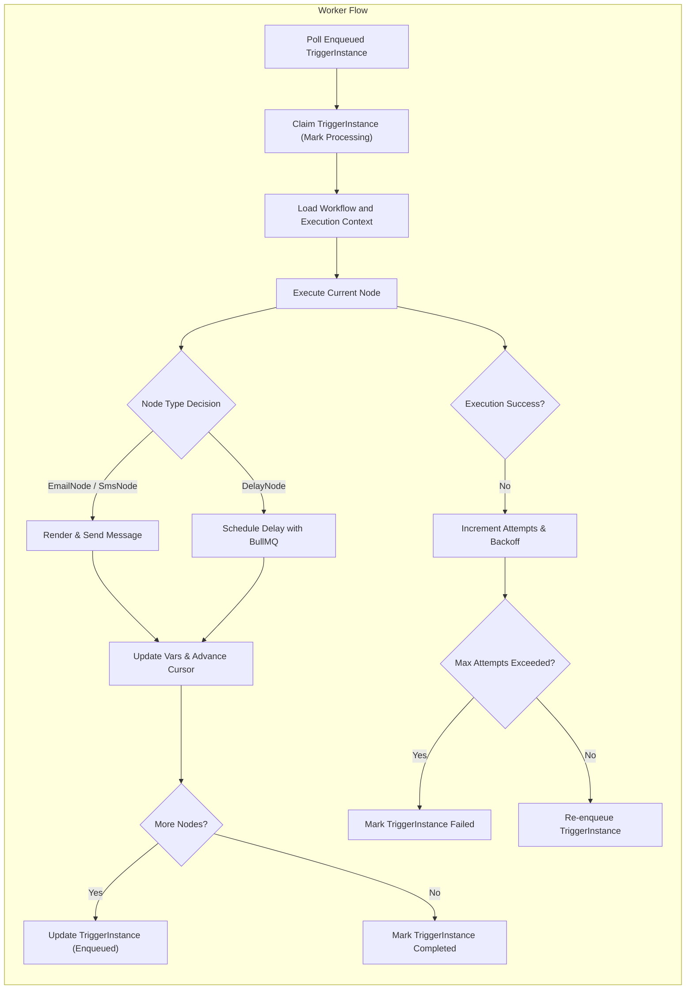

# Worker Execution Requirements for Notification Workflow Service

## 1. Worker Processing Model

### 1.1 Worker Responsibilities
Workers in the Notification Workflow system are responsible for processing pending TriggerInstances generated by the API server. The worker service continuously listens for TriggerInstances marked as "enqueued". Once a worker claims an instance, it updates the status to "processing" to lock exclusive ownership.

Each TriggerInstance corresponds to a specific Workflow, which is a Directed Acyclic Graph (DAG) of nodes. The worker sequentially executes each node in the workflow starting from the entry node, following edges until no further nodes remain. This includes executing EmailNode, SmsNode, and DelayNode steps as defined in the workflow.

The worker maintains and advances a cursor within the TriggerInstance that tracks the current execution node and previous execution results. On successful execution of a node, the worker merges the node’s output into the ongoing execution context for subsequent nodes.

Once the final node executes successfully, the worker marks the TriggerInstance as "completed".

### 1.2 Execution Context
The worker relies on the shared core module to load workflow definitions and to apply validation and execution logic. The execution context is an object containing immutable payload and trigger metadata, current workflow info, accumulated variables from prior nodes, and the current timestamp.

The worker merges outputs from each node execution into this context before advancing to the next node.

## 2. Concurrency and Scaling

### 2.1 Concurrent Processing
The worker system SHALL support concurrent processing of multiple TriggerInstances independently. Each TriggerInstance’s processing is isolated with its own execution context.

### 2.2 Horizontal Scale-Out
Multiple worker server instances MAY run in parallel across different hosts to increase throughput. Workers coordinate by atomically claiming TriggerInstances via database locks or transactionality to ensure only one worker processes a given instance at a time.

## 3. Step Execution Logic

### 3.1 Node Types and Processing Steps
- **EmailNode:**
  - Render `to`, `subject`, and `body` strings using LiquidJS templates with the current execution context.
  - Send email via the configured provider, acquiring a `messageId`.
  - Record the email sending outcome in `vars` using the key pattern `email_<nodeId>`.

- **SmsNode:**
  - Render `to` and `body` templates with LiquidJS.
  - Send SMS via provider and record the `messageId` in `vars` with key `sms_<nodeId>`.

- **DelayNode:**
  - Calculate delay duration either from `delayMs` or `duration` field.
  - Schedule delay using BullMQ with the computed delay time.
  - Update TriggerInstance's `availableAt` timestamp to reflect when the trigger should be processed again post delay.

### 3.2 Cursor Management
After each successful node execution, the worker SHALL update the TriggerInstance’s cursor to point to the next node in the DAG. If no next node exists, the status transitions to "completed".

## 4. Retry and Backoff Policies

### 4.1 Handling Failures
If execution of any node fails, the worker SHALL increment the `attempts` counter for the TriggerInstance.

### 4.2 Exponential Backoff
The worker SHALL reschedule the TriggerInstance to be processed again in the future after a delay that grows exponentially with the number of attempts.

### 4.3 Maximum Attempts
Once the retry count exceeds three attempts, the worker SHALL mark the TriggerInstance as "failed", and no further retries occur.

## 5. Delay Handling with BullMQ

### 5.1 BullMQ Integration
DelayNodes rely on BullMQ to implement wait periods. Workers enqueue BullMQ jobs for the duration of the delay, preventing the TriggerInstance from being processed until the delay expires.

### 5.2 Trigger Resumption
Once the BullMQ delay job completes, the TriggerInstance becomes eligible for execution again and is re-enqueued.

## Worker Processing Flow Diagram

## Business Rules and Requirements in EARS Format

- WHEN a worker picks a TriggerInstance with status "enqueued", THE worker SHALL atomically claim it and update status to "processing".
- WHEN a TriggerInstance is claimed "processing", THE worker SHALL execute nodes sequentially according to the workflow DAG.
- WHEN executing a node, THE worker SHALL merge output vars into the execution context.
- THE system SHALL support processing multiple TriggerInstances concurrently across multiple worker instances.
- THE system SHALL prevent two workers from processing the same TriggerInstance simultaneously.
- WHEN executing an EmailNode or SmsNode, THE worker SHALL render all LiquidJS templates, send the message using the configured provider, and record the send result in vars.
- WHEN executing a DelayNode, THE worker SHALL compute the delay duration and schedule a BullMQ job to resume processing after delay.
- IF a node execution fails, THEN THE worker SHALL increment the attempt count and reschedule with exponential backoff.
- IF attempt count exceeds three, THEN THE worker SHALL mark the TriggerInstance as "failed" and stop retrying.
- WHEN a DelayNode is scheduled, THE worker SHALL update TriggerInstance.availableAt to reflect delay expiry time.
- WHEN a delay expires, THE worker SHALL re-enqueue the TriggerInstance for further execution.
- THE worker SHALL guarantee that all node executions are idempotent to prevent duplicated side effects on retries.

---

This document provides business requirements only. All technical implementations regarding architecture, database schema, and API specifications are at the discretion of the development team. Developers have full autonomy to decide the HOW, while this document describes the WHAT the system must do.
