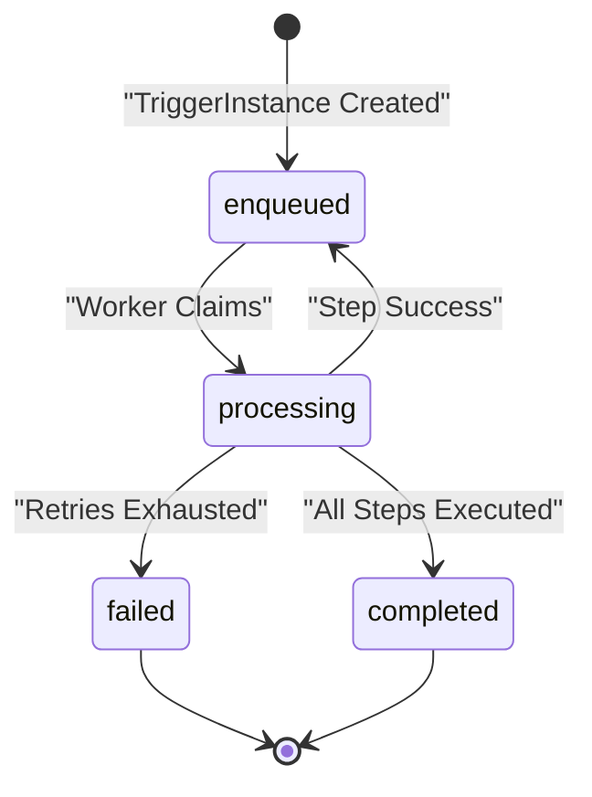

# Business Rules and Validation Specifications for Notification Workflow System

## Introduction
This document establishes strict business rules and validation requirements for the Notification Workflow backend system, ensuring all workflows and triggers are structurally sound, idempotent, and reliable.

## Workflow Invariants

### Entry Node Existence
WHEN a workflow is created or updated, THE system SHALL ensure `entryNodeId` references a node located in the workflow's node list.

### Edge Validity
WHEN a workflow is created or updated, THE system SHALL validate that all edges' `from` and `to` properties reference existing nodes within the workflow.

### Acyclic Graph Constraint
WHEN a workflow is created or updated, THE system SHALL verify that the structure forms a Directed Acyclic Graph (DAG) with no cycles.

### Node Schema Validation
WHEN a workflow is created or updated, THE system SHALL verify nodes comply with their type-specific schema:
- EmailNode nodes must have valid LiquidJS templates for `to`, `subject`, and `body`.
- SmsNode nodes must have valid LiquidJS templates for `to` and `body`.
- DelayNode nodes must specify valid `delayMs` or `duration` convertible to ms.

### No Self-Loop Edges
THE system SHALL reject edges where `from` and `to` reference the same node.

## Trigger Uniqueness and Idempotency

### Workflow Existence and Active Check
WHEN a trigger is created, THE system SHALL verify the workflow exists and is active.

### Idempotency Key Enforcement
WHEN creating a trigger with `(workflowId, idempotencyKey)`, THE system SHALL ensure uniqueness.

### Duplicate Trigger Handling
IF a trigger exists with the same key, THEN THE system SHALL return the existing trigger instead of creating a new one.

### Status and Cursor Management
THE system SHALL track trigger status transitions and maintain a cursor referencing the current node executed.

## Template Rendering Rules

### LiquidJS Parsing
THE system SHALL parse LiquidJS templates in EmailNode and SmsNode for syntactic validity.

### Template Variables
THE system SHALL provide `payload`, `trigger`, `workflow`, `vars`, and `now` variables during rendering.

### Output Recording
THE EmailNode and SmsNode executions SHALL record email and sms send results in `vars`.

## Delay Conversion and Validation

### Presence of Delay
DelayNode must specify either `delayMs` or `duration`.

### Conversion
THE system SHALL convert `duration` correctly to milliseconds.

### Validation Failure
Invalid or missing delay values shall cause workflow validation failure.

## Error and Retry Handling

### Failure Incrementation
Failures shall increment trigger `attempts` count.

### Exponential Backoff
Retry delay shall follow exponential backoff increasing with each attempt.

### Maximum Attempts
Failures beyond three attempts shall mark the trigger as `failed`.

### Idempotency
Actions must be idempotent to prevent duplicated sends.

## Conclusion
Business rules enforce non-cyclic workflows, trigger idempotency, template correctness, delay accuracy, and robust error and retry handling.

Mermaid Diagram: TriggerInstance State Lifecycle

This specification ensures backend developers understand all business rules and validations to deliver a resilient Notification Workflow service.
