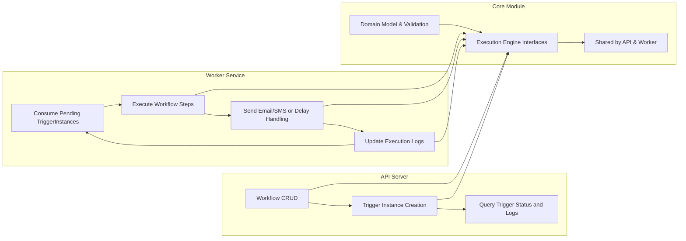

# Notification Workflow Backend Service - Business Requirements Specification

## 1. Introduction
This document specifies all necessary business requirements for the Notification Workflow backend system, a scalable service that manages workflows composed of email, SMS, and delay nodes to send notifications in a directed acyclic graph.

The service is architected into two main servers: an API server responsible for workflow CRUD and trigger creation with idempotency, and a Worker server responsible for concurrent execution of pending triggers. Both servers share a Core Module encapsulating domain models, validation logic, and execution semantics.

## 2. Business Model

### 2.1 Why the Service Exists
The service exists to provide a reliable, scalable backend system for orchestrating notification workflows that combine emails, SMS messages, and delayed execution steps. It addresses common challenges such as duplicate message sending, concurrency issues, and workflow validation.

### 2.2 Core Value Proposition
It enables clients to define customizable notification flows as directed acyclic graphs ensuring idempotent triggers, template-based message rendering, and robust retry and delay handling.

### 2.3 Success Criteria
The system shall process trigger requests with strict idempotency, execute workflow steps in defined sequence without duplication, handle failures with retries and backoff, and provide consistent execution context merging.

## 3. User Roles and Permissions

### 3.1 Roles
- **workflowManager:** Manages workflows including creation, update, activation, and deletion.
- **triggerOperator:** Creates and monitors trigger instances, ensuring idempotency.
- **systemAdmin:** Has full administrative privileges across workflows, triggers, and user role management.
- **workerService:** Backend worker responsible for processing triggers concurrently.

### 3.2 Authentication Overview
The system shall authenticate users and services, issuing JWT tokens with role and permissions embedded, and maintain secure sessions.

### 3.3 Permission Matrix
| Capability                         | workflowManager | triggerOperator | systemAdmin | workerService |
|----------------------------------|-----------------|-----------------|-------------|---------------|
| Create, read, update, delete workflows | ✅             | ❌               | ✅           | ❌             |
| Activate/deactivate workflows     | ✅             | ❌               | ✅           | ❌             |
| View execution logs               | ✅             | ✅               | ✅           | ❌             |
| Create trigger instances          | ❌             | ✅               | ✅           | ❌             |
| View trigger status, manage lifecycle | ❌             | ✅               | ✅           | ❌             |
| Manage users and roles            | ❌             | ❌               | ✅           | ❌             |
| Process trigger execution         | ❌             | ❌               | ❌           | ✅             |

## 4. Workflow CRUD and Validation

### 4.1 Workflow Structure
Workflows consist of a DAG of nodes (EmailNode, SmsNode, DelayNode) and edges connecting them. Workflows have fields including id, name, isActive flag, entryNodeId, nodes, edges, version, createdAt, updatedAt.

### 4.2 Validation Rules
- EntryNodeId must exist in nodes list.
- All edges' from and to must be valid node IDs.
- The graph must be acyclic.
- Node templates must be syntactically valid LiquidJS strings.
- DelayNodes must specify valid delayMs or ISO8601 duration.

### 4.3 Activation
Workflows can be activated only if they pass all validations. Activation sets isActive to true.

### 4.4 Error Handling
Validation failures shall return clear errors. Deletion disallowed if active triggers exist.

## 5. Trigger Instance Management

### 5.1 Trigger Creation
Triggers are created with a unique idempotencyKey per workflow. Existing triggers with same workflowId and idempotencyKey shall be returned instead of creating duplicates.

### 5.2 Lifecycle
TriggerInstances have states: enqueued, processing, completed, failed.

### 5.3 Cursor Management
Triggers track currentNodeId and last step status to progress through the workflow.

### 5.4 Error and Retry
Failed steps increment attempts and reschedule with exponential backoff, max 3 retries before failing.

## 6. Worker Server Execution

### 6.1 Execution Model
Workers claim triggers atomically, set status processing, execute steps sequentially per workflow DAG, merge execution contexts, and update cursor.

### 6.2 Concurrency
Multiple worker instances process trigger instances concurrently, ensuring exclusive claim per instance.

### 6.3 Step Execution
EmailNode and SmsNode render templates and send messages recording message IDs. DelayNode schedules delay using BullMQ and adjusts availableAt.

### 6.4 Retry Policy
Failures cause retry with exponential backoff. After 3 attempts, triggers fail.

## 7. Core Module Responsibilities

### 7.1 Domain Models
Defines Workflow, Nodes, Edges, TriggerInstance, StepExecutionLog, Execution Context with necessary fields and invariants.

### 7.2 Validation and Execution
Validates workflows, nodes, triggers, and manages step execution including context merging.

## 8. Business Rules and Validation

### 8.1 Workflow Rules
Entry node existence, acyclic graph, node schema validity, edge reference validity.

### 8.2 Trigger Rules
Unique idempotency, valid workflow references, proper state transitions.

### 8.3 Template Rules
All templates must parse and be valid LiquidJS strings.

### 8.4 Delay Rules
DelayNodes must provide valid delay duration convertible to milliseconds.

### 8.5 Error Handling
Retries on failures with backoff, failures after max attempts, idempotency enforced.

## 9. User Scenarios

Trigger creation, node execution flow including advance, delays handled with BullMQ, retries and failure marking.

## 10. Error and Retry Handling

Error classification, retry policies, backoff calculation, state transitions, idempotency best practices.

## 11. Validation Specification

Detailed validation rules for workflows, triggers, node templates, delays, and execution context integrity.

## 12. Summary and Developer Autonomy Statement
All business requirements are stated clearly. Developers have full autonomy for implementation and architectural decisions.

---

This diagram illustrates system components and data flow between API server, Worker service, and shared core module.