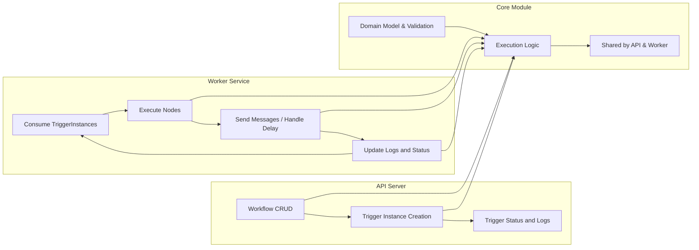

# Notification Workflow Backend System - Comprehensive Functional Requirements

## 1. Introduction
The Notification Workflow backend system orchestrates complex notification sequences involving Email, SMS, and Delay nodes defined as directed acyclic workflows. This document provides exhaustive business requirements guiding backend developers in building the API and Worker services along with the shared core module.

## 2. Business Model
The service exists to provide reliable, idempotent, and scalable notification orchestration to clients requiring sophisticated messaging workflows. It enhances user engagement by automating communication sequences with failure resilience and concurrency support.

## 3. User Roles and Permissions
- **workflowManager**: Manages workflows lifecycle and views execution logs.
- **triggerOperator**: Creates triggers with idempotency guarantees and monitors statuses.
- **systemAdmin**: Has full control over users, workflows, triggers, and system health.
- **workerService**: Processes triggers concurrently as an automated backend role.

## 4. Workflow Management and Validation
- Workflows can be created, updated, activated, deactivated, and deleted with strict validation:
  - `entryNodeId` must exist in the nodes.
  - Edges must reference valid nodes with no cycles or self-loops.
  - Templates in Email/SMS nodes must be valid LiquidJS.
  - Delay nodes require valid delayMs or ISO8601 duration.
- Activation requires workflows to be valid and complete.
- Deletion allowed only if no active triggers reference the workflow.

## 5. Trigger Handling and Idempotency
- Triggers are created idempotently using `(workflowId, idempotencyKey)` uniqueness.
- Existing triggers with same key will be returned without duplication.
- TriggerInstance states: `enqueued`, `processing`, `completed`, `failed`.
- Cursor tracks execution progress node-by-node.
- Valid state transitions define processing lifecycle.

## 6. Worker Server Execution and Concurrency
- Workers claim triggers atomically for processing.
- TriggerInstances process nodes sequentially per workflow DAG.
- Multiple TriggerInstances processed concurrently with horizontal scale-out.
- Each node execution updates the execution context vars.
- Email/SMS nodes render templates, send messages, record messageId in vars.
- Delay nodes compute `availableAt` and schedule BullMQ delay jobs.
- Failed steps trigger retry with exponential backoff, max 3 attempts.
- Exceeded retry attempts cause trigger to be marked `failed`.

## 7. Core Module Responsibilities
- Provides domain model, validation, execution interfaces.
- Enforces business invariants like DAG acyclicity, idempotency.
- Provides template parsing and rendering validation.
- Manages execution context merging and immutability rules.

## 8. Error and Retry Semantics
- Errors classified transient vs permanent.
- Transient errors retried with backoff, permanent errors fail immediately.
- Retry up to 3 times with exponential backoff based on attempts.
- Logs record all execution steps, status, errors, inputs, outputs for audit.

## 9. Validation Specification
- Workflow validation at creation/update enforces node/edge correctness.
- Trigger creation validates workflow existence and key uniqueness.
- Template syntax validated for all LiquidJS fields.
- Delay durations must be parseable to milliseconds.
- Execution context enforced immutable core fields.

## 10. User Scenarios
- Trigger creation enforces idempotency.
- Step execution includes rendering, sending, delay handling.
- Success advances cursor; failure retries or fails trigger.
- Concurrency supports multiple workers and triggers.
- Delay nodes schedule via BullMQ for deferred processing.

## Mermaid Diagrams

This document details business requirements only. Technical implementation, including architecture and API definitions, are at developer discretion. The focus is on WHAT the system shall do to ensure reliable, scalable notification workflow execution.