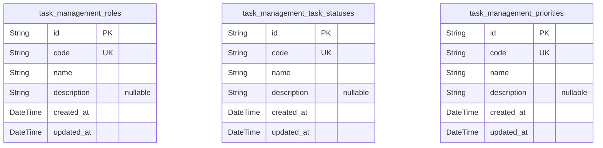
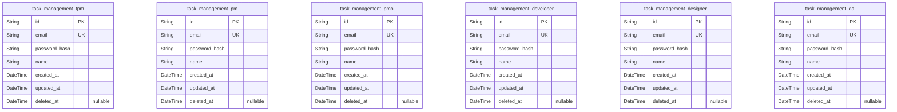
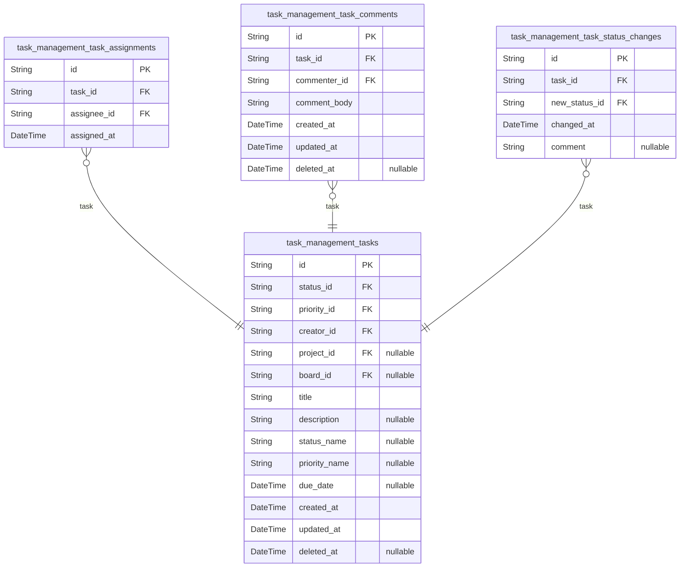
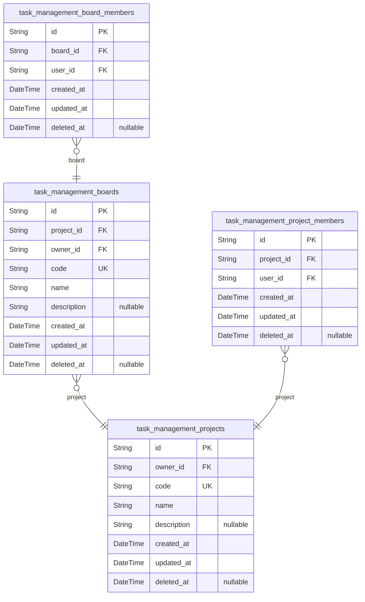
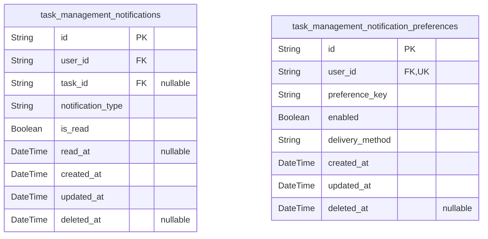

# Prisma Markdown

> Generated by [`prisma-markdown`](https://github.com/samchon/prisma-markdown)

- [Systematic](#systematic)
- [Actors](#actors)
- [Tasks](#tasks)
- [Projects](#projects)
- [Notifications](#notifications)

## Systematic

### `task_management_roles`

Task Management Roles define distinct user roles like TPM, PM, Developer,
etc. These roles control access and permissions within the task
management system. This table serves as a foundational system
configuration for role-based authorization and is referenced by user and
assignment tables.

Properties as follows:

- `id`: Primary Key.
- `code`: Unique code identifier for the role, e.g., 'TPM', 'PM', 'Developer'.
- `name`: Human-readable name of the role, e.g., 'Technical Project Manager'.
- `description`
  > Detailed description explaining the role's responsibilities and
  > permissions.
- `created_at`: Timestamp when the role record was created.
- `updated_at`: Timestamp when the role record was last updated.

### `task_management_task_statuses`

Task Management Task Statuses define the possible states a task can have,
such as 'To Do', 'In Progress', and 'Done'. This table controls workflow
states and is referenced by task lifecycle tables for state management.

Properties as follows:

- `id`: Primary Key.
- `code`
  > Unique code representing the task status, e.g., 'to_do', 'in_progress',
  > 'done'.
- `name`: Human-readable status name, e.g., 'To Do', 'In Progress', 'Done'.
- `description`: Detailed explanation of the status and its significance in the workflow.
- `created_at`: Timestamp indicating when the status was created.
- `updated_at`: Timestamp indicating when the status was last modified.

### `task_management_priorities`

Task Management Priorities define the level of urgency or importance for
tasks, such as low, medium, or high. These settings influence task
sorting and alerting mechanisms within the system.

Properties as follows:

- `id`: Primary Key.
- `code`: Unique code representing priority level, e.g., 'low', 'medium', 'high'.
- `name`: Human-friendly priority name, e.g., 'Low', 'Medium', 'High'.
- `description`: Detailed notes about the priority's impact and usage rules.
- `created_at`: Timestamp when the priority record was created.
- `updated_at`: Timestamp when the priority record was last updated.

## Actors

### `task_management_tpm`

Technical Project Manager (TPM) information including login credentials
and contact details. Independent business entity representing TPM users
within the system with full CRUD capability and role-based
authentication.

Properties as follows:

- `id`: Primary Key.
- `email`: Email address used for login and contact, unique across TPM users.
- `password_hash`: Hashed password for secure authentication.
- `name`: Full name of the TPM user.
- `created_at`: Record creation timestamp.
- `updated_at`: Record last update timestamp.
- `deleted_at`: Soft delete timestamp to enable recovery.

### `task_management_pm`

Project Manager (PM) information including login credentials and contact
details. Independent business entity for PM users with full CRUD and
authentication support.

Properties as follows:

- `id`: Primary Key.
- `email`: Email address used for login and contact, unique across PM users.
- `password_hash`: Hashed password for secure authentication.
- `name`: Full name of the PM user.
- `created_at`: Record creation timestamp.
- `updated_at`: Record last update timestamp.
- `deleted_at`: Soft delete timestamp to enable recovery.

### `task_management_pmo`

Project Management Officer (PMO) information including login credentials
and contact details. Independent business entity representing PMO users
with authentication and management capabilities.

Properties as follows:

- `id`: Primary Key.
- `email`: Email address used for login and contact, unique across PMO users.
- `password_hash`: Hashed password for secure authentication.
- `name`: Full name of the PMO user.
- `created_at`: Record creation timestamp.
- `updated_at`: Record last update timestamp.
- `deleted_at`: Soft delete timestamp to enable recovery.

### `task_management_developer`

Developer user information including secure login credentials.
Independent business entity representing developer users with full
control for user management and authentication.

Properties as follows:

- `id`: Primary Key.
- `email`: Email address used for login and contact, unique across developers.
- `password_hash`: Hashed password supporting secure login.
- `name`: Full name of the developer user.
- `created_at`: Timestamp when the record was created.
- `updated_at`: Timestamp when the record was last updated.
- `deleted_at`: Soft deletion timestamp for recoverable deletions.

### `task_management_designer`

Designer user information with authentication credentials and identity
details. Core independent business entity for managing designer user
accounts securely.

Properties as follows:

- `id`: Primary Key.
- `email`: Unique email address for designer login and communications.
- `password_hash`: Hashed password for secure authentication.
- `name`: Full name of the designer user.
- `created_at`: Record creation timestamp.
- `updated_at`: Record last update timestamp.
- `deleted_at`: Soft delete timestamp allowing recovery.

### `task_management_qa`

Quality Assurance (QA) user details including authentication data.
Independent user entity supporting role-based management and secure login
for QA team members.

Properties as follows:

- `id`: Primary Key.
- `email`: Email address unique to QA users for login and contact.
- `password_hash`: Hashed password ensuring authentication security.
- `name`: Full name of the QA user.
- `created_at`: Timestamp for when the record was created.
- `updated_at`: Timestamp for the latest update of the record.
- `deleted_at`: Optional timestamp for soft deletion enabling recovery.

## Tasks

### `task_management_tasks`

Primary table representing the core tasks in the system, including title,
description, status, priority, due date, creator info, and timestamps.
Tasks have independent lifecycle management and relate to statuses,
priorities, projects, and boards via foreign keys. Supports soft delete
and audit fields.

Properties as follows:

- `id`: Primary Key.
- `status_id`: Referenced task status. [task_management_task_statuses.id](#task_management_task_statuses).
- `priority_id`: Referenced task priority level. [task_management_priorities.id](#task_management_priorities).
- `creator_id`
  > Task creator user ID. References one of the user roles. {@link
  > task_management_tpm.id}, etc.
- `project_id`: Project this task belongs to. [task_management_projects.id](#task_management_projects).
- `board_id`: Board this task belongs to. [task_management_boards.id](#task_management_boards).
- `title`: Title of the task, mandatory and non-empty.
- `description`: Detailed description of the task, optional.
- `status_name`
  > Name of status (denormalized for easy querying). Usually synced with
  > status table.
- `priority_name`: Name of priority level for easier display, optional.
- `due_date`: Optional due date and time for task deadline.
- `created_at`: Timestamp of record creation.
- `updated_at`: Timestamp of last update.
- `deleted_at`: Soft deletion timestamp if the task is deleted.

### `task_management_task_assignments`

Records assignments of users to tasks, allowing multiple assignees per
task. Supports auditing of assignment changes with timestamps. Users can
be TPMs, PMs, Developers, Designers, or QA roles referenced via user
foreign keys.

Properties as follows:

- `id`: Primary Key.
- `task_id`: References the assigned task. [task_management_tasks.id](#task_management_tasks).
- `assignee_id`
  > User assigned to the task. References user role tables such as {@link
  > task_management_tpm.id}, [task_management_pm.id](#task_management_pm), etc.
- `assigned_at`: Timestamp when assignment occurred.

### `task_management_task_comments`

Stores comments made by users on tasks. Each comment references the task
and commenting user. Supports soft delete and auditing timestamps.

Properties as follows:

- `id`: Primary Key.
- `task_id`: Commented task reference. [task_management_tasks.id](#task_management_tasks).
- `commenter_id`
  > User who made the comment. References user role tables such as {@link
  > task_management_developer.id}, [task_management_designer.id](#task_management_designer), etc.
- `comment_body`: Content of the comment.
- `created_at`: Timestamp of comment creation.
- `updated_at`: Timestamp of last update to comment.
- `deleted_at`: Soft delete timestamp if comment is deleted.

### `task_management_task_status_changes`

Logs changes to a task's status over time for auditing and history
tracking. Each record references a task and the new status applied.
Includes timestamp of change and optional comments explaining status
transition.

Properties as follows:

- `id`: Primary Key.
- `task_id`: Task whose status changed. [task_management_tasks.id](#task_management_tasks).
- `new_status_id`: New status set on the task. [task_management_task_statuses.id](#task_management_task_statuses).
- `changed_at`: Timestamp when the status was changed.
- `comment`: Optional comment explaining the reason for status change.

## Projects

### `task_management_projects`

Project entity representing distinct projects for task grouping and
management within the system. Projects have unique codes, descriptive
names, owners, and standard temporal audit fields. They act as primary
containers for related boards and tasks, supporting structured project
workflows. References owners from existing user tables via foreign keys
and supports soft deletion with deletion timestamps.

Properties as follows:

- `id`: Primary Key.
- `owner_id`
  > Owner user reference. [task_management_tpm.id](#task_management_tpm) or equivalent user
  > table.
- `code`: Unique code identifier for the project.
- `name`: Descriptive name of the project.
- `description`: Optional detailed description of the project.
- `created_at`: Creation timestamp.
- `updated_at`: Timestamp of last update.
- `deleted_at`: Optional timestamp indicating soft deletion.

### `task_management_boards`

Board entity representing logical groupings of tasks within projects.
Boards have unique codes, descriptive names, project associations,
owners, and temporal audit fields. They enable task organization and
management distinct from projects and support soft deletion.

Properties as follows:

- `id`: Primary Key.
- `project_id`: Associated project reference. [task_management_projects.id](#task_management_projects).
- `owner_id`
  > Board owner user reference. [task_management_tpm.id](#task_management_tpm) or equivalent
  > user table.
- `code`: Unique board code within the project.
- `name`: Descriptive name of the board.
- `description`: Optional detailed description of the board.
- `created_at`: Creation timestamp.
- `updated_at`: Timestamp of last update.
- `deleted_at`: Optional timestamp indicating soft deletion.

### `task_management_board_members`

Membership entity connecting users to boards to represent membership
associations. Supports multiple members per board, with unique
constraints to prevent duplicate memberships. Includes references to user
and board entities, and temporal audit fields for membership tracking.

Properties as follows:

- `id`: Primary Key.
- `board_id`: Associated board reference. [task_management_boards.id](#task_management_boards).
- `user_id`
  > Member user reference. [task_management_tpm.id](#task_management_tpm) or equivalent user
  > table.
- `created_at`: Creation timestamp of membership record.
- `updated_at`: Last update timestamp of membership record.
- `deleted_at`: Optional timestamp indicating soft deletion.

### `task_management_project_members`

Membership entity connecting users to projects with membership roles and
assignment tracking. Ensures unique membership via composite keys.
Includes references to projects and users, and audit timestamps for
membership lifecycle management.

Properties as follows:

- `id`: Primary Key.
- `project_id`: Associated project reference. [task_management_projects.id](#task_management_projects).
- `user_id`
  > Member user reference. [task_management_tpm.id](#task_management_tpm) or equivalent user
  > table.
- `created_at`: Creation timestamp of membership record.
- `updated_at`: Last update timestamp of membership record.
- `deleted_at`: Optional timestamp indicating soft deletion.

## Notifications

### `task_management_notifications`

This table stores notifications generated by the system related to task
events, assignments, status changes, and general alerts for users. Each
notification tracks the target user, related task if any, notification
type, read status, and timestamps. It serves as the primary entity for
user alerts within the task management system.

Properties as follows:

- `id`: Primary Key.
- `user_id`
  > Target user's [task_management_tpm.id](#task_management_tpm), {@link
  > task_management_pm.id}, [task_management_pmo.id](#task_management_pmo), {@link
  > task_management_developer.id}, [task_management_designer.id](#task_management_designer), or
  > [task_management_qa.id](#task_management_qa).
- `task_id`
  > Related task's [task_management_tasks.id](#task_management_tasks), nullable for general or
  > system notifications.
- `notification_type`
  > Type of notification such as 'assignment', 'status_change', 'comment',
  > 'general'.
- `is_read`: Flag indicating whether the notification has been read by the user.
- `read_at`: Timestamp when the notification was read. Null if unread.
- `created_at`: Timestamp when the notification was created.
- `updated_at`: Timestamp when the notification record was last updated.
- `deleted_at`
  > Timestamp when the notification was deleted (soft delete). Nullable if
  > not deleted.

### `task_management_notification_preferences`

This table stores individual user preferences for receiving different
types of notifications within the task management system. Preferences
specify which notification categories a user opts into and notification
delivery options such as email or push notifications.

Properties as follows:

- `id`: Primary Key.
- `user_id`
  > User owning these notification preferences, referencing their role table
  > such as [task_management_tpm.id](#task_management_tpm), [task_management_pm.id](#task_management_pm),
  > [task_management_pmo.id](#task_management_pmo), [task_management_developer.id](#task_management_developer),
  > [task_management_designer.id](#task_management_designer), or [task_management_qa.id](#task_management_qa).
- `preference_key`
  > Notification preference key, e.g. 'assignment', 'status_change',
  > 'comment', indicating the type of notification this preference controls.
- `enabled`: Indicates if the notification preference is enabled or disabled.
- `delivery_method`
  > Preferred method for notification delivery, such as 'email', 'push', or
  > 'sms'.
- `created_at`: Timestamp when the preference was created.
- `updated_at`: Timestamp when the preference was last updated.
- `deleted_at`
  > Timestamp when the preference was deleted (soft delete). Nullable if not
  > deleted.
