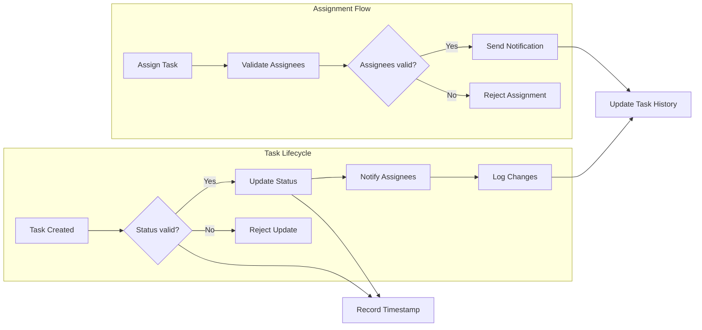

# Business Rules and Validation Constraints for Task Management System

## 1. Introduction
This document defines the comprehensive business rules, validation constraints, and operational policies that govern task assignment and management within the taskManagement system. It supports backend developers with clear, actionable descriptions to foster consistent and reliable implementation.

## 2. Business Model

### Why This Service Exists
The taskManagement service is designed to enhance project workflow efficiency for key roles such as TPMs, PMs, PMOs, developers, designers, and QAs. It addresses common challenges in task tracking, transparent assignment, status updating, and collaboration that exist in project teams.

### How the Business Operates
The system offers a centralized platform for managing and assigning tasks, supporting role-based permissions and clear notifications to involved parties. It fosters accountability, timely delivery, and streamlined communication.

### Core Value Proposition
- Efficient task lifecycle management mirroring Trello-like features.
- Scalable role-based access control.
- Transparent audit trails for task changes.

### Success Metrics
- Increased on-time task completion.
- Improved user adoption across roles.
- Reduction in assignment conflicts.

## 3. User Roles and Permissions

### Role Definitions
- **TPM (Technical Project Manager)**: Oversees projects, coordinates resources, and manages deadlines. Has full task creation and assignment permissions.
- **PM (Project Manager)**: Plans and executes projects, manages resources. Can create and assign tasks within assigned projects.
- **PMO (Project Management Officer)**: Oversees standards and compliance. Monitors task statuses and enforces policies without full editing rights.
- **Developer**: Implements features and fixes bugs. Can update status and details of assigned tasks.
- **Designer**: Produces UI/UX assets. Can view and update their assignments.
- **QA (Quality Assurance)**: Tests and ensures quality. Can view, update, and comment on tasks assigned to them.

### Permission Matrix
| Action                | TPM | PM | PMO | Developer | Designer | QA |
|-----------------------|-----|----|-----|-----------|----------|----|
| Create Task           | ✅  | ✅ | ❌  | ❌        | ❌       | ❌ |
| Assign Task           | ✅  | ✅ | ❌  | ❌        | ❌       | ❌ |
| Update Assigned Task  | ✅  | ✅ | ❌  | ✅        | ✅       | ✅ |
| View All Tasks        | ✅  | ✅ | ✅  | ✅        | ✅       | ✅ |
| Enforce Compliance    | ❌  | ❌ | ✅  | ❌        | ❌       | ❌ |

## 4. Task Management Business Rules

### Task Creation
WHEN a user with role TPM or PM initiates the creation of a task, THE system SHALL allow entry of task details including:
- Title
- Description
- Priority (Low, Medium, High)
- Due Date
- Assignees

WHEN a task is created, THE system SHALL assign a unique identifier and set the initial status to "To Do".

### Task Statuses
THE system SHALL support the following statuses:
- To Do
- In Progress
- Review
- Done

WHEN a task's status changes, THE system SHALL log the user who made the change and the timestamp.

### Task Updates
WHEN an assigned user updates a task's details or status, THE system SHALL save the changes and maintain a change history.

## 5. Validation and Data Integrity Rules

- THE system SHALL require that every task has a title with a maximum length of 255 characters and cannot be empty.
- WHERE a due date is provided, THE system SHALL validate that the date is in the future and formatted according to ISO 8601.
- THE system SHALL verify that assignee user IDs correspond to existing users with appropriate roles.

## 6. Task Assignment Policies

WHEN a task is assigned or reassigned, THE system SHALL:
- Send notifications to all assignees.
- Prevent assignment to users without the roles of TPM, PM, Developer, Designer, or QA.
- Allow multiple assignees per task.
- Record reassignment events with previous and new assignees logged.

## 7. Notifications and Alerts

WHEN a task is assigned or reassigned, THE system SHALL notify the assignee(s) immediately.

WHEN the due date of a task is within 24 hours, THE system SHALL send reminder notifications to assignees.

WHERE the PMO role user configures notification preferences, THE system SHALL respect those settings accordingly.

## 8. Status and Lifecycle Rules

THE system SHALL allow only these status transitions:
- To Do -> In Progress
- In Progress -> Review
- Review -> Done
- Any status -> To Do (for rework purposes)

IF a user attempts an invalid status transition, THEN THE system SHALL reject the change and provide an error message indicating the violation.

## 9. Access Control and Authorization

THE system SHALL enforce role-based access control based on the permissions defined for each role.

WHEN unauthorized actions are attempted, THEN THE system SHALL deny the action, notify the user with an appropriate message, and log the incident.

## 10. Error Handling and Recovery

IF invalid data input or business rule violations occur, THEN THE system SHALL return descriptive error messages explaining the issue and guide corrective actions.

IF concurrent conflicting updates are detected, THEN THE system SHALL apply optimistic concurrency control mechanisms and inform conflicting users accordingly.

## 11. Performance Expectations

WHEN users perform task-related operations, THE system SHALL respond within 2 seconds under normal load.
Notification dispatch SHALL occur within 5 seconds of triggering events.

## 12. Mermaid Diagrams

## 13. Glossary

- **TPM**: Technical Project Manager
- **PM**: Project Manager
- **PMO**: Project Management Officer
- **Assignee**: A user assigned a task
- **Task Status**: The current phase of the task lifecycle

---

**This document provides business requirements only. All technical implementation decisions belong to developers. Developers have full autonomy over architecture, APIs, and database design. The document describes WHAT the system should do, not HOW to build it.