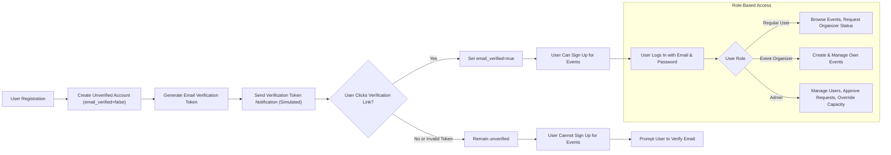

# User Roles and Authentication Requirements for Event Registration Platform

## 1. Introduction
This document defines the detailed business requirements for user role management, authentication workflows, authorization and permission controls for the Event Registration platform. It serves as a comprehensive guide for backend developers to build secure and robust authentication and role-based authorization mechanisms that align with the specified business needs.

## 2. User Roles and Descriptions

### 2.1 Regular Users
- WHEN a user registers using email and password, THE system SHALL create a user account with `email_verified` set to false.
- Regular Users SHALL provide additional profile information including full name, phone number, and optionally a profile picture URL.
- Regular Users SHALL be able to browse events and request organizer status through the platform.
- Regular Users SHALL NOT be allowed to create, update, or manage events unless upgraded to Event Organizer role by Admin approval.

### 2.2 Event Organizers
- WHEN an Admin approves a Regular User's organizer request, THE system SHALL assign the Event Organizer role to that user.
- Event Organizers SHALL be able to create events with complete details including name, date, location, capacity, description, ticket price, categories, and status.
- Event Organizers SHALL be able to update, cancel, or complete only the events they own.
- Event Organizers SHALL be able to view attendee lists and waitlists for their events.
- Event Organizers SHALL have access to analytics limited to their own events.
- Event Organizers SHALL NOT have global permissions beyond their own events.

### 2.3 Admins
- Admins SHALL have global privileges across the system.
- Admins SHALL be able to manage all users including approving or rejecting Event Organizer requests.
- Admins SHALL be able to manage all events system-wide including capacity overrides, event cancellations, and updates.
- Admins SHALL be able to manually verify user emails via the admin interface or APIs.
- Admins SHALL have access to global analytics and notification logs across all events and users.

## 3. Authentication Flow

### 3.1 Registration and Email Verification
- WHEN a user registers, THE system SHALL create an unverified account with `email_verified` = false.
- THE system SHALL generate a unique email verification token and associate it with the user account.
- WHEN the user accesses `/verify-email/{token}`, THE system SHALL validate the token and set `email_verified` = true if valid.
- Admins SHALL be able to manually verify user emails as an override.
- WHERE `email_verified` is false, THE system SHALL prohibit event sign-up attempts for that user.

### 3.2 Login and Session Management
- WHEN a user logs in, THE system SHALL validate credentials only if `email_verified` is true.
- THE system SHALL authenticate users using their email and password.
- THE system SHALL establish user sessions with expiration.
- Users SHALL be able to log out, revoking active sessions or tokens.

### 3.3 Password Management
- Users SHALL be able to reset forgotten passwords through secure processes.
- Users SHALL be able to change their password after authentication.
- Passwords SHALL comply with defined complexity standards.

## 4. Authorization and Permissions Matrix

| Action                        | Regular User | Event Organizer | Admin   |
|-------------------------------|--------------|-----------------|---------|
| Register account             | ✅           | ✅              | ✅      |
| Verify email                | ✅           | ✅              | ✅      |
| Request organizer status    | ✅           | ❌              | ❌      |
| Approve organizer requests  | ❌           | ❌              | ✅      |
| Create events              | ❌           | ✅              | ✅      |
| Update/delete own events     | ❌           | ✅              | ✅      |
| Manage attendee/waitlist    | ❌           | ✅              | ✅      |
| View analytics              | ❌           | ✅ (own events)  | ✅ (all) |
| Manage all users and events  | ❌           | ❌              | ✅      |
| Override capacity adjustments | ❌           | ❌              | ✅      |
| Manual email verification   | ❌           | ❌              | ✅      |

## 5. Token Management

### 5.1 JWT Payload
- Access tokens SHALL contain user ID, role, and an array of permissions.
- Access tokens SHALL expire after 15 to 30 minutes.
- Refresh tokens SHALL expire after 7 to 30 days.

### 5.2 Token Storage and Revocation
- THE system SHALL allow secure storage of tokens.
- Tokens SHALL be revoked immediately upon user logout.

## 6. Access Control Policies

- THE system SHALL strictly enforce role-based access according to the permissions matrix.
- THE system SHALL deny any attempt to perform unauthorized actions with informative error messages.
- THE system SHALL reject event sign-up attempts by users with unverified email addresses.

## 7. Error Handling and Security

### 7.1 Authentication Failure
- IF a user submits invalid credentials, THEN THE system SHALL return an authentication failure message promptly.

### 7.2 Unauthorized Access
- IF a user attempts actions outside their permission scope, THEN THE system SHALL return an HTTP 403 Forbidden status with relevant information.

### 7.3 Email Verification Errors
- IF an invalid or expired verification token is submitted, THEN THE system SHALL respond with a clear error message.

## 8. Performance Requirements

- THE system SHALL process login, registration, and verification operations within 2 seconds under normal load.
- Authorization checks SHALL be instantaneous, supporting concurrent users efficiently.

## 9. Summary
This document specifies detailed business requirements for user roles, authentication workflows, authorization, and security in the Event Registration platform. All conditions and rules are defined unambiguously to ensure backend developers implement robust and secure authentication and role-based access control systems.

---

## Mermaid Diagram: Authentication and Role Authorization Flow
