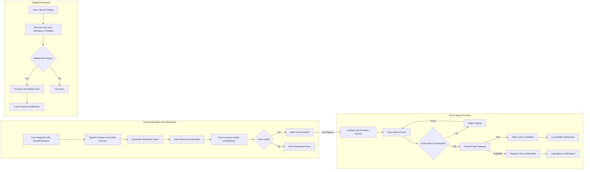

# Event Registration Platform - User Scenarios and Journeys

This document outlines detailed user scenarios and business workflows for the Event Registration platform. It serves as a comprehensive guide for backend developers to understand specific user journeys, business rules, error handling, and role-based access within the system.

---

## 1. User Registration and Verification

### 1.1. Registration Flow
- WHEN a new user attempts to register, THE system SHALL require an email address and password.
- THE system SHALL create a user account with `email_verified` set to false.
- THE system SHALL generate a unique email verification token linked to the user.
- THE system SHALL store the token securely and associate it with the user's account.
- WHEN registration successfully completes, THE system SHALL log a notification of type "Registration Confirmation" for the user.
- Users SHALL NOT be authorized to sign up for events until `email_verified` is true.

### 1.2. Email Verification
- WHEN a user accesses the `/verify-email/{token}` endpoint with a valid token, THE system SHALL mark the user's `email_verified` status as true.
- WHEN a user successfully verifies their email, THE system SHALL log a notification of type "Email Verified".
- WHEN an invalid or expired token is submitted, THEN THE system SHALL return an error explaining the failure.
- Admins SHALL have functionality to manually verify a user's email status via an admin interface or API.
- IF a user attempts to sign up for an event without `email_verified` being true, THEN THE system SHALL reject the signup and return an error indicating the email is not verified.

### 1.3. Resend Verification
- WHERE a user's email is unverified, THE system SHALL allow resending a new verification token.

## 2. Requesting Organizer Status

- WHEN a regular user submits a request to become an event organizer, THE system SHALL record the request with a pending status.
- Admins SHALL receive notifications of new organizer requests.
- WHEN an admin approves the request, THE system SHALL update the user's role to `eventOrganizer`.
- WHEN an admin rejects the request, THE system SHALL notify the user of the decision.
- Users without admin approval SHALL NOT be able to create or manage events.

## 3. Event Browsing and Sign-up

### 3.1. Browsing Events
- THE system SHALL provide an `/events` endpoint to allow all users to browse or search events.
- Event information SHALL include name, date, location, capacity, description, ticket price, category, and status.
- Users SHALL be able to filter or sort events by category, date, or popularity.

### 3.2. Signing Up for Events
- WHEN a verified user selects to sign up for an event, THE system SHALL check current event status:
  - IF event status is not "scheduled", THEN THE signup SHALL be rejected with an appropriate error.
  - IF the event is full (attendees count >= capacity), THEN THE user SHALL be placed on a waitlist in FIFO order.
  - ELSE, THE user SHALL be registered as an attendee.
- WHEN a user successfully signs up, THE system SHALL log a notification "Registration Confirmation".
- IF the user attempts to sign up multiple times for the same event, THEN THE system SHALL reject duplicate signups with an error.

### 3.3. Cancelling Event Signup
- WHEN a user cancels their event signup, THE system SHALL remove them from attendees or waitlist.
- THE system SHALL check if there is a waitlist present:
  - IF yes, THEN THE system SHALL promote the top user on the waitlist to attendee automatically and log a "Waitlist Promotion" notification.

## 4. Waitlist Management

- THE system SHALL maintain an ordered waitlist per event based on signup time.
- WHILE the waitlist length reaches 50% of current capacity, THE system SHALL increase capacity by 10%, unless overridden by an admin.
- WHILE the waitlist length falls below 10% of current capacity, THE system SHALL decrease capacity by 10%, unless overridden by an admin.
- Admin overrides SHALL take precedence and prevent automatic capacity adjustments.
- Users promoted from the waitlist SHALL receive logged notifications of promotion.

## 5. Organizer Event Management

- Event Organizers SHALL be able to create events with details: name, date, location, capacity, description, ticket price, categories, and status.
- Organizers SHALL be able to update or cancel their events.
- WHEN an event's status changes (e.g., scheduled to cancelled), THE system SHALL log a "Event Schedule Change" notification for all attendees and waitlisted users.
- Organizers SHALL be able to view the attendee list and waitlist ordered by signup time.
- Organizers SHALL have access to analytics related only to their own events.

## 6. Admin Operations

- Admins SHALL have system-wide permissions including managing all users and events.
- Admins SHALL manually verify user emails if necessary.
- Admins SHALL review, approve, or reject organizer status requests.
- Admins SHALL override dynamic capacity adjustments on events.
- Admins SHALL view global analytics across all events and categories.
- Admins SHALL get notifications about pending organizer requests and system-level events.

## 7. Notification Viewing

- Users and Organizers SHALL access their notification logs via their profile or dashboard.
- Notification types include: Registration Confirmations, Waitlist Promotions, Event Schedule Changes, and Capacity Adjustments.
- Notifications SHALL include timestamp and related event or action details.

## 8. Analytics Access

- Organizers SHALL have access to analytics scoped only to their events.
- Admins SHALL have access to global analytics.
- Analytics SHALL track:
  - Total sign-ups per event
  - Peak registration times
  - Waitlist length trends over time
  - Event popularity categorized by event category

---

# Mermaid Diagram: User Registration and Signup Workflow

---

# Document Summary

This document delivers exhaustive business scenarios covering each system user role and core processes. It details user registration with email verification, organizer request and approval workflows, event browsing and signup, dynamic capacity adjustments with waitlist handling, notification logging, and analytics access. All workflows specify success paths and error cases to ensure backend developers build a robust and compliant system.

The document only defines business requirements; technical designs, API details, and implementation specifics are to be developed by the engineering team.