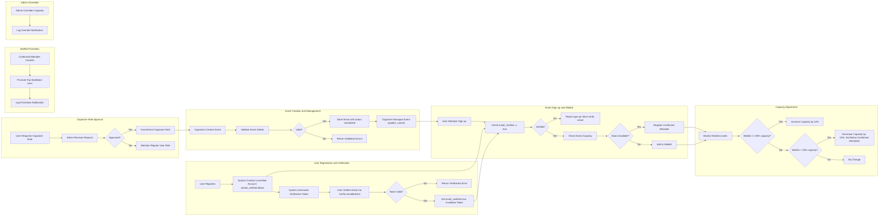

# Business Rules and Constraints for Event Registration Platform

## 1. Introduction and Scope
This document specifies all critical business rules, constraints, and validation logic governing the operations of the Event Registration platform. It provides backend developers with precise, unambiguous requirements ensuring correct platform behavior, data integrity, and compliance with the specified user roles and business model.

This document focuses exclusively on business rules, not technical implementation details or API specifications.

## 2. User Registration Rules

### 2.1 User Profile Information
- **Full Name:** Must be a non-empty string representing the user's legal or preferred full name.
- **Email:** Must be a valid email address format and unique within the system.
- **Password:** Must be securely handled (external to business rules), but registration requires a non-empty password.
- **Phone Number:** Optional but if provided, must follow a valid phone number format.
- **Profile Picture URL:** Optional; if provided, must be a valid URL.

### 2.2 Registration Workflow
- WHEN a user registers with email and password, THE system SHALL create an unverified user account with `email_verified` set to `false`.
- WHEN a registration request is received, THE system SHALL validate that the email is not already in use.
- WHEN a user registers, THE system SHALL generate an email verification token associated with the user and store it for verification use.

### 2.3 User Roles and Organizer Requests
- WHERE a registered Regular User requests organizer status, THE system SHALL flag the request for admin approval.
- WHEN admin approves an organizer request, THE system SHALL update the user's role to Event Organizer.
- WHERE a user is not approved as an organizer, THE system SHALL not grant event creation or management capabilities.

### 2.4 Constraints
- IF email is already verified for another account, THEN the system SHALL reject the registration with an email-already-in-use error.
- IF required profile information is missing or invalid, THEN THE system SHALL reject the registration request with descriptive error messages.

## 3. Email Verification Rules

### 3.1 Verification Token Management
- WHEN a user registers, THE system SHALL generate a unique email verification token linked to the user.
- WHEN the `/verify-email/{token}` endpoint is called with a valid token, THE system SHALL mark the user's `email_verified` status to `true` and invalidate the token.
- IF the token is invalid, expired, or already used, THEN THE system SHALL respond with an appropriate error.

### 3.2 Email Verified Status Effects
- WHILE a user's `email_verified` status is `false`, THE system SHALL prevent the user from signing up for any events.
- WHEN an admin manually verifies a user's email via API or admin interface, THE system SHALL update the user's verification status accordingly.

## 4. Event Creation Constraints

### 4.1 Event Properties Validation
- Event `name` MUST be a non-empty string.
- Event `date` MUST be a valid ISO 8601 date-time in the future relative to creation time.
- Event `location` MUST be a non-empty string specifying where the event takes place.
- Event `capacity` MUST be a positive integer greater than zero.
- Event `description` MAY be empty or any string.
- Event `ticket_price` MUST be a non-negative decimal number (zero indicates free event).
- Event `categories` MUST be an array containing one or more of the predefined categories: ["workshop", "seminar", "social", "networking"].
- Event `status` MUST be one of ["scheduled", "cancelled", "completed"].

### 4.2 Event Status Rules
- Events start in `scheduled` status when created.
- WHEN an event is cancelled by organizer or admin, THE system SHALL change status to `cancelled` and notify attendees.
- WHEN event date passes and event processing completes, THE system SHALL set status to `completed`.

### 4.3 Permissions
- ONLY users with Event Organizer role MAY create, update, or cancel events.
- Event edits SHALL respect capacity constraints and category validation.

## 5. Sign-up Limits and Waitlist Rules

### 5.1 Sign-up Eligibility
- ONLY users with `email_verified` status `true` SHALL be allowed to sign up for events.
- WHEN a user attempts to sign up for an event, THE system SHALL check event capacity vs confirmed attendees.

### 5.2 Capacity and Waitlist Handling
- IF event's confirmed attendees count is less than capacity, THEN THE system SHALL register the user as confirmed attendee.
- IF event capacity is full, THEN THE system SHALL register the user on the waitlist with a timestamp indicating sign-up order.

### 5.3 Waitlist Promotion
- WHEN a confirmed attendee cancels their attendance, THE system SHALL automatically promote the top user on the waitlist based on earliest waitlist timestamp to confirmed attendee.
- THE system SHALL log a notification for the promoted user indicating their promotion from waitlist.

### 5.4 User Sign-up Restrictions
- A user SHALL NOT be registered more than once as a confirmed attendee or on the waitlist for the same event.

## 6. Capacity Adjustment Policies

### 6.1 Dynamic Capacity Adjustment Rules
- IF the waitlist count reaches 50% or more of the current capacity, THEN THE system SHALL increase the event capacity by 10% (rounded up to nearest integer).
- IF the waitlist count falls below 10% of the current capacity, THEN THE system SHALL decrease the event capacity by 10% (rounded down to nearest integer), but capacity SHALL NOT fall below the number of confirmed attendees.

### 6.2 Admin Overrides
- Admins SHALL have the capability to manually override capacity adjustments.
- WHEN an admin overrides capacity, THE system SHALL log the override event in the notification logs.

## 7. Notification Rules

### 7.1 Notification Types
- Registration confirmation for event sign-up.
- Waitlist promotion notices.
- Event schedule changes (e.g., cancellations or time changes).
- Capacity adjustment alerts.
- Organizer and user system notifications stored in the database.

### 7.2 Viewing Notifications
- Users and organizers SHALL be able to view their notification history via their profile dashboard.
- Notifications SHALL be timestamped and stored in the database.

## 8. Analytics Data Access Rules

### 8.1 Data Tracked
- Total sign-ups per event.
- Peak registration times.
- Waitlist length trends.
- Event popularity categorized by event type.

### 8.2 Access Permissions
- Organizers SHALL see analytics only for the events they manage.
- Admins SHALL have access to global analytics across all events and users.

## 9. Admin Override Rules

### 9.1 Role Privileges
- Admins SHALL manage users, approve organizer requests, and globally manage events.
- Admins SHALL manually verify emails.
- Admins SHALL override dynamic capacity adjustments.

### 9.2 Override Constraints
- Manual overrides SHALL be logged as notifications.
- Admin actions SHALL be auditable via administrator logs (out of this document's scope).

---

## Business Rule and Process Flow Diagram

This document provides business requirements only. All technical implementation decisions belong entirely to the developers. Developers have full autonomy over architecture, API designs, and database structures. This document defines WHAT the system should do, not HOW to build it.