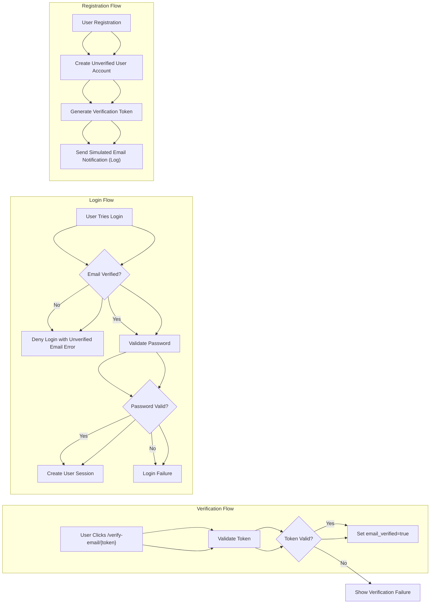

# Security and Compliance Requirements for Event Registration Platform

This document provides the complete business requirements for security and compliance aspects of the eventRegistration platform, focusing exclusively on authentication, authorization, data protection, email verification security, audit logging, and regulatory compliance. All technical implementation decisions belong to the developers, who have full autonomy regarding architecture, API details, and database design. This document specifies WHAT the system must do to meet business needs securely and compliantly.

## 1. Authentication Security

### 1.1 User Registration and Authentication
- WHEN a user registers with email and password, THE system SHALL create an unverified account with `email_verified` set to false.
- WHEN a user provides login credentials, THE system SHALL validate credentials and establish a session only if the user exists and the password matches.
- WHEN a user attempts to log in without verified email, THEN THE system SHALL deny sign-in and return an appropriate error indicating unverified email.
- THE user password SHALL be stored securely (implied encryption/hashing by developers).
- WHEN a password reset is requested, THE system SHALL provide a secure mechanism to reset the password.
- THE system SHALL maintain secure user sessions with expiration policies.

### 1.2 Email Verification Process
- WHEN a user registers, THE system SHALL generate a unique verification token and store it securely associated with that user.
- WHEN a user accesses the /verify-email/{token} endpoint, THE system SHALL verify the token and set the user's `email_verified` status to true.
- THE system SHALL support manual verification of email via API call or admin interface.
- IF the verification token is invalid or expired, THEN THE system SHALL refuse verification and log the attempt.
- Users SHALL not be allowed to sign up for events unless their email is verified.

## 2. Authorization Policies

### 2.1 Role Definitions and Permissions
- THE system SHALL support three distinct user roles: Regular Users, Event Organizers, and Admins.
- Regular Users can browse events, sign up for events (post-verification), and request organizer status.
- Event Organizers can create, update, cancel, and manage only their own events.
- Admins SHALL have global privileges to manage all users, approve organizer requests, manage all events system-wide, and override dynamic capacity adjustments.

### 2.2 Access Control Enforcement
- WHEN a user attempts an action, THE system SHALL verify their role and permissions before permitting the operation.
- IF a Regular User attempts to create or manage events before organizer approval, THEN THE system SHALL deny access with an appropriate error.
- THE system SHALL enforce event organizer ownership restrictions on event management functions.
- Admins SHALL be able to override capacity adjustments and perform administrative operations.

## 3. Data Privacy Requirements

### 3.1 Personal Information Handling
- THE system SHALL store user profile information including full name, phone number, email, email verification status, and profile picture URL.
- THE system SHALL log notifications per user and organizer profiles, accessible only to that user/organizer.
- THE system SHALL restrict access to personal data based on user roles and permissions.

### 3.2 Data Security Standards
- THE system SHALL ensure that sensitive data such as passwords and verification tokens are stored securely.
- THE system SHALL encrypt or protect notification logs and verification tokens against unauthorized access.

## 4. Email Verification Security

### 4.1 Token Management
- THE system SHALL generate unique, cryptographically secure tokens for email verification.
- THE system SHALL associate tokens with user accounts and expiration timestamps.
- THE system SHALL invalidate tokens upon successful verification.

### 4.2 Verification Endpoint Security
- THE /verify-email/{token} endpoint SHALL safely validate tokens without exposing user information.
- THE system SHALL log all verification attempts, successful or failed, for auditing.

## 5. Audit and Logging Requirements

### 5.1 User Action Auditing
- THE system SHALL log significant user actions including:
  - Registration attempts
  - Email verification attempts
  - Event sign-ups and cancellations
  - Organizer event creation and management
  - Admin actions such as approvals and overrides

### 5.2 System Event Logging
- THE system SHALL record system-level changes like capacity adjustments and waitlist promotions.

### 5.3 Log Access and Retention
- THE system SHALL make audit logs accessible only to authorized admins.
- THE system SHALL retain logs according to compliance requirements (to be defined by developers).

## 6. Compliance with Regulations

### 6.1 Data Protection Laws
- THE system SHALL comply with relevant data protection regulations (e.g., GDPR, CCPA) as applicable for storing and processing user data.

### 6.2 User Rights
- THE system SHALL support user rights such as data access, correction, and deletion requests via admin interfaces or APIs.

## Appendix: Authentication Flow Mermaid Diagram

This document fully defines the security and compliance business requirements for the eventRegistration platform. Developers have full discretion over implementation details but must meet these requirements to ensure the system's secure and compliant operation.