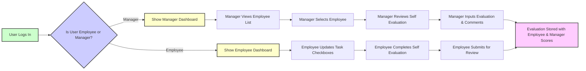

# Job Performance Evaluation Service 상세 요구사항

## 1. 비즈니스 개요

THE 시스템 SHALL 연 2회 직무 수행 여부 체크와 전문성 평가를 통해 조직 구성원의 업무 역량 진단을 지원한다.

THE 시스템 SHALL 인사담당자가 각 직원의 평가 결과를 지속적으로 모니터링할 수 있게 한다.

THE 시스템 SHALL 모든 평가 데이터와 진단 기록을 안전하게 저장하며, 연도별 누적 기록을 제공한다.

## 2. 사용자 역할 및 권한

### 2.1 직원

- WHEN 직원이 로그인하면, THE 시스템 SHALL 본인의 직무별 Task 및 Activity 수행 여부를 체크할 수 있게 한다.

- WHEN 직원이 자기 평가(업무수행 수준 진단, 지식/기술 평가, 문제해결 및 협업, 혁신성)를 5단계 척도로 입력하면, THE 시스템 SHALL 저장한다.

- WHEN 직원이 평가를 종료하면, THE 시스템 SHALL 종합 코멘트를 반드시 입력하도록 요구한다.

- THE 시스템 SHALL 직원이 본인의 평가 이력을 조회할 수 있게 한다.

### 2.2 매니저

- WHEN 매니저가 로그인하면, THE 시스템 SHALL 자신이 관리하는 직원 리스트를 이름, 조직 등으로 검색 및 필터할 수 있게 한다.

- WHEN 매니저가 직원 한명을 선택하면, THE 시스템 SHALL 해당 직원의 자기 평가 결과를 확인할 수 있게 한다.

- THE 매니저 SHALL 업무수행 수준 진단, 지식/기술 평가, 문제해결 및 협업, 혁신성에 대해 평가 점수를 입력하거나 수정할 수 있다.

- THE 매니저 SHALL 자기 평가와 다른 점수는 직원 평가와 매니저 평가로 구분해 저장해야 한다.

- THE 매니저 SHALL 종합 코멘트를 입력할 수 있게 한다.

- THE 매니저 SHALL 평가 이력을 조회할 수 있게 한다.

## 3. 기능 요구사항

### 3.1 로그인 및 인증

- WHEN 사용자가 이메일과 비밀번호로 로그인하면, THE 시스템 SHALL 인증 상태를 확인하고, 권한에 따른 화면을 제공한다.

- IF 인증 실패, THEN THE 시스템 SHALL HTTP 401 상태코드와 함께 오류 메시지를 반환한다.

### 3.2 수행 직무 체크

- WHEN 직원이 직무별 Task-Activity 리스트를 조회하면, THE 시스템 SHALL 수행 여부를 체크하는 UI를 보여준다.

- WHEN 수행 여부를 체크하거나 해제 시, THE 시스템 SHALL 체크한 현재 일자를 평가 주기 기준일로 기록한다.

- THE 수행 체크는 연 2회 가능하며, 언제든 수정 가능해야 한다.

### 3.3 평가 입력

- WHEN 직원이 자기 평가 문항을 5단계 척도로 입력하면, THE 시스템 SHALL 저장한다.

- WHEN 직원이 평가를 제출하면, THE 시스템 SHALL 종합 코멘트를 필수로 입력받는다.

- WHEN 매니저가 평가 데이터를 열람하면, THE 시스템 SHALL 직원 평가와 매니저 평가 점수를 구분하여 보여준다.

- WHEN 매니저가 평가 점수를 수정하면, THE 시스템 SHALL 수정 내용을 별도 저장한다.

### 3.4 평가 이력 및 주기 관리

- THE 시스템 SHALL 연 2회 평가 주기를 관리한다.

- THE 시스템 SHALL 평가 주기별로 평가 이력을 따로 저장하여 조회할 수 있게 한다.

### 3.5 직무 체계 및 직무기술서 관리

- THE 시스템 SHALL 직군-직렬-직무 체계를 CRUD 가능하게 한다.

- THE 시스템 SHALL 직무 체계 및 직무기술서를 엑셀 파일로 대량 등록할 수 있게 한다.

### 3.6 통계 및 리포트

- THE 시스템 SHALL 부서별, 직무별 평가 결과의 평균 및 분포를 집계하여 리포트로 생성한다.

## 4. 평가척도 정의

### 4.1 업무수행 수준 진단

| 점수 | 명칭            | 설명                                                             |
|-------|----------------|------------------------------------------------------------------|
| 1     | Unsatisfactory | 수행 능력이 현저히 부족하여 기대에 크게 못 미침                 |
| 2     | Need Improvement | 수행 능력 부족하여 개선 필요                                    |
| 3     | Average        | 평균 수준으로 기본적 기대 충족                                   |
| 4     | Good           | 수행 능력이 우수하며, 기대 이상의 성과 창출                      |
| 5     | Excellent      | 수행 능력이 매우 뛰어나며, 탁월한 성과를 지속적으로 창출         |

### 4.2 지식/기술 평가

| 점수 | 명칭      | 설명                                                      |
|-------|----------|----------------------------------------------------------|
| 1     | Acquired | 기본적인 지식, 기술을 습득                                 |
| 2     | Applied  | 습득한 지식, 기술을 실제 상황에 적용 가능                   |
| 3     | Proficient | 기술적인 능력에 능숙하며, 다양한 상황에서 효과적으로 활용  |
| 4     | Expert   | 높은 수준의 숙련도를 갖추고 있으며, 창의적이고 혁신적인 응용 가능 |
| 5     | Mastered | 최고의 수준에 도달했으며, 분야 내에서 인정받는 전문가       |

### 4.3 문제해결 및 협업, 혁신성 평가

| 점수 | 명칭            | 설명                                                          |
|-------|----------------|---------------------------------------------------------------|
| 1     | Unsatisfactory | 수행 능력이 현저히 부족하여 기대에 크게 못 미침              |
| 2     | Need Improvement | 수행 능력 부족하여 개선 필요                                   |
| 3     | Average        | 평균 수준으로 기본적 기대 충족                                 |
| 4     | Good           | 수행 능력이 우수하며, 기대 이상의 성과 창출                    |
| 5     | Excellent      | 수행 능력이 매우 뛰어나며, 탁월한 성과를 지속적으로 창출       |

## 5. 업무 흐름 및 프로세스

### 5.1 로그인 및 권한 처리 흐름

## 6. 데이터 관리 상세

- 직무 체계, 직무기술서, 직원 정보, 평가 결과 데이터 모두 CRUD 및 엑셀 대량 업로드 지원 필요.

## 7. 예외 처리 및 성능 요구사항

- 인증 실패 시, 상세한 메시지 제공
- 평가 저장 시 오류가 발생하면 재시도 및 사용자 알림
- 부적절한 접근 차단 및 로그 기록
- 응답 시간 3초 이내 보장

## 8. 추가 요구사항

- 평가 결과 이력은 연 2회 주기로 누적 관리
- 평가 결과 점수 차이에 대한 직원과 매니저의 구분 저장 필수

## 결론

THE 시스템 SHALL 직무 수행과 역량 진단을 위한 평가 프로세스를 완전하게 지원한다.

---

> 본 문서는 비즈니스 요구사항에 한정되며, 기술 구현 사항은 개발팀의 판단에 맡긴다. 시스템이 무엇을 해야 하는지 명확히 설명하며, 어떻게 구현할지는 내부 결정 사항이다.
