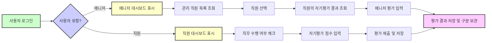

# Job Performance Evaluation Service - 상세 요구사항

## 1. 서비스 개요

Job Performance Evaluation Service는 조직내 직원들의 직무 수행 능력 및 직무 전문성 진단을 체계적으로 지원하는 시스템으로, 연 2회의 자기평가 및 매니저 평가를 통해 개인 성장과 인사관리를 효과적으로 지원함을 목적으로 한다.

## 2. 사용자 역할 및 권한

### 2.1 직원 (Employee)
- 이메일과 비밀번호를 사용하여 로그인한다.
- 본인의 수행 직무(Task 및 Activity 단위)에 대해 수행 여부를 체크할 수 있으며, 연 2회 평가 주기에 맞추어 입력 및 수정이 가능하다.
- 업무수행 수준 진단, 지식/기술 평가, 문제해결 및 협업, 혁신성에 대하여 각각 5단계 척도로 자기 평가를 실시한다.
- 평가 완료 시 "종합 코멘트(본인)"를 반드시 입력해야 한다.
- 본인의 평가 결과 및 과거 이력을 조회할 수 있다.

### 2.2 매니저 (Manager)
- 이메일과 비밀번호로 로그인한다.
- 자신이 관리하는 직원 목록을 이름, 조직 등 검색 및 필터 기능으로 조회할 수 있다.
- 직원 선택 후 해당 직원의 자기평가 결과를 열람한다.
- 업무수행 수준 진단, 지식/기술 평가, 문제해결 및 협업, 혁신성 평가를 5단계 척도로 입력·수정할 수 있다.
- 직원의 자기평가와 차이가 있는 경우 점수 및 코멘트를 구분하여 저장한다.
- "종합 코멘트(팀장)"를 입력할 수 있다.
- 직원의 평가 결과 및 이력을 조회할 수 있다.

## 3. 데이터 모델 및 평가 척도

### 3.1 직무 체계
- 직군, 직렬, 직무 계층으로 구성되며 CRUD 및 엑셀 대용량 업로드 지원

### 3.2 직무기술서
- 직무별 Task, Activity, 세부내용, 지식/기술 및 세부내용 포함
- CRUD 및 엑셀 업로드 기능 포함

### 3.3 직원 정보
- 사번, 조직, 직무, Growth Level, 매니저 정보, 이메일 등 포함

### 3.4 평가 척도
- 업무수행 수준 진단: 1(Unsatisfactory)~5(Excellent), 각 등급별 정의 명확
- 지식/기술 평가: 1(Acquired)~5(Mastered), 평가 척도 상세 정의
- 문제해결 및 협업, 혁신성: 1(Unsatisfactory)~5(Excellent)

| 평가 항목       | 1단계            | 2단계             | 3단계          | 4단계          | 5단계           |
|----------------|------------------|-------------------|----------------|----------------|-----------------|
| 업무수행 수준    | Unsatisfactory   | Need Improvement  | Average        | Good           | Excellent       |
| 지식/기술 평가   | Acquired        | Applied           | Proficient     | Expert         | Mastered        |
| 문제해결 및 협업 | Unsatisfactory   | Need Improvement  | Average        | Good           | Excellent       |
| 혁신성          | Unsatisfactory   | Need Improvement  | Average        | Good           | Excellent       |

## 4. 주요 기능 요구사항

### 4.1 로그인 및 권한 관리
- WHEN 사용자가 이메일과 비밀번호를 제출하여 로그인을 시도하면, THE 시스템 SHALL 2초 이내에 자격증명을 검증하고 사용자역할(직원 또는 매니저)에 맞는 화면 및 기능에 접근 허용한다.
- IF 로그인 자격 증명이 잘못되면, THEN THE 시스템 SHALL HTTP 401 오류와 AUTH_INVALID_CREDENTIALS 코드와 함께 에러 메시지를 반환한다.

### 4.2 업무 수행 체크 기능
- WHEN 직원이 본인의 직무에 대한 Task와 Activity를 조회하면, THE 시스템 SHALL 수행 여부 체크박스를 화면에 표시한다.
- WHEN 직원이 체크박스를 선택 또는 해제하면, THE 시스템 SHALL 해당 상태를 저장하며, 평가 주기(연 2회) 기준일을 기록한다.

### 4.3 직원 자기평가 입력
- WHEN 직원이 업무수행 수준 진단, 지식/기술 평가, 문제해결 및 협업, 혁신성의 5단계 척도 중 각 항목 점수를 입력하고 "종합 코멘트(본인)"를 작성하면, THE 시스템 SHALL 해당 데이터를 저장한다.
- 입력 항목에 모두 점수가 입력되고, 코멘트가 작성되어야만 제출 가능하다.

### 4.4 매니저 평가 입력 및 검토
- WHEN 매니저가 관리 직원 목록에서 직원을 선택하면, THE 시스템 SHALL 해당 직원의 자기평가 결과를 불러온다.
- WHEN 매니저가 각 평가 항목 점수를 입력하거나 수정하면, THE 시스템 SHALL 직원 평가 점수와 매니저 평가 점수를 별도로 저장한다.
- IF 직원과 매니저 평가 점수가 다르면, THEN THE 시스템 SHALL 양쪽 평가 데이터 모두 저장하고 구분하여 조회 가능해야 한다.
- WHEN 매니저가 "종합 코멘트(팀장)"를 작성하면, THE 시스템 SHALL 저장한다.

### 4.5 평가 주기 관리
- THE 시스템 SHALL 연 2회의 평가 주기를 관리하며, 각 주기별 평가 데이터는 별도 기록으로 누적 관리된다.
- 평가 주기의 시작 및 종료일은 시스템에서 정의 및 제어한다.

### 4.6 직무 및 직무기술서 CRUD 및 대량 업로드
- CRUD 기능을 통해 직군, 직렬, 직무, Task, Activity, 지식/기술을 개별 생성/수정/삭제 가능하다.
- 엑셀 파일 업로드 기능으로 대량 등록 및 수정 지원하며 데이터 무결성 검증이 필수이다.

### 4.7 평가 결과 조회 및 이력 관리
- 직원 및 매니저는 본인의 평가 결과 및 과거 평가 이력을 조회할 수 있다.
- 평가 데이터는 평가 주기별로 분리 저장되며 수정 이력도 기록한다.

### 4.8 통계 및 리포트 기능
- 관리자는 조직, 평가 주기, 직무별 통계 리포트를 조회할 수 있다.
- 리포트에는 평균 점수, 점수 분포, 자기평가와 매니저 평가 간 차이 등이 포함된다.

## 5. 업무 프로세스 흐름

## 6. 비즈니스 규칙 및 검증

- 직원 사번은 고유하며 조직, 직무 정보는 체계에 일치해야 한다.
- 평가 점수는 1~5 정수 범위 내여야 하며 각 척도별 정확한 의미를 반영한다.
- 평가 주기별 데이터는 별도 관리하며 과거 이력을 영구 보관한다.
- 매니저는 본인이 관리하는 직원만 평가 가능하다.
- 필수 입력항목(평가 점수, 종합 코멘트 등)은 누락 없이 작성되어야 한다.

## 7. 오류 처리

- IF 로그인 자격증명이 유효하지 않으면, THEN 401 에러와 명확한 메시지를 반환한다.
- IF 평가 기간이 종료된 후 입력 시도 시, THEN 입력 불가 메시지를 보여준다.
- IF 데이터 저장 중 오류 발생 시, THEN 재시도 요청 및 입력 내용 보호 알림을 준다.

## 8. 성능 요구사항

- 로그인 처리와 데이터 저장은 2초 이내에 완료되어야 한다.
- 평가 목록 조회 및 필터링 기능은 3초 이내 응답을 목표로 한다.

## 9. 용어 정의

- Task: 직무내 주요 업무 단위
- Activity: Task 내 세부 활동
- Growth Level: 직원 성장 단계 (GL1~GL5)
- 평가 주기: 연 2회 실시되는 평가 기간
- 자기평가: 직원 본인이 실시하는 평가
- 매니저 평가: 관리자가 실시하는 평가

---

이 문서는 업무 평가 시스템의 핵심 비즈니스 요구사항만을 명확히 기술하고 있으며, 기술 구현 세부사항 및 데이터베이스 설계는 개발팀에 위임된다.

개발자는 본 문서를 바탕으로 WHAT을 구현하며 HOW는 자유롭게 결정할 수 있다.