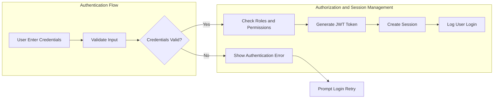
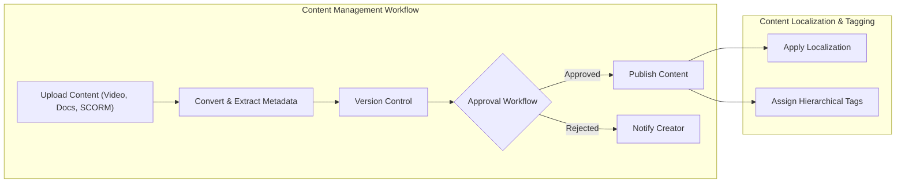
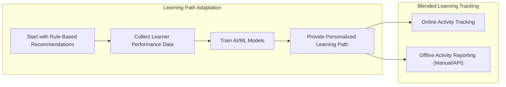
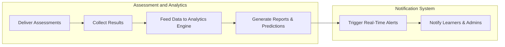

# Enterprise Learning Management System (LMS) Detailed Requirements Specification

## 1. Introduction

### 1.1 Business Model

The Enterprise Learning Management System (LMS) is designed to serve multiple organizations with isolated data and configuration settings. It addresses the need for scalable, AI-powered training platforms that support complex organizational hierarchies, compliance tracking, personalized learning paths, and advanced analytics. The system’s revenue model combines organizational subscriptions, paid certifications and courses for external learners, and premium integration services. Success is measured by active user engagement, course completion rates, and regulatory compliance.

### 1.2 User Roles and Permission Overview

The LMS includes a comprehensive role hierarchy to enforce granular access control across organizations:
- System Administrator
- Organization Administrator
- Department Manager
- Content Creator / Instructor
- Corporate Learner
- External Learner
- Guest

Roles are customizable within security constraints through a dynamic permissions matrix managed by Organization Administrators.

## 2. Multi-Tenant Architecture

### 2.1 Tenant Data Isolation

The system SHALL implement a shared database schema tagging all data with a unique tenant_id to ensure logical data segregation at all layers, preventing data leakage between organizations.

### 2.2 Tenant-Specific Branding and Customization

Each tenant SHALL customize branding elements including logos, color palettes, and apply white-label CSS overrides. Custom domain support is provided. Branding configurations SHALL be stored securely in tenant settings.

## 3. User Management and Authentication

### 3.1 Authentication Workflow

User authentication SHALL support conventional email/password login, password resets, email verification, and session management with expiration and revocation capabilities. Single Sign-On SHALL integrate via SAML 2.0, OAuth 2.0, and LDAP.

### 3.2 Role Hierarchy and Permissions

Roles follow a strict hierarchy with scope-limited attribute and role-based access controls:
- System Administrator: Full access across all organizations
- Organization Administrator: Manage users, content, approvals, and billing within their org
- Department Manager: Manage users and content within their department
- Content Creator/Instructor: Manage own course content and student progress
- Corporate Learner: Enroll and complete courses, access personal analytics
- External Learner: Limited access to public/paid courses, payment processing
- Guest: Browse public content catalog only

### 3.3 Permission Matrix

A dynamic permission matrix allows Organization Administrators to assign granular permissions within system-enforced minimum security levels. Context-aware controls limit actions to owned resources or designated scopes.

## 4. Content Management System

### 4.1 Supported Content Formats

Content formats supported include videos, PDF, DOCX, PPT, SCORM packages, xAPI/Tin Can API, and interactive HTML5 content.

### 4.2 Content Versioning and Approval Process

All content SHALL support unlimited versioning with full rollback. The system retains the latest 5 versions online, archiving older versions securely with retrieval capabilities. Approval workflows are multi-stage and configurable.

### 4.3 Localization and Tagging

The system supports content localization across languages with translation workflows. A hierarchical tagging system SHALL enable fine-grained content search and categorization.

## 5. Learning Path and Curriculum Management

### 5.1 AI-Driven Adaptive Learning Paths

Initial learning recommendations are rule-based leveraging content tags and learner preferences, progressing to AI/ML models that personalize learning paths dynamically.

### 5.2 Prerequisites Enforcement

Courses and modules SHALL enforce prerequisite chains. Learners cannot enroll without satisfying prior requirements, though admins may override with audit.

### 5.3 Certification and Competency Mapping

Certification programs SHALL include expiration and renewal policies. Competency mapping SHALL connect learning content to specific skills and proficiency levels.

### 5.4 Blended Learning Support

Online and offline activities SHALL be combined. Offline progress can be tracked manually or integrated through APIs with attendance and badge systems.

## 6. Assessment and Analytics Engine

### 6.1 Multiple Assessment Types

The system supports quizzes, surveys, peer reviews, practical assignments, and proctored exams via third-party proctoring vendor plugins.

### 6.2 Analytics Dashboard and Reporting

Dashboards present real-time insights into learning progress, engagement, performance trends, and completion metrics.

### 6.3 Predictive Analytics

AI-powered analytics SHALL predict learner success probabilities, competency achievement likelihood, and risk flags for compliance training.

### 6.4 Compliance Reporting

Automated report generation supports regulated industry mandates, with data retention for audits.

## 7. Communication and Collaboration

### 7.1 Discussion Forums and Messaging

Threaded, moderated forums facilitate learner interaction. Direct messaging supports secure file sharing with compliance archiving.

### 7.2 Virtual Classrooms Integration

Platform-agnostic integration supports Zoom, WebEx, Microsoft Teams, and custom virtual classroom solutions with calendar scheduling.

### 7.3 Group Projects and Announcements

Collaborative projects allow resource sharing and submission management. Targeted announcements provide delivery receipts and audit logs.

## 8. Business Rules and Validation

### 8.1 Enrollment and Certification Rules

Enrollment SHALL be disallowed unless prerequisites are met, with overrides auditable by admins. Certificates issued only on successful completion of required assessments.

### 8.2 Content Access Control

Content visibility SHALL be scoped based on tenant, department, and role restrictions.

### 8.3 Progress Tracking

Detailed analytics SHALL track time spent, attempts, and engagement. Data updates SHALL be near real-time or within one minute.

### 8.4 Compliance and Retention Policies

Training and certification records SHALL be retained securely for a minimum of 7 years using tiered storage with full searchability.

## 9. Non-Functional Requirements

### 9.1 Performance

Support for 10,000+ concurrent users per organization during peaks with API latency under 200 ms for 95% of requests. Adaptive bitrate streaming and resumable file uploads up to 2 GB.

### 9.2 Security

AES-256 encryption at rest, TLS 1.3 in transit, GDPR, CCPA, FERPA compliance, DRM and watermarking of content. SOC2 Type II and ISO 27001 certification.

### 9.3 Scalability

Multi-region deployments, auto-scaling via container orchestration, database sharding, multi-layer caching (Redis, CDN), and asynchronous background processing.

## 10. Integration Requirements

### 10.1 Third-Party Service Integrations

Slack, Microsoft Teams, Salesforce, Workday, BambooHR integrations for notifications, user sync, and reporting.

### 10.2 Payment and Email Services

Stripe integration for payments and subscriptions. SendGrid/AWS SES for transactional email with retry and logging.

### 10.3 Analytics and BI Integration

Google Analytics, Mixpanel, Tableau, PowerBI with data export APIs and custom dashboards.

## 11. Error Handling and Recovery

Graceful handling of authentication failures, enrollment validation, upload retries, approval rejections, and notification delivery.

## 12. Success Metrics and Monitoring

Meeting performance SLAs, concurrency targets, compliance reporting accuracy, AI recommendation improvements, and system uptime goals.

> This document provides business requirements only. All technical implementation decisions belong to developers. It describes WHAT the system should do, not HOW to build it.

---

---