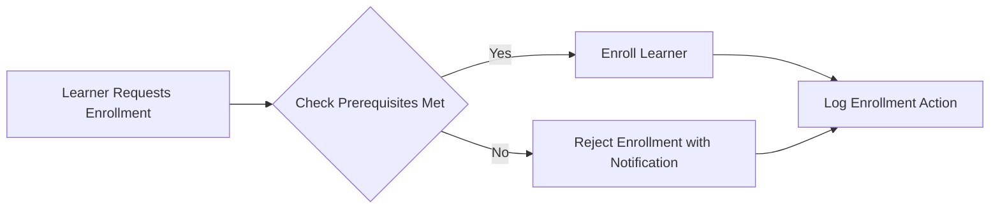
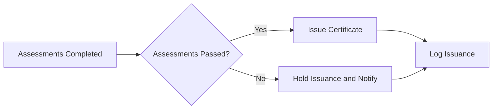
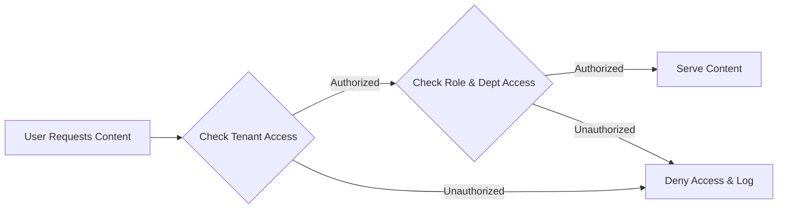

# Enterprise Learning Management System (LMS) Business Rules and Validation Logic

This document outlines the critical business rules and validation logic for the Enterprise LMS platform. It provides detailed, unambiguous requirements to enforce correct workflows, ensure compliance, and maintain data integrity for multi-tenant environments. The focus is exclusively on business logic from a backend perspective.

---

## 1. Introduction

This document serves as the definitive guide for all business rule implementations required by the enterprise LMS system. The rules structured herein govern enrollment prerequisites, certification issuance, content access restrictions, learning progress tracking, compliance with regulatory mandates, and strict tenant data separation.

All rules and validations described are mandatory for backend developers to implement exactly as specified to guarantee system correctness, compliance, and performance.

---

## 2. Enrollment Rules

### Prerequisite Enforcement
- WHEN a learner attempts to enroll in a course, THE system SHALL verify that the learner has completed all prerequisite courses and modules.
- IF a learner does not meet the prerequisite requirements, THEN THE system SHALL prevent enrollment and notify the learner of the missing prerequisites.
- WHERE an administrator overrides enrollment prerequisites, THE system SHALL log the override action in the audit trail with user and timestamp details.

### Enrollment Restrictions
- THE system SHALL prevent enrollment in courses if learner status is inactive or if enrollment period has expired.
- THE system SHALL disallow enrollment attempts for learners assigned the "guest" role.

### Notification
- WHEN enrollment is blocked due to prerequisites, THE system SHALL automatically notify the learner about prerequisites needed via email and in-app notification.

---

## 3. Certification Logic

### Certification Issuance
- WHEN a learner completes all required assessments in a certification track with minimum passing scores, THE system SHALL issue a certification certificate.
- IF assessments are incomplete or scores are below thresholds, THEN THE system SHALL withhold certificate issuance.

### Expiration and Renewal
- THE system SHALL track certification expiration dates based on regulatory or organizational policies.
- WHEN a certification nears expiration (e.g., 30 days prior), THE system SHALL notify the learner and their organization administrators to trigger renewal actions.
- THE system SHALL allow re-certification after expiration following successful re-assessment.

### Audit Logging
- ALL certification issuance, renewal, and revocation actions SHALL be logged with timestamps and responsible user information.

---

## 4. Content Access Control

### Access Authorization
- THE system SHALL enforce strict content visibility rules based on:
  - Tenant organization
  - Department membership
  - User role in the hierarchy
- Content assigned to an organization or specific departments SHALL be accessible only to users with membership and appropriate roles.
- THE system SHALL restrict content visibility for external learners to public or paid courses they have purchased.

### Dynamic Permissions
- WHERE attribute-based access control applies (e.g., instructors editing their content only), THE system SHALL validate ownership before granting modification rights.

### Content Tagging and Search
- Search and retrieval SHALL consider hierarchical tagging to filter and present content accurately within tenant boundaries.

---

## 5. Progress Tracking

### Learning Analytics Data
- THE system SHALL track and store detailed learner activity for each course:
  - Time spent per module
  - Number of attempts per assessment
  - Engagement levels (e.g., video views, document reads)
- THE system SHALL aggregate progress data at learner, department, and organizational levels for reporting.

### Data Update Frequency
- Progress data updates SHALL be processed in near real-time with asynchronous batch updates tolerated within 1-minute latency.

### Error Handling
- IF learner activity data submission fails due to transient errors, THEN THE system SHALL retry asynchronously with exponential backoff.
- IF persistent failures occur, THEN THE system SHALL alert administrator dashboards.

---

## 6. Compliance and Retention

### Regulatory Data Retention
- THE system SHALL retain all training records, including enrollment, progress, and certification data, for a minimum of 7 years.
- WHERE training records are less than 2 years old, THE system SHALL keep them online and instantly accessible.
- For records aged 3 to 5 years, THE system SHALL store them in warm storage with retrieval times under 1 hour.
- For records aged 6 to 7 years, THE system SHALL archive them in cold storage with full searchability and retrieval possible within 24 hours.

### Audit Trails
- THE system SHALL log all user actions related to training records, including enrollment, progress updates, content access, and certification events.
- Audit logs SHALL be immutable and stored securely with access controlled by system administrators only.

---

## 7. Multi-Tenancy Data Isolation

### Tenant Data Segregation
- THE system SHALL use tenant identifiers to strictly isolate data between organizations at the application level.
- No data, content, or user information SHALL be accessible across tenant boundaries.

### Branding and Configuration Segregation
- Tenant-specific branding configurations, including logos and CSS overrides, SHALL be stored and applied only within the tenant context.

### Access Control Enforcement
- THE system SHALL enforce multi-tiered role and attribute based access control within tenant data to prevent unauthorized cross-department or organization access.

### Data Handling and Backup
- Data backups SHALL maintain tenant separation to enable tenant-specific restores without affecting others.

---

## 8. Error Handling and Recovery

### Enrollment Errors
- IF prerequisite validation fails, THEN THE system SHALL return a clear error message indicating missing requirements.

### Certification Failures
- IF certificate issuance fails due to incomplete assessments, THEN THE system SHALL notify the learner and log the issue.

### Content Access Errors
- IF a user attempts to access unauthorized content, THEN THE system SHALL deny access and log the unauthorized attempt.

### Progress Tracking Errors
- IF data ingestion failures occur during progress tracking, THEN THE system SHALL perform retries and notify administrators after repeated failures.

### Data Isolation Violations
- IF cross-tenant data access is detected, THEN THE system SHALL block the action immediately and alert security teams.

---

# Mermaid Diagram: Enrollment Validation Flow

# Mermaid Diagram: Certification Issuance Workflow

# Mermaid Diagram: Content Access Decision

---

This document defines all business rules and validation logic exclusively. Technical implementation decisions, such as architecture, API design, and database schema, are left to the development team’s discretion. The document specifies what the system must do, not how to build it.