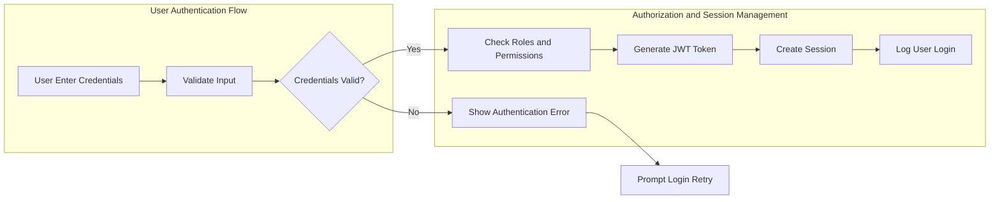
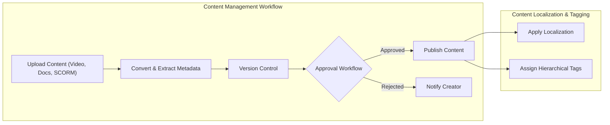
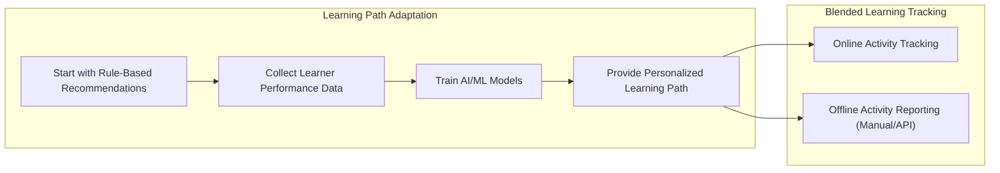
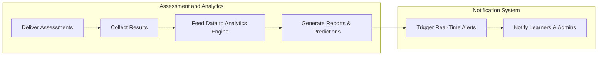

# Enterprise Learning Management System (LMS) Functional Requirements and Business Logic

## 1. Introduction

The Enterprise Learning Management System (LMS) is a multi-tenant platform designed to facilitate comprehensive training programs for multiple organizations. This document provides in-depth functional requirements and business logic to guide backend developers in building a scalable, secure, and feature-rich LMS with AI-powered personalization, advanced analytics, and compliance tracking.

## 2. Business Model Overview

### 2.1 Why This Service Exists
THE LMS SHALL provide a scalable, secure, and customizable platform to address enterprise training needs with complex organizational structures and regulatory compliance. This service fills a market gap by integrating AI-driven learning paths, multi-tenant isolation, and extensive analytics.

### 2.2 Revenue Strategy
THE LMS SHALL generate revenue primarily through organizational subscriptions, paid external certifications, and premium integrations.

### 2.3 Growth and Success Metrics
THE system SHALL track and optimize the number of active organizations, monthly active users, course completion rates, certification renewals, and adherence to compliance standards.

## 3. User Roles and Authentication Requirements

### 3.1 Comprehensive Role Definitions
- System Administrator: Full access to all organizations, server configurations, global analytics, and integration management.
- Organization Administrator: Manages own organization’s users, content, settings, billing.
- Department Manager: Oversees users and content within their department.
- Content Creator/Instructor: Creates and manages own content and learner progress.
- Corporate Learner: Enrolls in courses, tracks progress, accesses learner dashboard.
- External Learner: Limited access to public courses, payment handling, basic progress tracking.
- Guest: Browse-only access to public course catalogs.

### 3.2 Authentication Flow
WHEN a user attempts login, THE system SHALL support authentication via credentials or enterprise SSO (SAML 2.0, OAuth 2.0, LDAP) with response times under 2 seconds.

### 3.3 Permissions Management
THE system SHALL enforce both role-based and attribute-based controls, allowing Organization Admins to customize permissions dynamically under minimum security constraints. Instructors SHALL modify only own content; Department Managers SHALL access only own department data.

## 4. Functional Requirements

### 4.1 Multi-Tenant Architecture
- THE system SHALL use a shared database schema with tenant-specific identifiers ensuring strict data isolation.
- THE system SHALL support tenant-specific branding including logos, colors, custom domains, and CSS overrides.

### 4.2 User Management & Authentication
- THE system SHALL maintain audit trails of all user actions.
- Self-registration for external learners SHALL be supported with email verification and optional admin approval.

### 4.3 Content Management
- THE system SHALL support multiple content formats including video, PDFs, PPTs, SCORM, xAPI/Tin Can API, and interactive HTML5.
- SCORM/xAPI packages SHALL be parsed and converted internally while preserving the original.
- Unlimited version tracking with the latest 5 active versions stored online; older versions archived with retrievability.
- Multi-stage configurable content approval workflow.
- Localization and hierarchical tagging system for content.

### 4.4 Learning Path & Curriculum
- THE LMS SHALL deliver AI-driven adaptive learning paths, starting with rule-based recommendations and evolving to machine learning as data grows.
- Prerequisites and complex course dependencies SHALL be enforced.
- Certification tracks with expiration and renewal SHALL be supported.
- Competency mapping of skills and proficiency levels SHALL be enabled.
- Blended learning support including offline activity tracking either manual or API integrated.

### 4.5 Assessment & Analytics Engine
- Support quizzes, surveys, peer reviews, practical assignments, and third-party proctored exams.
- Advanced dashboards for learning progress, engagement, and performance trends.
- AI prediction models SHALL provide learner success likelihood and compliance risk.
- Automated compliance report generation.
- Real-time smart notifications for events and deadlines.

### 4.6 Communication & Collaboration
- Threaded forums with moderation.
- Secure direct messaging with compliance archiving.
- Platform-agnostic live virtual classrooms integrating Zoom, WebEx, Teams, and custom platforms.
- Group projects with collaborative workspace and submission tracking.
- Targeted announcements with delivery confirmation.

## 5. Critical Business Rules and Validation

- Enrollment SHALL be blocked if prerequisites are unmet; admins can override with audit logging.
- Certificates issued only upon passing required assessments.
- Content access restricted by tenant, department, and role.
- Tracking detailed learner progress including attempts, time, and engagement.
- Training records retained at least 7 years in tiered storage allowing instant search.
- Tenant data SHALL be fully isolated preventing cross-organizational access.

## 6. Non-Functional Requirements

- Support 10,000+ concurrent users per tenant during peaks.
- API response times under 200ms for 95% of requests.
- Adaptive bitrate streaming with CDN.
- Resumable file uploads up to 2GB.
- AES-256 encryption at rest; TLS 1.3 in transit.
- GDPR, CCPA, FERPA compliance.
- SOC2 Type II and ISO 27001 certification.
- Horizontal auto-scaling and multi-region deployments.
- Database sharding and multi-layer caching.
- Background jobs processed asynchronously.

## 7. Integration Requirements

- Integrate Slack, Microsoft Teams, Salesforce, Workday, BambooHR.
- Payment via Stripe supporting B2C and subscription billing.
- Email via SendGrid or AWS SES.
- Cloud storage with AWS S3 or Azure Blob and CDN.
- Analytics integration with Google Analytics, Mixpanel, Tableau, PowerBI.

## 8. Error Handling and Recovery

- Deny enrollments lacking prerequisites with clear notification.
- Authentication failures return HTTP 401 with specific error codes.
- Fail-safe large file upload retries.
- Content approval rejection workflows notify creators with details.
- Integration failures logged and retried with alerts.

## 9. Success Metrics

- 95% API responses below 200ms under load.
- Sustaining 10,000+ concurrent users without degradation.
- Automatic and compliant report generation.
- Improvement in course completion via AI recommendations.
- 99.9% system uptime.

## Diagrams

### User Authentication Flow

### Content Management Workflow

### Learning Path Adaptation

### Assessment and Analytics

This document provides business requirements only. Implementation details related to architecture, APIs, and database design are at the discretion of the development team. The document specifies WHAT the system shall do, not how to build it.
