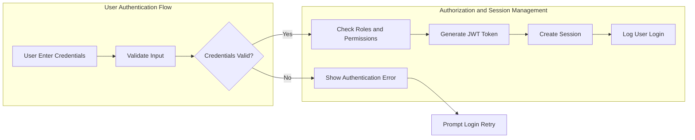
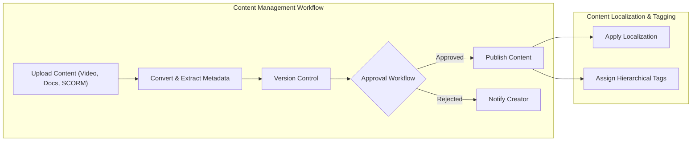
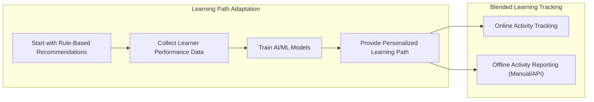
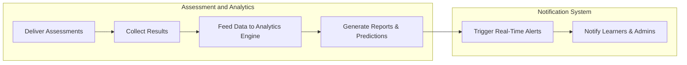

# Enterprise Learning Management System (LMS) Functional Requirements

## 1. Introduction
This document details the comprehensive functional requirements for the Enterprise Learning Management System (LMS) designed for multiple organizations. The LMS features advanced multi-tenant support, complex role hierarchies, AI-powered adaptive learning, extensive content management, assessment capabilities, communication tools, and compliance functionalities. The requirements herein strictly define the business logic, user interactions, and workflows to support backend development and ensure no ambiguity in implementation.

**Scope:** Covers multi-tenancy, user and permission management, content ingestion and management, learning path personalization, assessment and analytics, communication features, and critical business rules.

**Assumptions:** Security, performance, scalability, and integrations are addressed in allied documents; this document focuses on functional business requirements only.

## 2. Multi-Tenant Architecture
- The system SHALL implement a shared database schema where each organization is identified by a unique `tenant_id` and strict data isolation is enforced at the application level.
- The system SHALL support full customizable branding per tenant including logos, color schemes, custom domains, and white-label options stored in tenant configuration settings.
- The system SHALL provide CSS override capabilities for each tenant to apply unique branding.

## 3. User Management and Authentication

### 3.1 Authentication Flow
- THE system SHALL support secure user authentication including login, logout, session management, password resets, email verification, and multi-factor authentication (if enabled).
- THE system SHALL allow Single Sign-On (SSO) integration supporting SAML 2.0, OAuth 2.0, and LDAP authentication protocols.
- WHEN a user submits login credentials, THE system SHALL validate and respond within 2 seconds.
- IF authentication fails, THEN THE system SHALL return an appropriate error code with descriptive messaging.

### 3.2 Role Hierarchy and Permissions
The system SHALL implement the following role hierarchy with scoped permissions:
- System Administrator (systemAdmin): full access across all organizations including server maintenance, global analytics, integration management, and API administration.
- Organization Administrator (organizationAdmin): full control within their organization including user and role management, content approval, organization configurations, and financial reporting.
- Department Manager (departmentManager): manage users within their department, content assignment, department-specific analytics, and budget approvals.
- Content Creator/Instructor (contentCreatorInstructor): create and upload course content, monitor student progress, manage grading and feedback, with limited analytics.
- Corporate Learner (corporateLearner): enroll in courses, track progress, download certificates, participate in discussions, and access personal dashboards.
- External Learner (externalLearner): access public and paid courses with payment support, basic progress tracking, and community participation.
- Guest (guest): browse public course catalogs with read-only access, no enrollments.

### 3.3 Permissions and Access Control
- THE system SHALL implement both role-based access control (RBAC) and attribute-based access control (ABAC) to support dynamic and context-aware permissions.
- THE system SHALL allow Organization Administrator to customize the permissions matrix for roles within their organization, subject to system-enforced security minima.
- Context-aware permissions SHALL ensure instructors can only modify content they created, and department managers only manage users from their department.
- THE system SHALL audit all user actions with complete logs for compliance.

## 4. Content Management System

### 4.1 Content Formats and Import
- THE system SHALL support multiple content formats including video files, documents (PDF, DOCX, PPT), SCORM packages, xAPI/Tin Can API packages, and interactive HTML5 content.
- WHEN SCORM or xAPI packages are uploaded, THE system SHALL import and convert them into internal formats for optimized performance and analytics while maintaining the original package integrity.

### 4.2 Version Control and Archiving
- THE system SHALL track unlimited versions of content with rollback capabilities.
- THE system SHALL keep the latest 5 versions immediately accessible; older versions SHALL be archived to cold storage with retrievability for compliance.

### 4.3 Content Approval Workflow
- THE system SHALL support a configurable multi-stage content approval workflow involving designated reviewers before content publication.

### 4.4 Localization and Tagging
- THE system SHALL support multi-language content localization with translation management features.
- THE system SHALL implement a hierarchical content tagging system to enable advanced search, filtering, and categorization.

## 5. Learning Path and Curriculum Management

### 5.1 Adaptive Learning Paths
- THE system SHALL provide AI-driven adaptive learning paths, initially rule-based on content tags and learner preferences, evolving to machine learning models as data accumulates.

### 5.2 Prerequisites and Dependencies
- THE system SHALL enforce complex prerequisite chains between courses and modules.

### 5.3 Certification Tracks
- THE system SHALL provide formal certification programs with expiration and renewal rules.

### 5.4 Competency Mapping
- THE system SHALL enable mapping of content to specific skills and competency levels.

### 5.5 Blended Learning
- THE system SHALL support blended learning combining online and offline activities.
- OFFLINE activities SHALL be tracked either manually by instructors or integrated via APIs with external attendance systems.

## 6. Assessment and Analytics Engine

### 6.1 Assessment Types
- THE system SHALL support multiple assessment types: quizzes, surveys, peer reviews, practical assignments, and proctored exams.
- Proctored exams SHALL integrate with third-party proctoring platforms via a pluggable architecture.

### 6.2 Analytics Dashboard
- THE system SHALL provide dashboards displaying learning progress, engagement, completion rates, and performance trends.

### 6.3 Predictive Analytics
- THE system SHALL deliver AI-powered predictions for learner success likelihood, competency achievements, and risk identification in compliance-critical training.

### 6.4 Compliance Reporting
- THE system SHALL automatically generate compliance reports aligning with regulatory requirements.

### 6.5 Notifications
- Real-time, smart notifications SHALL be sent for deadlines, achievements, and other system events.

## 7. Communication and Collaboration

### 7.1 Discussion Forums
- THE system SHALL provide threaded discussion forums with moderation capabilities.

### 7.2 Direct Messaging
- THE system SHALL support secure direct messaging with file sharing and compliance features including archiving and audit trails.

### 7.3 Virtual Classrooms
- THE system SHALL integrate platform-agnostic live virtual classrooms with adapters for Zoom, WebEx, Teams, and custom platforms.
- Calendar integrations SHALL support scheduling.

### 7.4 Group Projects
- THE system SHALL provide collaborative workspaces for group projects including shared resources and submission tracking.

### 7.5 Announcement System
- THE system SHALL support targeted announcements with delivery confirmation.

## 8. Business Rules and Validation

- Enrollment SHALL be blocked unless prerequisites are fulfilled; administrators can override with notifications.
- Certification SHALL be issued only after successful completion of required assessments with minimum scores.
- Content visibility controlled by organization, department, and roles.
- Detailed progress tracking SHALL include time spent, attempts, and engagement metrics.
- Training records SHALL be retained for a minimum of 7 years with tiered storage strategies ensuring availability and searchability.
- Data isolation SHALL be strictly enforced between tenants to prevent cross-contamination.

## 9. Non-Functional Considerations (Summary)
For details refer to the [Non-Functional Requirements Document](./05-non-functional-requirements.md). Key points include:
- Performance targets such as API responses under 200ms for 95% requests, support for 10,000+ concurrent users per organization.
- Security compliance including SOC2, ISO 27001, GDPR, FERPA.
- Scalability via auto-scaling and multi-region deployment.

## 10. Integration Requirements

- Integrations SHALL include Slack, Microsoft Teams, Salesforce, Workday, BambooHR.
- Stripe SHALL be integrated for payment processing for both B2B subscriptions and B2C courses.
- Email notifications SHALL be sent via SendGrid or AWS SES.
- Cloud storage SHALL use AWS S3 or Azure Blob with CDN.
- Analytics SHALL be enhanced via Google Analytics, Mixpanel, Tableau, and PowerBI integrations.

## 11. Error Handling and Recovery Processes

- If enrollment prerequisites are unmet, THE system SHALL notify users with clear guidance.
- Authentication failures SHALL respond with appropriate HTTP error codes and messages.
- Content upload failures SHALL support retries and log issues.
- System SHALL gracefully handle external integration failures with fallback and alerts.

## 12. Success Metrics

- 95% API requests respond within 200ms under load.
- Peak concurrency of 10,000+ users per organization is sustained without degradation.
- Compliance reports generated automatically and accurately for regulated industries.
- AI recommendations improve course completion rates by measurable margin.
- System uptime maintained at 99.9% or better.

---

This document specifies business requirements only. All technical implementation decisions regarding architecture, APIs, database schemas, and infrastructure are the responsibility of the development team. The document focuses exclusively on the WHAT of the system, not the HOW.

---

## Mermaid Diagrams

---

This document provides business requirements only. All technical implementation decisions belong to the developers. The document focuses exclusively on business requirements and does not include technical design or database schema details. Developers have full autonomy in architecture and implementation choices.