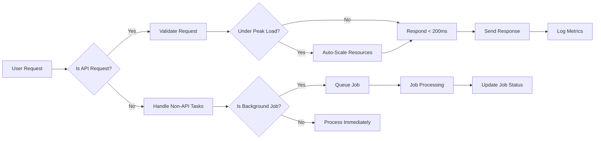

# Performance Expectations for Enterprise Learning Management System (LMS)

This document provides business requirements only. All technical implementation decisions, including architecture, API design, and database schemas, are the responsibility of the development team. This document defines WHAT the system should achieve in terms of performance and resource management.

---

## 1. Introduction

This document outlines the expected performance criteria for the Enterprise LMS designed to support multi-tenant enterprise training programs with advanced features including AI-powered personalization, compliance management, and multimedia content delivery. As a mission-critical platform, performance requirements ensure timely response, scalability, and optimal resource utilization to maintain user satisfaction and meet enterprise SLAs.

## 2. Concurrency and Load Handling

### 2.1 Support for Concurrent Users
- WHEN multiple users are active, THE system SHALL support at least 10,000 concurrent users per organization during peak usage periods, such as enterprise-wide training events.
- THE system SHALL allow concurrent access from multiple organizations without data cross-contamination or performance degradation.

### 2.2 Scalability and Burst Capacity
- THE system SHALL automatically scale resources horizontally in response to load spikes exceeding baseline thresholds, enabling burst capacity beyond 10,000 concurrent users.
- THE system SHALL redistribute workload using container orchestration or equivalent technology to balance load efficiently.

### 2.3 Resource Allocation
- THE system SHALL allocate underlying infrastructure resources dynamically based on concurrency and demand to optimize utilization.

## 3. API Response Time Requirements

### 3.1 Response Time Targets
- WHEN a client makes an API request under normal operating conditions, THE system SHALL respond within 200 milliseconds for 95% of all requests.
- WHEN large file uploads or downloads occur, THE system SHALL prioritize streaming or chunked transfer methods optimized for size.

### 3.2 Performance Degradation Thresholds
- IF system load exceeds 10,000 concurrent users, THEN THE system SHALL maintain response times under 500 milliseconds for critical user interactions.
- IF response time exceeds targets, THEN THE system SHALL emit alerts to monitoring infrastructure.

### 3.3 Prioritization of API Requests
- THE system SHALL prioritize API requests related to real-time user interactions over background or batch processing tasks.

## 4. Video Streaming Performance

### 4.1 Adaptive Bitrate Streaming
- THE system SHALL support adaptive bitrate video streaming to cater to diverse network bandwidths and device capabilities.
- THE system SHALL integrate with CDN services to minimize latency and buffering.

### 4.2 Video Delivery Constraints
- THE system SHALL support video streaming at standard resolutions including 480p, 720p, and 1080p, with automatic quality adjustments.
- THE system SHALL allow resumable video uploads up to 2GB per file to accommodate large content.

## 5. Caching Strategies

### 5.1 Multi-layered Caching
- THE system SHALL implement a multi-layer caching hierarchy comprising:
  - Redis or equivalent in-memory cache for frequently accessed data.
  - CDN caching for delivery of static and media assets.
  - Application-level caching for computed or aggregated results.

### 5.2 Cache Invalidation
- THE system SHALL provide mechanisms for cache invalidation upon content updates, permission changes, or configuration modifications.

### 5.3 Performance Optimization
- THE system SHALL leverage caching to reduce database load and improve overall API response times.

## 6. Background Processing and Job Management

### 6.1 Asynchronous Processing
- THE system SHALL process heavy or time-consuming operations (e.g., content transcoding, analytics aggregation, notification dispatch) asynchronously using background job queues.

### 6.2 Job Queue Management
- THE system SHALL support job prioritization and retries on failure.
- THE system SHALL provide visibility into job status and error reporting for operational monitoring.

## 7. Performance Success Metrics

### 7.1 Defined Metrics
- Concurrent user support accuracy (must meet/exceed 10,000 concurrent users per organization)
- API response time distribution (95% <= 200ms)
- Video streaming latency and quality consistency
- Cache hit ratio and corresponding database load reduction
- Background job throughput and failure rate

### 7.2 Monitoring and Reporting
- THE system SHALL integrate with performance monitoring tools to continuously report on these metrics.

## 8. Summary

These performance expectations ensure that the Enterprise LMS meets enterprise-grade requirements for responsiveness, scalability, and user experience. Backend development efforts must focus on implementing scalable architectures, efficient data access patterns, effective caching, and robust queuing systems.

---

## Mermaid Diagram: High-Level Performance Workflow

