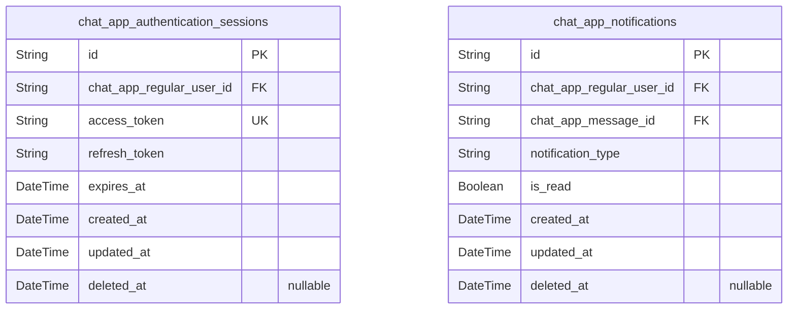
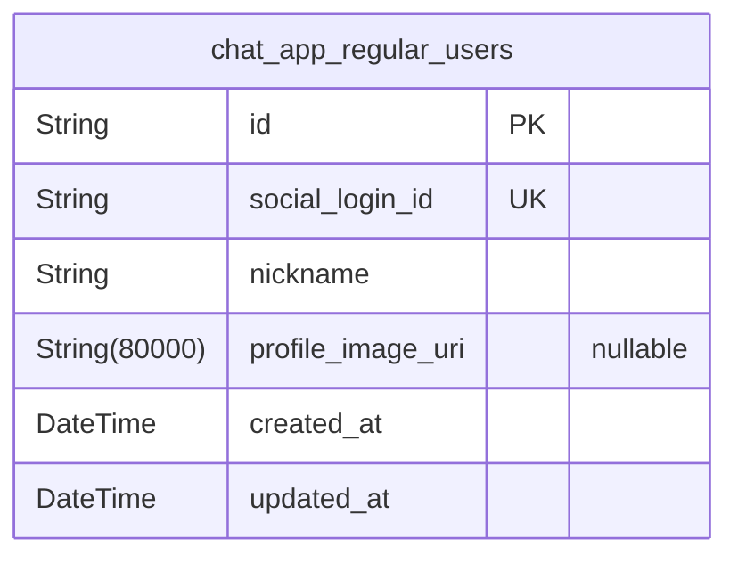
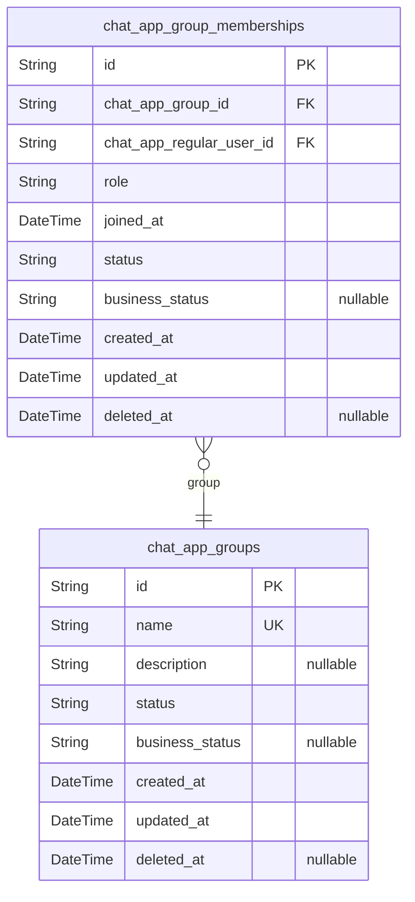
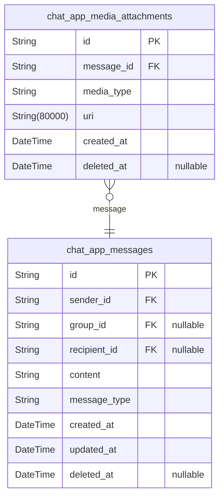

# Prisma Markdown

> Generated by [`prisma-markdown`](https://github.com/samchon/prisma-markdown)

- [Systematic](#systematic)
- [Actors](#actors)
- [Groups](#groups)
- [Messaging](#messaging)

## Systematic

### `chat_app_authentication_sessions`

Authentication sessions data for users logged in via Snapchat social
login, storing access and refresh tokens securely along with expiration
timestamps and session metadata. This table supports secure, token-based
OAuth2 authentication lifecycle management and session revocation.
References the regular user in chat_app_regular_users. Implements soft
delete functionality with deleted_at for session revocation tracking and
audit purposes. Includes indexes to enforce unique active tokens per user
and optimize query performance by user and expiration.

Properties as follows:

- `id`: Primary Key.
- `chat_app_regular_user_id`: Belonged user's [chat_app_regular_users.id](#chat_app_regular_users).
- `access_token`: OAuth2 access token string provided by Snapchat for authentication.
- `refresh_token`: OAuth2 refresh token string to obtain new access tokens.
- `expires_at`: Timestamp when the access token expires.
- `created_at`: Record creation timestamp.
- `updated_at`: Record last update timestamp.
- `deleted_at`: Soft delete timestamp indicating revocation or expiry.

### `chat_app_notifications`

Notification records for all system messages related to chat application
users. Includes notification type, association to target user and
message, read status, and timestamps for creation and updates. Enables
system-wide prompt communication to users regarding new messages or
system events. Supports marking notifications as read and soft deletion
for historical audit and recovery.

Properties as follows:

- `id`: Primary Key.
- `chat_app_regular_user_id`
  > Target user's [chat_app_regular_users.id](#chat_app_regular_users) who will receive the
  > notification.
- `chat_app_message_id`
  > Associated message's [chat_app_messages.id](#chat_app_messages) triggering this
  > notification.
- `notification_type`
  > Type/category of the notification, e.g., 'message_received',
  > 'group_invite'.
- `is_read`: Flag indicating whether the user has read the notification.
- `created_at`: Record creation timestamp.
- `updated_at`: Record last update timestamp.
- `deleted_at`: Soft delete timestamp for notification archival or removal.

## Actors

### `chat_app_regular_users`

Core entity representing regular users who authenticate primarily via
Snapchat social login. Stores key user identity and
authentication-related information. This model maintains user
authentication state and supports the social login mechanism for regular
users. Auditing fields track creation and update timestamps.

Properties as follows:

- `id`: Primary Key.
- `social_login_id`: Unique identifier provided by Snapchat for social login authentication.
- `nickname`: User's display name or nickname.
- `profile_image_uri`: Optional user profile image URL.
- `created_at`: Timestamp when the user record was created.
- `updated_at`: Timestamp when the user record was last updated.

## Groups

### `chat_app_groups`

Community groups in the chatting application. Represents a group entity
that users can create, join, and manage. Contains group metadata
including unique name, description, and status fields. Groups are
independently managed core business entities with lifecycle states and
soft deletion support. Related to group memberships via
chat_app_group_memberships. Enables group admins to organize and control
membership and group settings.

Properties as follows:

- `id`: Primary Key.
- `name`: Unique name of the community group, used for identification and display.
- `description`: Optional detailed description of the community group.
- `status`
  > Current status of the group for workflow management, e.g., 'active',
  > 'inactive', 'archived'.
- `business_status`: Additional business-specific status information, optional.
- `created_at`: Timestamp when the group was created.
- `updated_at`: Timestamp when the group was last updated.
- `deleted_at`: Timestamp for soft deletion of the group; null if not deleted.

### `chat_app_group_memberships`

Memberships represent the association between users and community groups
in the chatting application. Stores membership roles (e.g., member,
admin), join timestamps, and membership lifecycle status including soft
delete. Membership entities ensure proper role-based access control
within groups and facilitate management operations by group admins. Each
membership links a user and a group with unique constraints to prevent
duplicate memberships.

Properties as follows:

- `id`: Primary Key.
- `chat_app_group_id`: Belonged community group's chat_app_groups.id.
- `chat_app_regular_user_id`: Belonged regular user's chat_app_regular_users.id.
- `role`: Role of the member within the group, e.g., 'member', 'admin'.
- `joined_at`: Timestamp when the user joined the group.
- `status`: Current membership status, e.g., 'active', 'banned', 'pending'.
- `business_status`: Additional business-specific membership status, optional.
- `created_at`: Timestamp when membership record was created.
- `updated_at`: Timestamp when membership record was last updated.
- `deleted_at`: Timestamp for soft deletion of the membership; null if not deleted.

## Messaging

### `chat_app_messages`

Chat messages sent by users, representing individual pieces of
communication in one-on-one or group chats. Each message is associated
with either a sender, a target group or target user, with timestamps for
creation and update. Soft deletable for audit and compliance. Integrates
with media attachments and notifications.

Properties as follows:

- `id`: Primary Key.
- `sender_id`: Sender user's chat_app_regular_users.id.
- `group_id`: Target group chat_app_groups.id. Nullable for one-on-one chats.
- `recipient_id`
  > Recipient user for one-on-one chats, chat_app_regular_users.id. Nullable
  > because either group or recipient is required.
- `content`: Text content of the message.
- `message_type`: Type of the message content: 'text', 'image', or 'video'.
- `created_at`: Timestamp when message was created.
- `updated_at`: Timestamp when message was last updated.
- `deleted_at`: Soft delete timestamp. If set, message is considered deleted.

### `chat_app_media_attachments`

Media files attached to chat messages supporting images and videos.
Linked to messages and stored with metadata including file URI, type, and
timestamps. Supports audit with creation timestamps and soft deletion for
compliance.

Properties as follows:

- `id`: Primary Key.
- `message_id`: Associated message chat_app_messages.id.
- `media_type`: Type of media: 'image' or 'video'.
- `uri`: URI of the media file stored in the system.
- `created_at`: Timestamp when the media was uploaded.
- `deleted_at`: Soft delete timestamp. If set, media is considered deleted.
