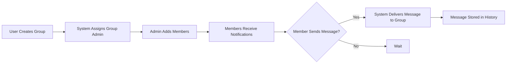
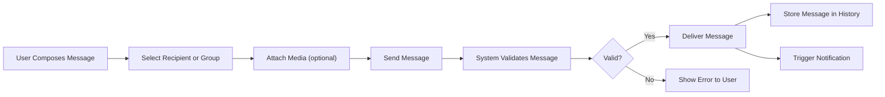

# Chatting Application Functional Requirements Analysis

## 1. Introduction
This document specifies the functional requirements for the chatApp chatting application, focusing on features essential for community group communication among regular users. The document clarifies message types, group chat functionalities, media handling, notification mechanisms, and chat history management.

This document provides business requirements only. All technical implementation decisions belong to developers. Developers have full autonomy over architecture, APIs, and database design. The document describes WHAT the system should do, not HOW to build it.

## 2. Message Types and Formats

### 2.1 One-on-One Messaging
WHEN a regular user sends a message to another regular user, THE system SHALL deliver the message only to the intended recipient.

WHEN a regular user sends a message in one-on-one chat, THE system SHALL support plain text messages.

### 2.2 Group Chat Messaging
WHEN a regular user sends a message to a community group chat, THE system SHALL deliver the message to all members who currently belong to the group.

WHEN a regular user sends a message in group chat, THE system SHALL support plain text messages.

### 2.3 Message Format
THE system SHALL maintain the message format with support for text, images, and videos.

## 3. Group Chat Management

### 3.1 Group Creation
WHEN a regular user creates a community group, THE system SHALL allow the user to specify a unique group name.

WHEN a community group is created, THE system SHALL designate the creator as the initial group admin.

### 3.2 Group Membership
WHEN a group admin adds a member to the group, THE system SHALL include the added user as a member of the group.

WHEN a group admin removes a member from the group, THE system SHALL revoke the user's membership.

WHEN a regular user wants to join a community group, THE system SHALL allow users to request to join existing groups if allowed by group settings.

### 3.3 Group Admin Roles
WHILE a user is a group admin, THE system SHALL allow the user to add or remove members and update group settings.

WHEN a group admin transfers admin rights to another member, THE system SHALL update the group admin accordingly.

### 3.4 Group Naming and Settings
THE system SHALL ensure group names are unique across all groups.

THE system SHALL allow admins to update group names.

## 4. Media Upload and Handling

### 4.1 Supported Media Types
THE system SHALL support sending images and videos in both one-on-one and group chats.

### 4.2 Media Constraints
THE system SHALL limit the size of images and videos to a maximum configurable size (e.g., 10 MB).

THE system SHALL validate the media file types against supported formats (e.g., jpeg, png, mp4).

### 4.3 Media Storage
THE system SHALL securely store uploaded media files and associate them with their respective messages.

### 4.4 Media Delivery
THE system SHALL provide a mechanism for efficient retrieval and streaming of media content to authorized users.

## 5. Notification Mechanisms

### 5.1 New Message Notifications
WHEN a user receives a new message (one-on-one or group), THE system SHALL notify the user promptly via push notifications or in-app alerts.

### 5.2 Notification Settings
THE system SHALL allow users to customize notification preferences for groups and one-on-one chats.

## 6. Chat History and Storage

### 6.1 Message Persistence
THE system SHALL persist all messages sent in one-on-one and group chats for later retrieval.

### 6.2 Message Retrieval
WHEN a user accesses a chat (one-on-one or group), THE system SHALL load the chat history sorted by timestamp in ascending order.

### 6.3 Data Retention
THE system SHALL retain chat history indefinitely unless deleted by users or groups according to retention policies.

## 7. Success Criteria

- THE system SHALL deliver messages in under 2 seconds under normal network conditions.
- THE system SHALL provide notification delivery with minimal delay (<5 seconds).
- THE system SHALL ensure media uploads complete within reasonable time based on size and network.

## 8. Appendices

### Mermaid Diagram: Group Chat Lifecycle Flow

### Mermaid Diagram: Message Sending Flow

