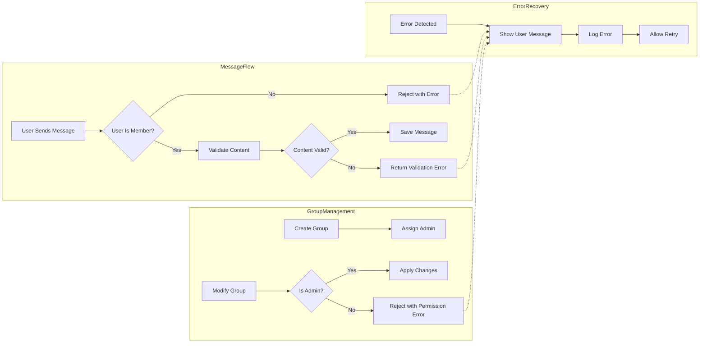

# Business Rules and Error Handling for Chatting Application

## Business Logic and Rules

WHEN a regular user sends a message in one-on-one or group chat, THE system SHALL verify the user is an active member.

WHEN a user sends a text message, THE system SHALL ensure message content is non-empty and below 2000 characters.

WHERE a message includes media, THE system SHALL confirm media format is JPEG, PNG, or MP4 and size is ≤10MB.

WHEN a message is sent, THE system SHALL persist it with timestamp.

WHEN a user deletes a message they sent, THE system SHALL mark it as deleted but retain for auditing.

IF a non-member attempts to message a group, THEN THE system SHALL reject with error.

WHEN a user creates a community group, THE system SHALL assign user as initial admin.

WHEN a group admin adds or removes members, THE system SHALL verify admin status before action.

WHEN a user requests to join a group, THE system SHALL check group existence and joining rules.

WHEN a group admin renames a group, THE system SHALL ensure new name is unique and ≤100 characters.

THE system SHALL keep records of membership, roles, and changes.

## Validation Requirements

WHEN receiving user inputs for messages and group modification, THE system SHALL validate types, lengths, required fields, and characters.

IF validation fails, THEN THE system SHALL send descriptive error messages.

THE system SHALL only accept supported media types and sizes.

## Error Handling

IF unauthorized action attempted without login, THEN reject with 401 Unauthorized.

IF non-admin tries group modification, THEN reject with 403 Forbidden.

IF message content invalid, THEN reject with validation error.

IF media invalid, THEN reject with constraint message.

IF joining non-existent group, THEN respond with not found error.

IF rename conflicts, THEN reject with conflict error.

MEDIA upload failures SHALL cause up to 3 retry attempts before error.

## Recovery Processes

WHEN errors occur, THE system SHALL provide friendly user error messages.

WHEN media upload fails temporarily, THE system SHALL allow retry.

THE system SHALL maintain idempotency in member changes.

Audit logs SHALL record deletions, membership, and admin actions.

## Security

THE system SHALL securely implement OAuth2 Snapchat login.

THE system SHALL encrypt data in transit with TLS 1.2+ and at rest with AES-256.

THE system SHALL comply with relevant data privacy regulations.

Security audits SHALL be performed quarterly.

## Role Permissions

- Regular users can send messages, create groups.
- Group admins can manage members, rename groups, assign admins.
- Non-admins cannot modify group settings.

## Mermaid Diagram

Clear, specific, and actionable business rules, validation, error handling, recovery, and security requirements enable backend developers to implement a robust chatting platform without ambiguity.