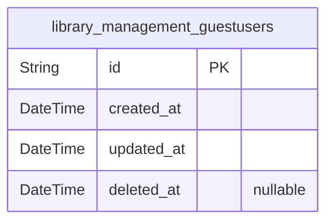
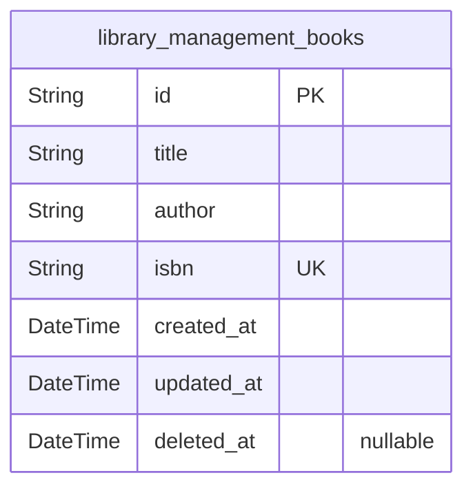

# Prisma Markdown

> Generated by [`prisma-markdown`](https://github.com/samchon/prisma-markdown)

- [Actors](#actors)
- [Core](#core)

## Actors

### `library_management_guestusers`

Guest user role representing unauthenticated users who can add, view, and
search books. This table stores minimal identity information for guest
users. It serves as a primary identity entity without authentication
credentials. This entity is primarily to support access control in the
Actors domain, isolated from main business entities to ensure clean
domain separation.

Properties as follows:

- `id`: Primary Key.
- `created_at`: Timestamp when the guest user record was created.
- `updated_at`: Timestamp when the guest user record was last updated.
- `deleted_at`: Soft delete timestamp allowing recovery of guest user records.

## Core

### `library_management_books`

Books catalog storing title, author, and uniquely validated ISBN
information for the library. Supports guest user addition, viewing, and
partial title search. Includes timestamps for creation and update with
soft delete support. ISBN is unique to prevent duplicates.

Properties as follows:

- `id`: Primary Key.
- `title`: Title of the book, must be a non-empty string.
- `author`: Author of the book, must be a non-empty string.
- `isbn`: Unique ISBN code of the book conforming to ISBN-10 or ISBN-13 format.
- `created_at`: Timestamp when the book record was created.
- `updated_at`: Timestamp when the book record was last updated.
- `deleted_at`: Timestamp when the book record was soft deleted, if applicable.
