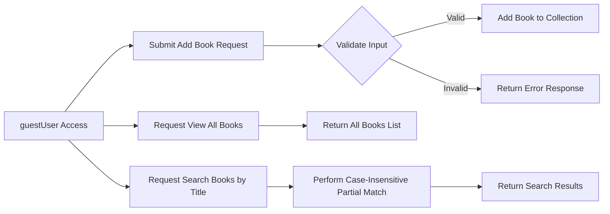

# Functional Requirements for Library Management System

## 1. Introduction

This document defines the complete functional requirements for the libraryManagement system, a simple open library management backend service. This system enables guest users (unauthenticated users) to add books, view all books, and search for books by their title with partial matching support.

The goal is to specify precise business rules, validation, workflows, and performance constraints to guide backend developers in designing and implementing the RESTful API endpoints.

## 2. User Roles and Permissions

### 2.1 guestUser

- Description: An unauthenticated user who can add books, view the collection, and search books by title.
- Permissions:
  - Add new books providing title, author, and ISBN.
  - Retrieve the full list of books.
  - Search books by partial title matches (case-insensitive).
- Restrictions:
  - Cannot update or delete any books.
  - No authentication or login required.

## 3. Book Addition Process

### 3.1 Workflow

WHEN a guestUser submits a book addition request, THE libraryManagement system SHALL validate the input data and, if valid, save the book to the collection.

### 3.2 Input Validation Rules

- The book title SHALL be a non-empty string.
- The author SHALL be a non-empty string.
- The ISBN SHALL be a non-empty string matching the standard ISBN-10 or ISBN-13 format.

### 3.3 Business Rules

- Each book is uniquely identified by its ISBN.
- IF the submitted ISBN already exists in the system, THEN THE libraryManagement system SHALL reject the addition request with a duplication error.

## 4. Book Viewing and Searching

### 4.1 Viewing All Books

WHEN a guestUser requests to view all books, THE libraryManagement system SHALL return a list of all books currently stored.

### 4.2 Searching Books By Title

WHEN a guestUser submits a search query with a title substring, THE system SHALL perform a case-insensitive partial match search on all stored books' titles and respond with the matching list.

## 5. Search Behavior

- The search SHALL be case-insensitive.
- Partial matches SHALL find all books containing the substring anywhere in their title.
- IF no match is found, THE libraryManagement system SHALL return an empty list.

## 6. Error and Exception Handling

### 6.1 Book Addition Errors

IF the add book request is missing any required fields (title, author, ISBN), THEN THE system SHALL respond with a HTTP 400 Bad Request and an error message indicating the missing data.

IF the ISBN format is invalid, THEN THE system SHALL respond with a HTTP 400 Bad Request and an error describing the invalid format.

IF a duplicate ISBN is detected, THEN THE system SHALL respond with a HTTP 409 Conflict error indicating that the book already exists.

### 6.2 Viewing and Search Errors

IF a search query is missing or empty, THEN THE system SHALL treat the request as a view all books request and return the complete collection.

### 6.3 General Errors

IF unexpected system errors occur, THEN THE system SHALL respond with a HTTP 500 Internal Server Error and a generic error message.

## 7. Performance Requirements

- Add book requests SHALL complete and respond within 2 seconds under normal load.
- Fetching all books or search results SHALL return responses within 2 seconds when the collection has up to 10,000 books.
- Search functionalities SHALL behave with near instant response times to maintain usability.

## 8. System Workflow Diagram

## Summary

This document lays out the unambiguous functional requirements for the libraryManagement backend system. It ensures any guest user may add validated books, retrieve all books, and perform partial title searches with clear error responses and guaranteed performance criteria.

All design decisions regarding API, database, and system architecture are left to the development team, as this document focuses solely on business and functional requirements.