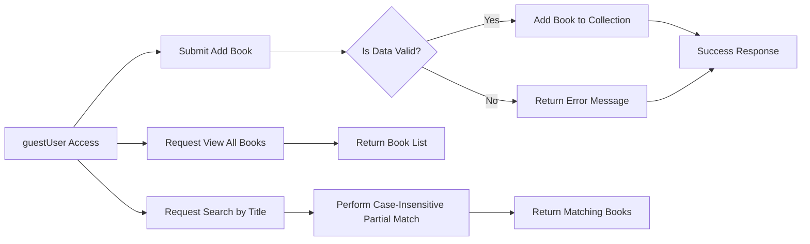

# Functional Requirements for Library Management System

## 1. Introduction

The Library Management System is a backend service designed to enable users to add books with title, author, and ISBN, view all books, and search books by title using partial matching without requiring user accounts or authentication. This document defines the detailed functional business requirements and validation rules to guide backend developers.

## 2. Business Model

### 2.1 Why This Service Exists

Libraries and personal book collectors require a streamlined, no-barrier system for cataloging their collections efficiently and openly. This service addresses the need for an accessible, lightweight library management platform that lowers entry barriers by eliminating account registration to facilitate wider usage and rapid book cataloging.

### 2.2 Target Users

The primary users are guests—unauthenticated individuals who wish to add books, browse the entire collection, or search for books by title. These users value simplicity, speed, and ease of use.

### 2.3 Benefits and Business Goals

- Provide an open, public system accessible to anyone without login.
- Allow rapid addition of books with essential information (title, author, ISBN).
- Enable efficient discovery of books through listing and partial title search.
- Ensure data integrity by validating inputs and preventing duplicates.
- Deliver a responsive experience with defined performance targets.

## 3. User Roles and Permissions

### 3.1 guestUser

The system supports a single role, guestUser, representing all unauthenticated users.

- Permissions:
  - Add new books by providing required fields (title, author, ISBN).
  - View the complete list of books.
  - Search for books by partial title matching.

- Restrictions:
  - Cannot modify or delete books.
  - No authentication or account management.

## 4. Functional Requirements

### 4.1 Add Book

- WHEN a guestUser submits book data containing title, author, and ISBN, THE system SHALL validate the data and add the book to the catalog.
- THE system SHALL require each book to have a non-empty title.
- THE system SHALL require each book to have a non-empty author.
- THE system SHALL require each book to have an ISBN conforming to ISBN-10 or ISBN-13 format.
- IF any data is missing or invalid, THEN THE system SHALL reject the request with a descriptive error.
- IF a book with the same ISBN already exists, THEN THE system SHALL reject the addition as a duplicate.

### 4.2 View All Books

- WHEN a guestUser requests to view books, THE system SHALL return a list of all books.
- THE system SHALL order the list by addition timestamp, with the newest first.
- THE system SHALL include title, author, and ISBN for each book in the list.

### 4.3 Search Books by Title

- WHEN a guestUser submits a search query with a title keyword, THE system SHALL perform a case-insensitive partial match search.
- THE system SHALL return all books where the title contains the search substring.
- IF no matches are found, THEN THE system SHALL return an empty list.

## 5. Business Rules and Validation

- Book titles and authors SHALL be non-empty strings.
- ISBNs SHALL validate to standard ISBN-10 or ISBN-13 format.
- Duplicate ISBNs are NOT permitted; each ISBN identifies a unique book.
- Search matching SHALL be case-insensitive and partial.

## 6. Error Handling

- IF a submitted title is empty or missing, THEN THE system SHALL respond with an error "Title is required."
- IF a submitted author is empty or missing, THEN THE system SHALL respond with an error "Author is required."
- IF a submitted ISBN is invalid or missing, THEN THE system SHALL respond with an error "Valid ISBN is required."
- IF a duplicate ISBN is detected on addition, THEN THE system SHALL respond with an error "Duplicate ISBN."
- IF system errors occur during processing, THEN THE system SHALL respond with a generic error message and HTTP 500 status code.

## 7. Performance Requirements

- THE system SHALL respond to add book requests within 2 seconds under normal load.
- THE system SHALL return search and view results within 1 second with up to 10,000 books.
- Search operations SHALL be optimized for near-instant response.

## 8. System Workflow Diagram

---

This document provides business requirements only. All technical implementation decisions, including architecture design, APIs, and database schema, are at the discretion of the development team. Developers have full autonomy in implementation. This document specifies WHAT the system SHALL do, not HOW it SHALL be built.
