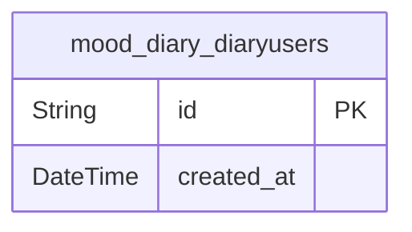
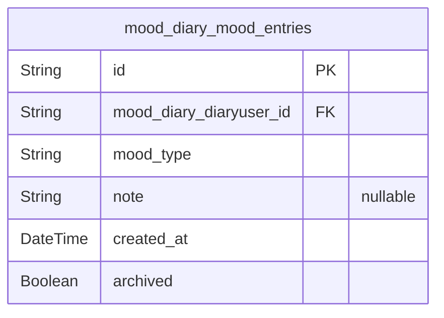

# Prisma Markdown

> Generated by [`prisma-markdown`](https://github.com/samchon/prisma-markdown)

- [Actors](#actors)
- [Diaries](#diaries)

## Actors

### `mood_diary_diaryusers`

Represents the logical owner/actor of the Mood Diary. This model
currently supports a single diary user, matching the app's business logic
of a single-user system. It is the reference point for all mood entries
via foreign keys and ensures the actor boundary is clear. By
encapsulating user context here, future expansion to a multi-user
scenario or advanced metadata storage is simplified. Fields are minimized
as only a logical system user is required.

Properties as follows:

- `id`: Primary Key.
- `created_at`
  > Timestamp indicating when the diary user was (theoretically) created.
  > Used for future extensibility and auditability, even if only a single
  > logical user exists.

## Diaries

### `mood_diary_mood_entries`

This table stores each mood diary entry, representing the core journaling
activity in the Mood Diary application. Each entry records a mood
selected from a fixed set of 8 types, an optional note (up to 500 Unicode
characters), an automatic creation timestamp, and an "archived" status
indicating if the entry is older than 30 days (and therefore excluded
from listings and summaries). Entries are immutable: once created, they
cannot be edited or deleted. Each entry references the logical diary user
in the system ([mood_diary_diaryusers](#mood_diary_diaryusers)), supporting future
extensibility for multi-user scenarios. All mood and archiving business
rules are strictly enforced in application logic.

Properties as follows:

- `id`: Primary Key.
- `mood_diary_diaryuser_id`: References the logical mood diary user. [mood_diary_diaryusers.id](#mood_diary_diaryusers).
- `mood_type`
  > Mood type selected for this entry, must be one of: happy, sad, anxious,
  > excited, angry, calm, stressed, tired. Enforced via application logic.
- `note`
  > Optional freeform note for this entry, max 500 Unicode characters. May be
  > blank or null.
- `created_at`
  > Timestamp when this entry was created (auto-set, UTC, immutable, used for
  > archiving and queries).
- `archived`
  > Indicates if this entry has been archived (i.e., older than 30 days, as
  > determined by background process). Archived entries are hidden from
  > listings/statistics.
