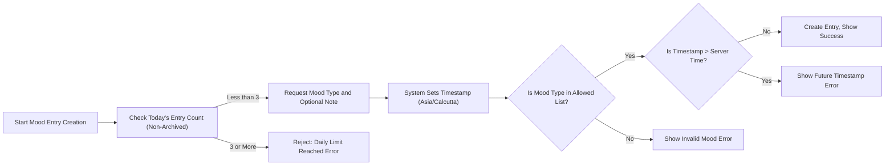
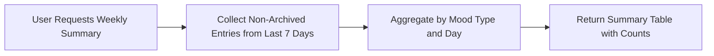

# Functional Requirements for Mood Diary

## Introduction
This document provides the comprehensive business requirements, logic, and detailed behaviors necessary for developing the core backend of the Mood Diary web application. It defines _what_ the system must do, not _how_ it is to be implemented. All technical implementation decisions—such as database design, API details, or programming language—are left to the development team. This document is written in accordance with best practices for backend requirement analysis and is intended for immediate use by backend developers.

## 1. Mood Logging

### Mood Entry Structure
- THE moodDiary entry SHALL consist of the following properties:
  - mood type (from a fixed set),
  - optional note (arbitrary text),
  - automatic timestamp when the entry is created (set by the system, not user-provided).
- THE mood types SHALL be constrained to the following fixed list:
  - happy
  - sad
  - anxious
  - excited
  - angry
  - calm
  - stressed
  - tired
- THE user SHALL NOT be able to choose any mood type outside this list.

### Entry Creation
- WHEN a diaryUser triggers creation of a mood entry, THE system SHALL automatically assign the current server-side timestamp (in the user's timezone) as the entry's timestamp.
- THE system SHALL capture and store the provided optional note; this note MAY be blank.

## 2. Entry Limitation (3 per day)
- WHEN a diaryUser attempts to create a mood entry, THE system SHALL verify how many entries exist for that logical calendar day (using local date in "Asia/Calcutta" timezone).
- IF there are fewer than 3 mood entries for that day, THEN THE system SHALL allow the new entry.
- IF the diaryUser has already logged 3 mood entries for the day, THEN THE system SHALL reject further entry attempts for that day, returning an appropriate error message.
- WHILE counting entries per day, THE system SHALL disregard archived entries (see Archiving Requirements).

## 3. Timestamp Validation (No Future Timestamps)
- THE system SHALL NOT allow manual entry of timestamps by users.
- WHEN a mood entry is created, THE system SHALL set the timestamp to the current system/server time using the "Asia/Calcutta" timezone.
- IF for any reason an entry is submitted with a timestamp in the future (after current server time), THEN THE system SHALL reject such an entry with a clear error message.
- WHILE validating timestamps in all business logic, THE system SHALL use the official server time as authoritative.

## 4. Entry Archiving
- WHEN a mood entry becomes older than 30 days (calculated from the current server time in the user's timezone), THE system SHALL automatically archive it.
- IF a mood entry is archived, THEN THE system SHALL ensure it is no longer available via standard retrieval or listing endpoints.
- Archived entries SHALL BE excluded from all summaries, statistics, and counts in the app.
- Archived entries SHALL be retained solely for possible future export and SHALL NOT be accessible to the user via the current app frontend or API.

## 5. Weekly Summary Generation
- THE system SHALL generate a weekly summary of the user's moods displaying, for each mood type, the number of times it was logged in the past 7 calendar days (excluding today).
- THE weekly summary SHALL exclude archived entries entirely.
- THE summary SHALL only count entries from the current logical week as per the user's timezone (Asia/Calcutta), mapping each entry to the correct day.
- The summary SHALL display counts for all 8 mood types, defaulting to zero where there are no entries.

### Weekly Summary Table Example
| Mood Type | Count This Week |
|-----------|----------------|
| happy     | 3              |
| sad       | 0              |
| anxious   | 1              |
| excited   | 5              |
| angry     | 1              |
| calm      | 2              |
| stressed  | 0              |
| tired     | 4              |

## 6. Business Rules & Validation Logic

### Mood Type Validation
- IF the submitted mood type is not one of the fixed 8 supported types, THEN THE system SHALL reject the entry with an explicit error.

### Entry Note Handling
- THE note SHALL be optional and may be blank.
- THE note SHALL support all Unicode characters and a minimum of 500 characters in length.

### Daily Entry Limit Checking
- WHEN a new entry is created, THE system SHALL count only non-archived entries when enforcing the 3-per-day maximum.

### Archiving Enforcement
- THE system SHALL evaluate entry age nightly (or periodically) to move entries greater than 30 days old to an archived state.
- Archived entries SHALL NOT be visible or accessible via any user-facing API.

### Weekly Summary Validation
- THE system SHALL only use non-archived entries dated within the current week, and SHALL ignore all others (including archived or future-dated entries).

## 7. Error Handling Expectations

### Exceeding Daily Entry Limit
- IF a diaryUser attempts to add more than 3 entries in a single day, THEN THE system SHALL return a specific error indicating the daily limit has been reached.

### Invalid Mood Type
- IF the mood type is not in the fixed list, THEN THE system SHALL return a validation error specifying valid options.

### Future Timestamp Rejection
- IF any entry has a timestamp that is later than the current server time, THEN THE system SHALL reject it and provide an appropriate error message.

### Access to Archived Data
- IF a diaryUser attempts to access an archived entry directly (by ID), THEN THE system SHALL return a not found or access denied error.

## 8. Performance and User Experience Requirements
- THE system SHALL respond to mood entry creation and retrieval requests within 2 seconds under normal load.
- THE weekly summary generation SHALL produce results within 2 seconds for standard query sizes (7 days, <30 entries).
- THE archiving process SHALL run as a background job and not impact user experience.

## 9. Illustrative User Scenarios

### Mermaid Flow Chart: Mood Logging and Limitation

### Mermaid Flow Chart: Weekly Summary Generation

## 10. Success Criteria
- The system SHALL enforce all entry and summary rules without manual intervention.
- All error messages SHALL be explicit and actionable for the user.
- Archived data SHALL be inaccessible through any user or admin interface, except for future data export features.
- All backend processes SHALL operate within designated performance requirements.
- EARS format is used for all critical business requirements.

---

This document defines business requirements only. All technical implementations (architecture, APIs, database design, etc.) are at the discretion of the development team. The document describes WHAT the system should do, not HOW to build it.