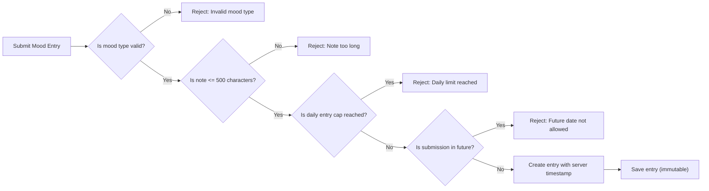

# Requirement Analysis Report for Mood Diary Application Backend

## Introduction
This document outlines the definitive business rules, validation logic, and constraints for the backend of the Mood Diary application. It serves as the authoritative source for all operating logic, ensuring unambiguous implementation and enforcement of application behavior in accordance with business goals and end-user requirements. All rules and requirements are specified using the EARS (Easy Approach to Requirements Syntax) format for clarity and testability.

## Mood Types

The Mood Diary supports a fixed set of mood types. No custom mood types or additional values are allowed.

**Supported Mood Types:**
- happy
- sad
- anxious
- excited
- angry
- calm
- stressed
- tired

EARS Requirement:
- THE moodDiary system SHALL restrict mood type input to the above list only.
- IF a submitted mood type is not in the above list, THEN THE moodDiary system SHALL reject the entry with an error message indicating invalid mood type.

## Entry Note Handling

The diary entry allows for an optional user note. 

EARS Requirements:
- THE moodDiary system SHALL accept entry notes as freeform text fields accompanying each mood entry.
- THE moodDiary system SHALL allow users to submit entries with or without a note.
- WHERE a note is provided, THE moodDiary system SHALL limit note length to 500 characters.
- IF a submitted note exceeds 500 characters, THEN THE moodDiary system SHALL reject the entry with a descriptive error message.
- THE moodDiary system SHALL permit all Unicode characters in the note field, including emojis and symbols.

## Timestamp Handling

Timestamps are required for every mood entry. They must reflect the creation time and cannot be arbitrarily set by users.

EARS Requirements:
- WHEN a user submits a mood entry, THE moodDiary system SHALL generate and assign the current server timestamp to the entry.
- THE moodDiary system SHALL disallow user-supplied timestamps.
- IF an entry is attempted with a client-side or future timestamp, THEN THE moodDiary system SHALL reject the request with an error indicating that only current server timestamps are allowed.
- THE moodDiary system SHALL store timestamps using ISO 8601 UTC format.

## Entry Submission Logic

There are strict limits and requirements for mood entries per calendar day. All logic is enforced per user and per calendar day (midnight to 23:59:59, user’s timezone).

EARS Requirements:
- THE moodDiary system SHALL limit the number of mood entries to 3 per user per calendar day.
- WHEN a user submits an entry and already has 3 entries for that day, THE moodDiary system SHALL reject the request with an error explaining the daily entry limit has been reached.
- WHEN entries are being counted for the daily cap, THE moodDiary system SHALL only consider non-archived entries with server-side timestamps corresponding to the present local day.
- THE moodDiary system SHALL ensure that successful entries always belong to the chronological calendar day associated with their creation timestamp (user’s local timezone).

## Archiving Logic

Mood entries older than 30 days must be archived and excluded from standard user-facing views and summary calculations.

EARS Requirements:
- WHEN an entry becomes more than 30 full days old (calculated using server date and entry timestamp), THE moodDiary system SHALL mark that entry as archived.
- THE moodDiary system SHALL exclude archived entries from all usual data views, lists, and summary/statistics generation functions.
- THE moodDiary system SHALL ensure archived entries are not accessible to users via any current API endpoints except for future explicit data export.
- THE moodDiary system SHALL provide internal mechanisms for future export of archived entries, while keeping them hidden from normal operation.

## Cross-Section Business Rules

- THE moodDiary system SHALL treat all operations as occurring under a single logical user context, with no authentication or differentiation between users.
- THE moodDiary system SHALL prevent editing or deleting mood entries after they are created.
- THE moodDiary system SHALL guarantee all mood entry data (type, note, timestamp) is immutable after creation.

## Error Handling Scenarios

- IF a user attempts to create a mood entry with a non-permitted mood type, THEN THE moodDiary system SHALL return an error clearly stating "Invalid mood type."
- IF a user submits a note longer than 500 characters, THEN THE moodDiary system SHALL return an error stating "Note exceeds maximum allowed length."
- IF a user attempts to add an entry after reaching the daily limit, THEN THE moodDiary system SHALL return an error indicating "Daily mood entry limit reached."
- IF a user attempts to submit a future-dated entry, THEN THE moodDiary system SHALL return an error stating "Entry timestamp cannot be in the future."

## Performance & User Experience Requirements

- THE moodDiary system SHALL respond to all valid entry submissions, summary fetches, and listing requests within 2 seconds under normal load.
- THE moodDiary system SHALL provide descriptive error messages for all failed validations as per above scenarios.

## Mermaid Diagram: Mood Entry Submission Business Logic

# END OF DOCUMENT
