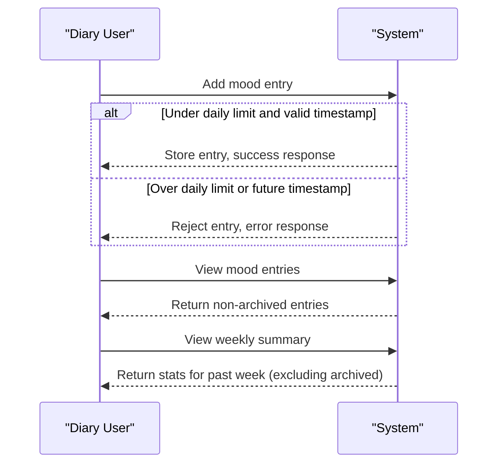

# User Roles and Permissions for Mood Diary

## Role Definition

There is a single user role in the system:

### diaryUser
The "diaryUser" role represents the only user type in the Mood Diary application. All users interacting with the app are treated as a single logical entity with no authentication, registration, or individual accounts. Actions are performed as a global diary owner on their device/browser (for web application scope), with no role separation or administrative privilege.

## Access Rights

The "diaryUser" role is granted the following permissions:

- Add a new mood entry (up to 3 per calendar day)
- View the complete list of their mood entries (excluding archived ones)
- View weekly mood summaries/statistics for the past week (excluding archived entries)

The "diaryUser" has unrestricted access to all functional features that do not violate business rules (e.g. entry limit, archiving rules). There are no permissions for editing or deleting existing data.

## Actions Allowed and Denied

The following table outlines which actions the diaryUser is allowed or denied:

| Action                                   | Allowed | Denied |
|------------------------------------------|:-------:|:------:|
| Add mood entry (if under daily limit)     |   ✅    |        |
| Add mood entry (over daily limit)         |         |   ❌   |
| Add mood entry with future timestamp      |         |   ❌   |
| View mood entries (not archived)          |   ✅    |        |
| View archived mood entries                |         |   ❌   |
| View weekly mood summary                  |   ✅    |        |
| Edit any mood entry                       |         |   ❌   |
| Delete any mood entry                     |         |   ❌   |
| Manage users/roles (admin features)       |         |   ❌   |
| Access underlying database or logs        |         |   ❌   |

## Role Limitations

- Only one logical user exists; all data is stored and retrieved as the system's single diary user.
- No authentication or user switching is supported; every feature is globally accessible.
- The user is never allowed to edit or delete existing mood entries; all entries are immutable after creation.
- The user is limited to three (3) new mood entries per calendar day. Attempts to add more are rejected.
- The user cannot add mood entries with a future timestamp. Such requests are always rejected.
- Entries older than 30 days are automatically archived; they are inaccessible and excluded from all lists and summaries.
- Archived entries are only retained for backend export and are otherwise invisible and inaccessible through the UI or API.

## Formal Requirements (EARS Format)

- THE diaryUser SHALL be able to add a mood entry IF the number of entries for the calendar day is less than 3.
- THE diaryUser SHALL NOT be able to add a mood entry IF the current day's entry limit has been reached.
- IF a mood entry is submitted with a timestamp in the future, THEN THE system SHALL reject it and provide an appropriate error message.
- THE diaryUser SHALL be able to view only their non-archived mood entries (entries from the last 30 days).
- THE diaryUser SHALL be able to view a summary of mood types for the past week.
- THE diaryUser SHALL NOT be able to edit any mood entry after submission.
- THE diaryUser SHALL NOT be able to delete any mood entry after submission.
- THE diaryUser SHALL have no access to features beyond adding/viewing entries and viewing summaries (e.g., no admin, export, or system management features through the main UI/API).

## Permissions Matrix (Summary)

| Feature                       | diaryUser |
|-------------------------------|:---------:|
| Add mood entry                |    ✅     |
| View mood entries             |    ✅     |
| View weekly mood summary      |    ✅     |
| Edit/delete mood entry        |    ❌     |
| View archived mood entries    |    ❌     |
| User management               |    ❌     |

## Sequence Diagram (Mermaid)

## Edge Case Handling

WHEN a diaryUser attempts to:
- Add more than 3 entries in one day, THE system SHALL reject the action and show a clear error message.
- Add an entry with a future timestamp, THE system SHALL reject the action and show a relevant error message.
- View archived entries or request summaries for older dates, THE system SHALL return no results and present no access to such data.
- Edit or delete any mood entry, THE system SHALL deny the request and show an appropriate error response.

## Performance Requirements
- THE diaryUser SHALL receive confirmation or error response within 2 seconds for all add, list, and summary actions, under normal operating circumstances.

---

For detailed functional requirements, please see the [Functional Requirements for Mood Diary](./04-functional-requirements.md).
Business validation logic is described in the [Business Rules and Validation](./06-business-rules-and-validation.md).
Mood entry management details can be found in the [Mood Entry Management Specifications](./07-mood-entry-management.md).
