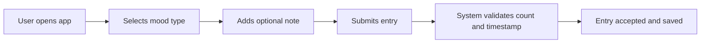
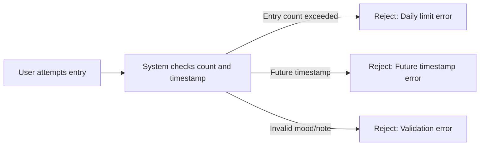
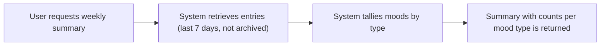
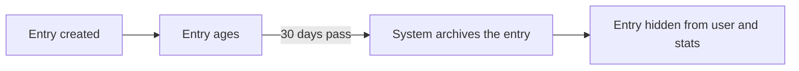

# User Flows and Scenarios for Mood Diary Application

## Introduction
This document describes in detail the user flows and business scenarios for the Mood Diary application. It is designed for backend developers who need an unambiguous, comprehensive understanding of how users interact with the system and how the system must respond according to business rules and requirements. All requirements leverage EARS (Easy Approach to Requirements Syntax) methodology for clarity.

---

## 1. Adding an Entry

### Standard Flow
- User accesses the app and is presented with the option to add a new mood entry.
- User selects a mood from the fixed list: happy, sad, anxious, excited, angry, calm, stressed, tired.
- User optionally writes a personal note (plain text, no length restriction unless otherwise stated by business rules).
- User submits the entry. The system records an automatic timestamp reflecting the exact time of receipt (according to server clock).

#### EARS Requirements
- WHEN a user submits a new mood entry, THE system SHALL record the mood type, note, and current timestamp.
- THE system SHALL allow a maximum of 3 mood entries per calendar day.
- THE system SHALL assign a timestamp to each entry based on server receipt time.

#### Flow Example (Standard Add)

### Post-Submission
- The user is returned either a success response or a detailed error in case the entry is rejected (see next section).
- Accepted entries are immediately visible in the user's current list.

---

## 2. Rejected Entry Cases

### Rejection on Entry Limit
- WHEN a user submits a mood entry and 3 entries for that day already exist, THE system SHALL reject the new entry and return an error indicating the daily limit has been reached.

### Rejection on Future Timestamp
- WHEN a user attempts to submit a mood entry containing a timestamp set in the future (any time after the current server time), THE system SHALL reject the entry and return an error stating that future timestamps are not allowed.

#### Other Rejections
- IF any submission does not specify one of the 8 standard mood types, THEN THE system SHALL reject the entry and return an error describing the required mood standards.
- IF the note field is not valid text (e.g., binary, injection attempt), THEN THE system SHALL reject the entry and inform the user.

#### EARS Summary Table
| Scenario                                 | Action                                                               |
|------------------------------------------|---------------------------------------------------------------------|
| More than 3 entries today                | Reject; return daily limit error                                    |
| Timestamp is in the future               | Reject; return future timestamp error                               |
| Invalid mood type not in standard set    | Reject; return mood type error                                      |
| Note field invalid                       | Reject; return note field error                                     |

#### Flow Example (Rejection)

---

## 3. Weekly Summary View

### Overview
- User accesses the summary section to see mood statistics for the past week.
- The system aggregates all mood entries from the last 7 calendar days, excluding entries that have been archived (older than 30 days).
- The statistics display how many times each of the 8 mood types was recorded during the week.

#### EARS Requirements
- WHEN a user requests the weekly summary, THE system SHALL aggregate all non-archived entries from the past 7 days.
- THE system SHALL count and display the frequency for each mood type individually.
- IF no entries exist for a given week, THEN THE system SHALL display a zero count for each mood type.

#### Flow Example (Weekly Summary Generation)

### Example Output Table
| Mood Type | Logged Count |
|-----------|--------------|
| Happy     | 5            |
| Sad       | 2            |
| Anxious   | 1            |
| Excited   | 4            |
| Angry     | 0            |
| Calm      | 3            |
| Stressed  | 0            |
| Tired     | 2            |

---

## 4. Archived Entries Lifecycle

### Timeline and Transition
- WHEN a mood entry becomes older than 30 days from its creation timestamp, THE system SHALL mark the entry as archived.
- Archived entries SHALL be excluded from all current views, listings, and statistic calculations.
- Entries that are archived SHALL not be visible to the user in any interface and do not contribute to weekly summaries.
- The system SHALL retain archived entries solely for the purposes of potential future data export (not accessible through standard app features).

#### EARS Requirements
- WHEN an entry reaches 30 days of age, THE system SHALL remove it from active listings and summaries.
- THE system SHALL not allow users to access, edit, or delete archived entries.

#### Flow Example (Archiving)

---

## Notes on User Experience and Data Integrity
- Editing or deleting mood entries is not permitted under business rules; all logged entries are immutable once accepted.
- All users are treated as a single logical user; privacy and authentication are not implemented in this version.
- The system is expected to respond to user actions with clear outcomes (success or error) within 2 seconds of submission for an optimal experience.
- All data validation, archiving checks, and error messaging are governed by backend business rules outlined here and in related requirement documents.

---

## Summary
This document provides all necessary user flows and scenario specifications for backend implementation of the Mood Diary application's logging, validation, summary, and archiving features. For technical and business logic details, see also:
- [Functional Requirements Document](./04-functional-requirements.md)
- [Business Rules and Validation](./06-business-rules-and-validation.md)
- [Mood Entry Management](./07-mood-entry-management.md)
- [Mood Summary Generation](./08-mood-summary-generation.md)
- [Archiving and Data Retention](./09-archiving-and-data-retention.md)
