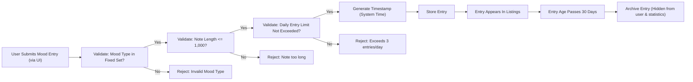

# Mood Diary Application – Mood Entry Management Requirements

## Introduction
This document provides complete business logic and process requirements for the core mood entry management of the Mood Diary web application. It is aimed at backend developers, describing exactly how entries are to be handled, listed, constrained, and archived according to business rules, with all requirements presented in clear, testable EARS format.

### Context
The Mood Diary app provides a simple, single-user experience for daily mood journaling and self-tracking. Each entry records a mood type (from a standard set), an optional note, and a timestamp (automatically generated at creation). Users may add up to 3 entries per day. No editing or deleting is permitted. Entries older than 30 days are archived and hidden. Weekly mood statistics are calculated only from non-archived entries. No authentication or privacy segregation exists: all data is managed under a single logical user.

## Entry Creation
### Entry Structure
- THE "mood entry" SHALL consist of:
    - A mood type selected from a fixed set: happy, sad, anxious, excited, angry, calm, stressed, tired.
    - An optional user note (string, max 1,000 characters recommended for usability).
    - An automatic timestamp in ISO 8601 format, recorded precisely at the time of creation by the backend (user-provided timestamps are disallowed).

| Field      | Type   | Description                                  |
|------------|--------|----------------------------------------------|
| moodType   | enum   | One of the 8 fixed moods                     |
| note       | string | Optional, up to 1,000 characters             |
| timestamp  | string | ISO 8601 datetime, generated by system       |

### Creation Process and Validation
- THE backend SHALL generate the creation timestamp at the precise moment the mood entry is accepted and saved.
- WHEN a mood entry is submitted, THE system SHALL verify all fields meet structural and business rules before saving.
- IF the submission is missing the mood type, THEN THE system SHALL reject the entry with an appropriate error.
- IF the user-provided note exceeds 1,000 characters, THEN THE system SHALL reject the entry with an appropriate error.
- IF an attempt is made to set the timestamp manually, THEN THE system SHALL ignore the value and use system time.
- IF the user attempts to select a mood type not in the fixed set, THEN THE system SHALL reject the entry with an appropriate error.
- IF the entry is being submitted for a date in the future, THEN THE system SHALL reject the entry with an appropriate error message.

## Entry Listing
- THE system SHALL provide a way to list all non-archived mood entries in time order, newest first.
- WHEN displaying or exporting entries, THE system SHALL omit all archived (older than 30 days) entries.
- THE returned list SHALL include: mood type, note, timestamp for each mood entry.
- THE list of entries SHALL be limited to entries made in the past 30 days, ordered from most recent to oldest.

## Entry Limitation Enforcement
- THE system SHALL restrict mood entries to a maximum of 3 per day (local calendar day).
- WHEN a user attempts to submit a fourth entry on the same day, THE system SHALL reject the request, presenting an error that the daily limit has been reached.
- THE counting of entries per day SHALL be based on the date portion (as per Asia/Calcutta timezone) of each entry's system-generated timestamp.
- WHEN counting entries, THE system SHALL consider only non-archived entries.

## Entry Archiving Process
- THE system SHALL automatically archive mood entries older than 30 days (calculated from their timestamp relative to the current date in Asia/Calcutta timezone).
- WHEN an entry becomes archived, THE system SHALL exclude it from listing, weekly summaries, and all user-facing statistics.
- Archived entries SHALL be retained in storage for possible future export but SHALL NOT be accessible or visible via the normal user interface or API for listing or statistics.

## Process Flow Diagrams

### Mood Entry Lifecycle (Creation to Archiving)

## Compliance with Business Rules
- THE system SHALL not allow any editing or deletion of previously created entries.
- WHEN retrieving, summarizing, or exporting mood data, THE system SHALL always operate on non-archived entries only, unless explicit export/archive access logic is required (future extension).
- All business rules defined in [Business Rules and Validation Requirements](./06-business-rules-and-validation.md) and [Archiving and Data Retention](./09-archiving-and-data-retention.md) SHALL be fully enforced.

## Summary Table: Allowed Operations

| Operation         | Requirement |
|-------------------|-------------|
| Add Entry         | Up to 3/day, must use fixed mood type, system timestamp, note optional |
| List Entries      | Only non-archived entries (last 30 days), ordered by newest |
| Archive Old Entry | Older than 30 days; hidden from all user access and stats |
| Edit/Delete       | Not permitted |

## Error and Constraint Scenarios
- IF a mood entry is submitted with a future timestamp, invalid mood type, missing required field, or if the daily entry limit is exceeded, THEN THE system SHALL return a clear error message specifying the failing condition.
- IF a request is made for archived or out-of-date entries, THEN THE system SHALL return an empty list or a relevant error (as per API design), confirming visibility rules.

## Locale, Timezone, and Date Handling
- THE system SHALL enforce business rules based on the Asia/Calcutta timezone.
- All date and time calculations (for entry counts, archiving, etc.) SHALL use the local calendar day definitions per this timezone.

## Performance Requirements
- WHEN creating or listing entries, THE system SHALL respond within 2 seconds for all typical operations (under 1,000 entries in 30-day list).

---
This document provides the exhaustive business logic and requirement analysis for mood entry management in the Mood Diary application. All technical implementation, API, and storage decisions are at the sole discretion of the backend development team.