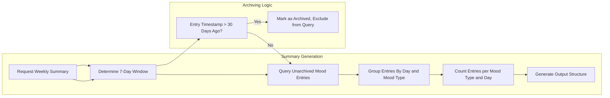

# Mood Diary: Weekly Mood Summary Generation Requirements

## 1. Introduction
This requirements document provides a thorough description of the business rules, logic, and output standards for generating weekly mood summaries and statistics within the Mood Diary service. The scope includes time window selection, mood counting, handling of archived records, and user-facing output requirements. The requirements are written exclusively in business terms and use EARS (Easy Approach to Requirements Syntax) wherever possible.

## 2. Weekly Summary Time Window
- THE summary SHALL represent data for exactly the most recent 7-day period, inclusive of today (based on system/application timezone, or user's local time if timezone support is added). The time zone standard SHALL be consistent across all summary calculations (default: server or application timezone, "Asia/Calcutta").
- WHEN a user requests the weekly summary, THE system SHALL aggregate entries from the 7-day window ending on the current day (00:00:00 to 23:59:59 of each day within that window).
- IF the current day contains no entries, THEN THE system SHALL still include that day as part of the 7-day window with a count of zero entries.
- WHEN no mood entries exist for the current 7-day period, THE system SHALL return a summary with zero counts for every mood type.

## 3. Mood Type Counting Logic
- THE system SHALL count occurrences of each mood type per entry within the weekly window. The recognized mood types are:
    1. happy
    2. sad
    3. anxious
    4. excited
    5. angry
    6. calm
    7. stressed
    8. tired
- WHEN a summary is generated, THE system SHALL calculate the total number of entries for each mood type across the 7-day window.
- WHERE multiple entries occur on a single day, THE system SHALL include all valid entries (up to maximum 3 per day; see business rules in [Business Rules and Validation Documentation](./06-business-rules-and-validation.md)).
- WHEN summarizing moods, THE system SHALL use only the mood type from each entry for counting statistics; notes are not included in summary metrics.

## 4. Exclusion of Archived Entries
- WHEN generating weekly summaries, THE system SHALL exclude all entries with timestamps older than 30 days from the time of summary generation.
- WHEN an entry becomes older than 30 days, THE system SHALL immediately cease including it in any summaries or mood counts.
- IF the 7-day window partially overlaps the 30-day archive threshold, THEN THE system SHALL only consider non-archived entries within the valid window; older entries SHALL not be counted for any day.

## 5. Display and Output Requirements
- WHEN the weekly mood summary is requested, THE system SHALL return for each of the 8 standard mood types:
    - Mood type (enumerated value, see above)
    - Total count for the week
    - Count per day (array or structure with counts indexed by each day within the 7-day window, in chronological order)
- WHERE no entries exist for a given mood type, THE system SHALL report zero for that mood type.
- THE summary SHALL clearly indicate the date range (start and end ISO dates) used for the aggregation.
- THE summary output SHALL NEVER include any data about archived entries.
- IF entries for a particular day are missing, THEN THE daily mood counts for that day SHALL be zero for all mood types.

### Output Structure (Business Rules Only, Not Technical Schema)
- List of 8 mood types (labels: happy, sad, anxious, excited, angry, calm, stressed, tired)
- For each mood type: total count this week, array of 7 daily counts (beginning of week to today)
- Date range shown as ISO start date and end date

## 6. Edge Cases & Error Handling
- IF less than 7 unarchived days exist before today, THEN THE system SHALL use as many days as possible up to 7 (e.g., if database only has data for the most recent 3 days, summary covers those 3 days plus today, remainder of days are counted as zeros).
- IF no valid mood data exists in the specified 7-day window, THEN THE system SHALL produce a summary response showing all mood types with weekly and daily counts of zero.
- IF errors occur during summary generation (e.g., no entries in database, internal processing failure), THEN THE system SHALL return a standardized error message as specified in [Error Handling Documentation](./10-error-handling-and-performance.md).

## 7. Performance Requirements
- WHEN a summary is requested, THE system SHALL return the response within 2 seconds for normal data volumes (assumed: up to 21 entries per week, since the app is limited to 3 per day).
- WHERE summary generation logic involves filtering by date and archival status, THE system SHALL process only unarchived entries to minimize unnecessary computation.

## 8. Example Scenarios
### Example 1: Normal Week
- User enters 2 moods/day for 7 days: summary shows counts aggregated per mood/day.
### Example 2: Overlap with 30-Day Archive
- If entry on day 1 is now >30 days old but all others are recent, only recent entries are included; counts for the archived day's moods are zero.
### Example 3: Sparse Data
- User enters moods only on Mondays and Fridays. Summary shows nonzero counts for those days, zeroes for all other days/moods.
### Example 4: No Data for the Week
- User requests summary but has no entries at all or all are archived: summary is all zeros.

## 9. Mermaid Diagram: Weekly Mood Summary Logic

## 10. EARS-Formatted Requirement Summary Table
| ID | Requirement (EARS) |
|----|--------------------|
| 1 | THE system SHALL generate weekly mood summaries for the most recent 7-day window. |
| 2 | THE system SHALL count each mood type's occurrence using only unarchived entries. |
| 3 | WHEN a summary is generated, THE system SHALL output counts per mood type and per day for the time window. |
| 4 | IF an entry is older than 30 days, THEN THE system SHALL exclude it from all summary results. |
| 5 | IF no entries are present for the week, THEN THE system SHALL show all mood types with zero counts. |
| 6 | THE system SHALL indicate the start and end ISO dates used in the summary. |
| 7 | WHEN a summary is requested, THE system SHALL provide all results within 2 seconds. |
| 8 | WHERE days in the window lack any mood entry, THE system SHALL set all mood counts for that day to zero. |

---

This document provides business requirements only. All technical implementation decisions belong to developers. Developers have full autonomy over architecture, APIs, and database design. The document describes WHAT the system should do, not HOW to build it.