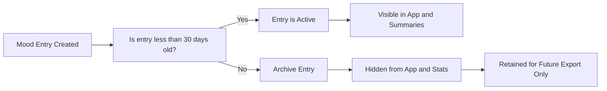

# Archiving and Data Retention Requirements for Mood Diary

## 1. 30-Day Archiving Rule

All mood entries transition through a staged lifecycle based on their creation timestamp. To promote simplicity, privacy, and manageable statistics, the Mood Diary application maintains a strict 30-day retention policy for active entries.

- THE system SHALL automatically archive any mood entry **once its creation timestamp exceeds 30 calendar days past the moment of entry creation** (measured in UTC).
- WHEN an entry is archived, THE system SHALL immediately remove it from all user-facing lists, statistics, and summaries within the app.
- THE entry's archived status SHALL be determined by comparing its timestamp with the current server UTC date; if the difference is 30 days or more, archiving triggers at the next system check or user interaction.

### Implementation Considerations
- Archiving logic should be executed at least daily and whenever user-facing actions might reveal new data.
- Archiving SHALL NOT rely solely on user actions; background or scheduled processes should ensure compliance with the 30-day rule.

## 2. Visibility Rules

### Policy for Archived Entries

- IF a mood entry is archived, THEN THE system SHALL ensure it is completely hidden from all standard application interfaces.
- Archived entries SHALL NOT appear in any mood entry listings, weekly summaries, mood statistics, or graphs.
- There SHALL be no option for the user to view, restore, or interact with archived entries via the standard user interface.

### User Experience and Frontend Behavior
- Archived entries are invisible and inaccessible in the app. The user will not be notified when entries are archived.
- THE system SHALL guarantee the integrity and security of archiving, such that the user cannot circumvent the retention policy or reveal archived data via unintended means.

## 3. Impact on Summaries and Statistics

- THE system SHALL generate all mood summaries and mood-type statistics using **ONLY active entries from the previous 7 days** (unarchived entries).
- WHEN generating weekly summaries, THE system SHALL exclude all entries that are archived (i.e., older than 30 days).
- IF archival logic triggers during summary generation, THEN THE system SHALL update the in-memory or temporary dataset to reflect newly archived entries, ensuring summaries are recalculated as needed.
- THE system SHALL never count archived entries in any calculation, total, or aggregate metric within the user-facing app.

## 4. Export Considerations for Archived Data

- THE system SHALL retain archived entries solely for the purpose of potential future export functionality.
- Archived entries SHALL NOT be exposed, listed, or downloadable through any standard app workflow.
- WHEN an explicit, backend-authorized export feature is developed (future scope), THE system MAY include archived entries in the exported dataset, per business policy and legal requirements.
- Until such a feature exists, archived entries are effectively inaccessible and unreferenced by all user-accessible endpoints.

## 5. Mermaid Diagram: Mood Entry Lifecycle (Archiving)

## 6. Business Rules and Validation (EARS Format)

### Archiving Policy
- THE system SHALL archive each mood entry **after 30 days** from its creation timestamp.
- WHEN an entry enters the archive state, THE system SHALL immediately ensure it is not shown or included in any user interface, summary, or statistic.

### Visibility Rules
- IF a mood entry is archived, THEN THE system SHALL block all attempts to access, view, or process its data through normal app operations.
- WHILE an entry is in the archived state, THE system SHALL not reference it outside backend-export operations.

### Statistics Exclusion
- WHEN computing mood statistics or weekly summaries, THE system SHALL consider only entries that are active (less than 30 days old).
- IF a summary query would select both active and archived entries, THEN THE system SHALL filter out archived entries before aggregating or counting.

### Export Constraint
- WHERE a backend export operation for data is explicitly authorized, THE system SHALL include archived entries in the export dataset per business policy.

## 7. Error Scenarios and Handling

- IF an API or process attempts to access an archived entry for view/list/statistic purposes, THEN THE system SHALL return a not found or forbidden error, as appropriate to the endpoint contract.
- IF an export request is made without explicit authorization, THEN THE system SHALL deny the request and log a security event.

## 8. Performance and Data Integrity Expectations

- THE system SHALL process archiving and entry filtering in a way that ensures instant user queries and statistics (results within 1 second for typical datasets).
- THE archiving process SHALL NOT introduce lag or visible delay to the user during normal app usage.

## Summary Table: Archiving Rules & Impacts

| Rule                          | Applies To           | Result/Effect                                     |
|-------------------------------|---------------------|---------------------------------------------------|
| Auto-archive after 30 days    | All mood entries    | Entry is removed from lists, stats, and summaries |
| Archived entries hidden       | Archived entries    | Never visible on frontend                        |
| Excluded from statistics      | Archived entries    | Not used in weekly summary or mood counts         |
| Retained only for export      | Archived entries    | Not accessible unless future export is enabled    |

---
For other policies and requirements, see the [Functional Requirements Document](./04-functional-requirements.md) and [Business Rules and Validation](./06-business-rules-and-validation.md).
