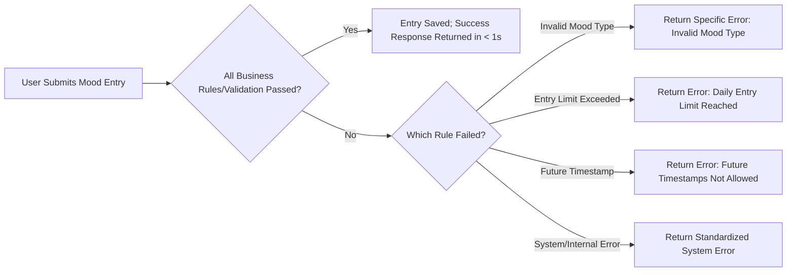

# Error Handling and Performance Requirements for Mood Diary

## Introduction
This document details the business requirements for error handling, user-facing and system response behaviors, and performance expectations for the Mood Diary application backend. The objective is to establish unambiguous rules for how the system must react to invalid input, business rule violations, and internal exceptions, ensuring both data integrity and a user-friendly experience.

## Add Entry Failures

### Invalid Data Submissions
- WHEN a user submits a mood entry with a missing or empty mood type, THEN THE system SHALL reject the entry and respond with an error message indicating that a valid mood type is required.
- WHEN a user submits a mood entry with a mood type not in the fixed list [happy, sad, anxious, excited, angry, calm, stressed, tired], THEN THE system SHALL reject the entry with a specific message stating the allowed mood types.
- WHEN a user provides a note that exceeds the maximum note length allowed by the system (e.g., 500 characters), THEN THE system SHALL reject the entry and return an error explaining the length restriction.
- WHEN a user attempts to submit a note containing prohibited characters or formats, THEN THE system SHALL reject the entry and provide a relevant error message.
- WHEN a user attempts to submit an entry with a malformed or missing timestamp, THEN THE system SHALL reject the entry and return an error message specifying the expected timestamp format.

### System Unavailability or Internal Failure
- IF the backend or database is unavailable, THEN THE system SHALL return a generic error indicating that the service is temporarily inaccessible and advise the user to try again later.
- IF an unexpected internal error occurs during a request, THEN THE system SHALL return a standardized internal error message and log detailed diagnostic information for troubleshooting.

## Exceeding Entry Limit
- WHEN a user attempts to add more than 3 mood entries for a single calendar day, THEN THE system SHALL reject the submission and return an error message specifying that the daily limit has been reached.
- WHEN the daily entry limit is reached, THE system SHALL prevent further submission attempts for that day for all users.

## Future Timestamp Rejection
- WHEN a user submits a mood entry with a timestamp later than the current server time, THEN THE system SHALL reject the entry and return an error stating that future times are not allowed.
- WHEN a user attempts to manipulate client time to submit a future-dated entry, THE system SHALL always validate against server-side current time before accepting.

## Performance and Response Expectations
- THE system SHALL respond to mood entry submissions within 1 second under normal operating conditions.
- THE system SHALL return any error or success message to users within 2 seconds, including clear guidance if the action failed.
- THE system SHALL generate and return weekly mood summary statistics within 2 seconds in 95% of cases, and never longer than 5 seconds in extreme load scenarios.
- THE system SHALL support concurrent processing for up to 100 simultaneous requests without performance degradation for normal operations.
- WHEN a performance or capacity threshold is approached or exceeded, THEN THE system SHALL log this event and issue an appropriate alert for operations monitoring (does not affect user-facing flows but is mandatory for supportability).

## Error and Success Messaging Patterns
- THE system SHALL provide user-facing error messages that are clear, specific, and actionable in natural language (e.g., “You have reached your daily entry limit of 3 moods” or “Only select from the standard mood types”).
- THE system SHALL avoid exposing internal database or infrastructure details in any user-facing message; log technical details for internal support only.
- THE system SHALL respond to successful operations with confirmation messages, including record of what was accepted, relevant timestamps, and mood types.
- THE system SHALL deliver a consistent and predictable structure for all API responses, using a standardized field for message, details, and error codes for client handling.

## Error Scenario Flow Example

## Summary
This document specifies response and error handling business requirements and performance guarantees for all main Mood Diary backend actions. Backend development teams must ensure every listed scenario is covered, messages are clear and user-centric, and system performance meets specified SLAs under expected loads.