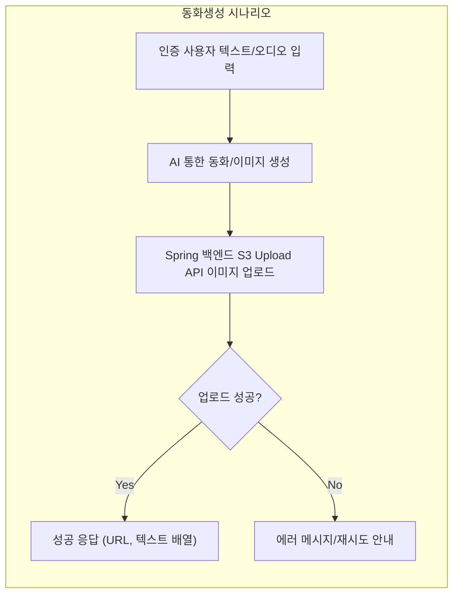

# StoryField AI Server 사용자 시나리오 및 예외 케이스 명세

## 1. 주요 사용자 스토리 (Primary User Stories)

### 1.1 텍스트로 동화 생성 (Fairy Tale Generation from Text)
- WHEN 인증된 사용자가 동화 생성 텍스트와 키워드를 입력하면, THE storyfieldAi 서버 SHALL 동화 15페이지의 삽화와 각 장의 텍스트를 자동으로 생성한다.
- WHEN 동화 생성이 완료되면, THE storyfieldAi 서버 SHALL Spring 백엔드(S3 Upload API)에 15개의 이미지 파일 업로드를 요청한다.
- WHEN Spring 백엔드에서 S3 URL 리스트가 반환되면, THE storyfieldAi 서버 SHALL 이미지 URL과 각 장의 텍스트를 배열로 반환한다.
- WHEN 이미지 업로드에 실패하면, THE storyfieldAi 서버 SHALL 적절한 오류 메시지를 반환한다(EARS - IF 형식).

### 1.2 오디오로 동화 생성 (Fairy Tale Generation from Audio)
- WHEN 인증된 사용자가 음성 파일(동화 플롯 오디오)과 키워드를 업로드하면, THE storyfieldAi 서버 SHALL 해당 음성을 텍스트로 변환(ASR)후 동화 생성 프로세스를 동일하게 진행한다.
- WHEN 오디오 인식 실패시, THE storyfieldAi 서버 SHALL "음성 인식 실패" 오차 메시지로 응답한다.

### 1.3 동화 읽어주기 TTS 요청 (Tale TTS Reading)
- WHEN 인증된 사용자가 TTS 요청을 위해 동화 텍스트를 제출하면, THE storyfieldAi 서버 SHALL 요청 텍스트를 음성파일로 변환 후 S3 URL을 반환한다.
- WHEN TTS 엔진 외부 API 호출 실패시, THE storyfieldAi 서버 SHALL 오류 메시지와 함께 실패 응답을 제공한다.

### 1.4 동화 사투리 TTS 요청 (Dialect Transformation for TTS)
- WHEN 인증된 사용자가 사투리 변환 옵션과 동화 문장을 제출하면, THE storyfieldAi 서버 SHALL 선택된 사투리(예: "경상도","전라도", "표준어")로 음성파일을 생성 후 S3 URL을 반환한다.
- IF 지원되지 않는 사투리 타입이 전달되면, THEN THE storyfieldAi 서버 SHALL 지원 불가 안내 메시지를 반환한다.

### 1.5 개발 테스트/목업 API 사용
- WHEN 개발 단계에서 /test 경로의 텍스트/음성 동화생성 엔드포인트가 호출되면, THE storyfieldAi 서버 SHALL 더미(목업) 이미지 URL 및 텍스트(로컬 파일)로 동일 포맷의 응답을 반환한다.

## 2. 보조 시나리오 및 엣지 케이스 (Secondary Scenarios and Edge Cases)

### 2.1 인증 및 토큰 관련 
- IF 액세스 토큰이 누락/만료/유효하지 않으면, THEN THE storyfieldAi 서버 SHALL Spring Redis를 통해 토큰 유효성 검증을 거치고, 실패 시 오류 코드와 함께 응답한다.
- WHEN 인증된 사용자가 아닌 경우, THE storyfieldAi 서버 SHALL 모든 코어 기능 접근을 차단한다(EARS 형식).
- WHEN 여러 사용자가 동시에 생성 요청을 할 경우, THE storyfieldAi 서버 SHALL 각 요청을 독립적으로, 제한 없이 병렬로 처리한다.

### 2.2 Spring(S3 Upload API) 연동 실패
- IF Spring 서버(혹은 S3전달)와의 통신에 실패하면, THEN THE storyfieldAi 서버 SHALL 적절한 복구 로직(재시도 및 실패 알림)과 안내 메시지를 반환한다.

### 2.3 외부 AI API 제한/오류
- IF 외부 AI API 호출이 quota 초과(요금 등)로 거부되면, THEN THE storyfieldAi 서버 SHALL 실패 안내와 차후 재시도 가이드 메시지를 제공한다.
- WHEN OpenAI 등 외부 API 장애 발생 시, THE storyfieldAi 서버 SHALL 장애 감지 후 내부 에러 메시지로 응답하며, 장애 로깅을 기록한다.

### 2.4 사용자 입력값 유효성/에러
- IF 동화 플롯/키워드가 비어있거나, 허용 길이 초과, 포맷 에러(음성파일/텍스트)일 경우, THEN THE storyfieldAi 서버 SHALL 입력값 오류 메시지와 함께 요청 실패를 응답한다(EARS).
- IF 음성파일 포맷이 mp3, wav, m4a가 아니면, THEN THE storyfieldAi 서버 SHALL 지원되지 않는 포맷임을 안내한다.

### 2.5 이미지/텍스트 매칭 오류
- IF 이미지-텍스트 매칭 개수 불일치 또는 순서 오류 발생시, THEN THE storyfieldAi 서버 SHALL 일관된 에러 메시지 및 재요청 가이드 제공한다.

## 3. 실패 및 복구 케이스 (Failure/Recovery Use Cases)

- WHEN 내/외부 장애, 네트워크 오류, API오류, S3 장애 등으로 정상적인 흐름이 중단될 때, THE storyfieldAi 서버 SHALL 내부 로그를 생성하고, End User에게는 원인-별도의 복구 가능 안내 또는 상세 가이드 메시지를 제공한다.
- WHEN Spring, S3, 외부 API의 장애가 단기성(수초~수십초) 일 때는, THE storyfieldAi 서버 SHALL 내부적으로 최소 1회 이상 재시도한다.
- IF 동일 요청에 대해 일정 횟수 이상 실패가 반복되면, THEN THE storyfieldAi 서버 SHALL 오류 알림 및, 지원불가(일시적 서비스중단 등) 상태를 명확히 안내한다.

## 4. 입/출력에 대한 비즈니스 룰 (Business Rules for Inputs/Outputs)

### 입력 규칙
- THE storyfieldAi 서버 SHALL 사용자 입력 텍스트·오디오는 각 1,024자, 5분 이내(음성)까지 허용한다.
- IF 입력값 누락·이상치 발생 시, THEN THE storyfieldAi 서버 SHALL 오류와 허용 범위를 명확히 고지한다.
- WHEN 인증토큰 미포함 요청이 오면, THE storyfieldAi 서버 SHALL 코드 AUTH_401_012 등 명확한 표준 에러코드를 사용한다.
- WHERE 사투리 변환은 MVP에서 표준어, 경상도, 전라도 만 지원한다.

### 출력 규칙
- THE storyfieldAi 서버 SHALL 1요청당 15개 이미지 URL과 15개 동화 문장(텍스트)의 배열을 반환한다.
- THE storyfieldAi 서버 SHALL 모든 오디오 출력(동화 읽기/사투리 변환)도 Spring S3 URL형태로 반환한다.
- IF 정상적으로 처리하지 못하면, THEN THE storyfieldAi 서버 SHALL 에러코드, 메시지를 체계적으로 제공한다.

## 5. 사용자 경험(UX) 고려사항 (User Experience Considerations)

- THE storyfieldAi 서버 SHALL 모든 에러 및 안내 메시지는 사용자 친화적이고, 구체적인 가이드(재시도, 입력예시 등)를 함께 제공한다. 
- THE storyfieldAi 서버 SHALL 모든 비동기 작업(동화생성, TTS 등)은 응답시간 30초 이내 원칙을 지향한다.
- WHEN 생성중 대기 혹은 지연 상황이 발생하면, THE storyfieldAi 서버 SHALL 사용자가 이해할 수 있는 상태 메시지(진행률, 예상 소요 시간 등)를 반환한다.

## Mermaid 예시 (동화생성 성공/실패 기준)

## 기타 비고
- 본 문서는 [Business Requirements](./02-business-requirements.md), [User Flows](./03-user-flows.md), [Error Handling and Recovery](./07-error-handling-and-recovery.md)와 함께 통합적으로 참조한다.
- 각 시나리오/예외/경계 상황은 실제 서비스 유지보수 및 QA에 도움이 되도록 현실 기반으로 최대한 Exhaustive하게 정의한다.