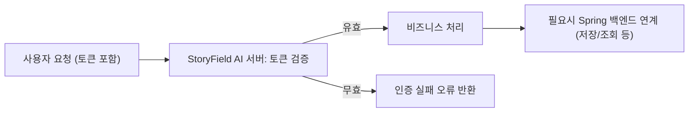
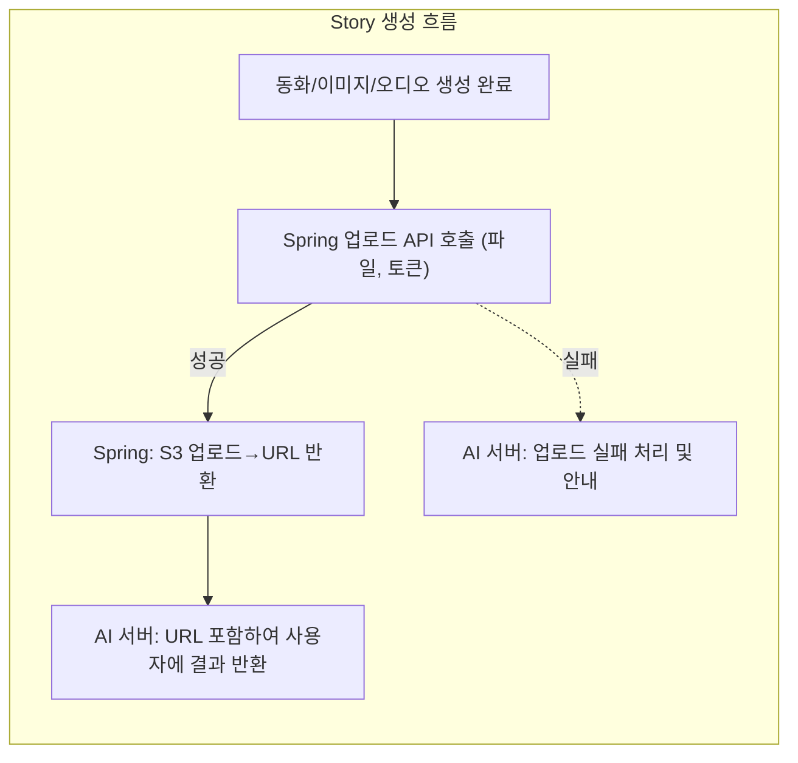
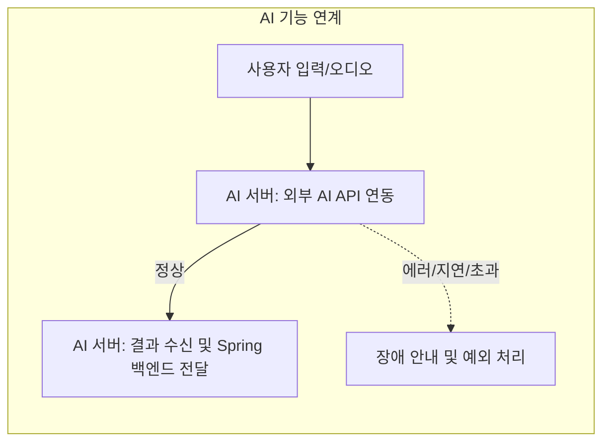
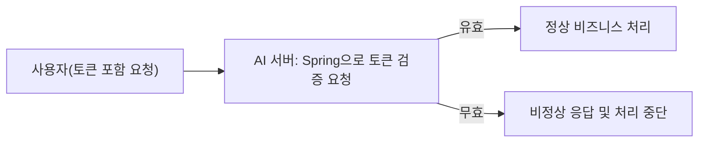
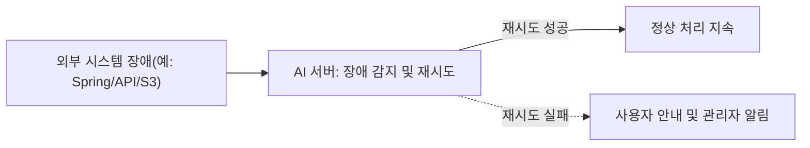

# 통합 요구사항 분석서: StoryField AI 서버

## 1. 소개
본 문서는 StoryField AI 서버가 외부 Spring 백엔드, S3 미디어 저장소(Spring 경유), 외부 AI API와 어떻게 통합되어야 하는지를 명확한 비즈니스 언어로 정의한다. 이 문서는 각 통합 지점의 책임, 데이터 전달 지점, 장애 시 회복 기대치, 보안 및 인증, 신뢰성 요구사항 등을 다룬다.

## 2. Spring 백엔드 연동 개요
- THE StoryField AI 서버 SHALL 모든 사용자 요청에 대해 Spring 백엔드가 발급한 '인증 토큰'의 유효성을 확인(검증)한다.
- WHEN 사용자 요청이 인증 토큰 없이 도착하면, THE StoryField AI 서버 SHALL 즉시 서비스를 거부하며, 인증 필요 오류 메시지를 반환한다.
- WHEN 인증 토큰이 만료되었거나 Redis 등에서 무효 처리된 경우, THE StoryField AI 서버 SHALL 거절 사유를 명확히 안내하고 처리하지 않는다.
- WHEN StoryField AI 서버가 S3 파일, 유저 이력, 권한정보 등 외부 시스템의 리소스에 접근하거나 연동이 필요한 경우, THE 시스템 SHALL 반드시 Spring 백엔드를 매개로 통신한다.
- WHERE 데이터 저장, 조회, 삭제 등 주요 비즈니스 행위가 발생하는 모든 상황에서, THE 시스템 SHALL Spring 백엔드의 사업적 정책 및 인터페이스를 준수해야 한다.
- THE StoryField AI 서버 SHALL 외부 시스템 연동 관련 장애 시, 적절한 장애 메시지 및 사용자 안내를 제공해야 한다.

### Spring 연동 플로우 예시

## 3. S3 업로드 및 파일 처리
- THE StoryField AI 서버 SHALL 사용자 입력(텍스트/오디오) 또는 AI 처리 결과를 이미지/오디오/텍스트 파일로 생성할 경우, 모든 파일 업로드 요청을 직접 S3가 아닌 Spring 백엔드의 별도 업로드 API를 통해 위임해야 한다.
- WHEN 이미지(동화 삽화) 혹은 TTS, 오디오파일 등 저장이 필요할 때, THE 시스템 SHALL 지정된 Spring API 엔드포인트에 파일 업로드 요청(multipart/form-data, 인증 토큰 포함)한다.
- WHEN Spring 백엔드가 S3 URL을 반환하면, THE StoryField AI 서버 SHALL 이 URL을 사용자 응답 데이터에 포함하여 전달한다.
- IF Spring S3 업로드 연동 시도에 실패할 경우, THEN THE 시스템 SHALL 실패 원인과 복구 가이드(재시도, 문의 등)를 포함하여 에러 메시지를 반환해야 한다.
- THE 시스템 SHALL 파일 삭제, 조회 등 추가적 스토리지 조작 역시 Spring 백엔드와 연계된 API를 통해서만 수행해야 한다.

### 파일 업로드 및 반환 프로세스 예시

## 4. 외부 AI API 연동
- THE StoryField AI 서버 SHALL 동화 이미지, 텍스트 생성, ASR(오디오→텍스트), TTS, 사투리 변환 등 핵심 AI 기능을 외부 AI 서비스(OpenAI, Whisper, FastAPI 등)에 위임하여 구현한다.
- WHEN AI API 연동을 위해 비즈니스 데이터(스토리 플롯, 오디오 등)를 전송할 경우, THE 시스템 SHALL 환경별(.env) API Key, 엔드포인트, 인증정보를 안전하게 활용해야 한다.
- WHERE AI 프로바이더가 변경될 수 있는 모든 기능(예: OpenAI→사내 FastAPI), THE 서비스 레이어 SHALL 외부 AI 연동을 완전 추상화해야 한다.
- THE StoryField AI 서버 SHALL 외부 AI API 호출 과정에서 발생 가능한 장애(과금 초과, 응답지연, 할당량 초과 등)에 대해 적절한 사용자 피드백 및 복구 지침을 제공해야 한다.
- WHERE 테스트/개발 등에서 실제 AI 토큰 소비가 부담이 되는 경우, THE 시스템 SHALL 별도의 test/mock API를 분리하여 제공해야 한다.

### 외부 AI 연동 흐름 예시

## 5. 토큰 공유 및 검증
- THE StoryField AI 서버 SHALL Spring 백엔드가 발급하고 Redis 등에서 관리하는 액세스 토큰만을 유효한 인증 수단으로 인정한다.
- WHEN 요청자가 올바른 토큰을 제공하지 않은 경우, THE StoryField AI 서버 SHALL 모든 동화 생성, TTS 등 주요 기능 사용을 거부한다.
- WHEN 토큰 검증에 실패했을 경우, THE 시스템 SHALL 즉시 실패 이유와 함께 처리하지 않아야 한다.
- WHERE 토큰 만료, 블랙리스트 등록 등 관리 정책이 바뀌는 경우, THE StoryField AI 서버 SHALL Spring 백엔드와 정책을 동기화한다.
- THE StoryField AI 서버 SHALL 토큰 유효성 검증 실패가 발생하면 해당 내용도 보안상 안전하게 로그로 남겨야 한다.

### 토큰 검증/공유 프로세스 예시

## 6. 장애 복구 및 회복탄력성 (Resilience)
- WHEN 외부 시스템(S3, Spring, AI API 등) 연계 실패, 장애, 타임아웃 등이 발생할 경우, THE StoryField AI 서버 SHALL 비즈니스 영향도를 최소화하고 사용자 혼란 방지에 집중한다.
- IF 장애가 일시적(retry로 복구 가능)인 경우, THEN THE 시스템 SHALL 적절한 재시도(Retry) 정책 및 후속 알림을 적용해야 한다.
- WHERE 장애가 치명적(처리 불가)인 경우, THE 시스템 SHALL 사용자에게 장애 원인, 재시도 방법, 문의 경로 등을 안내하는 메시지를 반환해야 한다.
- THE StoryField AI 서버 SHALL Spring 백엔드와 장애 연동 시, 장애 영향도 및 이벤트를 모두 로깅해야 한다.
- WHERE 장애 발생이 반복/계속될 경우, THE 시스템 SHALL 관리자를 위한 알림(이메일 등) 및 로그 기반 모니터링을 갖춰야 한다.

### 장애 및 회복 플로우 예시

## 7. 부록: 통합 시나리오별 주요 동작 요건 (EARS)

| 통합 항목                   | 상황/조건(Trigger/State)       | 필요 비즈니스 행위 및 기대치 (EARS)                                        |
|---------------------------|------------------------------|--------------------------------------------------------------------------|
| 인증 토큰 검증               | WHEN 요청 발생                   | THE 시스템 SHALL Spring에 검증을 위임하고, 실패 시 즉시 중단/응답 처리      |
| 파일 업로드                  | WHEN 파일 생성/저장 발생           | THE 시스템 SHALL Spring에 위임하고, 실패 시 장애 메시지 안내               |
| 외부 AI API 연동              | WHEN 동화생성/TTS/ASR 등 필요       | THE 서비스 레이어 SHALL 추상화(Provider Swappable), 오류 시 에러 처리 돌출  |
| 장애 및 예외처리              | IF 통합 연계 실패, 지연, 한계 발생   | THEN THE 시스템 SHALL 복구지침, 안내, 로그, 관리자 모니터링 수행             |
| 정책 변경/토큰 무효화           | WHERE Spring 정책 및 토큰 정책 변경   | THE 시스템 SHALL 정책 변경사항 즉시 반영, 동기화                           |

---

> *Developer Note: 본 문서는 "비즈니스 요건"만을 정의합니다. 시스템의 모든 기술적 구현(아키텍처, API, 데이터베이스 설계 등)은 개발팀의 전적인 재량입니다.*