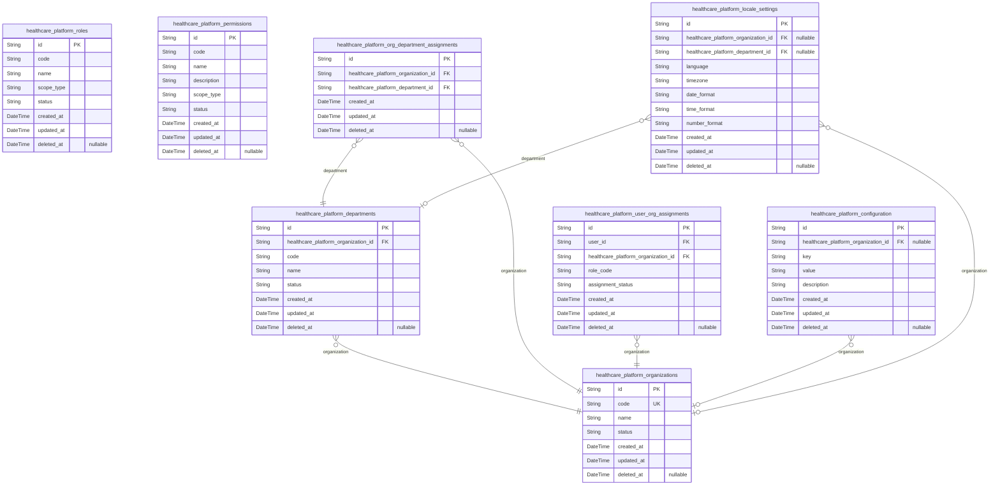
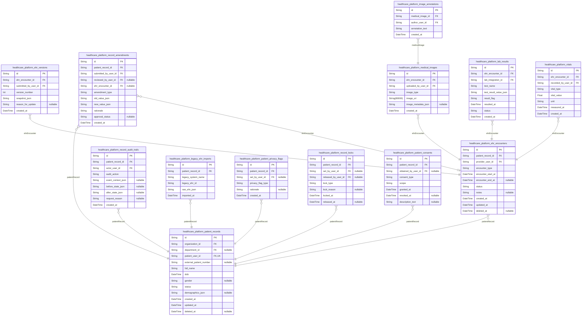
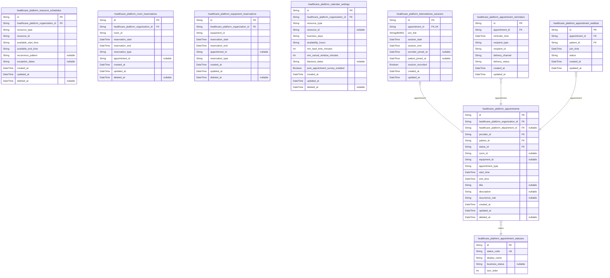
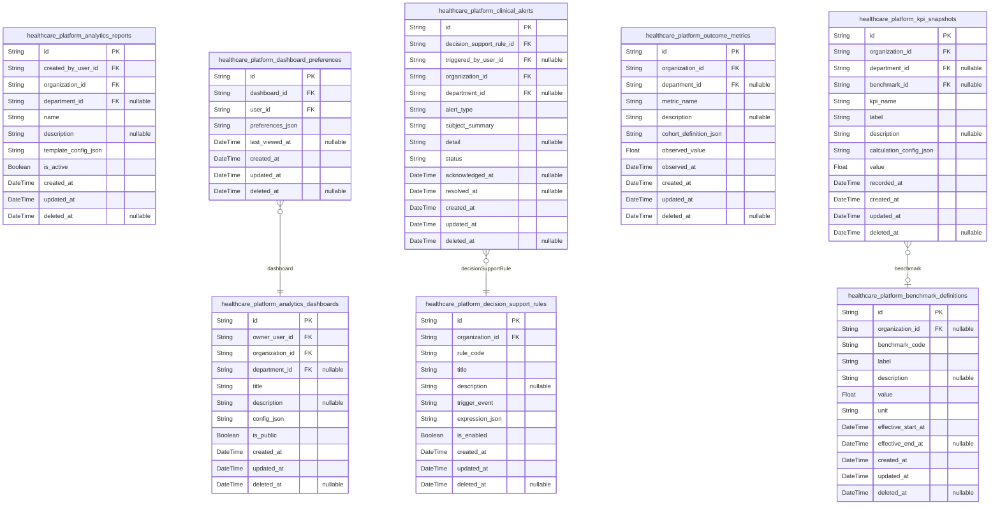
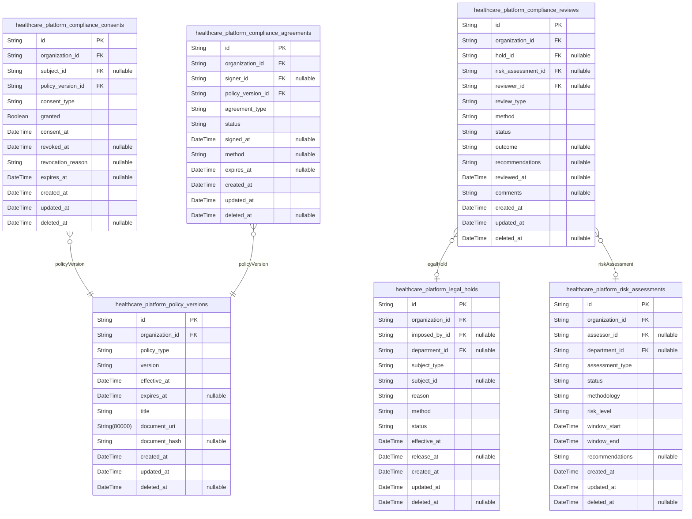
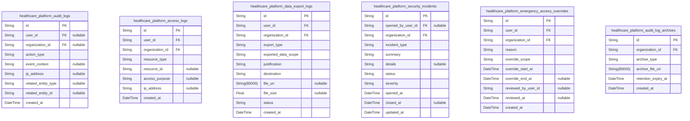
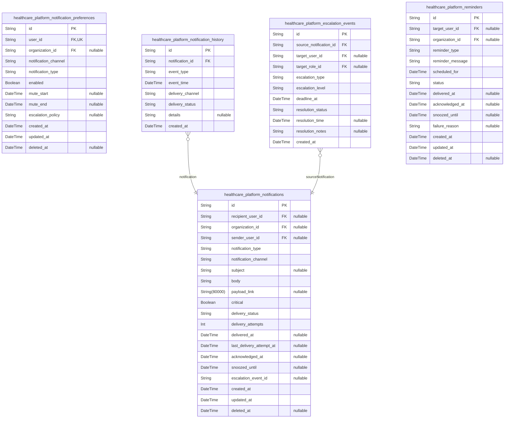

# Prisma Markdown

> Generated by [`prisma-markdown`](https://github.com/samchon/prisma-markdown)

- [Systematic](#systematic)
- [Actors](#actors)
- [PatientRecords](#patientrecords)
- [Scheduling](#scheduling)
- [BillingInsurance](#billinginsurance)
- [AnalyticsDecisionSupport](#analyticsdecisionsupport)
- [Integration](#integration)
- [ComplianceConsents](#complianceconsents)
- [AuditLogs](#auditlogs)
- [Notifications](#notifications)

## Systematic

### `healthcare_platform_organizations`

Represents a top-level tenant or organization (hospital, clinic,
practice) within the healthcarePlatform system. Defines the overall data
isolation boundary for all entity assignments, resources, and business
operations. Serves as the ultimate parent in the multi-tenant data model.
Relationships: has many departments, staff assignments, configurations,
locale settings. Critical for RBAC, compliance, and resource
partitioning.

Properties as follows:

- `id`: Primary Key.
- `code`
  > Unique business code for the organization (assigned for technical or
  > cross-system mapping).
- `name`: Official organization name for display and legal documentation.
- `status`
  > Current status of the organization (active, suspended, pending, archived,
  > etc.).
- `created_at`: Creation timestamp for the organization.
- `updated_at`: Last update timestamp for the organization.
- `deleted_at`: Soft delete timestamp for archival/compliance retention (null if active).

### `healthcare_platform_departments`

A department or business unit within an organization (e.g., Cardiology,
Radiology, Billing). Departments are mapped to an organization and
provide an isolated context for department head assignments, scheduling,
and resource allocation. Enables finer-grained access control and
workflow partitioning within each organization.

Properties as follows:

- `id`: Primary Key.
- `healthcare_platform_organization_id`: Parent organization's [healthcare_platform_organizations.id](#healthcare_platform_organizations).
- `code`
  > Short code for the department (unique within organization for business
  > logic).
- `name`: Display/legal name for the department.
- `status`
  > Current status of the department (active, suspended, pending, archived,
  > etc.).
- `created_at`: Department creation timestamp.
- `updated_at`: Last modification timestamp.
- `deleted_at`: Soft-delete timestamp (null = active).

### `healthcare_platform_roles`

Represents platform-wide and organization-level roles (e.g., admin,
doctor, nurse, technician, patient, receptionist). Defines RBAC and
permission boundaries. Roles can be platform global, organization-scoped,
or department-scoped depending on configuration. Used in conjunction with
permissions and user assignments.

Properties as follows:

- `id`: Primary Key.
- `code`
  > Role code used for assignment, internal mappings, and cross-system
  > integration (e.g., 'system_admin', 'organization_admin',
  > 'medical_doctor').
- `name`: Role display name.
- `scope_type`: Level at which this role applies: platform, organization, department.
- `status`: Current status of the role (active, retired, system-only, archived, etc.).
- `created_at`: Role creation timestamp.
- `updated_at`: Last role update timestamp.
- `deleted_at`: Soft-delete timestamp for role archival (null=active).

### `healthcare_platform_permissions`

Permission entity defining a specific actionable operation or scope
(e.g., 'manage_users', 'view_ehr', 'edit_billing'). Used in RBAC to
define which actions are available for which roles. Permissions can be
assigned to roles at platform, org, or department level. Enables granular
authorization policies.

Properties as follows:

- `id`: Primary Key.
- `code`: Unique code for this permission (e.g., 'edit_patient_record').
- `name`: Human-readable name for this permission.
- `description`: Explanation of the permission's intent and usage scenario.
- `scope_type`
  > Level at which this permission is applicable: platform, organization,
  > department.
- `status`: Current status of the permission (active, retired, system, etc.).
- `created_at`: Creation timestamp.
- `updated_at`: Last update timestamp.
- `deleted_at`: Soft delete timestamp if permission is retired.

### `healthcare_platform_org_department_assignments`

Maps organizations to departments for organizational hierarchy management
and delegation workflows. Each row links a department to its parent
organization with timestamp and audit trail for team structures. Enables
complex org/department relationship enforcement and permission
propagation.

Properties as follows:

- `id`: Primary Key.
- `healthcare_platform_organization_id`: Assigned organization's [healthcare_platform_organizations.id](#healthcare_platform_organizations).
- `healthcare_platform_department_id`: Assigned department's [healthcare_platform_departments.id](#healthcare_platform_departments).
- `created_at`: Assignment creation timestamp.
- `updated_at`: Assignment update timestamp (last structural change).
- `deleted_at`: Soft delete timestamp for assignment. Null if currently active.

### `healthcare_platform_user_org_assignments`

Mapping table assigning users to organizations for platform access, RBAC,
and scoped business operations. Critical for multi-tenant data and
permission enforcement. Each record ties a user to a single org (others
are referenced from user tables in other components). Assignment
timestamp and status are tracked for audit and access review.

Properties as follows:

- `id`: Primary Key.
- `user_id`
  > Reference to user in global user tables (e.g.,
  > healthcare_platform_systemadmins, organizationadmins, etc. in other
  > components).
- `healthcare_platform_organization_id`
  > Organization this user is assigned to. {@link
  > healthcare_platform_organizations.id}.
- `role_code`
  > Role code for assigned user within this organization instance (syncs with
  > roles in roles table).
- `assignment_status`: Current assignment status (active, pending, suspended, deleted).
- `created_at`: Assignment creation timestamp.
- `updated_at`: Assignment update timestamp.
- `deleted_at`: Soft delete timestamp, null if assignment is active.

### `healthcare_platform_configuration`

Represents system-wide and per-organization configuration settings.
Stores configuration keys and values for customizable, versioned, and
auditable settings. Can be global (if organization_id is null) or linked
to a specific organization for tenant-scoped config. Only
business/operational configuration data (never clinical or PHI).

Properties as follows:

- `id`: Primary Key.
- `healthcare_platform_organization_id`
  > Organization this config applies to (nullable for global configs). {@link
  > healthcare_platform_organizations.id}.
- `key`: Configuration key (e.g., 'language', 'timezone', 'feature_flag_name').
- `value`: Configuration value as string (can be serialized for structured values).
- `description`: Description of what this config controls and its impact.
- `created_at`: Config record creation timestamp.
- `updated_at`: Last configuration update timestamp.
- `deleted_at`: Soft delete timestamp, null if active.

### `healthcare_platform_locale_settings`

Stores locale and regionalization settings for the platform or specific
organizations/departments (time zone, language, formatting). Used for
translation and location-aware experiences. Unique per
organization/department context, providing override hierarchy. Only
technical/business localization.

Properties as follows:

- `id`: Primary Key.
- `healthcare_platform_organization_id`
  > Organization for which the locale settings apply. Nullable for
  > platform-global settings. [healthcare_platform_organizations.id](#healthcare_platform_organizations).
- `healthcare_platform_department_id`
  > (Optional) Department for which these settings are specifically applied.
  > Nullable if org-level or platform global. {@link
  > healthcare_platform_departments.id}.
- `language`: Language code (e.g., en-US, es-ES) for localization.
- `timezone`
  > IANA timezone string for scheduling/notifications (e.g.,
  > 'America/New_York').
- `date_format`: Default date display format (e.g., YYYY-MM-DD, MM/DD/YYYY).
- `time_format`: Default time display format (e.g., 24h, 12h).
- `number_format`
  > Number formatting convention for region/country (e.g., 1,234.56 vs
  > 1.234,56).
- `created_at`: Settings record creation timestamp.
- `updated_at`: Settings last update timestamp.
- `deleted_at`: Soft delete timestamp, null if settings are active.

## Actors

```mermaid
erDiagram
"healthcare_platform_systemadmins" {
  String id PK
  String email UK
  String full_name
  String phone "nullable"
  DateTime created_at
  DateTime updated_at
  DateTime deleted_at "nullable"
}
"healthcare_platform_organizationadmins" {
  String id PK
  String email UK
  String full_name
  String phone "nullable"
  DateTime created_at
  DateTime updated_at
  DateTime deleted_at "nullable"
}
"healthcare_platform_departmentheads" {
  String id PK
  String email UK
  String full_name
  String phone "nullable"
  DateTime created_at
  DateTime updated_at
  DateTime deleted_at "nullable"
}
"healthcare_platform_medicaldoctors" {
  String id PK
  String email UK
  String full_name
  String npi_number UK
  String specialty "nullable"
  String phone "nullable"
  DateTime created_at
  DateTime updated_at
  DateTime deleted_at "nullable"
}
"healthcare_platform_nurses" {
  String id PK
  String email UK
  String full_name
  String license_number UK
  String specialty "nullable"
  String phone "nullable"
  DateTime created_at
  DateTime updated_at
  DateTime deleted_at "nullable"
}
"healthcare_platform_technicians" {
  String id PK
  String email UK
  String full_name
  String license_number UK
  String specialty "nullable"
  String phone "nullable"
  DateTime created_at
  DateTime updated_at
  DateTime deleted_at "nullable"
}
"healthcare_platform_receptionists" {
  String id PK
  String email UK
  String full_name
  String phone "nullable"
  DateTime created_at
  DateTime updated_at
  DateTime deleted_at "nullable"
}
"healthcare_platform_patients" {
  String id PK
  String email UK
  String full_name
  DateTime date_of_birth
  String phone "nullable"
  DateTime created_at
  DateTime updated_at
  DateTime deleted_at "nullable"
}
"healthcare_platform_user_authentications" {
  String id PK
  String user_id
  String user_type
  String provider
  String provider_key
  String password_hash "nullable"
  DateTime last_authenticated_at "nullable"
  DateTime created_at
  DateTime updated_at
  DateTime deleted_at "nullable"
}
"healthcare_platform_auth_sessions" {
  String id PK
  String user_id
  String user_type
  String session_token UK
  String refresh_token "nullable"
  DateTime issued_at
  DateTime expires_at
  DateTime revoked_at "nullable"
  String user_agent "nullable"
  String ip_address "nullable"
}
"healthcare_platform_user_mfa_factors" {
  String id PK
  String user_id
  String user_type
  String factor_type
  String factor_value
  Int priority
  Boolean is_active
  DateTime created_at
  DateTime updated_at
}
"healthcare_platform_user_credentials" {
  String id PK
  String user_id
  String user_type
  String credential_type
  String credential_hash
  DateTime archived_at
  DateTime created_at
}
"healthcare_platform_user_license_verifications" {
  String id PK
  String user_id
  String user_type
  String license_number
  String license_type
  String verification_status
  DateTime last_verified_at
  String suspend_reason "nullable"
  DateTime created_at
  DateTime updated_at
}
```

### `healthcare_platform_systemadmins`

System-wide superuser administrators responsible for platform management,
cross-organization configuration, integrations, operational monitoring,
and global audit. These users have highest privileges and are subject to
highest audit standards. Assignment is strictly controlled; linked to
organizations and audit/event logs via separate assignment and audit
tables.

Properties as follows:

- `id`: Primary Key.
- `email`
  > Email address for login and notifications. Must be unique; business-only,
  > no personal domains allowed.
- `full_name`: Full legal name of the system admin.
- `phone`: Business phone number for contact and MFA challenges.
- `created_at`: Timestamp when admin account was created.
- `updated_at`: Last update timestamp for this account.
- `deleted_at`: Soft delete marker; indicates if the admin record is deactivated/retired.

### `healthcare_platform_organizationadmins`

Organization-level administrators responsible for managing users,
policies, configuration, billing, reporting, and compliance for an
individual healthcare tenant. Role-limited to specific organizations and
referenced from org assignment table. Subject to audit and strict
workflow constraints.

Properties as follows:

- `id`: Primary Key.
- `email`
  > Business email for organization admin login. Must be unique within
  > platform.
- `full_name`: Full legal name of organization admin.
- `phone`: Contact number for notifications and security events.
- `created_at`: Timestamp when admin account was created.
- `updated_at`: Timestamp when admin account was last updated.
- `deleted_at`: Soft deletion marker indicating org admin is deactivated.

### `healthcare_platform_departmentheads`

Clinical or operational department heads within organizations,
responsible for staff/resource management, analytics, scheduling, and
internal approvals. Each department head is linked to an organization and
may be referenced in department assignment tables. Direct permissions
scoped to department context.

Properties as follows:

- `id`: Primary Key.
- `email`
  > Business email used for login and escalations. Must be unique across all
  > department heads.
- `full_name`: Full legal name of department head.
- `phone`: Business phone for alerts and access confirmation.
- `created_at`: Timestamp for account creation date.
- `updated_at`: Last update timestamp for this record.
- `deleted_at`: Soft delete marker indicating deactivation or transfer.

### `healthcare_platform_medicaldoctors`

Licensed medical professionals responsible for patient care, diagnosis,
order entry, prescriptions, and care coordination within an organization.
Each doctor may be referenced from assignments and credential
verification tables. Extensive audit obligations.

Properties as follows:

- `id`: Primary Key.
- `email`: Unique business email for system login and clinical communication.
- `full_name`: Full legal name as registered for licensure and clinical privilege.
- `npi_number`
  > National Provider Identifier (NPI) for credential verification; must be
  > unique for each doctor.
- `specialty`: Clinical specialty (e.g., Cardiology, Pediatrics).
- `phone`: Contact number for notifications and emergency alerts.
- `created_at`: Timestamp of account creation.
- `updated_at`: Timestamp of last update to doctor record.
- `deleted_at`: Soft deletion; null unless this doctor account is archived/inactive.

### `healthcare_platform_nurses`

Clinical nursing staff responsible for patient care, monitoring,
medication administration, and supporting clinical workflows. Nurses have
distinct scope and privilege and undergo credential verification. Each
nurse is referenced by assignments and audit logs. Audit trails required
for all patient-related activity.

Properties as follows:

- `id`: Primary Key.
- `email`
  > Business email for login and staff communication. Must be unique among
  > nurses.
- `full_name`
  > Full legal name of nurse, as used for credentials and patient-facing
  > activity.
- `license_number`
  > State-issued license/certification for clinical practice. Must be unique
  > for auditing.
- `specialty`: Primary clinical area of nursing (optional, e.g., ICU, Med/Surg).
- `phone`: Work/personal phone for shift notifications and alerts.
- `created_at`: Timestamp when nurse account was created.
- `updated_at`: Timestamp for last modification to nurse record.
- `deleted_at`: Soft deletion/archival status field.

### `healthcare_platform_technicians`

Technical clinical staff involved in diagnostics, imaging, equipment
management, and lab processing. Techs have separate credential validation
and have access limited to technical orders. Referenced from assignment
and audit logs.

Properties as follows:

- `id`: Primary Key.
- `email`
  > Business email for login and shift notification. Unique among all
  > technicians.
- `full_name`: Full legal name for credentialing purposes.
- `license_number`
  > Technical/professional license for role (state or registry). Must be
  > unique.
- `specialty`: Field of technical expertise (Radiology, Phlebotomy, etc).
- `phone`: Contact number for scheduling, emergencies.
- `created_at`: When technician account was created.
- `updated_at`: Date/time when technician data last updated.
- `deleted_at`: Soft deletion / archive marker.

### `healthcare_platform_receptionists`

Reception/admin users who schedule appointments, manage check-in/out,
update patient basic info. No clinical privileges. May be referenced from
assignment and workflow/lifecycle tables.

Properties as follows:

- `id`: Primary Key.
- `email`: Receptionist login and business email. Unique for this table.
- `full_name`: Full name of the receptionist for identification and messaging.
- `phone`: Business or organizational contact number.
- `created_at`: Creation timestamp of receptionist record.
- `updated_at`: Timestamp for last update to this account.
- `deleted_at`: Soft deletion field; receptionist account is deactivated.

### `healthcare_platform_patients`

Patient/consumer users of the system. Patients can self-register or be
registered by staff, manage personal health info and records,
appointments, and billing. All personal health information (PHI) managed
under regulatory obligations. No direct references to department,
assignment, or staff tables here; handled via relationships. Consent,
privacy flag, and record assignments handled via separate tables.

Properties as follows:

- `id`: Primary Key.
- `email`
  > Personal or organizational email for login and portal notifications. Must
  > be unique for all patients.
- `full_name`: Legal full name as used in identity or insurance documents.
- `date_of_birth`
  > Date of birth for patient identity, required for matching and legal
  > compliance.
- `phone`: Contact number for reminders and portal communications.
- `created_at`: Account creation timestamp.
- `updated_at`: Last update time for patient profile.
- `deleted_at`: Soft deletion/closure marking, if account is closed or deregistered.

### `healthcare_platform_user_authentications`

Authentication records supporting login via email/password, SSO, or
federated provider for any user entity (reference by actor type). Stores
hashed credentials, provider keys, SSO tokens, and authentication method.
Used for login, session validation, and audit. Strictly subsidiary,
managed by system APIs.

Properties as follows:

- `id`: Primary Key.
- `user_id`
  > UUID of the user this authentication record belongs to (cross-table
  > reference by user/actor type).
- `user_type`
  > Indicates which actor table this refers to (systemadmin, orgadmin, etc).
  > Used for business logic and query purposes.
- `provider`: The authentication provider (local, saml, oauth2, ad).
- `provider_key`: Provider-specific user or session key (may be SSO subject, user_id, etc).
- `password_hash`: Bcrypt hash for local credentials (optional for SSO providers).
- `last_authenticated_at`: When this user last successfully authenticated via this record/provider.
- `created_at`: Timestamp when auth record was created.
- `updated_at`: Last modification to this authentication record.
- `deleted_at`: Soft delete field for rotation/retire.

### `healthcare_platform_auth_sessions`

Authentication session records, tracking issued tokens (JWT, refresh),
session state, expiry, revocation, and business context for all user
types (referenced by user_id/user_type). Used for permissions,
revocation, audit. Sessions can be forcibly terminated by business or
security rules. Strict subsidiary stance.

Properties as follows:

- `id`: Primary Key.
- `user_id`: Reference to the user associated with this session. Cross-table reference.
- `user_type`: Table/type discriminator for the user (systemadmin/orgadmin/etc).
- `session_token`: Opaque session token or JWT; unique value for session management.
- `refresh_token`: Refresh token for session extension; null for some SSO providers.
- `issued_at`: Timestamp for session start/issue.
- `expires_at`: Session planned expiration. Subject to renewal or rotation policies.
- `revoked_at`: When the session was forcibly terminated/expired; null if still active.
- `user_agent`: User agent/browser/device info for session security/audit.
- `ip_address`: IP address for session source logging.

### `healthcare_platform_user_mfa_factors`

Multi-factor authentication factor records for users, including TOTP,
SMS, email challenge, or security keys. Used for MFA enforcement and
account recovery. Each factor is scoped per user and user type, and only
one of each factor type is active at a time per user. Strictly
subsidiary; managed by system APIs.

Properties as follows:

- `id`: Primary Key.
- `user_id`: The user to whom this MFA factor belongs. Cross-table reference.
- `user_type`: Table/type discriminator for user (systemadmin, etc).
- `factor_type`
  > Type of MFA factor (totp, sms, email, webauthn, backup). Supports type
  > inference in application.
- `factor_value`
  > Encoded value or key for the MFA factor (encrypted, as appropriate for
  > type).
- `priority`: Sort priority/order for use during challenge (lower is primary factor).
- `is_active`: Indicates whether this factor is enabled for challenge.
- `created_at`: Create time for this MFA factor record.
- `updated_at`: Last modification to MFA configuration.

### `healthcare_platform_user_credentials`

Credential archive and metadata for user authentication events and
password state history (e.g., previous password hashes, SSO credential
history, rotation). Used for audit, rollback, and security. Archived
credentials are never active after rotation. Strictly subsidiary stance.

Properties as follows:

- `id`: Primary Key.
- `user_id`: The associated user record for these credentials. Cross-table reference.
- `user_type`: User table/type discriminator for credentials (systemadmin, etc).
- `credential_type`: Type of credential archived (password, sso, certificate, webauthn, etc).
- `credential_hash`: Hash or encoded credential value (historical, not active).
- `archived_at`: Time when credential became inactive or was rotated.
- `created_at`: Timestamp when credential was first active.

### `healthcare_platform_user_license_verifications`

Professional license/NPI/status check records for users who require
licensure (doctors, nurses, technicians). Reflects compliance with NPI
registry or state agency and tracks last check, status, failures, and
audit compliance. May be referenced from automated or manual review
processes. Strictly subsidiary table.

Properties as follows:

- `id`: Primary Key.
- `user_id`
  > The actor undergoing credential/license check (doctor/nurse/tech).
  > Cross-table reference.
- `user_type`: Discriminator for user/actor type (medicaldoctor/nurse/technician).
- `license_number`: License or registration number being checked. Invariant per user.
- `license_type`: Type of license/credential (medical, nurse, tech, etc).
- `verification_status`: Result of current/most recent check (valid/expired/suspended/pending).
- `last_verified_at`: Last time verification was attempted/recorded.
- `suspend_reason`: Reason for suspension or problem, if applicable.
- `created_at`: Record creation timestamp for initial check event.
- `updated_at`: Last update timestamp (may include failure, renewal, or audit event).

## PatientRecords

### `healthcare_platform_patient_records`

Central patient record entity representing the unique profile and
clinical record anchor for a patient within the healthcare organization.
This holds core patient metadata, life-cycle status, demographic data,
and foreign references to the organization, department, and patient user.
All EHR encounters, amendments, audit trails, and privacy controls hang
off this entity. It is the root for longitudinal clinical history and
compliance workflows. Searchable independently, supports soft-delete and
privacy enforcement.

Properties as follows:

- `id`: Primary Key.
- `organization_id`: Belonged organization's [healthcare_platform_organizations.id](#healthcare_platform_organizations).
- `department_id`: Belonged department's [healthcare_platform_departments.id](#healthcare_platform_departments).
- `patient_user_id`: Belonged patient's user record [healthcare_platform_patients.id](#healthcare_platform_patients).
- `external_patient_number`
  > External or legacy medical record number for reconciliation with upstream
  > EMRs.
- `full_name`: Patient's legal full name for search and display. Used for GIN search.
- `dob`: Date of birth of the patient.
- `gender`
  > Patient's gender identity (self-identified, can be blank or
  > 'undisclosed').
- `status`: Business status (active, inactive, deceased, transferred, etc).
- `demographics_json`
  > JSON blob for extensible structured demographic fields (race, ethnicity,
  > language, etc).
- `created_at`: Record creation datetime.
- `updated_at`: Record update datetime.
- `deleted_at`: Soft delete timestamp (null if active).

### `healthcare_platform_ehr_encounters`

Clinical care encounter events for a given patient record. This table
captures each discrete clinical or administrative event: admission,
consult, outpatient visit, telehealth, etc. Each encounter is linked to a
patient record and supporting metadata fields, and independently audited
for compliance. Allows direct search and filter. Entry point for attached
clinical data, lab results, medical images, etc.

Properties as follows:

- `id`: Primary Key.
- `patient_record_id`: Associated patient record [healthcare_platform_patient_records.id](#healthcare_platform_patient_records).
- `provider_user_id`
  > Primary provider's user id for this encounter {@link
  > healthcare_platform_medicaldoctors.id}.
- `encounter_type`
  > Type of the encounter (e.g., office_visit, inpatient_admission,
  > telemedicine, emergency, etc).
- `encounter_start_at`: Datetime when encounter started.
- `encounter_end_at`: Datetime when encounter ended (or null if ongoing).
- `status`: Status of the encounter (planned, active, completed, cancelled, etc).
- `notes`: Free text encounter summary for clinical documentation.
- `created_at`: Record creation timestamp.
- `updated_at`: Update timestamp.
- `deleted_at`: Soft delete timestamp (null if active).

### `healthcare_platform_ehr_versions`

Snapshot table holding all historical versions of a patient's EHR record
at encounter level. Each EHR version captures a point-in-time clinical
state for audit, compliance, and rollback. Append-only, created at each
save or amendment. Includes composite foreign keys to parent encounter
and submitter, and contains the full EHR JSON payload as submitted for
clinical operations, audit, and regulatory review.

Properties as follows:

- `id`: Primary Key.
- `ehr_encounter_id`: Parent encounter's [healthcare_platform_ehr_encounters.id](#healthcare_platform_ehr_encounters).
- `submitted_by_user_id`
  > User who submitted/created this version {@link
  > healthcare_platform_medicaldoctors.id}.
- `version_number`: Sequence number for versioning within encounter.
- `snapshot_json`: JSON payload of structured EHR content at this version (immutable).
- `reason_for_update`
  > Reason or event triggering version update (e.g., correction, routine,
  > regulatory, patient request).
- `created_at`: Version creation timestamp.

### `healthcare_platform_record_amendments`

Append-only table capturing patient record amendments, corrections, or
updates that require full audit and regulatory compliance. All proposed
and approved changes are logged here, with actor, rationale, approval
status, and direct linkage to record and/or encounter. Supports workflows
for regulatory amendment, patient-initiated requests, clinical
corrections, etc.

Properties as follows:

- `id`: Primary Key.
- `patient_record_id`
  > Patient record being amended {@link
  > healthcare_platform_patient_records.id}.
- `submitted_by_user_id`
  > User who submitted the amendment [healthcare_platform_nurses.id](#healthcare_platform_nurses) or
  > similar role.
- `reviewed_by_user_id`: Reviewer/approver's user id, if required by workflow.
- `ehr_encounter_id`
  > Targeted EHR encounter (if amendment is to a specific event) {@link
  > healthcare_platform_ehr_encounters.id}.
- `amendment_type`: Type of amendment (correction, patient_request, regulatory, etc).
- `old_value_json`: Prior value (serialized JSON form, to support review/storage).
- `new_value_json`: New value (after amendment).
- `rationale`: Reason/justification submitted with amendment.
- `approval_status`: Approval status (pending, approved, rejected, null if not applicable).
- `created_at`: Amendment created timestamp.

### `healthcare_platform_record_audit_trails`

Immutable audit log table recording every user or system action on
patient records and EHRs. Provides a tamper-evident record for regulatory
compliance, security, and medical-legal evidence. Captures the actor,
timestamp, action, before/after state, request details, and event
context. Used for investigation and compliance reporting.

Properties as follows:

- `id`: Primary Key.
- `patient_record_id`
  > Patient record for which event is audited {@link
  > healthcare_platform_patient_records.id}.
- `actor_user_id`: Actor user id (may be care team or admin user) for this action.
- `audit_action`
  > Action performed (create, update, delete, access, lock, unlock,
  > emergency_access_override, etc).
- `event_context_json`
  > JSON context for additional event details (e.g., client device info,
  > session, location).
- `before_state_json`: Serialized form of entity prior to this event.
- `after_state_json`: Serialized after-event state, if updated.
- `request_reason`: User/system provided justification or trigger, if supplied.
- `created_at`: Audit event timestamp.

### `healthcare_platform_legacy_ehr_imports`

Support table for legacy EHR/EPR (electronic medical record) data
imported from upstream/legacy EMR solutions. Serves as a cold archive;
not managed directly through APIs, but needed for historical
clinical/legal access. Links to patient record, stores original
identifiers, import timestamp, and raw EHR JSON. Used for compliance,
investigation, and data mapping but not for active workflows. Subsidiary
only.

Properties as follows:

- `id`: Primary Key.
- `patient_record_id`: Owning patient record's [healthcare_platform_patient_records.id](#healthcare_platform_patient_records).
- `legacy_system_name`: Source system/provider for legacy data (e.g., "Epic", "Cerner").
- `legacy_ehr_id`: Original id from source EHR (for mapping/reference).
- `raw_ehr_json`: Original EHR JSON (read-only, archival).
- `imported_at`: Import timestamp.

### `healthcare_platform_medical_images`

Stores metadata and references to medical images (e.g., DICOM series)
associated with an EHR encounter/event. Each record points to storage
URI, basic image metadata, linked patient and EHR encounter ids, with
upload/creation provenance for clinical and audit workflows. Critical for
radiology, imaging management, and regulatory retention.

Properties as follows:

- `id`: Primary Key.
- `ehr_encounter_id`: Owning EHR encounter's [healthcare_platform_ehr_encounters.id](#healthcare_platform_ehr_encounters).
- `uploaded_by_user_id`: User (typically technician) who uploaded image record.
- `image_type`: Type of medical image (DICOM, JPEG, PNG, etc).
- `image_uri`: Storage URI of image file in secure system.
- `image_metadata_json`: Serialized metadata (e.g., series, study_uid, acquisition_params).
- `created_at`: Image upload timestamp.

### `healthcare_platform_image_annotations`

Subsidiary table for user or AI-generated annotations on medical images.
Each annotation references a specific image, annotation text or
measurement, and the user who authored it. Serves radiology, AI
diagnostics, and audit traceability needs. Not standalone business
entity; governed via parent image audit.

Properties as follows:

- `id`: Primary Key.
- `medical_image_id`: Associated image record [healthcare_platform_medical_images.id](#healthcare_platform_medical_images).
- `author_user_id`: Who created/attached this annotation.
- `annotation_text`
  > Annotation free-text or label (radiology description, measurement, or AI
  > note).
- `created_at`: Annotation creation datetime.

### `healthcare_platform_lab_results`

Primary table for storing clinical laboratory results belonging to a
given EHR encounter (e.g., blood test, result panels, PCRs). Each result
is linked to an encounter and reporting lab integration. Full JSON
payload captured, plus reporting status and clinical alert indicators.
Key business entity for longitudinal data analysis and compliance
reporting.

Properties as follows:

- `id`: Primary Key.
- `ehr_encounter_id`: Belonged encounter's [healthcare_platform_ehr_encounters.id](#healthcare_platform_ehr_encounters).
- `lab_integration_id`
  > Reporting lab integration ({@link
  > healthcare_platform_lab_integrations.id}).
- `test_name`: Name of test/panel performed.
- `test_result_value_json`: Serialized (JSON) value of result or panel (machine and units).
- `result_flag`: Clinical flag (normal, abnormal, critical, corrected, etc.).
- `resulted_at`: Datetime when result was officially resulted on system.
- `status`: Status (pending, completed, revised, cancelled).
- `created_at`: Lab result record creation timestamp.

### `healthcare_platform_vitals`

Primary table for discrete patient vitals recorded during EHR encounters,
e.g., temperature, pulse, respiratory rate, blood pressure, etc. Allows
for high-frequency tracked data and enables analytic/alert capabilities.
Each entry references encounter and submitting user. Designed for fast
independent search, longitudinal analytics, and trend workflows.

Properties as follows:

- `id`: Primary Key.
- `ehr_encounter_id`: Owning encounter's [healthcare_platform_ehr_encounters.id](#healthcare_platform_ehr_encounters).
- `recorded_by_user_id`: User who recorded this vital sign measurement.
- `vital_type`: Vital sign type (heart_rate, temp_c, bp_systolic, bp_diastolic, etc).
- `vital_value`: Value for the vital sign.
- `unit`: Units for the vital sign (e.g., bpm, C, mmHg).
- `measured_at`: Datetime when measured.
- `created_at`: Measurement created timestamp.

### `healthcare_platform_patient_privacy_flags`

Subsidiary table for patient-level privacy and restriction enforcement.
Flags include do_not_contact, do_not_share, sensitive, etc. Not
independently managed; supporting data for access control and review
processes. Linked to patient record and optionally to reason or user who
enabled the flag.

Properties as follows:

- `id`: Primary Key.
- `patient_record_id`: Belongs to patient record [healthcare_platform_patient_records.id](#healthcare_platform_patient_records).
- `set_by_user_id`: User who set/approved the flag (admin, privacy officer, etc).
- `privacy_flag_type`: Type of flag (do_not_share, sensitive, etc).
- `rationale`: Reason for flag setting.
- `created_at`: Flag set timestamp.

### `healthcare_platform_record_locks`

Subsidiary table for record-level holds, locks, or restrictions (legal,
regulatory, audit investigation, etc). Linked to patient record and
referencing the user/authority imposing and releasing the lock. Each
entry is append-only; supports regulatory disaster recovery and legal
workflows. Not a direct API business entity.

Properties as follows:

- `id`: Primary Key.
- `patient_record_id`: The record under hold/lock [healthcare_platform_patient_records.id](#healthcare_platform_patient_records).
- `set_by_user_id`: User or authority imposing the lock.
- `released_by_user_id`: User or authority releasing/removing the lock.
- `lock_type`: Type of lock/hold (legal, audit, pended, regulatory).
- `lock_reason`: Explanation/purpose for lock placement.
- `locked_at`: Lock timestamp.
- `released_at`: Release timestamp (null if active).

### `healthcare_platform_patient_consents`

Patient consent/entity logging table for all issued, updated, or revoked
consent statements. Each consent record links to patient record,
describing type of consent (treatment, HIPAA, research, sharing, etc),
key dates (granted, revoked), scope, and reference to user obtaining or
witnessing consent. Provides full regulatory audit of patient privacy and
data rights across the record lifecycle. May be restored or queried
independently for legal or workflow need.

Properties as follows:

- `id`: Primary Key.
- `patient_record_id`: Parent patient record [healthcare_platform_patient_records.id](#healthcare_platform_patient_records).
- `obtained_by_user_id`: User obtaining/witnessing consent (admin, staff, etc).
- `consent_type`: Type of consent (treatment, HIPAA, research, data_sharing, etc).
- `scope`
  > Scope/coverage of this consent (clinical, legal, research, data_sharing,
  > etc).
- `granted_at`: Datetime when consent was granted.
- `revoked_at`: Datetime consent was revoked, if rescinded.
- `description_text`: Explanation or patient-supplied rationale.

## Scheduling

### `healthcare_platform_appointments`

Stores all individual appointment events scheduled between providers and
patients. Connects org, department, provider, patient, room, equipment,
and appointment status.

Properties as follows:

- `id`: Primary Key.
- `healthcare_platform_organization_id`: Belonged organization's [healthcare_platform_organizations.id](#healthcare_platform_organizations).
- `healthcare_platform_department_id`
  > Belonged department's [healthcare_platform_departments.id](#healthcare_platform_departments)
  > (nullable for org-level bookings).
- `provider_id`
  > Scheduled provider's user assignment {@link
  > healthcare_platform_user_org_assignments.id}.
- `patient_id`: Scheduled patient's [healthcare_platform_patients.id](#healthcare_platform_patients).
- `status_id`: Appointment's status [healthcare_platform_appointment_statuses.id](#healthcare_platform_appointment_statuses).
- `room_id`
  > Linked room reservation (uuid; not a strict FK in schema—references a
  > room from resource registry or external table).
- `equipment_id`
  > Linked equipment reservation (uuid; not a strict FK—external to this
  > schema file for cross-domain use).
- `appointment_type`: Type of appointment (e.g., in-person, telemedicine).
- `start_time`: Start time (ISO 8601).
- `end_time`: End time (ISO 8601).
- `title`: Appointment title.
- `description`: Notes and instructions.
- `recurrence_rule`: Recurrence rule if repeating (RRULE).
- `created_at`: Creation timestamp.
- `updated_at`: Last update timestamp.
- `deleted_at`: Soft delete timestamp (null if active).

### `healthcare_platform_appointment_statuses`

Defines possible appointment states (scheduled, cancelled, confirmed,
no-show, etc).

Properties as follows:

- `id`: Primary Key.
- `status_code`: Unique status code (e.g., scheduled, cancelled).
- `display_name`: Human label.
- `business_status`: Workflow grouping (e.g., active/closed).
- `sort_order`: For UI/business sorting.

### `healthcare_platform_resource_schedules`

Master resource availability for scheduling (provider, room, equipment)
using resource_type (as string) and resource_id (uuid, not strictly a FK
to a model in this file; instead a polymorphic external pointer).

Properties as follows:

- `id`: Primary Key.
- `healthcare_platform_organization_id`: Organization [healthcare_platform_organizations.id](#healthcare_platform_organizations).
- `resource_type`: Type/category of resource (provider, room, equipment).
- `resource_id`
  > Polymorphic resource uuid – not foriegnKey in this schema. Points out to
  > external resource (room, provider, equipment, etc.) table.
- `available_start_time`: Start of daily slot (e.g., 09:00, 24h/ISO time).
- `available_end_time`: End of daily slot (e.g., 18:00, 24h/ISO time).
- `recurrence_pattern`: Recurrence pattern (iCal, JSON or custom).
- `exception_dates`: Blackout (holiday, maintenance) dates as string or JSON.
- `created_at`: Creation timestamp.
- `updated_at`: Update timestamp.
- `deleted_at`: Soft delete timestamp.

### `healthcare_platform_room_reservations`

Room reservations for physical rooms. Each reservation is tied to an org
and a room_id uuid, which points to a resource registry or external model
(not represented as a FK here).

Properties as follows:

- `id`: Primary Key.
- `healthcare_platform_organization_id`: Organization [healthcare_platform_organizations.id](#healthcare_platform_organizations).
- `room_id`: Room id (uuid only; not a FK in this component – links to room registry).
- `reservation_start`: Reservation start time.
- `reservation_end`: Reservation end time.
- `reservation_type`: Reason: appointment, admin, cleaning, maintenance, etc.
- `appointment_id`: Optionally link to appointment (nullable for admin blocks).
- `created_at`: Creation timestamp.
- `updated_at`: Update timestamp.
- `deleted_at`: Soft delete timestamp.

### `healthcare_platform_equipment_reservations`

Equipment bookings or maintenance blocks. Each reservation references an
org and equipment_id uuid (external device/resource); not a FK in this
schema.

Properties as follows:

- `id`: Primary Key.
- `healthcare_platform_organization_id`: Organization [healthcare_platform_organizations.id](#healthcare_platform_organizations).
- `equipment_id`: Equipment resource id (uuid only; not a FK in this schema).
- `reservation_start`: Reservation start timestamp.
- `reservation_end`: Reservation end timestamp.
- `appointment_id`: Linked appointment if equipment scheduled; nullable otherwise.
- `reservation_type`: Reason: scheduled, blocked, maintenance, etc.
- `created_at`: Creation timestamp.
- `updated_at`: Update timestamp.
- `deleted_at`: Soft delete timestamp.

### `healthcare_platform_calendar_settings`

Stores scheduling, calendar and booking rules; may be org-wide or
per-resource with resource_type (string) and resource_id (uuid, not a
FK).

Properties as follows:

- `id`: Primary Key.
- `healthcare_platform_organization_id`: Organization reference [healthcare_platform_organizations.id](#healthcare_platform_organizations).
- `resource_type`: Type of resource (org-wide, provider, room, equipment).
- `resource_id`
  > Resource id for whom the settings apply (uuid; not a FK in this schema).
  > Nullable for org-wide.
- `business_days`: Business open days (e.g., '["Mon","Tue"]'), JSON string.
- `availability_hours`: Standard window (e.g., '08:00-18:00').
- `min_lead_time_minutes`: Min advance booking (minutes).
- `min_cancel_window_minutes`: Min allowed cancellation notice (minutes).
- `blackout_dates`: Blackout (holiday, etc.) dates as string/JSON.
- `post_appointment_survey_enabled`: Enable auto-survey after visit.
- `created_at`: Creation timestamp.
- `updated_at`: Update timestamp.
- `deleted_at`: Soft delete timestamp.

### `healthcare_platform_telemedicine_sessions`

Manages join link, session times and attendance for virtual appointments.
1:1 with appointment if used.

Properties as follows:

- `id`: Primary Key.
- `appointment_id`: Appointment reference [healthcare_platform_appointments.id](#healthcare_platform_appointments).
- `join_link`: Virtual session secure link.
- `session_start`: Session start (scheduled).
- `session_end`: Session end (actual/closed).
- `provider_joined_at`: Provider join time.
- `patient_joined_at`: Patient join time.
- `session_recorded`: If recording enabled.
- `created_at`: Created.
- `updated_at`: Updated.

### `healthcare_platform_appointment_reminders`

Tracks reminder notifications sent as part of the appointment lifecycle,
for SLA/notification audits. Subsidiary under appointment. Not directly
user-managed; joins the linked appointment.

Properties as follows:

- `id`: Primary Key.
- `appointment_id`: Appointment reference [healthcare_platform_appointments.id](#healthcare_platform_appointments).
- `reminder_time`: Send time for notice.
- `recipient_type`: Recipient (patient, provider, both).
- `recipient_id`: Recipient user id.
- `delivery_channel`: Delivery channel: email, sms, in-app, etc.
- `delivery_status`: Notification status (sent, failed, etc).
- `created_at`: Created.
- `updated_at`: Updated.

### `healthcare_platform_appointment_waitlists`

Tracks users awaiting slot on already-filled appointments; processed
within the appointment's lifecycle, not independently user-managed.

Properties as follows:

- `id`: Primary Key.
- `appointment_id`: Linked appointment [healthcare_platform_appointments.id](#healthcare_platform_appointments).
- `patient_id`: Waitlisted patient's reference [healthcare_platform_patients.id](#healthcare_platform_patients).
- `join_time`: When user requested waitlist join.
- `status`: Current status (active, promoted, removed, etc).
- `created_at`: Created.
- `updated_at`: Updated.

## BillingInsurance

```mermaid
erDiagram
"healthcare_platform_billing_invoices" {
  String id PK
  String organization_id FK
  String patient_id FK
  String encounter_id FK "nullable"
  String invoice_number
  String description "nullable"
  String status
  Float total_amount
  String currency
  DateTime due_date "nullable"
  DateTime created_at
  DateTime updated_at
  DateTime deleted_at "nullable"
}
"healthcare_platform_billing_items" {
  String id PK
  String invoice_id FK
  String billing_code_id FK
  String description
  Int quantity
  Float unit_price
  Float total_amount
  DateTime created_at
  DateTime updated_at
  DateTime deleted_at "nullable"
}
"healthcare_platform_billing_codes" {
  String id PK
  String code
  String code_system
  String name
  String description "nullable"
  Boolean active
  DateTime created_at
  DateTime updated_at
}
"healthcare_platform_billing_adjustments" {
  String id PK
  String invoice_id FK "nullable"
  String item_id FK "nullable"
  String adjustment_type
  String description
  Float amount
  DateTime created_at
  DateTime updated_at
  DateTime deleted_at "nullable"
}
"healthcare_platform_billing_discount_policies" {
  String id PK
  String organization_id FK
  String policy_name
  String discount_type
  String description "nullable"
  Boolean is_active
  DateTime created_at
  DateTime updated_at
}
"healthcare_platform_billing_payment_plans" {
  String id PK
  String invoice_id FK,UK
  String plan_type
  String terms_description
  String status
  Float total_amount
  DateTime start_date
  DateTime end_date "nullable"
  DateTime created_at
  DateTime updated_at
  DateTime deleted_at "nullable"
}
"healthcare_platform_billing_payments" {
  String id PK
  String invoice_id FK
  String payee_id FK "nullable"
  String payment_method_id FK "nullable"
  Float amount
  String currency
  String reference_number "nullable"
  DateTime payment_date
  String memo "nullable"
  String status
  DateTime created_at
  DateTime updated_at
  DateTime deleted_at "nullable"
}
"healthcare_platform_billing_payment_methods" {
  String id PK
  String organization_id FK
  String method_type
  String provider_name "nullable"
  String details_json "nullable"
  Boolean is_active
  DateTime created_at
  DateTime updated_at
}
"healthcare_platform_insurance_policies" {
  String id PK
  String patient_id FK
  String organization_id FK
  String policy_number
  String payer_name
  String group_number "nullable"
  DateTime coverage_start_date
  DateTime coverage_end_date "nullable"
  String plan_type
  String policy_status
  DateTime created_at
  DateTime updated_at
  DateTime deleted_at "nullable"
}
"healthcare_platform_insurance_eligibility_checks" {
  String id PK
  String insurance_policy_id FK
  String performed_by_id FK "nullable"
  DateTime check_timestamp
  String status
  String payer_response_code "nullable"
  String payer_response_description "nullable"
  DateTime created_at
  DateTime updated_at
}
"healthcare_platform_insurance_claims" {
  String id PK
  String insurance_policy_id FK
  String invoice_id FK
  String claim_number UK
  DateTime service_start_date
  DateTime service_end_date "nullable"
  Float total_claimed_amount
  String submission_status
  String last_payer_response_code "nullable"
  String last_payer_response_description "nullable"
  DateTime created_at
  DateTime updated_at
  DateTime deleted_at "nullable"
}
"healthcare_platform_insurance_claim_statuses" {
  String id PK
  String claim_id FK
  String updated_by_id FK "nullable"
  String status_code
  String status_description
  Float payment_amount "nullable"
  DateTime status_timestamp
  DateTime created_at
}
"healthcare_platform_financial_audit_logs" {
  String id PK
  String organization_id FK
  String entity_id FK "nullable"
  String user_id FK "nullable"
  String entity_type
  String audit_action
  String action_description "nullable"
  DateTime action_timestamp
  DateTime created_at
}
"healthcare_platform_billing_items" }o--|| "healthcare_platform_billing_invoices" : invoice
"healthcare_platform_billing_items" }o--|| "healthcare_platform_billing_codes" : billingCode
"healthcare_platform_billing_adjustments" }o--o| "healthcare_platform_billing_invoices" : invoice
"healthcare_platform_billing_adjustments" }o--o| "healthcare_platform_billing_items" : item
"healthcare_platform_billing_payment_plans" |o--|| "healthcare_platform_billing_invoices" : invoice
"healthcare_platform_billing_payments" }o--|| "healthcare_platform_billing_invoices" : invoice
"healthcare_platform_billing_payments" }o--o| "healthcare_platform_billing_payment_methods" : paymentMethod
"healthcare_platform_insurance_eligibility_checks" }o--|| "healthcare_platform_insurance_policies" : insurancePolicy
"healthcare_platform_insurance_claims" }o--|| "healthcare_platform_insurance_policies" : insurancePolicy
"healthcare_platform_insurance_claims" }o--|| "healthcare_platform_billing_invoices" : invoice
"healthcare_platform_insurance_claim_statuses" }o--|| "healthcare_platform_insurance_claims" : claim
"healthcare_platform_financial_audit_logs" }o--o| "healthcare_platform_billing_invoices" : affectedEntity
```

### `healthcare_platform_billing_invoices`

Primary entity representing a billing invoice issued by the healthcare
organization to a patient and/or payer, referencing clinical encounters
and aggregating billable service items. Connected to organization,
patient, billing items, payments, and claims. Uniquely identified by
invoice_number per organization. Includes audit and status metadata for
compliance and workflow tracking.

Properties as follows:

- `id`: Primary Key.
- `organization_id`: Belonged organization's [healthcare_platform_organizations.id](#healthcare_platform_organizations).
- `patient_id`: Patient associated [healthcare_platform_patients.id](#healthcare_platform_patients).
- `encounter_id`
  > Clinical encounter associated {@link
  > healthcare_platform_ehr_encounters.id}.
- `invoice_number`
  > Business invoice number, unique per organization for financial tracking
  > and reconciliation. Required for billing and audit.
- `description`
  > Description or purpose of the invoice. May summarize bundled services,
  > visit, or care episode.
- `status`
  > Current invoice status (e.g., draft, sent, paid, overdue, canceled).
  > Supports billing workflow, status transitions, and analytics.
- `total_amount`
  > Total amount due on the invoice, before adjustments and after all
  > itemization. In base currency units (e.g., USD).
- `currency`
  > Invoice currency code (e.g., USD, EUR). Used for multi-currency support
  > in multi-national deployments.
- `due_date`
  > Date and time when payment is due. Used for reminders and overdue status
  > logic.
- `created_at`: Invoice creation timestamp.
- `updated_at`: Last update timestamp for invoice. Updated on each material change.
- `deleted_at`
  > Soft-delete marker. When non-null, invoice is logically deleted but
  > preserved for compliance audit.

### `healthcare_platform_billing_items`

Individual itemization of services or products billed on each
invoice—e.g., procedures, medications, supplies. References an invoice
and a billing code for audit and claim support. Amounts reflect
pre-adjustment business value. Managed in the context of an invoice, not
directly by end users.

Properties as follows:

- `id`: Primary Key.
- `invoice_id`: Parent invoice's [healthcare_platform_billing_invoices.id](#healthcare_platform_billing_invoices).
- `billing_code_id`: Billing/catalog code's [healthcare_platform_billing_codes.id](#healthcare_platform_billing_codes).
- `description`
  > Description of the billed item or service (free text), for clarity and
  > downstream claim mapping.
- `quantity`: Quantity of the billed unit/service (e.g., '3 x lab test').
- `unit_price`
  > Business price per unit for the item/service before adjustments or
  > discounts. Used to compute line total.
- `total_amount`
  > Extended line total (quantity * unit_price). Computed at entry, never
  > pre-aggregated beyond item level. For snapshot/audit trace.
- `created_at`: Creation timestamp for the billing item row.
- `updated_at`: Last billing item update timestamp.
- `deleted_at`: Soft-delete. Null unless item removed from invoice. Retained for audit.

### `healthcare_platform_billing_codes`

Catalog of billable codes used in invoices/items—supports
ICD-10/CPT/HCPCS mapping, internal and external code management. Not
modified by general users; referenced by items and claims for price,
compliance, and traceability.

Properties as follows:

- `id`: Primary Key.
- `code`
  > Business or regulatory billing code (e.g., CPT, ICD-10, service code).
  > Unique catalog key.
- `code_system`
  > Defines the type/origin of the code (e.g., CPT, ICD-10, internal, HCPCS,
  > DRG, revenue code, etc).
- `name`: Human-readable name or summary for this code.
- `description`: Detailed business/clinical description for auditors and claim mapping.
- `active`
  > Whether this code may be used in future invoices or claims. Not deleted
  > for audit history.
- `created_at`: Creation timestamp for the code row.
- `updated_at`: Timestamp for last catalog update.

### `healthcare_platform_billing_adjustments`

Represents adjustments or write-offs applied to invoices or specific
billing items. Can be positive (increase) or negative (discount/waiver).
Used for business policy compliance, error correction, charity care, or
insurance remittance difference. Linked to invoices or billing items.
Managed centrally by billing staff/admins; not directly by clinical
staff.

Properties as follows:

- `id`: Primary Key.
- `invoice_id`
  > Invoice on which adjustment is applied. May be null if applied to item
  > only. [healthcare_platform_billing_invoices.id](#healthcare_platform_billing_invoices).
- `item_id`
  > If applicable, the specific item adjusted. {@link
  > healthcare_platform_billing_items.id}.
- `adjustment_type`
  > Business logic or financial category for adjustment (e.g., insurance,
  > write-off, charity, coding error, patient satisfaction, etc).
- `description`
  > Description/reason for adjustment. Required for audit trail and
  > compliance justification.
- `amount`
  > Adjustment numeric value—positive or negative. Audited independently from
  > invoice total.
- `created_at`: Timestamp for adjustment creation.
- `updated_at`: Adjustment last update timestamp.
- `deleted_at`: Soft-delete logic; null unless adjustment reversed or retracted.

### `healthcare_platform_billing_discount_policies`

Defines named discount, charity, or business policy for discounts that
may be applied to invoices or items. Used to enforce consistency and
approval flows; linked to actual adjustments. Only managed by
organization admins.

Properties as follows:

- `id`: Primary Key.
- `organization_id`
  > Organization to which discount policy belongs. {@link
  > healthcare_platform_organizations.id}.
- `policy_name`
  > Business-facing display name for this discount policy (e.g., Charity,
  > Employee, Hardship).
- `discount_type`
  > Type/logic for discount (e.g., percentage, fixed, sliding scale, policy
  > code). Used in business rules to automate discounting.
- `description`
  > Detailed description of the policy rationale. Used for transparency with
  > auditors and staff.
- `is_active`
  > Whether the policy is active/available for use. Historical entries are
  > never deleted.
- `created_at`: Timestamp for creation.
- `updated_at`: Last update timestamp (e.g., rules changed).

### `healthcare_platform_billing_payment_plans`

Payment installment arrangement for invoices, supporting patient
self-pay, insurance payment schedules, or internal staff agreements.
Links to invoice, includes plan logic/terms and status. Managed by
billing staff, visible to patients.

Properties as follows:

- `id`: Primary Key.
- `invoice_id`
  > Invoice for which plan is established. {@link
  > healthcare_platform_billing_invoices.id}.
- `plan_type`
  > Installment or payment plan type (e.g., self-pay, insurance, payment
  > deferral, promissory).
- `terms_description`
  > Human-readable description of payment terms (e.g., amount per period,
  > number of payments).
- `status`: Current status (e.g., active, completed, defaulted, cancelled, expired).
- `total_amount`
  > Total plan amount—typically matches invoice amount to be paid via
  > schedule.
- `start_date`: Plan inception/start date.
- `end_date`: Planned or actual end date of payment plan.
- `created_at`: Timestamp for payment plan creation.
- `updated_at`: Payment plan last updated timestamp.
- `deleted_at`
  > Soft delete marker for plan archival. Null unless plan is retired/deleted
  > from workflows.

### `healthcare_platform_billing_payments`

Represents actual payments received against invoices—by patients, payers,
or third parties. Links to invoice, payer, payment method. Tracks
reconciliation status, amount, memo, audit trail. Used for financial
reporting and patient account balances.

Properties as follows:

- `id`: Primary Key.
- `invoice_id`
  > Invoice to which payment was applied. {@link
  > healthcare_platform_billing_invoices.id}.
- `payee_id`
  > User/entity who made the payment (patient, org, payer, other staff).
  > [healthcare_platform_patients.id](#healthcare_platform_patients) or external entity. For direct
  > payment attribution.
- `payment_method_id`
  > Payment method used (card, bank, external API, insurance remittance,
  > etc). [healthcare_platform_billing_payment_methods.id](#healthcare_platform_billing_payment_methods).
- `amount`
  > Actual payment amount recorded. Must never exceed invoice total unless
  > corrected via adjustment.
- `currency`
  > Transaction currency (should match invoice, but required for
  > reporting/audit).
- `reference_number`
  > External transaction, check, or remittance reference (bank or
  > payer-specific). Used for reconciliation.
- `payment_date`
  > Date/time when payment was received/recorded (may be backdated for
  > offline payments).
- `memo`: Free text for payment note, payer memo, or reconciliation reference.
- `status`
  > Current payment status (e.g., posted, pending, voided, returned,
  > disputed, refunded). Used in revenue/accounting workflows.
- `created_at`: Payment creation timestamp.
- `updated_at`
  > Last update timestamp for payment entry (including reconciliation or
  > dispute status change).
- `deleted_at`: Soft-delete/archival field; null unless deleted for audit.

### `healthcare_platform_billing_payment_methods`

Catalog of accepted payment methods (card, ACH, insurance, check,
in-person, custom 3rd party) assignable to payments. Organization admins
control available options; required for payment acceptance logic and
reconciliation. Not modifiable by patients/end users.

Properties as follows:

- `id`: Primary Key.
- `organization_id`
  > Organization that accepts this payment method. {@link
  > healthcare_platform_organizations.id}.
- `method_type`
  > Kind of method (e.g., credit_card, ach, insurance, check, cash,
  > bank_transfer, external_service, other).
- `provider_name`
  > External or internal provider label (e.g., Visa, Stripe, Aetna, Company
  > payroll).
- `details_json`
  > Serialized details/settings for integration (e.g., JSON params for
  > gateways or insurance API config).
- `is_active`
  > If true, method is offered for current payments; not deleted to preserve
  > audit trail.
- `created_at`: Method creation timestamp.
- `updated_at`: Last updated timestamp (for configuration, branding, or status changes).

### `healthcare_platform_insurance_policies`

Represents insurance policy information associated with a patient,
tracked for eligibility, claim processing, and billing. Links to patient
and payer entities. Used for insurance workflow and regulatory
compliance. Patients may have multiple policies
(primary/secondary/tertiary). Managed by organization/billing/admin
staff.

Properties as follows:

- `id`: Primary Key.
- `patient_id`
  > Policyholder (patient/user) entity. {@link
  > healthcare_platform_patients.id}.
- `organization_id`
  > Owning organization for this policy (required for tenancy/data
  > isolation). [healthcare_platform_organizations.id](#healthcare_platform_organizations).
- `policy_number`: External/business policy number as provided by payer/insurer.
- `payer_name`: Insurance company/payer name (Aetna, BlueCross, etc).
- `group_number`
  > Payer group/panel number. Used for batch eligibility or claims where
  > applicable.
- `coverage_start_date`: Coverage effective date. Business use for eligibility logic.
- `coverage_end_date`: Coverage end/expiration date; null if still active as of record.
- `plan_type`
  > Type/kind of insurance (e.g., commercial, medicare, medicaid, self-pay,
  > worker_comp, auto, etc).
- `policy_status`
  > Status of the policy (e.g., active, inactive, expired, pending
  > verification).
- `created_at`: Creation timestamp for policy record.
- `updated_at`: Most recent update/verification of this policy.
- `deleted_at`
  > Soft-deletion field; retained for data retention and compliance. Null if
  > active.

### `healthcare_platform_insurance_eligibility_checks`

Represents an eligibility check transaction against a payer/insurer to
verify active coverage for a patient and policy. Used for compliance
prior to billing, encounter, or appointment workflows. Tracks API or
manual responses and audit data. Important for appeals and claim status
tracking. Managed by staff, not patient.

Properties as follows:

- `id`: Primary Key.
- `insurance_policy_id`
  > Insurance policy checked. {@link
  > healthcare_platform_insurance_policies.id}.
- `performed_by_id`
  > User or staff responsible for the check/entry. {@link
  > healthcare_platform_user_org_assignments.id} or other staff id.
- `check_timestamp`
  > Date/time eligibility was checked (when request sent, API called, or form
  > submitted).
- `status`
  > Outcome of eligibility (e.g., verified, not_covered, expired, pending,
  > error, partial).
- `payer_response_code`
  > Code returned by payer/clearinghouse; reflects eligibility check business
  > outcome.
- `payer_response_description`
  > Human-readable description/response from payer or integration API. Used
  > for downstream audit or appeals.
- `created_at`: Eligibility check creation timestamp (system entry/audit trail).
- `updated_at`
  > Last update (may reflect appeals, corrections, supplemental
  > documentation).

### `healthcare_platform_insurance_claims`

Represents principal insurance claim submission and lifecycle/updates for
an invoice or encounter under a patient's insurance policy. Tracks payer,
submission/ref num, claim status, and links to billing codes. Used in
appeals, financial reconciliation, and compliance audits. Managed by
billing staff and org admins.

Properties as follows:

- `id`: Primary Key.
- `insurance_policy_id`
  > Policy under which claim was submitted. {@link
  > healthcare_platform_insurance_policies.id}.
- `invoice_id`
  > Invoice to which claim relates. {@link
  > healthcare_platform_billing_invoices.id}.
- `claim_number`: Unique business/clearinghouse reference for claim submission.
- `service_start_date`: Date service(s) started — for payer coverage logic and audit.
- `service_end_date`: Date service(s) ended — for payer logic (may match start for single-day).
- `total_claimed_amount`: Total amount claimed on the invoice after adjustments, in base currency.
- `submission_status`
  > Status in payer/claim workflow (e.g., submitted, received, accepted,
  > denied, pending, needs_info, paid, rejected, cancelled).
- `last_payer_response_code`
  > Last payer/clearinghouse status code or response indicating claim
  > disposition/status.
- `last_payer_response_description`
  > Full text (or summary) of last payer/clearinghouse/status response; used
  > for diagnostic, appeals, audit.
- `created_at`: Claim record creation timestamp.
- `updated_at`
  > Claim record last update (may be status, response, doc upload,
  > resubmission).
- `deleted_at`
  > Soft-deletion field for compliance. Null unless removed from standard
  > workflows but always retained for audit.

### `healthcare_platform_insurance_claim_statuses`

Captures status updates, result codes, and documentation of claim status
changes through the payer, clearinghouse, or internal workflows. Supports
multi-step status tracking for claims, appeals, and compliance review.
Linked to insurance_claim. Not directly managed by end users. Created and
updated by staff actions, payer API responses, or scripts.

Properties as follows:

- `id`: Primary Key.
- `claim_id`: Main claim being tracked. [healthcare_platform_insurance_claims.id](#healthcare_platform_insurance_claims).
- `updated_by_id`
  > Org user/staff who recorded the status event. {@link
  > healthcare_platform_user_org_assignments.id}.
- `status_code`
  > Payer, clearinghouse, or internal status code associated with this claim
  > status update. Critical for audit/compliance.
- `status_description`
  > Detailed description or free text for current claim status reason. Used
  > for user workflow, remediation, or appeals.
- `payment_amount`
  > Amount (if any) paid at this status (e.g., partial payment, adjustment,
  > supplemental).
- `status_timestamp`: When this claim status was recorded/received (payer API or staff action).
- `created_at`: Claim status tracking entry creation timestamp.

### `healthcare_platform_financial_audit_logs`

Comprehensive audit logging for all financial/billing/insurance events,
recording the who/when/what/why for regulatory, SOC 2, and HIPAA
compliance. Tracks all user/payment/adjustment/claim/invoice edits,
status changes, and access events. Never deleted or modified except by
compliance admin per retention policy. Not user-editable.

Properties as follows:

- `id`: Primary Key.
- `organization_id`
  > Organization context for audit log. {@link
  > healthcare_platform_organizations.id}.
- `entity_id`
  > ID of the business entity affected (invoice/item/payment/claim/etc). May
  > be null for generic audit events.
- `user_id`
  > User performing or triggering the audited event. {@link
  > healthcare_platform_user_org_assignments.id}.
- `entity_type`
  > Type of business entity affected (e.g., invoice, payment, claim, item,
  > adjustment, policy, etc).
- `audit_action`
  > Nature of the audited action (e.g., create, update, delete, access,
  > payment_post, claim_submit, refund, adjustment, status_change,
  > compliance_export, etc).
- `action_description`
  > Human-readable explanation and context for the audit log; may include
  > rationale, business context, before/after values as applicable.
- `action_timestamp`
  > Date/time when event occurred (may differ from created_at if backfilled
  > or imported for legacy audit log).
- `created_at`: Timestamp when audit log entry was created (system entry).

## AnalyticsDecisionSupport

### `healthcare_platform_analytics_dashboards`

Analytics dashboard definitions. Represents user- or organization-saved
dashboard configurations for analytics. Defines layout, selected widgets,
settings, and sharing (public, private, org, department). Users and
departments are linked for access/ownership. Used to render web
dashboards and store configurations over time.

Properties as follows:

- `id`: Primary Key.
- `owner_user_id`: Dashboard owner's [healthcare_platform_user_org_assignments.id](#healthcare_platform_user_org_assignments).
- `organization_id`: Organization's [healthcare_platform_organizations.id](#healthcare_platform_organizations).
- `department_id`
  > Optional department's [healthcare_platform_departments.id](#healthcare_platform_departments) for
  > department-scoped dashboards.
- `title`: Dashboard title for display/search. User-friendly name.
- `description`: Detailed description of dashboard purpose/configuration.
- `config_json`: Serialized dashboard widgets/layout/settings (JSON string).
- `is_public`
  > Whether the dashboard is public to the organization/department or only to
  > the owner.
- `created_at`: Creation timestamp.
- `updated_at`: Last update timestamp.
- `deleted_at`: Soft deletion timestamp.

### `healthcare_platform_analytics_reports`

Analytics report templates and saved report definitions. Used for
building, customizing, and running parameterized
organization/department/user-scoped analytics reports, including
clinical, operational, and compliance dashboards. Includes search
metadata and links to dashboard/catalogs.

Properties as follows:

- `id`: Primary Key.
- `created_by_user_id`
  > User's [healthcare_platform_user_org_assignments.id](#healthcare_platform_user_org_assignments) who created
  > the report.
- `organization_id`: Organization's [healthcare_platform_organizations.id](#healthcare_platform_organizations).
- `department_id`
  > Optional department's [healthcare_platform_departments.id](#healthcare_platform_departments) for
  > department-scoped reports.
- `name`: Report template name (unique per org).
- `description`: Report description and usage context.
- `template_config_json`: Parameter/model/configuration for rendering this report (JSON).
- `is_active`: Whether this template is currently active (available to users).
- `created_at`: Creation timestamp.
- `updated_at`: Last update timestamp.
- `deleted_at`: Soft deletion timestamp.

### `healthcare_platform_dashboard_preferences`

Saved preferences for dashboard settings per user per dashboard. Supports
theme/layout/display customizations and last-view state for returning
sessions. Used for restoring user context and personalization.

Properties as follows:

- `id`: Primary Key.
- `dashboard_id`: Dashboard's [healthcare_platform_analytics_dashboards.id](#healthcare_platform_analytics_dashboards).
- `user_id`
  > User's [healthcare_platform_user_org_assignments.id](#healthcare_platform_user_org_assignments) who owns these
  > preferences.
- `preferences_json`
  > Serialized preferences (theme, layout, filters, widget state, etc, JSON
  > string).
- `last_viewed_at`: Most recent dashboard view date/time.
- `created_at`: Creation timestamp.
- `updated_at`: Last update timestamp.
- `deleted_at`: Soft deletion timestamp.

### `healthcare_platform_decision_support_rules`

Catalog of clinical decision support (CDS) logic rules. Each record
represents a single best-practice, clinical alert, or guideline rule,
supporting real-time patient safety and operational logic (e.g., drug
interaction check, critical lab value alert, documentation prompt). Used
at runtime for CDS execution and supports status/disabling.

Properties as follows:

- `id`: Primary Key.
- `organization_id`
  > Owning organization's [healthcare_platform_organizations.id](#healthcare_platform_organizations) for
  > organization-specific rules.
- `rule_code`: Unique code/identifier for this rule within the org.
- `title`: Name/title of decision support rule (user-friendly).
- `description`: Detailed description of rule logic and intent.
- `trigger_event`
  > What system event or data change triggers this rule (e.g.,
  > 'medication_prescribed', 'lab_result_posted').
- `expression_json`
  > Serialized logic or expression for evaluation (JSON/DSL, never store code
  > here).
- `is_enabled`: Controls whether rule is currently being executed by CDS engine.
- `created_at`: Creation timestamp.
- `updated_at`: Last update timestamp.
- `deleted_at`: Soft deletion timestamp.

### `healthcare_platform_clinical_alerts`

Generated clinical decision support (CDS) alerts, events, and
notifications for patient care, compliance, or workflow outcomes. Tracks
lifecycle (new, viewed, acknowledged, resolved), links to originating CDS
rule and relevant user(s), supports alert assignment, status,
acknowledgments, and timestamps. Used for patient safety and audit
workflows.

Properties as follows:

- `id`: Primary Key.
- `decision_support_rule_id`
  > Originating CDS rule's {@link
  > healthcare_platform_decision_support_rules.id}.
- `triggered_by_user_id`
  > User's [healthcare_platform_user_org_assignments.id](#healthcare_platform_user_org_assignments) who triggered
  > this alert or is responsible for response.
- `organization_id`: Alert's organization [healthcare_platform_organizations.id](#healthcare_platform_organizations).
- `department_id`
  > Alert's department, if relevant, {@link
  > healthcare_platform_departments.id}.
- `alert_type`
  > Type of alert/event (e.g., warning, error, recommendation, info,
  > compliance).
- `subject_summary`
  > Short summary of what this alert is about (may reference patient, event,
  > or process).
- `detail`: Detailed alert content/body/message.
- `status`
  > Workflow state of this alert (e.g., new, viewed, acknowledged, resolved,
  > escalated).
- `acknowledged_at`: Timestamp when user acknowledged this alert.
- `resolved_at`: Timestamp alert was resolved/closed.
- `created_at`: Alert creation timestamp.
- `updated_at`: Last update.
- `deleted_at`: Soft-deletion marker for alert archiving.

### `healthcare_platform_outcome_metrics`

Organization/cohort/department outcome metrics time-series registry.
Captures outcome variable (name, configuration, cohort/department),
timestamps, and metric value for targeted/benchmarking analytics and
quality improvement. Used for longitudinal performance and quality
tracking in outcomes dashboards.

Properties as follows:

- `id`: Primary Key.
- `organization_id`: Owning organization's [healthcare_platform_organizations.id](#healthcare_platform_organizations).
- `department_id`
  > Target department's [healthcare_platform_departments.id](#healthcare_platform_departments) (optional
  > for cross-department or org-level metrics).
- `metric_name`: Outcome metric/variable name (e.g., readmission_rate, infection_rate).
- `description`: Outcome metric definition and inclusion rules.
- `cohort_definition_json`: Serialized cohort inclusion definition (JSON or similar).
- `observed_value`: Observed value for this metric and timepoint.
- `observed_at`: Timepoint this metric value was observed or recorded.
- `created_at`: Creation timestamp for this record.
- `updated_at`: Last update.
- `deleted_at`: Soft delete marker for this row.

### `healthcare_platform_benchmark_definitions`

Reference table for analytic benchmarks and standard performance
thresholds (e.g., national, regional, payer, or custom-defined). Used to
normalize and compare outcome metrics/KPIs across organizations or time
periods. Populated by admins or via integration for benchmarking
dashboards. Typically referenced from outcome_metrics or KPI snapshots.

Properties as follows:

- `id`: Primary Key.
- `organization_id`
  > Owning organization's [healthcare_platform_organizations.id](#healthcare_platform_organizations), or
  > null if globally defined.
- `benchmark_code`: Short programmatic code for this benchmark (e.g., 'NAT_AVG_23').
- `label`: Human-friendly label for this benchmark (e.g., '2023 National Average').
- `description`
  > Detailed description of what this benchmark represents, scenario, or data
  > source.
- `value`: Benchmark value (target or average).
- `unit`
  > Measurement unit for normalization (e.g., percent, per_1000, score,
  > seconds).
- `effective_start_at`: When this benchmark becomes active/valid.
- `effective_end_at`: When this benchmark is no longer valid.
- `created_at`: Creation timestamp.
- `updated_at`: Last update timestamp.
- `deleted_at`: Soft-deletion marker.

### `healthcare_platform_kpi_snapshots`

Materialized time-series of KPI (key performance indicator) calculations
per organization/department for analytics dashboards. Each record
represents a computed value for a KPI at a given time, with
configuration, reference/benchmark links, and metadata. Supports trend
analysis and dashboard rendering.

Properties as follows:

- `id`: Primary Key.
- `organization_id`: Organization's [healthcare_platform_organizations.id](#healthcare_platform_organizations).
- `department_id`
  > Target department's [healthcare_platform_departments.id](#healthcare_platform_departments) (nullable
  > for organization-level KPIs).
- `benchmark_id`
  > Reference's [healthcare_platform_benchmark_definitions.id](#healthcare_platform_benchmark_definitions); the
  > benchmark to compare against (optional).
- `kpi_name`: Programmatic name/identifier for the KPI (unique per org).
- `label`: Display label for KPI (shown in dashboards).
- `description`: KPI calculation logic/meaning.
- `calculation_config_json`
  > Serialized detail of calculation method, filter, cohort, and
  > normalization parameters (JSON string).
- `value`: Observed KPI value at this timepoint.
- `recorded_at`
  > Timestamp this snapshot represents (may be start, end, or point in
  > reporting period).
- `created_at`: Row creation timestamp.
- `updated_at`: Row last update timestamp.
- `deleted_at`: Soft deletion timestamp.

## Integration

```mermaid
erDiagram
"healthcare_platform_external_emr_connectors" {
  String id PK
  String healthcare_platform_organization_id FK
  String connector_type
  String(80000) connection_uri
  String status
  DateTime last_sync_at "nullable"
  DateTime created_at
  DateTime updated_at
  DateTime deleted_at "nullable"
}
"healthcare_platform_lab_integrations" {
  String id PK
  String healthcare_platform_organization_id FK
  String lab_vendor_code
  String(80000) connection_uri
  String supported_message_format
  String status
  DateTime created_at
  DateTime updated_at
  DateTime deleted_at "nullable"
}
"healthcare_platform_lab_order_transactions" {
  String id PK
  String healthcare_platform_organization_id FK
  String lab_integration_id FK
  String external_lab_order_id "nullable"
  String status
  String status_message "nullable"
  DateTime requested_at
  DateTime transmitted_at "nullable"
  DateTime acknowledged_at "nullable"
  DateTime created_at
  DateTime updated_at
  DateTime deleted_at "nullable"
}
"healthcare_platform_lab_result_imports" {
  String id PK
  String healthcare_platform_organization_id FK
  String lab_integration_id FK
  String(80000) raw_payload_reference
  String parsed_status
  String parsed_message "nullable"
  DateTime imported_at
  DateTime created_at
  DateTime updated_at
  DateTime deleted_at "nullable"
}
"healthcare_platform_pharmacy_integrations" {
  String id PK
  String healthcare_platform_organization_id FK
  String pharmacy_vendor_code
  String(80000) connection_uri
  String supported_protocol
  String status
  DateTime created_at
  DateTime updated_at
  DateTime deleted_at "nullable"
}
"healthcare_platform_pharmacy_transactions" {
  String id PK
  String healthcare_platform_organization_id FK
  String pharmacy_integration_id FK
  String transaction_type
  String external_transaction_id "nullable"
  String status
  String status_message "nullable"
  String(80000) payload_reference "nullable"
  DateTime requested_at
  DateTime transmitted_at "nullable"
  DateTime acknowledged_at "nullable"
  DateTime created_at
  DateTime updated_at
  DateTime deleted_at "nullable"
}
"healthcare_platform_insurance_api_integrations" {
  String id PK
  String healthcare_platform_organization_id FK
  String insurance_vendor_code
  String(80000) connection_uri
  String supported_transaction_types
  String status
  DateTime created_at
  DateTime updated_at
  DateTime deleted_at "nullable"
}
"healthcare_platform_device_data_ingestions" {
  String id PK
  String healthcare_platform_organization_id FK
  String device_type
  String(80000) ingest_endpoint_uri
  String supported_protocol
  String status
  DateTime created_at
  DateTime updated_at
  DateTime deleted_at "nullable"
}
"healthcare_platform_integration_logs" {
  String id PK
  String healthcare_platform_organization_id FK
  String integration_type
  String referenced_transaction_id "nullable"
  String event_status
  String event_code
  String event_message "nullable"
  DateTime occurred_at
  DateTime created_at
  DateTime updated_at
}
"healthcare_platform_lab_order_transactions" }o--|| "healthcare_platform_lab_integrations" : labIntegration
"healthcare_platform_lab_result_imports" }o--|| "healthcare_platform_lab_integrations" : labIntegration
"healthcare_platform_pharmacy_transactions" }o--|| "healthcare_platform_pharmacy_integrations" : pharmacyIntegration
```

### `healthcare_platform_external_emr_connectors`

Defines external EMR/EHR connector adapters (e.g. Epic, Cerner,
AllScripts) configured for each organization. Captures connection
metadata, status, and mapping linkage to supported integration types.
Separation at org level ensures compliance and audit boundaries. Related
to [healthcare_platform_organizations.id](#healthcare_platform_organizations).

Properties as follows:

- `id`: Primary Key.
- `healthcare_platform_organization_id`: Belonged organization's [healthcare_platform_organizations.id](#healthcare_platform_organizations).
- `connector_type`
  > Vendor/platform identifier (e.g. 'Epic', 'Cerner', 'AllScripts', or
  > custom type).
- `connection_uri`: Connection URI or endpoint for the EMR/EHR API.
- `status`
  > Operational status of the connector (e.g. 'active', 'pending', 'failed',
  > 'disabled').
- `last_sync_at`: Time of most recent successful data sync through this connector.
- `created_at`: Creation timestamp.
- `updated_at`: Last update timestamp.
- `deleted_at`: Soft-delete timestamp (null if active).

### `healthcare_platform_lab_integrations`

Configuration per organization for integrated laboratory providers (e.g.,
LabCorp, Quest). Contains connection info, provider code, supported
order/result formats, and operational status. Related to {@link
healthcare_platform_organizations.id}. Enables role/tenant isolation for
inbound and outbound lab workflows.

Properties as follows:

- `id`: Primary Key.
- `healthcare_platform_organization_id`: Belonged organization's [healthcare_platform_organizations.id](#healthcare_platform_organizations).
- `lab_vendor_code`: External lab provider code (e.g., 'LabCorp', 'Quest', custom).
- `connection_uri`: Primary endpoint URI for lab system API.
- `supported_message_format`: Supported message/document type (e.g., HL7, FHIR, C-CDA).
- `status`
  > Integration status for this lab provider (e.g., 'active', 'disabled',
  > 'pending').
- `created_at`: Creation timestamp.
- `updated_at`: Last update timestamp.
- `deleted_at`: Soft-delete timestamp (null if active).

### `healthcare_platform_lab_order_transactions`

Tracks all outbound lab order transmissions to external providers, mapped
to the originating organization and optionally linked to the EHR
encounter or lab order. Ensures trace and audit trail for each order,
with status and error fields for sync result. Related to {@link
healthcare_platform_organizations.id}.

Properties as follows:

- `id`: Primary Key.
- `healthcare_platform_organization_id`
  > Organization sending the lab order {@link
  > healthcare_platform_organizations.id}.
- `lab_integration_id`
  > Lab integration used for transaction {@link
  > healthcare_platform_lab_integrations.id}.
- `external_lab_order_id`: External/lab system provided order ID for reconciliation.
- `status`: Transmission status (e.g., 'created','sent','acknowledged','failed').
- `status_message`
  > Additional information or error detail regarding transmission/processing
  > status.
- `requested_at`: Time the order was created within healthcarePlatform.
- `transmitted_at`: Timestamp lab order was sent to external system.
- `acknowledged_at`: Timestamp for external system acknowledgement, if received.
- `created_at`: Creation timestamp (audit trail).
- `updated_at`: Last transaction update timestamp.
- `deleted_at`: Soft-delete timestamp.

### `healthcare_platform_lab_result_imports`

Captures all inbound external lab result imports, per organization and
lab provider. Provides immutable audit trail of external payload, parsing
status, and linkages to core clinical data. Related to {@link
healthcare_platform_organizations.id}, links to originating lab
integration.

Properties as follows:

- `id`: Primary Key.
- `healthcare_platform_organization_id`: Receiving organization's [healthcare_platform_organizations.id](#healthcare_platform_organizations).
- `lab_integration_id`
  > Lab integration related to import {@link
  > healthcare_platform_lab_integrations.id}.
- `raw_payload_reference`
  > URI or blob reference to the raw inbound result (for
  > audit/troubleshooting).
- `parsed_status`: Parsing outcome (e.g., 'parsed','error','partial').
- `parsed_message`: Parsing detail, including error context if any.
- `imported_at`: Timestamp of import attempt.
- `created_at`: Entry creation timestamp.
- `updated_at`: Last update timestamp.
- `deleted_at`: Soft-delete timestamp.

### `healthcare_platform_pharmacy_integrations`

Defines ePrescribing/pharmacy network integrations for each organization.
Includes API endpoint, provider/vendor identifiers, supported protocols,
and status tracking. Related to {@link
healthcare_platform_organizations.id}. Enables role/tenant isolation for
eRx messaging.

Properties as follows:

- `id`: Primary Key.
- `healthcare_platform_organization_id`: Belonged organization's [healthcare_platform_organizations.id](#healthcare_platform_organizations).
- `pharmacy_vendor_code`
  > Identifier of external pharmacy network/provider (e.g., 'Surescripts',
  > 'NCPDP', custom).
- `connection_uri`: eRx API endpoint URI.
- `supported_protocol`
  > Communication protocol or standard supported (e.g., 'NCPDP', 'FHIR', HL7
  > batch/message, etc.).
- `status`: Integration status (e.g., 'active','pending','failed').
- `created_at`: Creation timestamp.
- `updated_at`: Last update timestamp.
- `deleted_at`: Soft-delete timestamp.

### `healthcare_platform_pharmacy_transactions`

Tracks all outbound and inbound ePrescription transactions with external
pharmacy networks for audit and traceability. Links to the originating
organization and configured pharmacy integration. Stores transaction
payload reference, status, and errors. Related to {@link
healthcare_platform_organizations.id}.

Properties as follows:

- `id`: Primary Key.
- `healthcare_platform_organization_id`: Belonged organization's [healthcare_platform_organizations.id](#healthcare_platform_organizations).
- `pharmacy_integration_id`
  > Pharmacy integration for the transaction {@link
  > healthcare_platform_pharmacy_integrations.id}.
- `transaction_type`
  > Pharmacy operation performed (e.g., 'new eRx', 'refill', 'cancel',
  > 'status_query').
- `external_transaction_id`: Identifier assigned by external pharmacy network/system.
- `status`: Transaction status ('pending', 'sent', 'acknowledged', 'error', etc.).
- `status_message`: Additional message or error info associated with transaction.
- `payload_reference`: Pointer/URI to stored payload (for troubleshooting/audit).
- `requested_at`: Timestamp when the transaction was triggered.
- `transmitted_at`: Timestamp when sent to external network.
- `acknowledged_at`: Timestamp of acknowledgement from pharmacy/external system.
- `created_at`: Entry creation timestamp.
- `updated_at`: Last update timestamp.
- `deleted_at`: Soft-delete timestamp.

### `healthcare_platform_insurance_api_integrations`

Per-organization insurance platform API configuration for real-time
eligibility verification and claims. Stores API URIs, vendor identifiers,
credential linkage, supported transaction types, and status. Related to
[healthcare_platform_organizations.id](#healthcare_platform_organizations). Enables strict role/tenant
boundary for payer connectivity.

Properties as follows:

- `id`: Primary Key.
- `healthcare_platform_organization_id`: Belonged organization's [healthcare_platform_organizations.id](#healthcare_platform_organizations).
- `insurance_vendor_code`: Insurance payer or clearinghouse code (e.g., 'UHC', 'Aetna', 'Humana').
- `connection_uri`: API endpoint for real-time eligibility or claim submission.
- `supported_transaction_types`
  > Comma-separated supported transaction types (e.g.,
  > 'eligibility,claims,realtime').
- `status`: Connector status (e.g. 'active','test','failed').
- `created_at`: Creation timestamp.
- `updated_at`: Last update timestamp.
- `deleted_at`: Soft-delete timestamp.

### `healthcare_platform_device_data_ingestions`

Describes configured ingestion routes for medical device data (e.g.,
monitors, diagnostic equipment) per organization. Captures ingestion
endpoint, device type, supported protocol, and operational status.
Related to [healthcare_platform_organizations.id](#healthcare_platform_organizations).

Properties as follows:

- `id`: Primary Key.
- `healthcare_platform_organization_id`: Belonged organization's [healthcare_platform_organizations.id](#healthcare_platform_organizations).
- `device_type`
  > Device/system type for ingestion (e.g., 'vital_monitor', 'infusion_pump',
  > 'ecg').
- `ingest_endpoint_uri`: Ingestion endpoint for the device feed/API.
- `supported_protocol`: Communication/protocol standard supported (e.g. 'HL7', 'FHIR', 'custom').
- `status`: Ingestion route status (e.g. 'ready','pending','error').
- `created_at`: Creation timestamp.
- `updated_at`: Last update timestamp.
- `deleted_at`: Soft-delete timestamp.

### `healthcare_platform_integration_logs`

General-purpose log for all integration-related successes, errors, or
status events. Can reference any integration/transaction as needed (by
uuid and metadata). Used for audit, troubleshooting, and compliance.
Queryable by org, integration type, and time window. Related to {@link
healthcare_platform_organizations.id}.

Properties as follows:

- `id`: Primary Key.
- `healthcare_platform_organization_id`
  > Organization for which event occurred. {@link
  > healthcare_platform_organizations.id}.
- `integration_type`
  > Type of integration for this event (e.g., 'emr', 'lab', 'pharmacy',
  > 'insurance', 'device').
- `referenced_transaction_id`: Related integration transaction or object (nullable for generic logs).
- `event_status`: Event status (e.g., 'success','failure','timeout','retry').
- `event_code`: Short status/error code (e.g., 'E_CONN', 'E_PARSE', 'OK').
- `event_message`: Verbose event description, error details, or stack trace (if any).
- `occurred_at`: Event occurrence timestamp.
- `created_at`: Entry creation timestamp.
- `updated_at`: Last update timestamp.

## ComplianceConsents

### `healthcare_platform_compliance_consents`

Tracks all explicit, time-stamped, versioned consents given by patients
or staff members for compliance-sensitive actions, policies, or data
processing. References the organization, subject (e.g., patient or
staff), the matching policy version, and records full consent/revocation
lifecycle for audit. Can cover any consented business area (e.g.,
privacy, treatment, data use). Distinct from agreements—consents are
narrowly scoped, explicitly granted, and can be revoked.

Properties as follows:

- `id`: Primary Key.
- `organization_id`: Belonged organization's [healthcare_platform_organizations.id](#healthcare_platform_organizations).
- `subject_id`
  > ID of the consenting subject (user or patient). References patients or
  > staff depending on context. Foreign key to either {@link
  > healthcare_platform_patients.id} or {@link
  > healthcare_platform_user_org_assignments.id}.
- `policy_version_id`
  > Associated policy version's {@link
  > healthcare_platform_policy_versions.id}. Captures which version of the
  > policy this consent applies to.
- `consent_type`
  > Type/category of consent (e.g., privacy, treatment, research, data
  > processing).
- `granted`: Whether consent is currently granted (true) or revoked (false).
- `consent_at`: Timestamp when consent was explicitly granted.
- `revoked_at`
  > Timestamp when consent was explicitly revoked, if applicable; null if
  > still active.
- `revocation_reason`
  > Reason for revocation, if provided (required for audit if consent is
  > revoked).
- `expires_at`: Expiration timestamp if consent is time-bound (e.g., research). Optional.
- `created_at`: Consent record creation timestamp (for audit trail).
- `updated_at`: Last update timestamp for this consent record. Required for audit.
- `deleted_at`
  > Timestamp for soft deletion (for compliance recovery, not physical
  > deletion).

### `healthcare_platform_compliance_agreements`

Logs all one-time or periodic signed compliance/legal agreements (e.g.,
user terms, business associate agreements, HIPAA acknowledgments) by
staff or patients. Includes versioned agreement to specific policies and
captures agreement status, method, and sign-off details for
audit/compliance, distinct from narrowly scoped dynamic consents.

Properties as follows:

- `id`: Primary Key.
- `organization_id`: Belonged organization's [healthcare_platform_organizations.id](#healthcare_platform_organizations).
- `signer_id`: ID of user or patient signing the agreement (references staff or patient).
- `policy_version_id`
  > Versioned policy's [healthcare_platform_policy_versions.id](#healthcare_platform_policy_versions) for the
  > agreement.
- `agreement_type`
  > Type of compliance agreement (e.g., HIPAA, data use, terms of service,
  > research agreement).
- `status`: Current status (e.g., signed, pending, withdrawn, expired, rejected).
- `signed_at`: When the agreement was signed. Required for completed agreements.
- `method`
  > How agreement was captured/acknowledged (e.g., digital signature,
  > checkbox, wet signature, etc.).
- `expires_at`: Optional expiration if the agreement is not perpetual.
- `created_at`: Agreement record creation timestamp.
- `updated_at`: Agreement record last update timestamp.
- `deleted_at`: Soft deletion timestamp (for audit/recovery purposes).

### `healthcare_platform_policy_versions`

Maintains a full change history of compliance policy documents (e.g.,
privacy, terms, risk procedures). Each row is a specific, immutable
version of a policy, used as a reference by consents and agreements for
legal/audit traceability. Contains policy type, effective/expire
timestamps, and policy document content/URI references. Modified only via
explicit version update actions.

Properties as follows:

- `id`: Primary Key.
- `organization_id`: Belonged organization's [healthcare_platform_organizations.id](#healthcare_platform_organizations).
- `policy_type`: Policy category (e.g., privacy, HIPAA, risk management, data retention).
- `version`
  > Policy version label (semantic or document version). E.g., 'v2.1',
  > '2024-06', etc.
- `effective_at`: Policy version's effective start timestamp.
- `expires_at`: Policy version's expiration, if any, else null.
- `title`: Human-readable policy/document title or headline.
- `document_uri`: URI or external link to canonical policy document (PDF, HTML).
- `document_hash`: Optional hash of the document for immutability/audit purposes.
- `created_at`: Policy version record creation timestamp.
- `updated_at`: Policy version record last update timestamp.
- `deleted_at`
  > Policy version soft deletion timestamp (for legal retention, not physical
  > removal).

### `healthcare_platform_risk_assessments`

Tracks all required and periodic risk assessments conducted by
organizations or departments for compliance (HIPAA, SOC2, internal). Each
record contains who assessed, scope, method, risk level, status, window,
and resulting recommendations. Supports scheduling and audit linkage.
Assessment reviews are stored separately for independence and audit
granularity.

Properties as follows:

- `id`: Primary Key.
- `organization_id`: Belonged organization's [healthcare_platform_organizations.id](#healthcare_platform_organizations).
- `assessor_id`
  > Conducting staff member's {@link
  > healthcare_platform_user_org_assignments.id}.
- `department_id`
  > Scoped department's [healthcare_platform_departments.id](#healthcare_platform_departments) if
  > applicable.
- `assessment_type`: Type of risk assessment (e.g., annual, incident, ad hoc, post-breach).
- `status`
  > Assessment status (e.g., scheduled, in_progress, completed, approved,
  > rejected).
- `methodology`
  > Description of assessment methodology/process followed (e.g., NIST CSF,
  > HIPAA Security Rule, etc.).
- `risk_level`: Risk level determined (e.g., low, moderate, high, critical).
- `window_start`: Assessment period start timestamp.
- `window_end`: Assessment period end timestamp.
- `recommendations`: Summary of key findings and recommendations.
- `created_at`: Assessment record creation timestamp (for audit).
- `updated_at`: Assessment record last update timestamp.
- `deleted_at`: Soft deletion timestamp for assessment record.

### `healthcare_platform_legal_holds`

Captures legal/compliance holds placed on patient or organizational data
for regulatory, investigational, or litigation reasons (e.g., eDiscovery,
legal lock, audit). Records scope, subject(s), reason, method, effective
and release dates, and status. Links to responsible organizational units
or staff as needed. Each hold is independently tracked, auditable, and
managed for duration and compliance review. Hold outcome/reviews stored
separately.

Properties as follows:

- `id`: Primary Key.
- `organization_id`: Belonged organization's [healthcare_platform_organizations.id](#healthcare_platform_organizations).
- `imposed_by_id`
  > Staff/user who imposed the hold (@link
  > healthcare_platform_user_org_assignments.id).
- `department_id`
  > Department scope for the hold, if any (@link
  > healthcare_platform_departments.id).
- `subject_type`
  > Held subject type (e.g., patient_data, org_data, audit_trail,
  > external_document).
- `subject_id`
  > Subject record/entity under legal hold (ID type varies by subject_type),
  > enables external record linkage. Nullable if scope is broad.
- `reason`: Explicit hold reason/justification (required for compliance/audit).
- `method`
  > How the hold was imposed (e.g., system, legal request, investigation,
  > manual).
- `status`: Hold status (e.g., active, released, denied, expired).
- `effective_at`: Datetime the hold was imposed/took effect.
- `release_at`
  > Datetime the hold was released or intended to be lifted; null if still
  > active.
- `created_at`: Hold record creation timestamp.
- `updated_at`: Hold record last update timestamp.
- `deleted_at`
  > Soft deletion timestamp for the hold record (never physical unless legal
  > clearance).

### `healthcare_platform_compliance_reviews`

Records independent review outcomes and logs for legal holds or risk
assessments. Each review is associated with a parent hold or risk
assessment and documents reviewer, method, status, outcome,
recommendations, timestamp, and comments. Used for compliance audit
trail, but not independently managed outside parent workflow (subsidiary
stance).

Properties as follows:

- `id`: Primary Key.
- `organization_id`: Belonged organization's [healthcare_platform_organizations.id](#healthcare_platform_organizations).
- `hold_id`
  > Parent legal hold if review is for a hold, else null. {@link
  > healthcare_platform_legal_holds.id}
- `risk_assessment_id`
  > Parent risk assessment if review is for assessment, else null. {@link
  > healthcare_platform_risk_assessments.id}
- `reviewer_id`
  > Responsible reviewer's {@link
  > healthcare_platform_user_org_assignments.id}.
- `review_type`: Type of review (e.g., periodic, incident, escalation, external_audit).
- `method`
  > Review methodology or process (e.g., manual audit, compliance workflow,
  > external review).
- `status`
  > Current review status (scheduled, in_progress, completed, approved,
  > rejected, followup_required).
- `outcome`
  > Summary outcome or result (e.g., compliant, noncompliant,
  > recommended_action).
- `recommendations`: Detailed reviewer recommendations or follow-up actions.
- `reviewed_at`: Review completion timestamp.
- `comments`: Reviewer notes or commentary.
- `created_at`: Review record creation timestamp.
- `updated_at`: Review record last update timestamp.
- `deleted_at`
  > Soft deletion timestamp for the review record (audit recovery, not
  > physical delete).

## AuditLogs

### `healthcare_platform_audit_logs`

Comprehensive, immutable forensic record of all auditable user/system
actions across the platform. Contains fine-grained details for access,
modifications, privilege changes, and business logic triggers exclusively
for internal and compliance review, supporting high-volume, append-only
event storage. Used for full lifecycle audit, security investigation, and
regulatory reporting. Foreign keys may reference users, roles,
organizations as context.

Properties as follows:

- `id`: Primary Key.
- `user_id`
  > Actor's [healthcare_platform_user_org_assignments.id](#healthcare_platform_user_org_assignments) who triggered
  > the event (nullable for system/anonymous actions).
- `organization_id`
  > Organization context [healthcare_platform_organizations.id](#healthcare_platform_organizations) where
  > action occurred (nullable for global/system events).
- `action_type`
  > Type of action (e.g., 'LOGIN', 'RECORD_UPDATE', 'CONSENT_CHANGE',
  > 'SECURITY_EVENT').
- `event_context`: Structured JSON or descriptive context for this event.
- `ip_address`: IP address associated with the event, for traceability.
- `related_entity_type`
  > Optional business entity type affected (e.g., 'PATIENT_RECORD',
  > 'CONSENT', 'APPOINTMENT').
- `related_entity_id`: Optional business entity ID affected (matches the referenced entity UUID).
- `created_at`: Timestamp of audit log creation.

### `healthcare_platform_access_logs`

Detailed append-only record of user, staff, or system resource access
events (read/view actions). Tracks access to patient records, EHR, and
other sensitive data for HIPAA compliance and internal monitoring.
Supports security analysis, breach detection, and data access reporting.

Properties as follows:

- `id`: Primary Key.
- `user_id`
  > Actor's [healthcare_platform_user_org_assignments.id](#healthcare_platform_user_org_assignments) initiating
  > the access.
- `organization_id`
  > Organization whose data was accessed {@link
  > healthcare_platform_organizations.id}.
- `resource_type`
  > Type of resource accessed (e.g., 'EHR', 'PATIENT_RECORD', 'IMAGING',
  > 'CONFIG').
- `resource_id`: Primary key of referenced resource (if applicable).
- `access_purpose`
  > Legal/business justification for access (role, consent, emergency, audit,
  > etc.).
- `ip_address`: IP address of access event.
- `created_at`: Access timestamp.

### `healthcare_platform_data_export_logs`

Append-only log recording every export/transfer of PHI or sensitive data
(internal and external). Tracks the requesting user, justification,
export type, size, and destination. Used for compliance, breach
investigations, and regulatory reporting. Links to related
organization/user for isolation and auditability.

Properties as follows:

- `id`: Primary Key.
- `user_id`
  > Initiating user's [healthcare_platform_user_org_assignments.id](#healthcare_platform_user_org_assignments) of
  > export event.
- `organization_id`
  > Owning organization [healthcare_platform_organizations.id](#healthcare_platform_organizations) of
  > exported data.
- `export_type`: Nature of export (e.g., 'REPORT', 'EHR_BULK', 'DATA_DUMP').
- `exported_data_scope`
  > Description or scope of data exported (e.g., department, patient cohort,
  > full org, resource class).
- `justification`
  > Business/legal justification (consent, audit, emergency, patient request,
  > etc.).
- `destination`
  > Destination of export (e.g., 'USER_DOWNLOAD', 'EXTERNAL_API',
  > 'PATIENT_PORTAL').
- `file_uri`: If a file is produced, storage URI for post-facto retrieval or review.
- `file_size`: Size of exported file/data in bytes.
- `status`: Status tracking ('REQUESTED', 'IN_PROGRESS', 'COMPLETED', 'FAILED').
- `created_at`: Export log creation timestamp.

### `healthcare_platform_security_incidents`

Logs production security violations, anomalies, and incident events—such
as failed authentication, privileged misuse, policy breaches, and anomaly
triggers. Includes incident status, summary/description, classification,
and incident review/closure tracking. Supports compliance, forensic
investigation, and escalation workflows.

Properties as follows:

- `id`: Primary Key.
- `opened_by_user_id`
  > User who reported or triggered the security incident event {@link
  > healthcare_platform_user_org_assignments.id} (nullable for
  > automated/system-detected).
- `organization_id`
  > Organization scope in which the incident occurred {@link
  > healthcare_platform_organizations.id}.
- `incident_type`
  > Classification of incident (e.g., 'FAILED_LOGIN', 'PHI_EXFIL',
  > 'ROLE_ESCALATION', 'CONFIG_CHANGE', 'BREACH_SUSPECTED').
- `summary`: Brief summary/subject of incident.
- `details`
  > Optional extended incident description/context (redacted as needed for
  > PHI compliance).
- `status`
  > Incident status (e.g., 'OPEN', 'INVESTIGATING', 'RESOLVED', 'ESCALATED',
  > 'ARCHIVED').
- `severity`: Incident severity (e.g., 'LOW', 'MEDIUM', 'HIGH', 'CRITICAL').
- `opened_at`: Incident opened timestamp.
- `closed_at`: Incident closure time, if resolved.
- `updated_at`: When this incident record was last updated.

### `healthcare_platform_emergency_access_overrides`

Audit log of all break-the-glass and emergency access overrides in the
system. Tracks user identity, purpose/reason, access window,
entities/data accessed, and post-event compliance review. Supports
immediate compliance reporting, monitoring usages, and triggers mandatory
post-incident investigation.

Properties as follows:

- `id`: Primary Key.
- `user_id`
  > User who performed the emergency override {'@link
  > healthcare_platform_user_org_assignments.id'}.
- `organization_id`: Organization affected {'@link healthcare_platform_organizations.id'}.
- `reason`: Business justification given for emergency override.
- `override_scope`
  > Data/entities accessed in this override (e.g., 'EHR_ALL',
  > 'PATIENT_RECORD_123', 'SYSTEM_SETTINGS').
- `override_start_at`: When emergency override period commenced.
- `override_end_at`: When emergency override was revoked/expired (null if still open).
- `reviewed_by_user_id`
  > User responsible for compliance review after the override (nullable if
  > not yet reviewed).
- `reviewed_at`: When review was performed.
- `created_at`: Recording timestamp for audit.

### `healthcare_platform_audit_log_archives`

Tracks archive/retention management for log and audit tables (e.g.,
offsite storage, data cycling). Not directly queried except for system
operations and external audits. Includes archive storage metadata and
retention windows. Used when old logs are moved to cold storage for
long-term regulatory compliance.

Properties as follows:

- `id`: Primary Key.
- `organization_id`: Owning organization [healthcare_platform_organizations.id](#healthcare_platform_organizations).
- `archive_type`: Which audit table this archive covers.
- `archive_file_uri`: Storage location of archive in cold storage or offsite.
- `retention_expiry_at`
  > Date/time the archive can be scheduled for permanent deletion as per
  > policy/law.
- `created_at`: Archive creation timestamp.

## Notifications

### `healthcare_platform_notifications`

Represents every notification event issued in the system (real-time,
batch, or escalated). Stores business payload, delivery status, retry
logic, type/channel, and criticality. Links to user/org as recipient,
sender if applicable, and escalation record if triggered. Used for
audit/compliance and notification search across all users and orgs.

Properties as follows:

- `id`: Primary Key.
- `recipient_user_id`
  > Recipient user's [healthcare_platform_patients.id](#healthcare_platform_patients) or equivalent
  > user table from other components.
- `organization_id`: Target organization's [healthcare_platform_organizations.id](#healthcare_platform_organizations).
- `sender_user_id`
  > Sender user's [healthcare_platform_patients.id](#healthcare_platform_patients) or appropriate user
  > table.
- `notification_type`
  > Logical type/category (e.g., appointment_reminder, billing_alert,
  > compliance_breach, escalation, info, marketing).
- `notification_channel`
  > Delivery channel (e.g., in_app, email, sms, push, phone_call, postal,
  > fax).
- `subject`: Notification subject/title (for email/SMS/push display).
- `body`: Notification full body (text or HTML if channel supports).
- `payload_link`
  > Link to related resource or call-to-action (e.g., portal URL, patient
  > record).
- `critical`
  > Whether the notification is considered critical (SLA/incident/mandatory
  > acknowledgement required).
- `delivery_status`
  > Current delivery status (pending, in_progress, delivered, failed,
  > acknowledged, snoozed, escalated).
- `delivery_attempts`: How many times delivery was attempted.
- `delivered_at`: Time notification successfully delivered (null if never delivered).
- `last_delivery_attempt_at`: Timestamp of most recent delivery attempt.
- `acknowledged_at`: If present, recipient acknowledged notification at this time.
- `snoozed_until`: If snoozed, when notification will be re-tried.
- `escalation_event_id`
  > Associated escalation event, if triggered. {@link
  > healthcare_platform_escalation_events.id}.
- `created_at`: Time notification was created in the system.
- `updated_at`: Last update time.
- `deleted_at`: Soft deletion marker.

### `healthcare_platform_notification_preferences`

Stores notification delivery preferences for users, roles, or
organizations. Allows opt-in/opt-out management per channel or
notification type. May include snooze/mute/dnd windows and escalation
handling policy. Used by core delivery logic and user/organization
preference UIs.

Properties as follows:

- `id`: Primary Key.
- `user_id`
  > User that owns this preference set. {@link
  > healthcare_platform_patients.id} or other user table as appropriate.
- `organization_id`
  > Organization scope (for global or role-based prefs). {@link
  > healthcare_platform_organizations.id}.
- `notification_channel`: Channel this preference applies to (email, sms, push, in_app, etc).
- `notification_type`: Applicable notification type/category (matches notification model).
- `enabled`: Whether this preference is enabled.
- `mute_start`: Mute window start (for DND configurations).
- `mute_end`: Mute window end (for DND configurations).
- `escalation_policy`
  > Policy for escalation when not acknowledged (e.g., escalate_after,
  > escalate_to_role, escalate_immediate).
- `created_at`: Creation time.
- `updated_at`: Last update time.
- `deleted_at`: Soft delete marker.

### `healthcare_platform_notification_history`

Delivery outcome history for notifications—each record logs an attempt or
event (delivered, failed, retried, bounced, acknowledged, snoozed,
escalated) with full outcome metadata. Enables full audit/trace of
notification lifecycle for compliance or troubleshooting.

Properties as follows:

- `id`: Primary Key.
- `notification_id`
  > Which notification this history refers to. {@link
  > healthcare_platform_notifications.id}.
- `event_type`
  > Delivery event type (delivered, failed, retried, acknowledged, snoozed,
  > bounced, escalated).
- `event_time`: Timestamp of this event.
- `delivery_channel`: Channel used for this attempt/event.
- `delivery_status`: Delivery status after this event.
- `details`: Extended info or failure message, payload snapshot, or user agent, etc.
- `created_at`: Record creation time.

### `healthcare_platform_escalation_events`

Records notification or SLA escalations for compliance, regulatory, or
operational attention. Links to source notification, target/handler
role/user, deadlines, outcome and final resolution. Exists independently
as audit/compliance entity searchable by regulatory staff.

Properties as follows:

- `id`: Primary Key.
- `source_notification_id`
  > Source notification that triggered escalation. {@link
  > healthcare_platform_notifications.id}.
- `target_user_id`
  > User assigned to handle escalation. {@link
  > healthcare_platform_patients.id} or role user.
- `target_role_id`
  > If escalated to a role (compliance, orgAdmin, etc). {@link
  > healthcare_platform_roles.id}.
- `escalation_type`
  > Reason/type for escalation (sla_violation, breach, compliance_required,
  > ack_timeout, business_policy, system_alert).
- `escalation_level`: Severity/priority (normal, urgent, critical, info).
- `deadline_at`: Time by which action/acknowledgement is due.
- `resolution_status`
  > Resolution status (open, in_progress, resolved, expired, error,
  > dismissed).
- `resolution_time`: When escalation was resolved/closed.
- `resolution_notes`: Human-entered disposition, root cause, or audit note.
- `created_at`: Record created at.

### `healthcare_platform_reminders`

Active and scheduled reminders for users (patients/staff) or system jobs.
Tracks status, delivery schedule, target, message, and outcomes. Supports
organization-level and user-level filtering, and is the source of
appointment, medication, and compliance reminders.

Properties as follows:

- `id`: Primary Key.
- `target_user_id`
  > User to receive this reminder. [healthcare_platform_patients.id](#healthcare_platform_patients) or
  > appropriate user entity.
- `organization_id`
  > Scope organization for the reminder. {@link
  > healthcare_platform_organizations.id}.
- `reminder_type`
  > Class/category (appointment, medication, task, compliance, followup,
  > checkin, survey, job, etc).
- `reminder_message`: Reminder content payload (displayed to recipient, may be templated).
- `scheduled_for`: When this reminder is set to deliver.
- `status`
  > Current delivery status (pending, sent, snoozed, failed, acknowledged,
  > expired, cancelled).
- `delivered_at`: If delivered, time of delivery.
- `acknowledged_at`: If acknowledged by user, time acknowledged.
- `snoozed_until`: If snoozed, when to re-deliver.
- `failure_reason`: If failed, why.
- `created_at`: Created at timestamp.
- `updated_at`: Last update timestamp.
- `deleted_at`: Soft delete marker.
