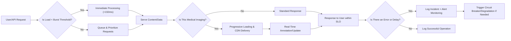

# Non-Functional Requirements for the Enterprise Healthcare Management Platform (Multi-Tenant SaaS)

## Performance and Scalability

### Concurrent User Support
- WHEN 5,000 or more users from a single healthcare organization simultaneously access the platform, THE healthcarePlatform SHALL maintain full responsiveness for all business, clinical, and administrative workflows without functional degradation.
- WHEN multiple organizations are active concurrently, THE healthcarePlatform SHALL isolate compute and storage resources per organization to prevent cross-tenant performance impact.

### API Response Time
- THE healthcarePlatform SHALL process and respond to 95% of API requests within 150 milliseconds during normal and peak business loads.
- WHEN users access health check endpoints or request application readiness state, THE healthcarePlatform SHALL return status information within 50 milliseconds.
- THE healthcarePlatform SHALL queue and manage request surges to maintain business logic execution consistency.

### Medical Imaging and Data Handling
- WHEN users request DICOM or other medical images, THE healthcarePlatform SHALL deliver frequently accessed images within 3 seconds and archived images within 30 seconds.
- WHILE serving medical images or large clinical data, THE healthcarePlatform SHALL use progressive loading and content distribution strategies to optimize initial view times for end users.
- WHEN users annotate or interact with images, THE healthcarePlatform SHALL reflect updates in real-time within the user's current session.

### Real-Time Features
- WHEN appointment schedules, critical alerts, or monitored device events are updated, THE healthcarePlatform SHALL update all associated users’ views, dashboards, or notification areas within 2 seconds.
- WHERE live messaging or clinical alerting is enabled, THE healthcarePlatform SHALL guarantee event delivery and receipt confirmation within 3 seconds for time-critical workflows.

### Caching and Resource Management
- THE healthcarePlatform SHALL use multi-layered caching (Redis, application-level, CDN) for medical images, patient data, and configuration to minimize remote database or storage access latency.
- WHERE Redis or in-memory caching is used for session management, THE healthcarePlatform SHALL ensure business session state is preserved across horizontal scale-up/down events.

### Database and Auto-Scaling
- THE healthcarePlatform SHALL implement efficient queries and indexing to prevent N+1 performance problems, maintaining query response times below 100 milliseconds for common workflows.
- WHERE volume grows, THE healthcarePlatform SHALL automatically scale horizontally based on utilization, balancing workloads and maintaining performance SLOs per organization.

### Performance Monitoring
- WHEN query response times exceed defined thresholds (e.g., >150ms), THE healthcarePlatform SHALL alert operations teams within 1 minute, and record the incident for performance analysis.

## Availability and Reliability

### Uptime and Service Levels
- THE healthcarePlatform SHALL target 99.95% monthly uptime for core clinical, administrative, and patient-facing functions.
- THE healthcarePlatform SHALL guarantee zero downtime during scheduled maintenance by using rolling updates and failover routing.

### Failover, Redundancy, and Graceful Degradation
- WHEN a primary deployment fails, THE healthcarePlatform SHALL automatically route traffic to a fallback region or replica with data currency no more than 1 minute old.
- WHEN external integrations (e.g., labs, pharmacy, insurance APIs) are unavailable, THE healthcarePlatform SHALL degrade gracefully, presenting retention/fallback logic and user-friendly messaging.
- THE healthcarePlatform SHALL implement circuit breaker patterns to avoid cascading failures from unresponsive external systems.
- WHEN receiving a SIGTERM or termination event, THE healthcarePlatform SHALL execute connection cleanup and persistent queue draining before shutdown sequence completes.

### Health Checks and Disaster Recovery
- THE healthcarePlatform SHALL expose health check endpoints for all critical system components (database, cache, storage, third-party integrations, CPU, memory usage), updating health status in less than 1 minute on a change event.
- THE healthcarePlatform SHALL maintain database and file storage backups, with full restore capability for any organization within 4 hours of failure detection and no more than 5 minutes of data loss (RPO).
- WHERE backups are created, THE healthcarePlatform SHALL archive point-in-time copies to cold storage for 10 years in compliance with healthcare data retention law.

## Security and Compliance

### Data Encryption and Transmission
- THE healthcarePlatform SHALL encrypt all data at rest using AES-256 and in transit using TLS 1.3.
- WHEN certificates approach expiration, THE healthcarePlatform SHALL automatically renew and rotate certificates without manual intervention.

### Access Control and Auditability
- WHEN users or APIs access, view, or modify any protected health information (PHI), THE healthcarePlatform SHALL log the access event, purpose, and user or system identity using a secure audit trail, available for inspection for a minimum of 10 years.
- THE healthcarePlatform SHALL enforce RBAC and approval flows as defined in the [User Roles & Authentication](./02-user-roles-and-authentication.md) document, preventing unauthorized access to any organization’s or patient’s data.
- IF a patient data access attempt does not include proper consent or justification, THEN THE healthcarePlatform SHALL deny the action and generate a security incident log entry.
- THE healthcarePlatform SHALL integrate with NPI Registry and state medical board APIs to validate and re-validate medical professional licenses prior to granting clinical privileges.

### Regulatory Readiness (HIPAA and SOC 2)
- THE healthcarePlatform SHALL meet or exceed HIPAA requirements for access control, audit logging, breach response, consent, and data integrity.
- WHERE SOC 2 controls are relevant, THE healthcarePlatform SHALL implement change management, monitoring, and access review practices, preparing evidence for future SOC 2 Type II audits.
- WHERE multi-region deployments are used, THE healthcarePlatform SHALL ensure data residency and jurisdiction-specific retention in compliance with local healthcare law.

### Incident and Breach Handling
- WHEN abnormal API usage, repeated failed authentication, or anomaly patterns are detected, THE healthcarePlatform SHALL apply rate limiting and session lockout responses.
- THE healthcarePlatform SHALL support basic anomaly detection, alerting administrators after more than 5 consecutive failed logins or suspicious device activity within any 30-minute window.
- WHEN a breach or compliance event occurs, THE healthcarePlatform SHALL record incident details, affected users/records, and the audit trail within 1 hour for review and reporting.
- WHEN authorized users request, THE healthcarePlatform SHALL provide an immutable export of audit logs for legal or compliance audit.

### Session and API Security Controls
- THE healthcarePlatform SHALL use JWTs for session control, where sessions expire after configurable intervals and tokens are revocable on password or privilege change.
- WHEN an access or refresh token is suspected compromised, THE healthcarePlatform SHALL immediately revoke and forcibly log out all associated sessions.
- THE healthcarePlatform SHALL implement input validation, API versioning, and rate limits on all externally facing endpoints to mitigate OWASP Top 10 API risks.

## Usability and Accessibility

### Accessibility Compliance
- THE healthcarePlatform SHALL achieve WCAG 2.1 AA compliance for all patient and provider-facing modules.
- WHEN user agents request alternate language (English, Spanish), THE healthcarePlatform SHALL deliver complete user-facing content in the requested language for all supported features.

### User Experience Standards
- THE healthcarePlatform SHALL provide real-time feedback, progress updates, and user-notice messaging for long-running or asynchronous workflows such as imaging uploads, bulk imports, or complex reporting queries.
- IF an error or delay exceeds 5 seconds, THEN THE healthcarePlatform SHALL present a clear message to the user explaining the delay and expected time to resolution.
- WHERE organizations configure portal/module access (e.g., restrict messaging, booking, or records), THE healthcarePlatform SHALL only display and permit user actions determined by each organization’s portal policy.

## Observability and Maintainability

### Logging and Monitoring
- THE healthcarePlatform SHALL produce structured logs using Pino for all user, admin, clinical, and system actions, with every log entry including a unique correlation ID tied to the originating request.
- WHEN system errors, performance bottlenecks, or security events occur, THE healthcarePlatform SHALL immediately send alerts to the monitoring dashboard (Prometheus/Grafana) and create support tickets for critical incidents.

### Tracing and Incident Response
- THE healthcarePlatform SHALL use OpenTelemetry tracing on all services, including for cross-service and user-initiated workflows, capturing latency and error data for root cause analysis.
- THE healthcarePlatform SHALL document and expose platform health metrics, error rates, request volumes, and other SLO metrics through secure endpoints, providing transparency for support and administration teams.

### Performance and Query Monitoring
- WHEN database query latency exceeds 100 milliseconds for typical business workflows, THE healthcarePlatform SHALL trigger automated alerts and include query metrics in performance dashboards.
- IF slow queries persist for more than 10 minutes, THEN THE healthcarePlatform SHALL escalate alerts to the system administrator for immediate investigation.

### Support, Maintenance, and Documentation
- THE healthcarePlatform SHALL supply and maintain complete, Markdown-based documentation for all APIs, business rules, data models, and system operations, optimized for AI-based developer assistance tooling (GitHub Copilot, Cursor, Claude).
- WHEN incidents are detected, THE healthcarePlatform SHALL maintain a history of support actions, resolutions, and post-mortem summaries accessible to relevant stakeholder roles.
- THE healthcarePlatform SHALL enable seamless upgrades, hotfixes, and rollback procedures, supporting non-disruptive maintenance.

## Mermaid Diagram: Overall Non-Functional Flow (LR)

#